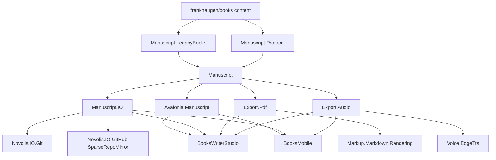

# novolis-manuscript framework repo

Source of truth: [novolis-manuscript-package-map](C:\Users\frank\.cursor\projects\d-novolis\canvases\novolis-manuscript-package-map.canvas.tsx) (+ framework placement canvas).

## Locked naming

| PackageId | Role |
|-----------|------|
| `Novolis.Manuscript` | Workspace façade / doctor bridge (no PDF, no audio) |
| `Novolis.Manuscript.Protocol` | NMP/1 reader |
| `Novolis.Manuscript.LegacyBooks` | Legacy `content/` adapter |
| `Novolis.Manuscript.IO` | Tree surgery, working copies, git/GitHub façades |
| `Novolis.Manuscript.Export.Pdf` | PDF export |
| `Novolis.Manuscript.Export.Audio` | TTS / audiobook (from Voice.Manuscript) |
| `Novolis.Avalonia.Manuscript` | Shared editor chrome (only Avalonia package in this product) |

Reserved later (do not scaffold empty stubs): `Export.Html`, `Export.Docx`, `Export.Txt`, `Export.Epub`.

Rejected: `Mutate`, `Manuscript.Pdf`, `Manuscript.Voice`, `Export.Voice`.

Avalonia.Manuscript lives **in** `novolis-manuscript` (not `novolis-avalonia`) so Avalonia stays free of Manuscript-specific packages.

## Target shape

Hosts stay under [d:\novolis\novolis-apps](d:\novolis\novolis-apps). Content stays in `D:\repos\books`.

## Phase 1 — Scaffold repo + move read model

1. Bootstrap [d:\novolis\novolis-manuscript](d:\novolis\novolis-manuscript) from [novolis-template-dotnet](d:\novolis\novolis-template-dotnet) (net10.0, nuget.org + GitHub Packages only, CI/release, `.novolis/packages.json`).
2. Move (git history optional; prefer clean move of sources) from markup:
   - [Novolis.Markup.Manuscript.Protocol](d:\novolis\novolis-markup\src\Novolis.Markup.Manuscript.Protocol) → `Novolis.Manuscript.Protocol`
   - [Novolis.Markup.Manuscript.LegacyBooks](d:\novolis\novolis-markup\src\Novolis.Markup.Manuscript.LegacyBooks) → `Novolis.Manuscript.LegacyBooks` (ProjectReference → Protocol)
   - Catalog/doctor/workspace/metadata from [Novolis.Markup.Manuscript](d:\novolis\novolis-markup\src\Novolis.Markup.Manuscript) → `Novolis.Manuscript` **without** `ManuscriptBookPdfExporter` / print types
3. Update namespaces/PackageIds to `Novolis.Manuscript*`. Move Protocol/Legacy/Manuscript unit tests from [Novolis.Markup.Unit](d:\novolis\novolis-markup\tests\Novolis.Markup.Unit) into `novolis-manuscript/tests`.
4. Remove the three Manuscript projects from [Novolis.Markup.slnx](d:\novolis\novolis-markup\Novolis.Markup.slnx) and markup `packages.json`.
5. Regen platform map: `pwsh -File d:\novolis\novolis-governance\build\Generate-Platform-Slnx.ps1`.

## Phase 2 — Export.Pdf + Export.Audio

1. `Novolis.Manuscript.Export.Pdf`: move PDF exporter + print settings; PackageReference `Novolis.Markup.Markdown.Rendering` + `Novolis.Manuscript`.
2. `Novolis.Manuscript.Export.Audio`: move [Novolis.Audio.Voice.Manuscript](d:\novolis\novolis-audio\src\Novolis.Audio.Voice.Manuscript) sources; PackageReference `Novolis.Audio.Voice.EdgeTts`; rename types/namespaces to `Novolis.Manuscript.Export.Audio` (keep public API names sensible — e.g. drop redundant `Manuscript` prefix where the namespace already says it).
3. Remove `Novolis.Audio.Voice.Manuscript` from novolis-audio; move its unit tests.
4. Consumers temporarily keep building via ProjectRef mode until GPR publish.

## Phase 3 — Genericize GitHub mirror + Manuscript.IO

1. In [Novolis.IO.GitHub](d:\novolis\novolis-io\src\Novolis.IO.GitHub): rename `BooksRepoMirror` / `BooksRepoMirrorOptions` → `SparseRepoMirror` / `SparseRepoMirrorOptions` (already has `ContentPrefix`). Add obsolete type aliases for one release if needed for external callers; update BooksMobile + IO unit tests.
2. Add `Novolis.Manuscript.IO`:
   - Port insert-after / insert-between / promote / sync / stub write from [D:\repos\books\tools\dev\book-tool.cs](D:\repos\books\tools\dev\book-tool.cs) against legacy layout first (Calypso today).
   - Façades composing `Novolis.IO.Git` and `SparseRepoMirror` for manuscript workspaces (dirty set, pull/push helpers).
   - Working-copy helpers wrapping `Novolis.IO.Recovery` patterns used by WriterSession.
3. Thin `book-tool` can later call this library; not required in the first merge.

## Phase 4 — Avalonia.Manuscript + retarget hosts

1. Add `Novolis.Avalonia.Manuscript` in novolis-manuscript (Avalonia PackageReferences allowed **only** here among Manuscript packages). Lift shared chapter-list / editor-shell pieces from Studio/Mobile only where duplication is real; leave spell, Android player, OAuth client id, Inno in apps.
2. Retarget PackageReferences:
   - [BooksWriterStudio.csproj](d:\novolis\novolis-apps\src\BooksWriterStudio\BooksWriterStudio.csproj): `Novolis.Manuscript`, `.IO`, `.Export.Pdf`, `.Export.Audio`, `.Avalonia.Manuscript` (drop Markup.Manuscript / Voice.Manuscript).
   - [BooksMobile.csproj](d:\novolis\novolis-apps\src\BooksMobile\BooksMobile\BooksMobile.csproj): same minus Pdf; use SparseRepoMirror via Manuscript.IO or IO.GitHub.
   - Dogfooding [ManuscriptSmoke](d:\novolis\novolis-dogfooding\apps\manuscript) if it references old IDs.
3. Publish `novolis-manuscript` to GitHub Packages; bump apps/dogfooding restores on nuget.org + github only.
4. Verify: `verify-nuget-only.ps1`, `verify-project-ref-mode.ps1 -SkipBuild`, build/test manuscript + apps under ProjectRef, then NuGet restore smoke.

## Out of scope this plan

- Migrating `D:\repos\books` to NMP/1 on disk
- Implementing Export.Html/Docx/Txt/Epub
- Deep UI redesign of Studio/Mobile
- Putting hosts inside novolis-manuscript

## Done when

- `d:\novolis\novolis-manuscript` exists with the locked PackageIds above (minus reserved Export siblings)
- Markup/audio no longer ship Manuscript/Voice.Manuscript packages
- BooksWriterStudio + BooksMobile restore/build against new IDs
- Platform slnx map includes the new packables; nuget-only checks pass

