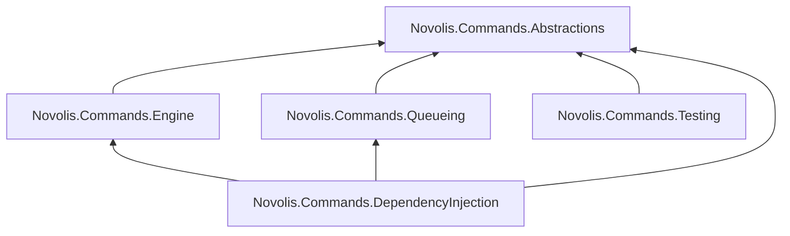
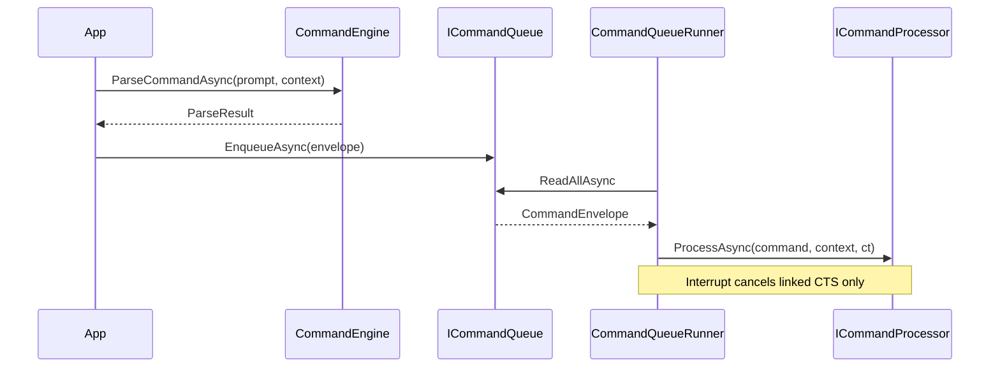

# Novolis.Commands v0 library and repo

## Goal

Deliver milestone v0:

```text
string prompt → ParseResult → CommandEnvelope on ICommandQueue
```

Parser describes intent only (envelopes + flags). `ICommandProcessor<TContext>` and `CommandQueueRunner<TContext>` own runtime behavior later.

## Repo bootstrap

| Item | Value |
|------|--------|
| GitHub org/repo | `Novolis-Platform/novolis-commands` |
| Default branch | `main` (matches [novolis-template-dotnet CI](d:\novolis\novolis-template-dotnet\.github\workflows\ci.yml)) |
| Scaffold | GitHub **Use this template** on [novolis-template-dotnet](https://github.com/Novolis-Platform/novolis-template-dotnet) |
| Local path | `d:\novolis\novolis-commands\` (alongside [novolis-math](d:\novolis\novolis-math)) |
| Solution | `Novolis.Commands.slnx` with `/src` and `/tests` folders per [frank-naming-and-structure.md](d:\novolis\novolis-governance\docs\frank-naming-and-structure.md) |

Copy/adapt from template + [novolis-math](d:\novolis\novolis-math):

- `Directory.Build.props`, `Directory.Packages.props`, `global.json` (SDK `10.0.100`, MTP test runner)
- `.github/workflows/ci.yml` + `release.yml` → reusable `novolis-workflows` (`dotnet-ci`, `dotnet-publish-nuget`)
- `.novolis/packages.json` — one entry per packable project (same pattern as [novolis-math/.novolis/packages.json](d:\novolis\novolis-math\.novolis\packages.json))
- `docs/{getting-started,design,release}.md` — design doc describes parse/queue/interrupt boundary
- Initial versions: `0.1.0-preview.1` per package (matches [novolis-messaging](d:\novolis\novolis-messaging\src\Novolis.Messaging\Novolis.Messaging.csproj))

Post-scaffold (manual/org): set default branch `main`, enable OIDC publish, add `novolis-registry` entries after first release.

## Package layout and dependencies



| Package | Responsibility |
|---------|----------------|
| **Abstractions** | All public contracts from your spec: `ICommandEngine<TContext>`, `ParseResult`, `CommandEnvelope`, `CommandId`, `CommandPriority`, failures, candidates, `BuiltInCommands`, `ICommandQueue`, `ICommandProcessor<TContext>` |
| **Engine** | Parsing only — registry lookup, tokenization, built-in phrase detection, ambiguity detection |
| **Queueing** | `ChannelCommandQueue`, `CommandQueueRunner<TContext>` (channel hidden behind `ICommandQueue`) |
| **DependencyInjection** | `ServiceCollectionExtensions` — register queue, engine, optional runner factory |
| **Testing** | Fakes/builders for consumers and this repo’s tests: in-memory queue, `CommandRegistryBuilder`, sample `TContext` helpers |

**Project references (no circular refs):** Engine and Queueing never reference each other; DI wires both.

## Abstractions (your API verbatim)

Implement types exactly as specified in [Novolis.Commands.Abstractions](d:\novolis\novolis-commands\src\Novolis.Commands.Abstractions) (new):

- `ParseResult` with `Succeeded` / `Failed` factories
- `CommandId` using `Guid.CreateVersion7()` (.NET 10)
- `CommandEnvelope` with interrupt/cancel flags and `IReadOnlyDictionary<string, object?> Arguments`
- `ParseFailure` / `ParseFailureCode` / `CommandCandidate`
- `BuiltInCommands`: `system.belay-that`, `system.clear-queue`, `system.repeat-last`

Keep Abstractions free of `Microsoft.Extensions.*` and `System.Threading.Channels` so it stays a thin contract package.

## Engine design (parse only, no domain execution)

### Registry model (data, not behavior)

```csharp
// Engine — illustrative
public sealed record CommandDefinition(
    string Name,
    string? ContextWord,
    IReadOnlyList<string> Verbs,
    IReadOnlyList<CommandArgumentDefinition> Arguments);

public interface ICommandRegistry
{
    IReadOnlyList<CommandDefinition> GetAll();
}
```

- **Built-ins** live in Engine as phrase → envelope mapping (no processor calls):
  - `"belay that"` → `BuiltInCommands.BelayThat`, `Emergency`, `InterruptsCurrentCommand = true`
  - `"clear queue"` / `"repeat last"` → corresponding `BuiltInCommands.*` with appropriate flags (document in design.md)
- **Domain commands** (e.g. `helm.set-heading`) are **registered by the host**, not hardcoded in Engine — keeps Engine free of game/sim domain.

### Context hook

```csharp
public interface ICommandContextResolver<TContext>
{
    string? GetActiveContextWord(TContext context);
    // v0: optional alias map for future; can return empty dictionary
    IReadOnlyDictionary<string, string> GetAliases(TContext context);
}
```

`CommandEngine<TContext> : ICommandEngine<TContext>` depends on `ICommandRegistry` + `ICommandContextResolver<TContext>`.

### Parse pipeline (deterministic, synchronous internally)

1. Normalize: trim; `EmptyPrompt` if whitespace-only
2. **Built-in phrase table** (case-insensitive, whole prompt) → success envelope
3. Tokenize on whitespace
4. Resolve optional leading **context word** (explicit token or `GetActiveContextWord` when omitted)
5. Match verb token(s) against registry for that context → 0 = `UnknownCommand`, 1 = continue, 2+ = `AmbiguousCommand` + `Candidates` (confidence/reason from simple heuristics in v0)
6. Parse trailing tokens into arguments (`CommandArgumentDefinition`: name, kind `Integer`/`String`, required flag)
7. Return `ParseResult.Succeeded(envelope)` — **never** call `ICommandProcessor` or mutate world state

### v0 argument parsing (minimal)

For `helm heading 270`:

- Registry entry: `Name = "helm.set-heading"`, `ContextWord = "helm"`, `Verbs = ["heading"]`, one int arg `heading`
- Parser reads last token as int → `Arguments["heading"] = 270`

Invalid/missing args → `MissingArgument` / `InvalidArgument`.

### Ambiguity (test-ready, not required for helm tests)

Support `AmbiguousCommand` when multiple definitions share a verb across contexts or alias collision. v0 heuristic: fixed confidence scores from match quality (exact verb > alias > active context boost). Include one Engine test with two overlapping definitions (your `"fire"` example) to lock behavior.

## Queueing

Implement in [Novolis.Commands.Queueing](d:\novolis\novolis-commands\src\Novolis.Commands.Queueing):

- `ChannelCommandQueue` — exactly your `Channel.CreateUnbounded` settings; only type that touches `Channel<CommandEnvelope>`
- `CommandQueueRunner<TContext>` — your sketch; v0 additions:
  - Dispose linked `CancellationTokenSource` after each command completes
  - On `command.CancelsQueuedCommands`, document as **processor/queue policy** in v0 (runner does not drain channel yet unless you want a follow-up hook — keep v0 aligned with your snippet)

## DependencyInjection

`Novolis.Commands.DependencyInjection/ServiceCollectionExtensions.cs`:

```csharp
public static IServiceCollection AddNovolisCommands<TContext>(
    this IServiceCollection services,
    Action<CommandRegistryBuilder>? configureRegistry = null,
    ServiceLifetime lifetime = ServiceLifetime.Singleton)
```

Registers:

- `ICommandQueue` → `ChannelCommandQueue`
- `ICommandRegistry` (built from `CommandRegistryBuilder` + built-ins merged in Engine)
- `ICommandContextResolver<TContext>` (must be supplied by host — no guess default)
- `ICommandEngine<TContext>` → `CommandEngine<TContext>`

Optional: `AddCommandQueueRunner<TContext>()` registering a factory/hosted-service wrapper — defer if not needed for v0 milestone.

Package refs: `Microsoft.Extensions.DependencyInjection.Abstractions` only.

## Testing package and test projects

**Governance:** TUnit only ([naming.md](d:\novolis\novolis-governance\docs\naming.md)) — adapt your examples from FluentAssertions to TUnit:

```csharp
await Assert.That(result.Success).IsTrue();
await Assert.That(result.Command!.Name).IsEqualTo("helm.set-heading");
```

| Test project | Covers |
|--------------|--------|
| `tests/Novolis.Commands.Engine.Tests` | Your three parse tests + built-in belay + empty prompt + ambiguity |
| `tests/Novolis.Commands.Queueing.Tests` | Enqueue/read order; belay cancels in-flight via runner + test processor that honors CT |

**Engine test setup** (domain definitions in test, not product code):

```csharp
var registry = new CommandRegistryBuilder()
    .Add("helm.set-heading", context: "helm", verbs: ["heading"],
         CommandArgumentDefinition.Integer("heading", required: true))
    .Build();
var engine = new CommandEngine<TestContext>(registry, resolver, builtInMatcher);
```

**Novolis.Commands.Testing** exports `CommandRegistryBuilder`, `RecordingCommandQueue` (implements `ICommandQueue`, no channel leak), `TestCommandContext` with `ActiveContextWord`.

## End-to-end flow (v0 milestone)



## Files to create (high level)

```text
novolis-commands/
  Novolis.Commands.slnx
  Directory.Build.props
  Directory.Packages.props
  global.json
  .novolis/packages.json
  .github/workflows/{ci,release}.yml
  docs/{getting-started,design,release}.md
  src/
    Novolis.Commands.Abstractions/*.cs
    Novolis.Commands.Engine/{CommandEngine,CommandRegistry,CommandRegistryBuilder,BuiltInCommandMatcher,CommandParser}.cs
    Novolis.Commands.Queueing/{ChannelCommandQueue,CommandQueueRunner}.cs
    Novolis.Commands.DependencyInjection/ServiceCollectionExtensions.cs
    Novolis.Commands.Testing/{CommandRegistryBuilder,RecordingCommandQueue,TestCommandContext}.cs
  tests/
    Novolis.Commands.Engine.Tests/
    Novolis.Commands.Queueing.Tests/
```

## Verification

```powershell
cd d:\novolis\novolis-commands
dotnet build
dotnet test
```

CI on push/PR to `main` should pass via reusable workflow (no local secrets required for build/test).

## Out of scope (explicit v0 boundaries)

- No `ICommandProcessor` implementations for helm/tactical/admin (apps bring those)
- No NLP, fuzzy matching beyond simple alias table
- No confirmation flow execution (`RequiresConfirmation` — parse-only failure code is fine)
- No integration with [novolis-messaging](d:\novolis\novolis-messaging) channels (separate bounded command queue abstraction)
- No changes to simulation/physics stack ([library-boundaries](d:\novolis\novolis-governance\docs\library-boundaries.md))

## Optional follow-ups (after v0 merges)

- `novolis-registry` package manifest for all five packages
- Governance table row for `novolis-commands` in `frank-naming-and-structure.md`
- Hosted-service wrapper for `CommandQueueRunner` + sample in `samples/`

