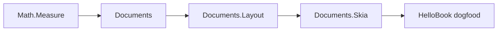

# novolis-documents (book PDF island)

Source of truth: [novolis-documents-spec canvas](C:\Users\frank\.cursor\projects\d-novolis\canvases\novolis-documents-spec.canvas.tsx). Spec locked: one-column book printer (cover / TOC / body / chrome), Skia paint, **not** a QuestPDF clone.

## Locked decisions

- **Math lives in** [`novolis-math`](d:\novolis\novolis-math): new peer facet `Novolis.Math.Measure` (BCL-only). Documents never owns Length/Size/Thickness/Rect.
- **Measure shapes** are scalar records (`Length` in points; `Size` = Width+Height; `Thickness`; `Rect` = X/Y/Width/Height as `Length`). **No `Vector2`**, no `*2D` suffixes ([library-boundaries.md](d:\novolis\novolis-governance\docs\library-boundaries.md)).
- **Repo create:** GitHub template → clone `d:\novolis\novolis-documents` → rename identity → first packages → push `main` (maintainer path, no PR).
- **v1 packages:** `Novolis.Documents`, `Novolis.Documents.Layout`, `Novolis.Documents.Skia` (+ shared unit tests). **No** separate `Documents.Testing` package — fake `ITextMeasurer` lives in unit tests.
- **Out of v1:** Manuscript QuestPDF replacement / adapter flag; lists/tables/images/code blocks; fluent layout DSL.
- **HelloBook** demo in [`novolis-dogfooding`](d:\novolis\novolis-dogfooding), not under library `apps/`.



---

## Phase 0 — Create and baseline `novolis-documents`

1. Create public repo from template:
   ```powershell
   gh repo create Novolis-Platform/novolis-documents --public --template Novolis-Platform/novolis-template-dotnet --clone=false
   ```
2. Clone to [`d:\novolis\novolis-documents`](d:\novolis\novolis-documents).
3. Rename identity per [repository-policy.md](d:\novolis\novolis-governance\docs\repository-policy.md) / template README:
   - `NovolisGitHubRepository` → `novolis-documents` in `Directory.Build.props`
   - Solution → `Novolis.Documents.slnx`
   - Marketing README header / docs blurbs for documents island
4. Confirm baseline: `net10.0`, `nuget.config` = nuget.org + GitHub Packages only, CalVer `build/version.json`, thin `.github/workflows` → `novolis-workflows`, MIT LICENSE, `docs/getting-started.md` + `design.md` + `release.md`, **no** `apps/`.
5. Scaffold empty packable projects + `tests/Novolis.Documents.Unit` (TUnit), wire slnx, fill `.novolis/packages.json`.
6. Push `main` so `merge.yml` can publish when packages have content.

---

## Phase 1 — `Novolis.Math.Measure` in novolis-math

Add [`d:\novolis\novolis-math\src\Novolis.Math.Measure\`](d:\novolis\novolis-math\src\Novolis.Math.Measure\) as a **fourth BCL-only peer** (same skeleton as Arrays/Topology).

| Type | Role |
|------|------|
| `Length` | Points (1/72"); `LengthUnits.FromInches` / `FromMillimeters` / `FromPoints` |
| `Size` | Width + Height `Length` |
| `Thickness` | Left/Top/Right/Bottom |
| `Rect` | X/Y/Width/Height as `Length` (page box; not a vector type) |

Wire: csproj + package README → [`Novolis.Math.slnx`](d:\novolis\novolis-math\Novolis.Math.slnx) → `ProjectReference` + `tests/Novolis.Math.Unit/Measure/` → update [`docs/design.md`](d:\novolis\novolis-math\docs\design.md) facet table + root README → list Measure in [library-boundaries.md](d:\novolis\novolis-governance\docs\library-boundaries.md) Math facet table.

Publish math to GPR (`push origin main` on novolis-math) **before** documents PackageReferences can restore from GitHub Packages. Local iteration: Platform.slnx ProjectRef mode.

---

## Phase 2 — Documents model + Layout + Skia

### `Novolis.Documents`

- `BookDocument`, `BookMeta`, `PageSetup`, `Typography`, `RunningChrome`, `LastPage`
- Closed blocks: Cover, Toc, Heading (1–3), Paragraph, SceneBreak, PageBreak, BlankPage
- `TrimPresets`: TradePaperback6x9 (primary, matches [`ManuscriptPrintSettings`](d:\novolis\novolis-manuscript\src\Novolis.Manuscript.Export.Pdf\ManuscriptPrintSettings.cs)), Digest5.5×8.5, A5, USLetter
- PackageReference: `Novolis.Math.Measure` only (no Skia, no Markdig)

### `Novolis.Documents.Layout`

- `ITextMeasurer`, `PagePlan` / `PageSlice` / `PlacedBlock`
- Algorithm: content rect = trim − margins − chrome bands; cover page; flow body; H1 break when prior content; optional TOC second pass; last page
- Unit tests with fake measurer (A4)

### `Novolis.Documents.Skia`

- SkiaSharp pinned in documents `Directory.Packages.props`
- `BookPdf.Write` / `ToBytes` + `BookPdfOptions` (font paths)
- Skia implements `ITextMeasurer`; **no Skia types** on Documents/Layout public APIs
- One integration test: non-empty PDF + page count (A5)

Design docs in-repo must state hard non-goals from the canvas (no fluent layout, no tables/images in v1, Avalonia-free).

---

## Phase 3 — Dogfood + platform registration

1. `novolis-dogfooding` HelloBook console: build sample `BookDocument` → PDF under artifacts.
2. Regen platform map:
   ```powershell
   pwsh -File d:\novolis\novolis-governance\build\Generate-Platform-Slnx.ps1
   ```
3. Refresh org landing after public repo + workflows exist:
   ```powershell
   pwsh -File d:\novolis\.github\scripts\Update-OrgLandingStatus.ps1
   ```
4. Verify:
   ```powershell
   pwsh -File d:\novolis\novolis-governance\scripts\verify-nuget-only.ps1
   pwsh -File d:\novolis\novolis-governance\scripts\verify-project-ref-mode.ps1 -SkipBuild
   ```

---

## Acceptance (v1)

| ID | Criterion |
|----|-----------|
| A1 | Trade 6×9 PDF: cover + ≥2 chapters + footers with page numbers |
| A2 | Optional TOC with chapter titles + page refs |
| A3 | Header/footer suppressed on cover; present on body |
| A4 | Layout unit tests without native Skia |
| A5 | Skia integration test: bytes + page count |
| A6 | MIT, net10.0, NuGet-only, Avalonia-free, no library `apps/` |

---

## Explicitly deferred

- Manuscript Export.Pdf adapter / QuestPDF swap (keep books-grade QuestPDF until Documents proves A1–A5 on real book trees)
- `Novolis.Documents.Testing` package
- Geometry ProjectReference to Measure (add later only if Geometry APIs need these types)

