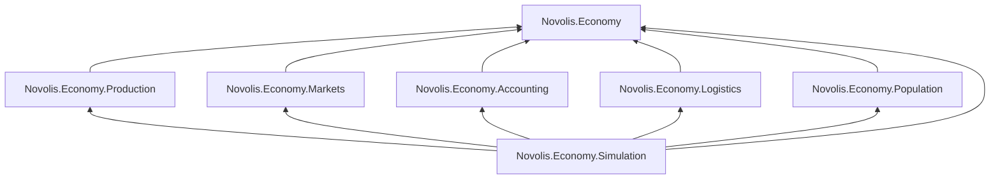

# Novolis.Economy shared library skeleton

## Decisions (locked)

- **Repo:** new [`Novolis-Platform/novolis-economy`](https://github.com/Novolis-Platform/novolis-economy) (platform library family, not the Commerce game)
- **Depth:** skeleton only — contracts, stubs, phase runner, smoke tests
- **TFM:** `net10.0` / SDK `10.0.100` (match Novolis governance; ignore concept draft’s .NET 9)
- **Out of scope:** `Novolis.Commerce.*`, UI, Platform host wiring, food vertical slice, AI controllers, full accounting/logistics math

## Placement in the Novolis stack

Existing [`novolis-simulation`](https://github.com/Novolis-Platform/novolis-simulation) is **spatial/physics orchestration** (`ISimulationSystem.Step`, worlds, cameras). Economy is a **separate domain family**.

```text
Novolis.Economy.*     (this repo — economic processes)
Novolis.Simulation.*  (spatial runtime — do not reference)
novolis-commerce      (future product — consumes Economy via NuGet)
```

`Novolis.Economy.Simulation` owns the **economic tick runner**. It must **not** reference `Novolis.Simulation.*`. Optional later composition with `novolis-workspaces` snapshots happens at the product layer.

## Repo bootstrap

Create under `d:\repos\novolis-economy` from [`novolis-template-dotnet`](https://github.com/Novolis-Platform/novolis-template-dotnet), then align with sibling repos (`novolis-math` / `novolis-simulation`):

- `Novolis.Economy.slnx`
- `global.json` (SDK 10.0.100 + Microsoft.Testing.Platform)
- `Directory.Build.props` / `Directory.Packages.props` / `Directory.Build.targets`
- `.novolis/packages.json`, `build/version.*`, `scripts/pack-local.ps1`
- `docs/design.md`, `docs/getting-started.md`, `docs/release.md`
- Root README with package index
- TUnit **1.44.39** only (no xUnit/NUnit/FluentAssertions)
- Packable projects: XML docs + per-package `README.md`

GitHub: create public repo under `Novolis-Platform`, push initial branch via PR to `main` if branch protection requires it.

## Package layout

```text
src/
  Novolis.Economy/                 # primitives + marker interfaces
  Novolis.Economy.Production/
  Novolis.Economy.Markets/
  Novolis.Economy.Accounting/
  Novolis.Economy.Logistics/
  Novolis.Economy.Population/
  Novolis.Economy.Simulation/      # phase runner + IEconomySimulation
tests/
  Novolis.Economy.Unit/            # TUnit; folders mirror packages
```

### Dependency graph (same-repo `ProjectReference` OK)



No external Novolis package dependencies in the skeleton (keeps the economy island self-contained).

## Core API surface (`Novolis.Economy`)

Implement only what the runner and stubs need:

- Strong IDs as readonly structs / records: `FirmId`, `FacilityId`, `ProductId`, `BrandId`, `ConsumerCohortId`, `GeographicAreaId`, `OperatingUnitId`
- Value types: `Money` (`decimal`), `Quantity` (`decimal`), `Percentage`, `SimulationDate` / `SimulationHour` (discrete clock)
- Markers: `IEconomyCommand`, `IEconomyEvent`, `IEconomyProjection`
- Explainability stub: `MetricExplanation` + `MetricContribution` (empty helpers OK)
- Seeded RNG abstraction: `IEconomyRandom` / `DeterministicRandom` (for later invariants)

Example command/event shapes (real types, no behavior yet):

```csharp
public sealed record SetRetailPrice(
    FirmId FirmId, FacilityId FacilityId, ProductId ProductId, Money Price)
    : IEconomyCommand;

public sealed record RetailPriceChanged(
    SimulationDate Date, FirmId FirmId, FacilityId FacilityId,
    ProductId ProductId, Money PreviousPrice, Money CurrentPrice)
    : IEconomyEvent;
```

## Domain stubs (one thin model file set each)

| Package | Stub types (definitions only) |
|---------|-------------------------------|
| Production | `ProductDefinition`, `ProductInput`, `ProductBatch`, `FacilityLayout`, `OperatingUnit`, `MaterialRoute` |
| Markets | `MarketEstimate`, `IMarketIntelligenceService` (throws `NotImplementedException` or returns empty estimate) |
| Accounting | `LedgerEntry`, `AccountId`, period-close marker types |
| Logistics | `Shipment`, `FreightRoute`, inventory location id |
| Population | `ConsumerCohort`, `PreferenceProfile` |

No algorithms: no utility choice model, no recipe execution, no ledger posting.

## Simulation runner (`Novolis.Economy.Simulation`)

Concrete, testable skeleton:

```csharp
public interface IEconomySimulation
{
    SimulationState State { get; }
    ValueTask<SimulationResult> AdvanceAsync(
        SimulationDuration duration,
        CancellationToken cancellationToken = default);
}

public interface ISimulationPhase
{
    SimulationPhaseOrder Order { get; }
    ValueTask ExecuteAsync(SimulationContext context, CancellationToken cancellationToken);
}
```

- `SimulationPhaseOrder` enum matching the concept’s 12 phases
- Twelve **no-op / record-only** phase classes that append a diagnostic event when executed
- `PhasePipeline` sorts by `Order` and runs sequentially
- `SimulationState`: clock + pending commands queue + event buffer + simple state hash seed
- `AdvanceAsync`: apply duration in hourly ticks; each tick runs all phases
- Command enqueue API on the simulation (player/AI later share this)

Determinism smoke path: same seed + same empty command stream → identical `State.Hash` after N ticks.

## Tests (TUnit)

`tests/Novolis.Economy.Unit`:

1. Phases execute in enum order
2. `AdvanceAsync(1 hour)` runs every phase once
3. Money/Quantity reject invalid construction if we add guards; otherwise basic equality
4. Deterministic hash: two sims with same seed match after advance
5. Pack smoke: types from each package are constructible (prevents empty-project drift)

## Docs

- `docs/design.md` — economy family boundary vs `Novolis.Simulation.*`; command/event/projection; snapshot-not-full-event-sourcing; phase list; deferred vertical slice
- `docs/getting-started.md` — build, test, pack-local
- `docs/release.md` — mirror sibling release notes pattern
- Concept inspiration can live as `docs/concept.md` (trimmed from the user’s brief; no game UI promises)

## Explicit non-goals for this PR

- Food chain content / scenario builders
- Real production, inventory balance, demand, spoilage, loans
- `IFirmController` / AI strategies
- `ICommerceGameHost` / workspaces / snapshots integration
- NuGet.org publish (local pack + GitHub Packages wiring only if template already includes it)

## Verification

```powershell
dotnet build Novolis.Economy.slnx
dotnet test tests/Novolis.Economy.Unit
.\scripts\pack-local.ps1
```

## Follow-up (not this task)

Food vertical-slice kernel (depth B): implement Production + Logistics + Population demand + Accounting enough for wheat→bread, then later stand up `novolis-commerce` as the host.

