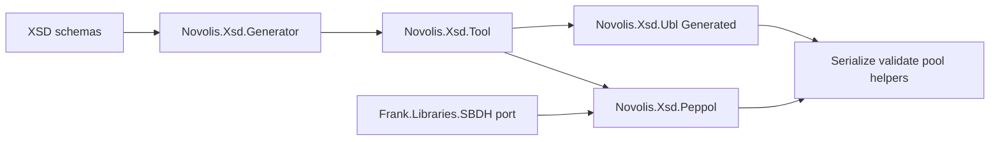

# Absorb UBL/XSD sources into `novolis-xsd`

## Verdict

Stand up **one** new library repo [`novolis-xsd`](https://github.com/Novolis-Platform) (from [`novolis-template-dotnet`](d:\novolis\novolis-template-dotnet)). Primary technical lineage is **[Frank.UblSharp](https://github.com/frankhaugen/Frank.UblSharp)** (supported Roslyn + `XmlSchemaClassGenerator` pipeline). Other repos become migration inputs, test oracles, or historical credit—not parallel generators.

**Peppol owns the envelope:** SBDH is not a separate package. Types and wrap/unwrap helpers from [Frank.Libraries.SBDH](https://github.com/frankhaugen/Frank.Libraries/tree/master/src/Frank.Libraries.SBDH) land under **`Novolis.Xsd.Peppol`** alongside BIS schemas/helpers. Prefer Peppol naming in public APIs; keep `Sbdh` only as internal type names where the OASIS/CEFACT vocabulary requires it.

This does **not** touch `novolis-markup` / Manuscript (different “document” domain). It **does** reverse entries in [`frank-repos-explicit-skip.md`](d:\novolis\novolis-governance\docs\imports-todo\frank-repos-explicit-skip.md) and [`frank-codegen-devtools.md`](d:\novolis\novolis-governance\docs\imports-todo\frank-codegen-devtools.md).

## Source disposition

| Source | Role in Novolis |
|--------|-----------------|
| [Frank.UblSharp](https://github.com/frankhaugen/Frank.UblSharp) | **Absorb** — `Generation`, `Internals.XsdCodeGenerator`, `Resources`/`UBL-2.1`, runtime helpers, `Validation`. Drop legacy `Generator`/`V2`–`V4` after parity. |
| [Frank.Finance.Documents.Ubl](https://github.com/frankhaugen/Frank.Finance.Documents.Ubl) | **Ideas + tests** — per-document namespace mapping from `Generate.linq`; OASIS XSD tree; round-trip samples. **Do not** vendor the huge generated tree; regenerate under Novolis naming. Renderer → later optional facet or dogfood host. |
| [Frank.Libraries.Ubl](https://github.com/frankhaugen/Frank.Libraries/tree/master/src/Frank.Libraries.Ubl) | **Cherry-pick** helpers/services (`UblService`, any useful API). Discard its separate `Generation/CSharpGenerator` if it duplicates UblSharp. |
| [Frank.Libraries.SBDH](https://github.com/frankhaugen/Frank.Libraries/tree/master/src/Frank.Libraries.SBDH) | **Port into `Novolis.Xsd.Peppol`** — envelope types + `StandardBusinessDocumentService` (rename to Peppol-facing helpers where sensible). No `Novolis.Xsd.Sbdh` package. |
| [Frank.XsdCodeGeneration](https://github.com/frankhaugen/Frank.XsdCodeGeneration) | **Reference only** — incomplete Roslyn Syntax spike; do not ship. Long-term emit backend may move toward Roslyn Syntax *behind* the same public API. |
| [ubllarsen](https://github.com/Gammern/ubllarsen) | **Credit / NOTICE** — ancestral XmlSerializer models (Unlicense); already evolved inside UblSharp. Do not dual-maintain. |
| Upstream [UblSharp](https://github.com/ublsharp/UblSharp) (local `D:\repos\UblSharp`) | Baseline NuGet API comparison for helpers (`UblDocument`, validation). |

Dependency on **`XmlSchemaClassGenerator`** (nuget.org) stays explicit—same engine Frank.UblSharp and Finance.Documents already wrap—rather than inventing a third generator.

## Target shape

```text
d:\novolis\novolis-xsd\
  schemas\ubl-2.1\          # vendored OASIS XSDs (or submodule) used by generate tool
  schemas\peppol\           # BIS XSDs + SBDH/envelope schemas used by Peppol package
  tools\XsdGen\             # CLI that writes Generated/ into packages
  src\Novolis.Xsd\                  # options, emit model, shared XML helpers
  src\Novolis.Xsd.Generator\        # library API (schema set → C# sources)
  src\Novolis.Xsd.Tool\             # packable dotnet tool (arbitrary XSD)
  src\Novolis.Xsd.Ubl\              # pre-generated UBL 2.1 + serialize helpers
  src\Novolis.Xsd.Ubl.Validation\   # schema validate
  src\Novolis.Xsd.Peppol\           # SBDH envelope + Peppol BIS + wrap/process helpers
  tests\Novolis.Xsd.Unit\
  Novolis.Xsd.slnx
```

Orthogonal library island (like markup/storage): Avalonia-free, not on the Math→Physics spine. Pack `2026.1.*` to GitHub Packages; NuGet-only restore.



## Generation product decisions (locked)

1. **Pre-generated packages for consumers** — CI/`tools/XsdGen` writes C# into `src/Novolis.Xsd.Ubl/Generated/` (and Peppol). Consumers do **not** pay source-generator cost on every build. The Frank.UblSharp in-process Roslyn generator becomes the **engine inside** `Novolis.Xsd.Generator` / tool, not the default UBL package shipping mode.
2. **XmlSerializer-first models** — emit `partial class` (+ enums) with `Xml*` attributes (UblSharp / ubllarsen fidelity). Optional **record projections** or `--emit records` come later for non-XML DTOs; records are a poor default for full UBL XmlSerializer fidelity.
3. **Namespaces** — `Novolis.Xsd.Ubl.{DocumentName}` (and common CAC/CBC namespaces), inspired by Finance.Documents’ per-document split, not one giant root namespace. Peppol: `Novolis.Xsd.Peppol.*` (envelope + BIS).
4. **General XSD path** — same generator accepts arbitrary schema sets (Peppol, custom profiles) via tool flags: root namespace, naming scheme, collection type, nullable annotations.
5. **Licensing** — MIT for Novolis packages; retain NOTICE for UblSharp/OASIS schema terms and ubllarsen ancestry; do not copy Unlicense sources wholesale if regenerated under MIT tooling.
6. **One Peppol facet** — no separate SBDH package or `schemas/sbdh/` tree; envelope schemas live under `schemas/peppol/`.

## Performant helpers (ship with `Novolis.Xsd` / `Novolis.Xsd.Ubl` / `Novolis.Xsd.Peppol`)

Port and harden patterns from UblSharp + Finance.Documents:

- Cached `XmlSerializer` / typed document facade (à la `UblDocument`)
- Serialize/deserialize to stream, UTF-8 bytes, and `XmlReader`/`XmlWriter` without intermediate strings
- Schema validation API from `Frank.UblSharp.Validation`
- Peppol envelope wrap/unwrap around UBL payloads (from SBDH port) without full DOM where practical
- Optional later: HTML/text render from Finance.Documents.Renderer (dogfood or separate facet—not phase 1)

## Phased delivery

### Phase 0 — Governance + repo bootstrap

- Update skip/import docs: Finance UBL and XsdCodeGeneration move from “skip/spike” to “import into `novolis-xsd`”.
- Add row to [`frank-naming-and-structure.md`](d:\novolis\novolis-governance\docs\frank-naming-and-structure.md).
- Create `Novolis-Platform/novolis-xsd` from template; clone under `d:\novolis\novolis-xsd`.
- Wire into Platform slnx map when first packable projects exist (`Generate-Platform-Slnx.ps1`).

### Phase 1 — Generator spine

- Port Frank.UblSharp `Generation` + schema-set loading/`XmlSchemaMetaVisitor`/`UblGeneratorFactory` into `Novolis.Xsd.Generator` (Novolis naming, net10.0, TUnit).
- Replace LINQPad `Generate.linq` with `tools/XsdGen` calling the library.
- Golden tests: generate Invoice (+ one CAC type) and compare serialization round-trip against OASIS samples / existing Frank tests.

### Phase 2 — Pre-generated UBL + validation

- Vendor UBL 2.1 XSDs under `schemas/ubl-2.1`.
- Generate full model set into `Novolis.Xsd.Ubl`.
- Port validation package; publish both to GPR.
- Smoke: deserialize OASIS invoice sample, validate, re-serialize.

### Phase 3 — Peppol (includes SBDH)

- Port `Frank.Libraries.SBDH` into `Novolis.Xsd.Peppol` (envelope types + service helpers under Peppol namespaces).
- Add Peppol BIS Billing (and agreed message set) XSDs under `schemas/peppol`; generate Peppol-specific bits as needed.
- Integration test: wrap UBL Invoice in Peppol/SBDH envelope and round-trip; helpers for common Peppol identifiers / process IDs.
- Schematron stays out-of-scope unless separately approved.

### Phase 4 — Polish + retire Frank lanes

- Performance tests (serializer cache, large catalogues).
- Dogfood app under `novolis-dogfooding` if needed (not library `apps/`).
- Archive or mark Frank.UblSharp / Finance.Documents.Ubl as superseded; leave XsdCodeGeneration archived.

## Explicit non-goals (v1)

- No Avalonia UI / invoice designer in the library repo
- No bulk import of `Frank.Libraries` monolith
- No separate `Novolis.Xsd.Sbdh` package (SBDH is Peppol)
- No local NuGet folder feeds; no cross-repo `ProjectReference` in committed csproj
- No folding XSD into `novolis-codegen` (keeps CodeGen focused on Reflection/bindings; XSD stays domain-adjacent to UBL/Peppol)

## Success criteria

- `dotnet tool` can generate C# from a complex multi-file XSD set (UBL-scale) into a chosen namespace
- `Novolis.Xsd.Ubl` + `.Validation` + `.Peppol` restore from **nuget.org + GitHub Packages only** and pass round-trip + validate + envelope wrap tests
- Governance skip lists and naming map agree with the new repo
- `verify-nuget-only` / project-ref mode scripts remain green for the new packages when added to the platform map

