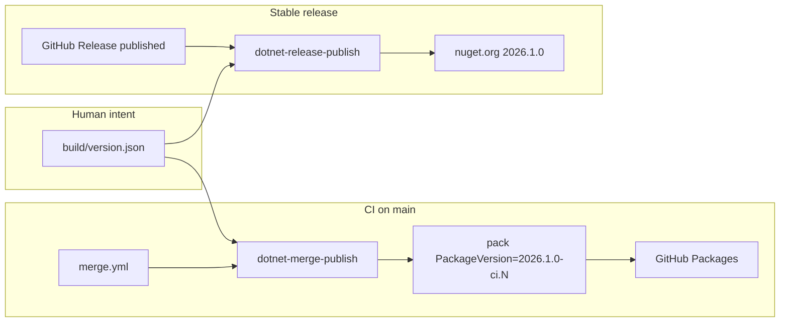

# Implement NuGet versioning (`2026.APIBREAK.FEATURE`)

## Current vs target

| Area | Today | Target (per [nuget-versioning.md](d:\novolis\.github\docs\nuget-versioning.md)) |
|------|--------|----------------------------------------------------------------------------------|
| Version source | [`.novolis/version.props`](d:\novolis\novolis-math\.novolis\version.props) (`NovolisVersionMajor/Minor/Patch/Build`) | [`build/version.json`](d:\novolis\.github\docs\nuget-versioning.md) (`sdkYear`, `apiBreak`, `feature`) — **not** `eng/` (ambiguous) |
| Merge publish | 4-part `0.0.1.{build}`; **commits** build bump | `2026.1.0-ci.{run}` to GitHub Packages; **BUILD = `github.run_number` only** (no commit) |
| Stable publish | Tag from GitHub Release → [dotnet-release-publish.yml](d:\novolis\novolis-workflows\.github\workflows\dotnet-release-publish.yml) | Same trigger (your choice); pack **`2026.1.0`** (3-part, no build) |
| Cross-repo deps | Fixed `0.0.1.1` in stack [`Directory.Packages.props`](d:\novolis\novolis-physics\Directory.Packages.props) | Floating **`2026.1.*`** (from `build/version.json`) |
| MSBuild | [Novolis.Version.targets](d:\novolis\novolis-governance\build\Novolis.Version.targets) maps 4-part props | CI-injected `Version` / `PackageVersion` / assembly metadata per doc |



**Scope:** Implement in existing [`novolis-workflows`](d:\novolis\novolis-workflows) + [`novolis-governance`](d:\novolis\novolis-governance), then roll out to ~20 packable `novolis-*` repos. Doc references `frankhaugen/shared-workflows`; **do not create a new repo**—extend `Novolis-Platform/novolis-workflows` already in use.

---

## Phase 1 — Version model and MSBuild (`novolis-governance`)

### 1.1 Add `build/version.json` template

**Naming:** use repo-root `build/` for version intent—not `eng/` (ambiguous between engineering and English). This coexists with existing per-repo `build/*Packaging.props` (e.g. physics, rendering); version files are `build/version.json` and generated `build/version.props`.

Per-repo file (initial cutover **`2026.1.0`**):

```json
{
  "sdkYear": 2026,
  "apiBreak": 1,
  "feature": 0,
  "dotnetBaseline": "net10.0",
  "publicPackage": true
}
```

### 1.2 Replace `.novolis/version.props` import chain

- Update each repo [`Directory.Build.props`](d:\novolis\novolis-math\Directory.Build.props): import `build/version.props` (generated MSBuild projection) instead of `.novolis/version.props`.
- **Remove** `.novolis/version.props` after migration (update [`merge.yml` paths-ignore](d:\novolis\novolis-math\.github\workflows\merge.yml) to ignore `build/version.json` only if release bumps are committed manually—not for CI build bumps).

Recommended: commit **`build/version.json`** (source of truth) plus a thin **`build/version.props`** generated by script (MSBuild-friendly) to avoid requiring `System.Text.Json` in every build:

```xml
<NovolisSdkYear>2026</NovolisSdkYear>
<NovolisApiBreak>1</NovolisApiBreak>
<NovolisFeature>0</NovolisFeature>
<NovolisStableVersion>2026.1.0</NovolisStableVersion>
<NovolisPackageFloatVersion>2026.1.*</NovolisPackageFloatVersion>
```

Add [`novolis-governance/scripts/sync-version-props.ps1`](d:\novolis\novolis-governance\scripts) to regenerate `build/version.props` from JSON (used by release bump PRs and local dev).

### 1.3 Rewrite [`Novolis.Version.targets`](d:\novolis\novolis-governance\build\Novolis.Version.targets)

- **Local / non-CI:** if `$(PackageVersion)` unset, set stable `$(NovolisStableVersion)` for packable projects.
- **Do not** set 4-part `Version` from committed build segment.
- When CI passes `-p:PackageVersion=...` (see Phase 2), targets should not override it.
- Apply assembly metadata from doc when CI properties present:

| Property | CI value |
|----------|----------|
| `AssemblyVersion` | `{sdkYear}.{apiBreak}.0.0` |
| `FileVersion` | `{sdkYear}.{apiBreak}.{feature}.{run}` |
| `InformationalVersion` | `{stable}+build.{run}.sha.{shortSha}` |

- Add `ContinuousIntegrationBuild` when `GITHUB_ACTIONS=true` (already partially done in stack repos).

### 1.4 Central floating Novolis dependencies

Add to governance [`Directory.Build.props` fragment](d:\novolis\novolis-governance\build) (or template applied by `configure-package-publishing.ps1`):

```xml
<ManagePackageVersionsCentrally>true</ManagePackageVersionsCentrally>
<CentralPackageFloatingVersionsEnabled>true</CentralPackageFloatingVersionsEnabled>
```

Update [`normalize-package-versions.ps1`](d:\novolis\novolis-governance\scripts\normalize-package-versions.ps1):

- Replace `Novolis.*` pins `0.0.1.1` → `$(NovolisPackageFloatVersion)` or literal `2026.1.*` synced from `build/version.json`.
- Apply to: `novolis-physics`, `novolis-simulation`, `novolis-rendering`, `novolis-raylib`, `novolis-testing`, and any other repo with `PackageVersion Include="Novolis.*"`.
- Update **dogfooding** from `Version="*"` to `Version="2026.1.*"` for consistency (still floating, but aligned to platform line).

**GPR / `-ci` note:** NuGet floating `2026.1.*` resolves **stable** versions only. Until `2026.1.0` exists on a feed, stack CI may need the first stable publish or temporary `2026.1.*-*` on the GitHub Packages source. Validate in `novolis-math` → `novolis-physics` merge order after cutover; adjust [`nuget.config`](d:\novolis\novolis-math\nuget.config) only if restore fails (document in [`release-policy.md`](d:\novolis\novolis-governance\docs\release-policy.md)).

### 1.5 Deprecate repo `*Packaging.props` fallbacks

Remove or narrow `0.0.1.1` / `0.1.0-local` fallbacks in:

- [`novolis-physics/build/Novolis.Physics.Packaging.props`](d:\novolis\novolis-physics\build\Novolis.Physics.Packaging.props)
- [`novolis-rendering/build/Novolis.Rendering.Packaging.props`](d:\novolis\novolis-rendering\build\Novolis.Rendering.Packaging.props)
- simulation / raylib equivalents

Governance targets become the single version path.

---

## Phase 2 — CI actions and workflows (`novolis-workflows`)

### 2.1 New composite: `read-version`

Replace [`resolve-version`](d:\novolis\novolis-workflows\actions\resolve-version\action.yml) logic:

**Inputs:** `version-file` (default `build/version.json`), optional `prerelease-label` (`ci`), `build-number` (`github.run_number`).

**Outputs:**

- `stableVersion` → `2026.1.0`
- `packageVersion` → `2026.1.0-ci.382` (merge) or `2026.1.0` (release)
- `assemblyVersion`, `fileVersion`, `informationalVersion` strings for `-p:` passthrough

Implementation: `jq` in bash (ubuntu-latest) or small inline Node—keep dependency-free if possible.

### 2.2 New composite: `dotnet-pack-versioned`

Wrap [`pack`](d:\novolis\novolis-workflows\actions\pack\action.yml):

```bash
dotnet pack "$slnx" -c Release -o artifacts/packages \
  -p:Version="$PACKAGE_VERSION" \
  -p:PackageVersion="$PACKAGE_VERSION" \
  -p:AssemblyVersion="$ASSEMBLY_VERSION" \
  -p:FileVersion="$FILE_VERSION" \
  -p:InformationalVersion="$INFO_VERSION"
```

### 2.3 Update [`dotnet-merge-publish.yml`](d:\novolis\novolis-workflows\.github\workflows\dotnet-merge-publish.yml)

```text
read-version (ci) → dotnet-build → dotnet-pack-versioned → publish-github-packages
```

**Remove:** [`bump-build-version`](d:\novolis\novolis-workflows\actions\bump-build-version\action.yml) and [`commit-version-bump`](d:\novolis\novolis-workflows\actions\commit-version-bump\action.yml) from merge path.

**Remove** `contents: write` from merge jobs where only used for version commits (keep `packages: write`).

### 2.4 Update [`dotnet-release-publish.yml`](d:\novolis\novolis-workflows\.github\workflows\dotnet-release-publish.yml)

Keep **GitHub Release published** trigger in per-repo [`release.yml`](d:\novolis\novolis-math\.github\workflows\release.yml).

- [`resolve-release-version`](d:\novolis\novolis-workflows\actions\resolve-release-version\action.yml): validate tag matches `v{sdkYear}.{apiBreak}.{feature}` (e.g. `v2026.1.0`).
- Pack with **3-part** `PackageVersion` only (no `-ci`, no 4th segment).
- Optional: fail if tag’s `feature` ≠ `build/version.json` (prevents accidental drift).

**Feature bump:** remains **manual** edit to `build/version.json` before creating the GitHub Release (doc’s `workflow_dispatch` bump can be a later enhancement; not required for your chosen trigger).

### 2.5 Raylib path

Update [`dotnet-raylib-merge-publish.yml`](d:\novolis\novolis-workflows\.github\workflows\dotnet-raylib-merge-publish.yml) and [`raylib-pack-publish`](d:\novolis\novolis-workflows\actions\raylib-pack-publish\action.yml) to use `read-version` + versioned pack; drop commit-version-bump there too.

### 2.6 Workflow inputs (optional, low priority)

Add `version-file: build/version.json` to reusable `workflow_call` inputs for forward compatibility; default suffices for all Novolis repos.

---

## Phase 3 — Per-repo rollout (batch via governance scripts)

Update [`configure-package-publishing.ps1`](d:\novolis\novolis-governance\scripts\configure-package-publishing.ps1) and [`apply-pr-merge-release-workflows.ps1`](d:\novolis\novolis-governance\scripts\apply-pr-merge-release-workflows.ps1) to:

1. Create `build/version.json` + `build/version.props` at **`2026.1.0`**
2. Delete `.novolis/version.props`
3. Fix `Directory.Build.props` import path
4. Normalize `Directory.Packages.props` Novolis refs → `2026.1.*`
5. Enable `CentralPackageFloatingVersionsEnabled` where missing
6. Fix `paths-ignore` in merge workflows

**Repos (~20):** math, physics, simulation, rendering, raylib, commands, avalonia, aspire, analyzers, codegen, machinelearning, markup, messaging, security, storage, transports, wirefish, testing, templates, template-dotnet, install, smoketest.

**Order suggestion:** `novolis-workflows` + `novolis-governance` first → `novolis-math` (leaf) → physics → simulation → rendering → raylib → remaining leaves.

---

## Phase 4 — Docs, registry, and validation

| Item | Action |
|------|--------|
| [nuget-versioning.md](d:\novolis\.github\docs\nuget-versioning.md) | Replace `eng/` with `build/` throughout; add Novolis-specific note: workflows live in `novolis-workflows`, release trigger = GitHub Release |
| [release-policy.md](d:\novolis\novolis-governance\docs\release-policy.md) | Rewrite for new scheme; remove “CI bumps build in git” |
| `novolis-physics/docs/VERSIONING.md` | Point to platform doc or archive |
| [`novolis-registry/packages/*.json`](d:\novolis\novolis-registry\packages) | Update metadata versions to `2026.1.0` when publishing |
| Installer [`Resolve-Version.ps1`](d:\novolis\novolis-installer-inno\scripts\Resolve-Version.ps1) | Read `build/version.json` if it consumes package version |

### Validation checklist

1. **PR:** build + test only; no publish; no version file changes.
2. **Merge math:** GPR receives `Novolis.Math.*` at `2026.1.0-ci.{run}`; git tree unchanged.
3. **Merge physics:** restore `Novolis.Math.Geometry` at `2026.1.*` succeeds against GPR (or documented prerelease workaround).
4. **Release math:** create GitHub Release `v2026.1.0` → nuget.org gets `2026.1.0`; assembly/file/info versions match doc.
5. **Local:** `dotnet pack /p:NovolisLocalPack=true` produces `2026.1.0` without CI env.

---

## Explicit non-goals (this pass)

- `workflow_dispatch` release with auto-bump PR (doc’s `dotnet-nuget-release.yml`); manual `build/version.json` + GitHub Release is enough per your choice.
- New `frankhaugen/shared-workflows` repo.
- `eng/` folder anywhere in Novolis repos (use `build/` instead).
- Auto-increment `feature` from commit analysis (human-owned `build/version.json` only).

---

## Risk summary

| Risk | Mitigation |
|------|------------|
| Floating `2026.1.*` ignores `-ci` packages | Publish first stable `2026.1.0` to GPR or use `2026.1.*-*` temporarily on GPR-only consumers |
| Breaking all existing `0.0.1.x` consumers | Expected platform cutover; document in release notes |
| Parallel merge workflows pin different ci builds | Acceptable with floating; consumers get latest matching stable/ci per NuGet rules |
| Raylib native pack path diverges | Dedicated workflow update in Phase 2.5 |

