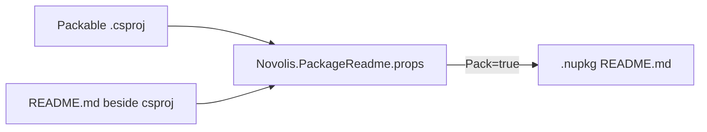

# Packable NuGet package READMEs

## Current state

- **109** projects with `<IsPackable>true</IsPackable>` (excluding `tests/` and `content/`).
- **100** already have co-located [`README.md`](novolis-governance/docs/templates/package-readme.md) next to the `.csproj`.
- **9** are missing a package README (packing can still succeed today because wiring uses `Condition="Exists('README.md')"` — no file is packed and NuGet.org shows no package readme).

| Missing README | Repo |
|----------------|------|
| `Novolis.Audio`, `Novolis.Audio.Abstractions`, `Novolis.Audio.Bindings`, `Novolis.Audio.Native`, `Novolis.Audio.Runtime`, `Novolis.Audio.Manifests` | [novolis-audio](novolis-audio) |
| `Novolis.Scheduling`, `Novolis.Scheduling.Cron` | [novolis-scheduling](novolis-scheduling) |
| `Novolis.Transports.Tcp.Abstractions` | [novolis-transports](novolis-transports) |

**Notable debt:** [novolis-scheduling/build/.novolis-documentation-complete](novolis-scheduling/build/.novolis-documentation-complete) exists, but both packable projects lack READMEs — [doc-audit.ps1](novolis-governance/scripts/doc-audit.ps1) would fail on the next strict CI run.

**Configuration patterns today (3 variants):**

1. **Governance import** (6 repos): `src/Directory.Build.props` imports [Novolis.PackageReadme.props](novolis-governance/build/Novolis.PackageReadme.props) — simulation, rendering, physics, math, raylib `src/` + `codegen/`.
2. **Duplicated inline** (~18 repos): `PackageReadmeFile` + conditional `None Include` in `src/Directory.Build.props` (e.g. [novolis-transports/src/Directory.Build.props](novolis-transports/src/Directory.Build.props)).
3. **Repo-root only** (audio): [novolis-audio/Directory.Build.props](novolis-audio/Directory.Build.props) lines 39–44; `src/` and `codegen/` do not import governance props.

Canonical wiring (already documented in [documentation-policy.md](novolis-governance/docs/documentation-policy.md) and [package-policy.md](novolis-governance/docs/package-policy.md)):

```xml
<PackageReadmeFile>README.md</PackageReadmeFile>
<None Include="README.md" Pack="true" PackagePath="\" />
```

Implemented centrally in [Novolis.PackageReadme.props](novolis-governance/build/Novolis.PackageReadme.props).

**Reference README quality:** [novolis-raylib/src/Novolis.Raylib/README.md](novolis-raylib/src/Novolis.Raylib/README.md) (install, API matrix, quick start, cross-links); manifests: [novolis-raylib/codegen/Novolis.Raylib.Manifests/README.md](novolis-raylib/codegen/Novolis.Raylib.Manifests/README.md).



---

## Phase 1 — Harden MSBuild (governance)

Update [Novolis.PackageReadme.props](novolis-governance/build/Novolis.PackageReadme.props):

- When `'$(IsPackable)' == 'true'`, **error** if `$(MSBuildProjectDirectory)\README.md` does not exist (user chose MSBuild enforcement, not audit-only).
- Keep existing `PackageReadmeFile`, `None` pack item, and `NU5118` suppression.
- Scope the error to packable projects only (respect `IsPackable=false` overrides in tests/codegen hosts).

Optional small improvement: use `Exists('$(MSBuildProjectDirectory)\README.md')` in the `None` condition for consistency with the error check.

---

## Phase 2 — Standardize imports (all repos)

Replace duplicated `PropertyGroup`/`ItemGroup` blocks in per-repo `src/Directory.Build.props` with a single import:

```xml
<Import Project="$(MSBuildThisFileDirectory)..\..\novolis-governance\build\Novolis.PackageReadme.props"
        Condition="Exists('$(MSBuildThisFileDirectory)..\..\novolis-governance\build\Novolis.PackageReadme.props')" />
```

**Repos to convert** (inline `PackageReadmeFile` today): analyzers, avalonia, commands, machinelearning, security, testing, transports, codegen, markup, storage, messaging, wirefish, aspire, install, smoketest, templates, mapping, scheduling, audio (move from repo-root conditional block to import at `src/` + `codegen/`).

**Audio-specific:** Add import in [novolis-audio/src/Directory.Build.props](novolis-audio/src/Directory.Build.props) and [novolis-audio/codegen/Directory.Build.props](novolis-audio/codegen/Directory.Build.props); remove redundant root-only readme block from [novolis-audio/Directory.Build.props](novolis-audio/Directory.Build.props) after imports are in place.

Repos already importing governance props (simulation, rendering, physics, math, raylib): no wiring change beyond picking up the new error from Phase 1.

---

## Phase 3 — Author missing READMEs (9 packages)

For each gap, add `README.md` beside the `.csproj` using [package-readme.md](novolis-governance/docs/templates/package-readme.md):

| Package | Content focus |
|---------|----------------|
| `Novolis.Audio` | Meta-package; table of siblings; quick start from [novolis-audio/README.md](novolis-audio/README.md) |
| `Novolis.Audio.Abstractions` | `IAudioEngine`, `NullAudioEngine`; when not to use Runtime |
| `Novolis.Audio.Runtime` | `MiniaudioAudioEngine`; generated facades |
| `Novolis.Audio.Bindings` | Generated interop; maintainer/regen note |
| `Novolis.Audio.Native` | RID native layout; transitive-only for apps |
| `Novolis.Audio.Manifests` | Mirror [Novolis.Raylib.Manifests README](novolis-raylib/codegen/Novolis.Raylib.Manifests/README.md) pattern |
| `Novolis.Scheduling` | Core scheduling API + link to Cron package |
| `Novolis.Scheduling.Cron` | Cron expressions / hosted scheduling |
| `Novolis.Transports.Tcp.Abstractions` | `ITcpConnectionMiddleware`, in-memory transport; sibling table to Client/Server |

Required sections per policy: H1 = `PackageId`, **Install**, **Quick start** (real code, not placeholder), **Related packages**, **More documentation** links, **Support** note.

---

## Phase 4 — Extend doc-audit and CI alignment

Update [doc-audit.ps1](novolis-governance/scripts/doc-audit.ps1):

- Scan **`codegen/**/*.csproj`** in addition to `src/**/*.csproj` (catches `Novolis.Audio.Manifests` and `Novolis.Raylib.Manifests`-style trees).
- Optionally add a **workspace driver** `doc-audit-all.ps1` that loops `novolis-*/` repos and aggregates failures (useful for monorepo validation).

CI already runs strict doc-audit when `build/.novolis-documentation-complete` exists ([novolis-workflows/actions/dotnet-build/action.yml](novolis-workflows/actions/dotnet-build/action.yml)). After Phase 3, re-run doc-audit on **novolis-scheduling** to clear the marker debt.

Post-pack verification (release/local): use existing [verify-nupkg-package-readme.ps1](novolis-governance/scripts/verify-nupkg-package-readme.ps1) to assert H1 matches `PackageId` — sample one package per touched repo after `dotnet pack`.

---

## Phase 5 — Validation

Per [nuget-only policy](.cursor/rules/nuget-only-dependencies.mdc):

1. `pwsh -File novolis-governance/scripts/verify-nuget-only.ps1` (exit 0).
2. `dotnet build` / `dotnet pack` on affected repos: **novolis-audio**, **novolis-scheduling**, **novolis-transports** (confirm MSBuild errors if README removed).
3. `doc-audit.ps1 -RepoRoot <repo>` for each touched repo with documentation-complete marker.
4. Spot-check `.nupkg` contains `README.md` at package root via `verify-nupkg-package-readme.ps1`.

---

## Deliverables summary

| Item | Location |
|------|----------|
| Pack-time README requirement | [Novolis.PackageReadme.props](novolis-governance/build/Novolis.PackageReadme.props) |
| 9 new README files | audio (6), scheduling (2), transports (1) |
| Unified imports | all `*/src/Directory.Build.props` + audio `codegen/` |
| Audit coverage for codegen | [doc-audit.ps1](novolis-governance/scripts/doc-audit.ps1) |

No new local NuGet feeds or packaging workarounds.

