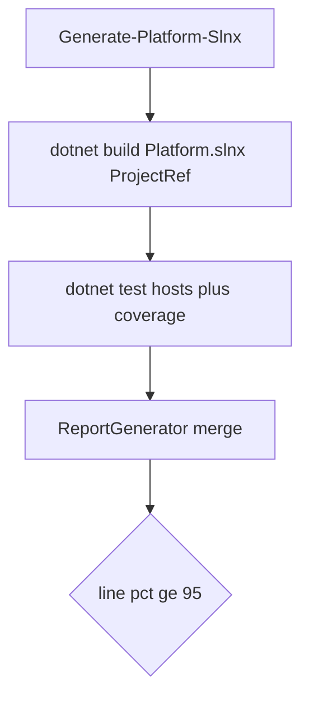

# Platform 95% Coverage via Novolis.Platform.slnx

## Locked decisions

- **Scope:** All library projects in regenerated [`Novolis.Platform.slnx`](d:\novolis\novolis-governance\build\Novolis.Platform.slnx), minus standing skips in [`coverage-excludes.txt`](d:\novolis\novolis-governance\scripts\coverage-excludes.txt) and assemblies already marked `[assembly: ExcludeFromCodeCoverage]` (native/UI/Docker — see [`coverage-report.md`](d:\novolis\novolis-governance\docs\coverage-report.md)).
- **Evaluation:** Build/test with **ProjectReference mode** against the platform slnx (local source), not NuGet-mode per-repo collection.
- **Gate:** Aggregate **line** coverage ≥ **95%** (`-FailBelow 95`). Any test failure fails the run.

## Tooling (do this first)

Extend coverage collection rather than inventing a parallel stack.

1. **Regenerate** before every evaluation:

```powershell
pwsh -File d:\novolis\novolis-governance\build\Generate-Platform-Slnx.ps1
```

2. Add a **Platform mode** to [`get-coverage-report.ps1`](d:\novolis\novolis-governance\scripts\get-coverage-report.ps1) (e.g. `-PlatformSlnx`):
   - Resolve solution: `d:\novolis\novolis-governance\build\Novolis.Platform.slnx` (after regen).
   - Optional `-RegenerateSlnx` to call `Generate-Platform-Slnx.ps1` up front.
   - Set `NovolisUseProjectReferences=true` (solution name `Novolis.Platform` also auto-enables; keep the explicit property).
   - **Build once:** `dotnet build` on the platform slnx.
   - **Collect coverage:** run `dotnet test --coverage` on every MTP test host that appears in that slnx (or `dotnet test` on the slnx if stable under MTP). Prefer enumerating test projects from the slnx so parallel throttle still works and apps/excludes stay out.
   - Merge Cobertura with ReportGenerator as today → `d:\novolis\artifacts\coverage\`.
   - Default or document `-FailBelow 95` for this mode.

3. Keep existing NuGet/per-repo mode for single-repo debugging; Platform mode is the org gate.

4. Fix [`Get-ScopedCoverage.ps1`](d:\novolis\novolis-governance\scripts\Get-ScopedCoverage.ps1) (`$valid` vs `$linesValid`) if used for assembly-scoped rollups.

5. Update [`coverage-report.md`](d:\novolis\novolis-governance\docs\coverage-report.md): Platform.slnx regen + ProjectRef evaluation + 95% gate.



## Baseline then close gaps

After tooling works, run:

```powershell
pwsh -File d:\novolis\novolis-governance\build\Generate-Platform-Slnx.ps1
pwsh -File d:\novolis\novolis-governance\scripts\get-coverage-report.ps1 -PlatformSlnx -RegenerateSlnx:$false -FailBelow 95
```

Use `SUMMARY.md` / HTML to drive work in this order:

1. **Green tests** — last slice failed `novolis-audio` / `novolis-rendering` unit hosts; fix those first so Cobertura is complete.
2. **Linkage gaps** — from [`artifacts/test-gaps/SUMMARY.md`](d:\novolis\artifacts\test-gaps\SUMMARY.md): either add headless tests + `ProjectReference`, or (only for true platform/native hosts) add `ExcludeFromCodeCoverage` and document in `coverage-report.md`. Candidates still unlinked without that attribute include e.g. `Novolis.Media.Rtc*`, `Novolis.Avalonia.Media`, `Novolis.Media.Capture.Windows`.
3. **Lowest line-% assemblies** — add TUnit coverage in the owning repo’s `tests/` until aggregate ≥ 95%. Prefer exercising public API and branches; no Coverlet packages (MTP `--coverage` only).

Do not use local NuGet feeds; ProjectRef mode is the measurement path.

## Done when

- Platform slnx regenerated and used for the coverage run.
- `get-coverage-report.ps1 -PlatformSlnx -FailBelow 95` exits **0**.
- Docs describe the Platform evaluation path.
- `verify-nuget-only.ps1` still clean (no committed cross-repo `ProjectReference`).

