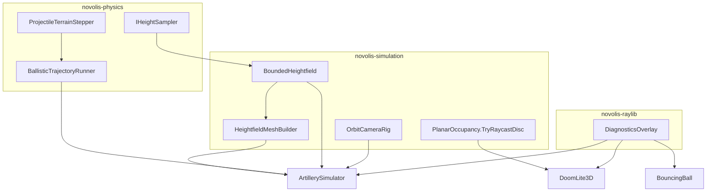

# Platform library gaps + dogfood PackRef migration

## Goal

Implement the framework types identified from **BouncingBall**, **DoomLite3D**, and **ArtillerySimulator**, ship them via existing NuGet packages (no new repos), bump **`0.4.0-local`**, pack to [`artifacts/nuget-local`](d:\novolis\artifacts\nuget-local), and migrate the three apps to **`PackageReference` only** per [design.md](d:\novolis\novolis-dogfooding\docs\design.md).

## Constraints (governance)

- Stack: Math → Physics → Simulation; **Raylib must not reference Simulation** ([library-boundaries.md](d:\novolis\novolis-governance\docs\library-boundaries.md)).
- `ViewPose` lives in Simulation.View; GPU bridge stays a **one-liner in apps**: `RayCamera.Perspective(pose.Position, pose.Target, pose.Up, pose.FieldOfView)`.
- Procedural terrain **styles** (`TerrainHeightSampler`, `TerrainStyle`) stay in the Artillery app; libraries take `IHeightSampler` delegates.



---

## Phase 1 — Physics.Abstractions + Physics.Ballistics (P0)

**Repo:** [novolis-physics](d:\novolis\novolis-physics)

### New types (`Novolis.Physics.Abstractions`)

| Type | Role |
|------|------|
| `IHeightSampler` | `float SampleHeight(float x, float z)` for terrain contact |
| `AxisAlignedRangeBox` | XZ extent `[0, extent]` helpers used by bounded ballistics |

### New types (`Novolis.Physics.Ballistics`)

| Type | Role |
|------|------|
| `ProjectileTerrainImpactReason` | `TerrainMesh`, `Heightfield`, `BeyondRange`, `MaxSteps` |
| `ProjectileTerrainImpact` | Position, velocity, time, horizontal range, reason |
| `ProjectileTerrainStepOptions` | `dt`, sphere radius, max sweep per substep, max steps, substep budget |
| `ProjectileTerrainStepper` | **Canonical integrate-then-sweep** loop matching [`ProjectileSemiImplicitIntegrator`](d:\novolis\novolis-physics\src\Novolis.Physics.Ballistics\ProjectileSemiImplicitIntegrator.cs): `displacement = candidate.Position - startPos`; sub-split when `|disp| > maxSweep`; `BallisticsQueries.SweepProjectileSphere`; heightfield + range-box checks |
| `BallisticTrajectoryRunner` | Stateful runner: `Begin` / `AdvanceWithBudget` / trail buffer / `Impact`; shared by flight and preview |
| `HeightfieldContact` | Segment height test + surface projection (replaces app-only `TryHeightfieldContact` / misuse of [`GroundImpact`](d:\novolis\novolis-physics\src\Novolis.Physics.Ballistics\GroundImpact.cs) for terrain) |
| `SegmentImpactInterpolator` | Lerp impact point/time/velocity along sweep hit (extract from test patterns in [`CollisionSweepScenarioTests`](d:\novolis\novolis-physics\tests\Novolis.Physics.Unit\CollisionSweepScenarioTests.cs)) |

**Bounded range behavior (encode range-limit fix):** when segment exits `AxisAlignedRangeBox`, impact position = **project XZ to box edge + `IHeightSampler` Y** (same semantics as completed [fix_range-limit plan](d:\novolis\.cursor\plans\fix_range-limit_impacts_4ca31268.plan.md)), not in-air Y.

### Tests

- New `ProjectileTerrainStepperTests` in [Novolis.Physics.Unit](d:\novolis\novolis-physics\tests\Novolis.Physics.Unit): flat mesh hit, heightfield hit, range-box ground projection, large-step sub-split (parity with `SweepLimitationScenarioTests`).
- Extend [INTEGRATION.md](d:\novolis\novolis-physics\docs\INTEGRATION.md) §2 with **“Terrain flight loop”** section pointing at `ProjectileTerrainStepper` (not hand-rolled sweeps).

### Version

Bump [`Novolis.Physics.Packaging.props`](d:\novolis\novolis-physics\build\Novolis.Physics.Packaging.props) → **`0.4.0-local`**.

---

## Phase 2 — Simulation.World + World.Builders (P1)

**Repo:** [novolis-simulation](d:\novolis\novolis-simulation)

### `Novolis.Simulation.World`

| Type | Role |
|------|------|
| `BoundedHeightfield` | Wraps `IHeightSampler` + `AxisAlignedRangeBox`: `IsInside`, `SampleHeight`, `TrySegmentLeavesRange`, `ProjectOntoSurface`, `TryHeightfieldContact` (move logic from [`TerrainWorld.cs`](d:\novolis\novolis-dogfooding\apps\ArtillerySimulator\Game\TerrainWorld.cs)) |
| `WorldExtentOptions` | `ExtentMeters`, collision grid resolution, draw decimation |
| `PlanarOccupancy.TryRaycastDisc` + `PlanarDiscHit` | XZ ray vs columnar target (replaces [`CombatRaycast`](d:\novolis\novolis-dogfooding\apps\DoomLite3D\Game\CombatRaycast.cs)) |

### `Novolis.Simulation.World.Builders`

| Type | Role |
|------|------|
| `HeightfieldMeshBuilder` | Height grid → `StaticTriangleMesh` + `BvhStaticWorld` (extract from `TerrainWorld.BuildMeshes`) |
| `HeightfieldBuildResult` | Collision BVH + optional decimated draw vertices |

### Tests

- `BoundedHeightfieldTests`, `HeightfieldMeshBuilderTests` in simulation test projects.
- `PlanarOccupancyDiscRaycastTests` (hit/miss/max range).

### Version

Bump [`Novolis.Simulation.Packaging.props`](d:\novolis\novolis-simulation\build\Novolis.Simulation.Packaging.props) → **`0.4.0-local`**.

---

## Phase 3 — Simulation.View cameras (P2)

**Repo:** [novolis-simulation](d:\novolis\novolis-simulation)

| Type | Role |
|------|------|
| `ViewPose` | Position, Target, Up, FieldOfViewDegrees (platform observer output) |
| `OrbitCameraRig` | Target, distance, yaw/pitch, smoothing → `ViewPose` |
| `FreeLookCameraRig` | WASD-style free position + yaw/pitch → `ViewPose` |
| `TrackingCameraRig` | Optional: smooth follow moving target (shot trail / gun pivot) |

Port behavior from [`ArtilleryCamera.cs`](d:\novolis\novolis-dogfooding\apps\ArtillerySimulator\Game\ArtilleryCamera.cs) into rigs; keep product FOV/speed constants in app.

### Tests

- `OrbitCameraRigTests` (snap, smooth, clamp pitch).

---

## Phase 4 — Raylib.Game diagnostics (P4)

**Repo:** [novolis-raylib](d:\novolis\novolis-raylib)

| Type | Role |
|------|------|
| `SmoothedFps` | EMA FPS helper |
| `FrameDiagnostics` | Working set, GC heap, optional custom lines |
| `DiagnosticsOverlay` | F3 toggle, panel draw via `RayGameContext` |

Replace duplicated [`DiagnosticsHud.cs`](d:\novolis\novolis-dogfooding\apps\BouncingBall\Game\DiagnosticsHud.cs) / DoomLite copy with overlay + app-specific `Action<FrameDiagnostics>` lines.

**Optional (same phase if cheap):** `RayGameContext.DrawHeightfieldWires(vertices, cellsX, cellsZ)` to replace Artillery bolt loop in [`TerrainWorld.Draw`](d:\novolis\novolis-dogfooding\apps\ArtillerySimulator\Game\TerrainWorld.cs).

### Version

Bump [`Novolis.Raylib.Packaging.props`](d:\novolis\novolis-raylib\build\Novolis.Raylib.Packaging.props) → **`0.4.0-local`**.

---

## Phase 5 — Pack and central versions

1. Run [`scripts/pack-novolis-local.ps1`](d:\novolis\scripts\pack-novolis-local.ps1) (math/physics/simulation/raylib in dependency order).
2. Update [novolis-dogfooding/Directory.Packages.props](d:\novolis\novolis-dogfooding\Directory.Packages.props): all Novolis `0.3.0-local` → **`0.4.0-local`** (add any missing package IDs: `Novolis.Physics.Ballistics` already listed; ensure `Novolis.Raylib` pulls updated Game assembly).

---

## Phase 6 — App migrations (PackageReference only)

### Shared csproj pattern

Replace all `ProjectReference` to `novolis-*` with `PackageReference` (no version in csproj; central versions only). Keep app `Program.cs` + `Game/` unchanged in structure.

| App | PackageReferences |
|-----|-------------------|
| [BouncingBall.csproj](d:\novolis\novolis-dogfooding\apps\BouncingBall\BouncingBall.csproj) | `Novolis.Raylib`, `Novolis.Math.Arrays`, `Novolis.Simulation.World`, `Novolis.Simulation.World.Builders`, `Novolis.Physics.Collision.Simple` |
| [DoomLite3D.csproj](d:\novolis\novolis-dogfooding\apps\DoomLite3D\DoomLite3D.csproj) | `Novolis.Raylib`, `Novolis.Math.Arrays`, `Novolis.Math.Geometry`, `Novolis.Simulation.World`, `Novolis.Simulation.View`, `Novolis.Simulation.Kinematics` |
| [ArtillerySimulator.csproj](d:\novolis\novolis-dogfooding\apps\ArtillerySimulator\ArtillerySimulator.csproj) | `Novolis.Raylib`, `Novolis.Physics.Ballistics`, `Novolis.Physics.Collision.Simple`, `Novolis.Simulation.World`, `Novolis.Simulation.World.Builders`, `Novolis.Simulation.View` |

### BouncingBall

- Swap in `DiagnosticsOverlay` (custom lines: ball count, contacts, substeps from `BallWorld` stats).
- No pile/spawn library work (optional `SpawnSphereLayout` **deferred**).

### DoomLite3D

- `EnemySystem` / weapon hit: use `PlanarOccupancy.TryRaycastDisc`; **delete** `CombatRaycast.cs`.
- `PlayerController.BuildRaylibCamera`: build from `YawPitchController` → `ViewPose` → `RayCamera.Perspective(...)`.
- `DiagnosticsOverlay` with enemy/level seed lines.

### ArtillerySimulator (largest refactor)

| App file | Becomes |
|----------|---------|
| [`TerrainWorld.cs`](d:\novolis\novolis-dogfooding\apps\ArtillerySimulator\Game\TerrainWorld.cs) | Thin wrapper: `BoundedHeightfield` + `HeightfieldMeshBuilder` + app `TerrainHeightSampler` adapter implementing `IHeightSampler`; draw uses optional `DrawHeightfieldWires` |
| [`ProjectileRun.cs`](d:\novolis\novolis-dogfooding\apps\ArtillerySimulator\Game\ProjectileRun.cs) | **Deleted** — use `BallisticTrajectoryRunner` |
| [`BallisticArcPreview.cs`](d:\novolis\novolis-dogfooding\apps\ArtillerySimulator\Game\BallisticArcPreview.cs) | **Deleted** — `BallisticTrajectoryRunner` preview mode (coarser dt / point cap) |
| [`ArtilleryCamera.cs`](d:\novolis\novolis-dogfooding\apps\ArtillerySimulator\Game\ArtilleryCamera.cs) | **Deleted** — `OrbitCameraRig` + `FreeLookCameraRig` |
| [`SimulationUnits.cs`](d:\novolis\novolis-dogfooding\apps\ArtillerySimulator\Game\SimulationUnits.cs) | Keep as app tuning; pass into `WorldExtentOptions` |
| [`AtmosphereModel.cs`](d:\novolis\novolis-dogfooding\apps\ArtillerySimulator\Game\AtmosphereModel.cs) | Unchanged (product preset over `StandardAtmosphere`) |

[`ArtillerySimulatorGame.cs`](d:\novolis\novolis-dogfooding\apps\ArtillerySimulator\Game\ArtillerySimulatorGame.cs) wires runner + rigs + overlay only.

### Docs

- Update [design.md](d:\novolis\novolis-dogfooding\docs\design.md) app table with new package columns.
- Update [README.md](d:\novolis\novolis-dogfooding\README.md) quick start: **pack → restore → build** (no project-ref path for these three apps).

---

## Validation

```powershell
d:\novolis\scripts\pack-novolis-local.ps1
cd d:\novolis\novolis-dogfooding
dotnet build Novolis.Dogfooding.slnx -c Release
dotnet run --project apps/BouncingBall -c Release --no-build
dotnet run --project apps/DoomLite3D -c Release --no-build
dotnet run --project apps/ArtillerySimulator -c Release --no-build
```

**Artillery acceptance:** flat terrain + vacuum ≈ textbook range; high-angle shot at map edge shows **ground Y** at edge (range-limit projection); preview arc matches flight endpoint; no regression in sweep hits on hills.

**DoomLite acceptance:** hitscan still kills enemies; F3 diagnostics; movement unchanged.

**BouncingBall acceptance:** spawn/stress (B / Ctrl+B) unchanged; F3 diagnostics.

---

## Explicitly out of scope

- New NuGet repos / “Kit” packages
- DoomLite maze/enemy/boss systems (stay in app)
- `SpawnSphereLayout` / dual-BVH documentation-only helpers (unless time remains in P4)
- BridgeCommander / WireFishViewer csproj changes
- Pushing `0.4.0-local` to nuget.org (local feed only)

