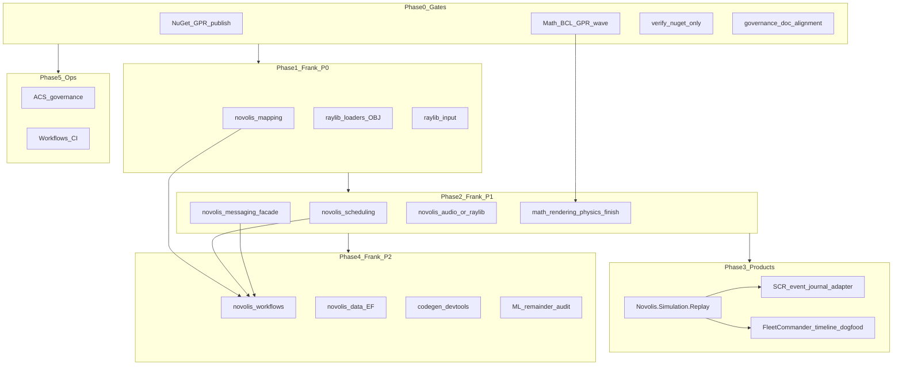

# Platform import master plan

## Problem

Today import work lives as **37 disconnected markdown files** under [`novolis-governance/docs/imports-todo/`](d:\novolis\novolis-governance\docs\imports-todo\README.md), plus overlap with [`roadmap.md`](d:\novolis\novolis-governance\docs\roadmap.md) and [`frank-inventory.md`](d:\novolis\novolis-governance\docs\frank-inventory.md). There is no single execution sequence, status tracking, or publish gate.

## Deliverable (governance change)

Create **one canonical plan** and demote scattered docs to appendices:

| Artifact | Role |
|----------|------|
| **[`docs/platform-import-plan.md`](d:\novolis\novolis-governance\docs\platform-import-plan.md)** (new) | Master plan: phases, dependencies, acceptance, status |
| [`docs/imports-todo/README.md`](d:\novolis\novolis-governance\docs\imports-todo\README.md) | Short index pointing to master plan + “detail appendix” links |
| [`docs/roadmap.md`](d:\novolis\novolis-governance\docs\roadmap.md) | Add “Platform imports” section linking to master plan |
| Detail files under `imports-todo/` | Kept as **appendices** (what/why/how); no duplicate priority tables |



---

## Global rules (all phases)

From [`third-party-inspiration-policy.md`](d:\novolis\novolis-governance\docs\imports-todo\third-party-inspiration-policy.md) and workspace policy:

- **Mine (Frank):** `D:\frankrepos`, `D:\github\Frank.*`, FleetCommander, SCR — extract **pieces** via rebuild, not wholesale copy.
- **Third-party:** `D:\repos` clones (bullet3, raylib, ravendb, …) and `D:\dotnetrepos` (Bedrock, aspnetcore, …) — **inspiration only**; use NuGet or reimplement slices.
- **Cross-repo:** `PackageReference` only ([`nuget-only-policy.md`](d:\novolis\novolis-governance\docs\nuget-only-policy.md)); publish upstream packages before consumer bumps.
- **Stack:** [`library-boundaries.md`](d:\novolis\novolis-governance\docs\library-boundaries.md) — Math → Physics → Simulation; Raylib/Rendering orthogonal; SCR product code stays in `StarConflictsRevolt.*`.

---

## Already done (do not re-plan; close in master plan)

| Item | Evidence | Appendix |
|------|----------|----------|
| **Simulation replay (FC patterns)** | [`Novolis.Simulation.Replay`](d:\novolis\novolis-simulation\src\Novolis.Simulation.Replay) in slnx | [fleetcommander-patterns](d:\novolis\novolis-governance\docs\imports-todo\fleetcommander-patterns-for-platform.md) |
| **TCP middleware + memory transport** | [`Novolis.Transports.Tcp.Abstractions`](d:\novolis\novolis-transports\src\Novolis.Transports.Tcp.Abstractions) | [bedrockframework-transports](d:\novolis\novolis-governance\docs\imports-todo\bedrockframework-transports-inspiration.md) |
| **2D platformer lane (partial GameEngine 2D)** | [`Novolis.Rendering.TwoD`](d:\novolis\novolis-rendering\src\Novolis.Rendering.TwoD) + [`Backends.TwoD.Silk`](d:\novolis\novolis-rendering\src\Novolis.Rendering.Backends.TwoD.Silk) per [design-two-d.md](d:\novolis\novolis-rendering\docs\design-two-d.md) | [gameengine-2d](d:\novolis\novolis-governance\docs\imports-todo\gameengine-2d-scene-rendering.md) — **revise appendix**: Raylib `Scene2D` import → **cancelled** unless gap found; optional: `Board<T>` only |

**Follow-ups on “done” items (still in plan):** GPR publish for Replay + Tcp.Abstractions; optional logging middleware; SCR/FC adoption of Replay package.

---

## Phase 0 — Publish gates and in-repo completion (2–3 weeks)

Unblocks all consumers; sourced from [`internal-novolis-audit/`](d:\novolis\novolis-governance\docs\imports-todo\internal-novolis-audit\README.md).

| Workstream | Actions | Acceptance |
|------------|---------|------------|
| **GPR / local feed** | Ship messaging pilot per [nuget-setup.md](d:\novolis\novolis-governance\docs\nuget-setup.md); pack Math `2026.1.*` (Arrays, Topology, Geometry), Simulation.Replay, Tcp.Abstractions | Consumers restore without `Ray3`/`Sphere3` missing types |
| **Math BCL wave** | [math-bcl-refactor-publish-wave](d:\novolis\novolis-governance\docs\imports-todo\internal-novolis-audit\math-bcl-refactor-publish-wave.md): consumer `Directory.Packages.props`, release notes, `verify-nuget-only.ps1` exit 0 | Physics/Rendering/Simulation/dogfooding build on packages only |
| **Physics.Numerics sunset** | [physics-numerics-package-sunset](d:\novolis\novolis-governance\docs\imports-todo\internal-novolis-audit\physics-numerics-package-sunset.md): fix README, remove csproj edges, delete package | No production `Ray3d` guidance |
| **Rendering/math polish** | [viewbasis](d:\novolis\novolis-governance\docs\imports-todo\internal-novolis-audit\rendering-viewbasis-ray-generation.md), [ilgpu-bvh-slab-parity](d:\novolis\novolis-governance\docs\imports-todo\internal-novolis-audit\ilgpu-bvh-slab-parity.md), [rigidtransform](d:\novolis\novolis-governance\docs\imports-todo\internal-novolis-audit\rigidtransform-and-obsolete-transform.md) | Tests green; single slab/ray authority |
| **Doc alignment** | [governance-docs-stale-references](d:\novolis\novolis-governance\docs\imports-todo\internal-novolis-audit\governance-docs-stale-references.md), simulation-layer-policy Topology line, cursor rule `Ray3` | Agents see consistent names |

---

## Phase 1 — Frank P0: new platform packages (3–5 weeks)

Sources: `D:\frankrepos` (primary). Appendices: [frank-mapping](d:\novolis\novolis-governance\docs\imports-todo\frank-mapping.md), [gameengine-assets](d:\novolis\novolis-governance\docs\imports-todo\gameengine-assets-mesh-import.md), [gameengine-input](d:\novolis\novolis-governance\docs\imports-todo\gameengine-input.md).

| # | Target | Source | Notes |
|---|--------|--------|-------|
| 1.1 | **`novolis-mapping`** (`Novolis.Mapping`, `.Analyzers`; Documents wave 1b) | `Frank.Mapping` | Blocks WorkflowEngine and ML Legacy; update [frank-inventory](d:\novolis\novolis-governance\docs\frank-inventory.md) wave 13 |
| 1.2 | **`Novolis.Raylib.Loaders`** (or `.Assets`) | `Frank.GameEngine.Assets` (`ObjParser`, `SceneMeshImporter`, optional Assimp split) | Merge with wave 7b OBJ brief; depends Phase 0 Geometry GPR |
| 1.3 | **`Novolis.Raylib.Input`** | `Frank.GameEngine.Input` | `IInputSource`, `NullInputSource`; no Simulation ref |

**Acceptance:** TUnit in each repo; registry entries; dogfood one sample (mesh load or input mode).

---

## Phase 2 — Frank P1: infrastructure + game lane (4–6 weeks)

| # | Target | Source | Depends |
|---|--------|--------|---------|
| 2.1 | **`novolis-scheduling`** | `Frank.CronJobs` | Testing GPR |
| 2.2 | **Extend `novolis-messaging`** | `Frank.Messaging` facade | Channels on GPR |
| 2.3 | **`novolis-audio`** (preferred) or Raylib facet | `Frank.GameEngine.Audio` | Independent |
| 2.4 | **ViewPose bridge doc + dogfood helper** | [simulation-viewpose-to-rendering](d:\novolis\novolis-governance\docs\imports-todo\internal-novolis-audit\simulation-viewpose-to-rendering-bridge.md) | Simulation + Rendering packages only |
| 2.5 | **Codegen bindings backlog (selective)** | [codegen-bindings-backlog](d:\novolis\novolis-governance\docs\imports-todo\internal-novolis-audit\codegen-bindings-backlog.md) | Phase 6 doc enrichment deferred |

**Revise:** [gameengine-audio](d:\novolis\novolis-governance\docs\imports-todo\gameengine-audio.md), [frank-messaging-facade](d:\novolis\novolis-governance\docs\imports-todo\frank-messaging-facade.md), [frank-scheduling-cronjobs](d:\novolis\novolis-governance\docs\imports-todo\frank-scheduling-cronjobs.md).

---

## Phase 3 — Product patterns (mine; apps adopt platform) (ongoing)

**Not new monolith repos** — adapters in products + small platform facets.

| Product | Path | Platform work | Appendix |
|---------|------|---------------|----------|
| **FleetCommander** | `D:\repos\FleetCommander` | Adopt `Novolis.Simulation.Replay` in headless tests; keep domain in product | [fleetcommander-patterns](d:\novolis\novolis-governance\docs\imports-todo\fleetcommander-patterns-for-platform.md) |
| **Star Conflicts Revolt** | `D:\github\StarConflictsRevolt` | **Event journal** (`IGameEvent` + `IEventStore`) stays product; add optional `ISimulationEventStore<T>` in Simulation **only if** second consumer; map tick snapshots via Replay | [star-conflicts-revolt-patterns](d:\novolis\novolis-governance\docs\imports-todo\star-conflicts-revolt-patterns.md) |
| **Dogfooding** | `novolis-dogfooding` | PackageReference-only; bridge `ViewPose` → `CameraSnapshot` | internal bridge doc |

**Future (spec only):** [`inertial-frame-stack-spec.md`](d:\novolis\novolis-governance\docs\inertial-frame-stack-spec.md) → `novolis-spatial` when SCR needs it (out of scope for this plan’s code waves).

---

## Phase 4 — Frank P2: workflows, data, codegen, ML (6+ weeks)

| # | Target | Source | Depends |
|---|--------|--------|---------|
| 4.1 | **`novolis-workflows`** | `Frank.WorkflowEngine` | Mapping + Cron + Messaging |
| 4.2 | **`novolis-data`** EF facet | `Frank.EntityFrameworkCore` | Testing |
| 4.3 | **Codegen devtools facets** | `Frank.SolutionManager`, `GitKit`, `Blazor.JsInteropGenerator` | [frank-codegen-devtools](d:\novolis\novolis-governance\docs\imports-todo\frank-codegen-devtools.md) |
| 4.4 | **ML remainder audit** | `Frank.ML` domain/presentation | [frank-ml-remainder](d:\novolis\novolis-governance\docs\imports-todo\frank-ml-remainder.md); apps only for presentation |

---

## Phase 5 — Governance and CI (parallel with Phase 0–1)

| # | Work | Source |
|---|------|--------|
| 5.1 | ACS: `AGENTS.md` + `.ai/index.md` + adapted `Verify-AcsRepo.ps1` | `D:\repos\agent-contracts-standard` — [agent-contracts](d:\novolis\novolis-governance\docs\imports-todo\agent-contracts-novolis-governance.md) |
| 5.2 | Central GitHub Actions from `D:\repos\Workflows` | [workflows-and-release-ci](d:\novolis\novolis-governance\docs\imports-todo\workflows-and-release-ci.md) |
| 5.3 | **DependenciesExplorer** maintainer tool | [github-frank-mine-extra](d:\novolis\novolis-governance\docs\imports-todo\github-frank-mine-extra.md) |

---

## Explicit skip / inspiration-only (no platform import waves)

Consolidate into master plan “Do not import” table from:

- [frank-repos-explicit-skip](d:\novolis\novolis-governance\docs\imports-todo\frank-repos-explicit-skip.md)
- [repos-third-party-catalog](d:\novolis\novolis-governance\docs\imports-todo\repos-third-party-catalog.md)
- [dotnetrepos-platform-reference](d:\novolis\novolis-governance\docs\imports-todo\dotnetrepos-platform-reference.md)

Includes: WPF, HttpDude, Finance UBL, TorrentClient, bullet3/ravendb/MonoGame vendoring, `Frank.GameEngine` bulk migration (Rendering.RayLib, Physics, Primitives 3D), **Unity `rebellion2`**, semantic-kernel in platform.

**Bedrock.Framework:** no fork; optional middleware/logging only ([bedrock appendix](d:\novolis\novolis-governance\docs\imports-todo\bedrockframework-transports-inspiration.md) — Tcp slice **done**).

---

## Verification checklist (every phase)

1. `pwsh -File novolis-governance/scripts/verify-nuget-only.ps1` → exit 0  
2. Affected solution `dotnet build` + `dotnet test` (MTP-compatible on .NET 10 SDK)  
3. Pack affected packages `2026.1.*`; bump consumer `Directory.Packages.props`  
4. Update master plan status table + [frank-inventory](d:\novolis\novolis-governance\docs\frank-inventory.md) row  

---

## Suggested implementation order (single backlog)

```text
Phase0 (Math GPR, Numerics sunset, docs) 
  → Phase1 (Mapping, Raylib Loaders, Raylib Input)
  → Phase2 (Cron, Messaging, Audio) in parallel with Phase5 (ACS, CI)
  → Phase3 (SCR Replay adoption, FC tests)
  → Phase4 (Workflow → EF → Codegen devtools → ML audit)
```

---

## What you get after consolidation

- One place to track **status** (todo / in progress / done / skip).  
- Clear **dependencies** (Mapping before Workflow; Math GPR before simulation tests).  
- No duplicate “P0” lists across 37 files.  
- Appendices remain for deep “how” without maintaining parallel priority tables.

