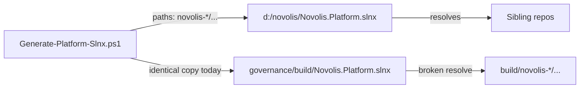

# Fix Novolis.Platform.slnx root vs governance/build

## Diagnosis

There are two identical files (same SHA256):

- [`d:\novolis\Novolis.Platform.slnx`](d:\novolis\Novolis.Platform.slnx) — **works**
- [`d:\novolis\novolis-governance\build\Novolis.Platform.slnx`](d:\novolis\novolis-governance\build\Novolis.Platform.slnx) — **does not**

[`Generate-Platform-Slnx.ps1`](d:\novolis\novolis-governance\build\Generate-Platform-Slnx.ps1) writes project paths relative to the **workspace root** (`novolis-agent\src\...`), then copies that file unchanged into `novolis-governance\build\`. Dotnet/VS resolve those paths against the **solution directory**, so from `build\` they look for `d:\novolis\novolis-governance\build\novolis-agent\...` (missing). Confirmed: that path does not exist; the root-relative path does.

`SolutionName == Novolis.Platform` (ProjectReference mode) still works from either filename; location is the bug, not mode.

The root file is outside any git repo; the governance copy is the checked-in inventory (`git ls-files build/Novolis.Platform.slnx`). Docs/skills still tell people to open/build the governance path ([`nuget-only-dependencies.mdc`](d:\novolis\.cursor\rules\nuget-only-dependencies.mdc), [`novolis-project-ref-mode` skill](d:\novolis\.cursor\skills\novolis-project-ref-mode\SKILL.md), [`platform-project-ref-mode.md`](d:\novolis\novolis-governance\docs\platform-project-ref-mode.md), [`README-Platform-Solution.md`](d:\novolis\novolis-governance\build\README-Platform-Solution.md)).



## Chosen approach

1. **Canonical daily path:** `d:\novolis\Novolis.Platform.slnx` (matches your “want it in root” preference; generator already defaults here).
2. **Keep a checked-in copy** under governance for regen commits, but when copying, **rewrite** each `Project Path=` to `..\..\...` so that file is also buildable from `build\`.
3. **Retarget** agent rules, skill, coverage resolver, and platform docs to prefer/document the root path.

## Implementation

### Generator

In [`Generate-Platform-Slnx.ps1`](d:\novolis\novolis-governance\build\Generate-Platform-Slnx.ps1) (copy block ~279–284):

- Write root file unchanged (workspace-relative paths).
- When copying to `$scriptDir\Novolis.Platform.slnx`, transform every project path to be relative to `novolis-governance\build` (prefix `..\..\`).
- Keep PackageToProject map generation as today (unaffected).

### Coverage / scripts

In [`Coverage.ps1`](d:\novolis\novolis-governance\scripts\lib\Coverage.ps1) `Get-NovolisPlatformSlnxPath`:

- Prefer **root** `Novolis.Platform.slnx`, fall back to governance copy.
- Resolve project paths with `[IO.Path]::GetFullPath((Join-Path $slnxDir $rel))` so both path styles work; drop the special-case “always join to workspace root” hack once the build copy uses `..\..\`.

Update [`get-coverage-report.ps1`](d:\novolis\novolis-governance\scripts\get-coverage-report.ps1) help text default from “governance/build copy” to workspace root.

### Docs / agent surfaces (high-signal only)

Point open/build commands at `d:\novolis\Novolis.Platform.slnx`:

- [`.cursor/rules/nuget-only-dependencies.mdc`](d:\novolis\.cursor\rules\nuget-only-dependencies.mdc)
- [`.cursor/skills/novolis-project-ref-mode/SKILL.md`](d:\novolis\.cursor\skills\novolis-project-ref-mode\SKILL.md)
- [`docs/platform-project-ref-mode.md`](d:\novolis\novolis-governance\docs\platform-project-ref-mode.md)
- [`build/README-Platform-Solution.md`](d:\novolis\novolis-governance\build\README-Platform-Solution.md) — fix stale “default OutputPath = governance/build” (script already defaults to root); state root is canonical, governance copy is checked-in + path-adjusted.

Light touch on READMEs that hardcode the wrong absolute path (e.g. civics / GeoPolity / ChannelLab) if encountered while editing; no mass dogfooding README sweep.

### Verify (after implementation)

```powershell
dotnet sln d:\novolis\Novolis.Platform.slnx list
# spot-check a project resolves from both locations after regen:
Test-Path d:\novolis\novolis-agent\src\Novolis.Agent.Core\Novolis.Agent.Core.csproj
pwsh -File d:\novolis\novolis-governance\build\Generate-Platform-Slnx.ps1
# then confirm governance paths start with ..\..\
dotnet build d:\novolis\Novolis.Platform.slnx --no-restore  # or restore+build smoke if needed
```

Full platform build may still fail for unrelated project issues; success criterion is **solution load / project path resolution** from root (and from the rewritten governance copy).

