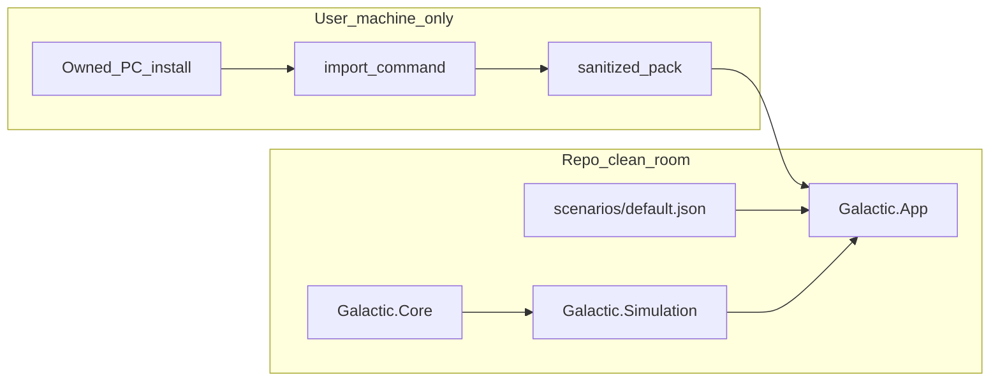

# Playable, IP-safe GalacticSim

## Goals (your choices)

- **Playable:** Real game loop (not just a viewer), architected for **full parity over multiple phases**; first milestone is a shippable MVP loop.
- **Content:** **Optional local import** from an install the user owns; **no names/strings/audio/video** in the pack; **nothing committed to git**.

## Non-negotiable IP rules

| Rule | Implementation |
|------|----------------|
| No game binaries in repo | Expand [`.gitignore`](d:\novolis\novolis-experimental\.gitignore): `**/*.dat`, `**/*.bmp`, `**/*.wav`, `**/*.smk`, `**/*.x`, `**/pack/`, `**/manifest.json`, `_scratch/` |
| No trademarked **names** in source | Rename namespaces, CLI strings, window titles, env vars, scripts (see below) |
| No copyrighted **text** in packs | Drop `TEXTSTRA` / `ENCYTEXT` extraction; JSON uses numeric IDs only (`systemId`, `hull`, `factionMask`) |
| No generated code in repo with user paths | Stop writing import output into [`generated/`](d:\novolis\novolis-experimental\generated); emit pack only under `%LOCALAPPDATA%/NovolisExperimental/GalacticSim/pack/` |
| Import is opt-in | `play` works **without** import using built-in [`scenarios/default.json`](d:\novolis\novolis-experimental\scenarios\default.json) (synthetic, clean-room) |

**Rename map (code + UX):**

- `Novolis.Experimental.Rebellion.*` → `Novolis.Experimental.Galactic.*`
- `RebellionInstall` → `LegacyInstallLocator` (docs: “1998 grand-strategy PC install”, never “Star Wars”)
- `SW_REBELLION_DIR` → `GALACTIC_SOURCE_INSTALL`
- CLI: `build`/`run` → **`import`** / **`play`**
- Window title: `"Novolis GalacticSim (experimental)"`

Remove committed infringing artifacts: replace [`generated/*.g.cs`](d:\novolis\novolis-experimental\generated\Novolis.Experimental.Rebellion.Generated) with tiny hand-written stubs or delete folder; add `verify-clean-repo.ps1` that fails if `.dat`/`.bmp`/trademark strings appear outside `docs/legacy-reference.md`.



---

## Phase 1 — Sanitized import pipeline

Refactor existing extract/parse stack ([`RebellionAssetDumper`](d:\novolis\novolis-experimental\src\Novolis.Experimental.Rebellion.Extract\RebellionAssetDumper.cs), [`DatRegistry`](d:\novolis\novolis-experimental\src\Novolis.Experimental.Rebellion.Data\Dat\DatRegistry.cs)):

**`import` output layout** (`%LOCALAPPDATA%/NovolisExperimental/GalacticSim/pack/`):

```
pack/
  manifest.json          # hashes, counts, no trademark strings
  schema/
    systems.json           # id, sectorId, x, y, production fields (numbers only)
    ships.json             # id, stats vector, factionMask
    sectors.json
    params.json            # GNPRTB/SDPRTB numeric tables
  visuals/                 # optional --include-visuals
    meshes/mesh_###.x
    sprites/sprite_###.png
```

**Strip from current importer:**

- Delete `ExtractTextResources` / `StringTables` codegen / `entities.json` / `encyclopedia.json`
- Default **off:** voice WAV, SMK video, soundtrack (John Williams) — add `--include-audio` only if user explicitly wants local research copies
- PE UI bitmaps: anonymous `sprite_#####.png` only; no DLL names in manifest

**New:** [`ContentSanitizer.cs`](d:\novolis\novolis-experimental\src\Novolis.Experimental.Galactic.Import\ContentSanitizer.cs) — maps DAT rows to schema DTOs; never serializes string fields from game.

---

## Phase 2 — Playable MVP (`Galactic.App`)

New projects under [`novolis-experimental/src/`](d:\novolis\novolis-experimental\src):

| Project | Responsibility |
|---------|----------------|
| `Novolis.Experimental.Galactic.Core` | `WorldState`, `FactionId`, `SystemId`, `Fleet`, `TurnClock`, `GameConfig` |
| `Novolis.Experimental.Galactic.Simulation` | Turn pipeline: economy tick, fleet orders, combat resolver v0, victory check |
| `Novolis.Experimental.Galactic.Content` | Load `scenarios/default.json` or sanitized `pack/schema/*.json` |
| `Novolis.Experimental.Galactic.App` | Silk window + input; replaces viewer as `play` target |

**MVP gameplay (first playable milestone):**

1. **Galaxy map** — reuse/improve [`GalaxyMapGpu.cs`](d:\novolis\novolis-experimental\src\Novolis.Experimental.Rebellion.Viewer\GalaxyMapGpu.cs): colored by owner, clickable systems
2. **Selection panel** — system stats (numeric), fleet list, production queue
3. **Orders** — select fleet → click destination system; `Enter` confirms move
4. **End turn** — `Space` advances week; production + combat resolve
5. **Combat v0** — deterministic strength formula from imported ship stats (placeholder for 7-phase parity)
6. **Win/lose** — control 60% systems or enemy eliminated
7. **Save/load** — JSON save in pack folder (`saves/slot1.json`), own format (not original save v7)

**Synthetic scenario** (no import required): ~20 systems, 2 factions (`FactionA` / `FactionB`), 3 ship hull types, 2 fleets — enough to play 15–30 minutes.

**CLI:**

```powershell
dotnet run --project src/Novolis.Experimental.Galactic.Cli -- import --install "<path>"
dotnet run --project src/Novolis.Experimental.Galactic.Cli -- play
dotnet run --project src/Novolis.Experimental.Galactic.Cli -- play --pack "%LOCALAPPDATA%\NovolisExperimental\GalacticSim\pack"
```

---

## Phase 3 — UI parity shell (post-MVP, same architecture)

Extend `Galactic.App` toward original UX without importing names:

- **Strategy map** mode (current galaxy) + **system detail** panel + **fleet roster**
- **Tactical** mode stub → later XOF mesh render (Assimp) using `visuals/meshes/`
- **Mission** slot from `*MSTB` schema (numeric mission types only)
- In-game labels: `"System #142"`, `"Hull type 3"`, `"Faction A"` — user may mentally map; we never display `"Coruscant"` / `"Luke Skywalker"`

---

## Phase 4 — Simulation parity roadmap (documented, incremental)

Track in [`docs/parity-roadmap.md`](d:\novolis\novolis-experimental\docs\parity-roadmap.md) (references [open-rebellion](https://github.com/tdimino/open-rebellion) / Ghidra notes as **read-only specs**, no code copy):

| System | MVP | Parity target |
|--------|-----|----------------|
| Galaxy / economy | Basic production + credits | GNPRTB-driven balance |
| Fleets / movement | Point-to-point | Hyperspace + detection |
| Combat | Strength rollup | 7-phase weapon/shield pipeline |
| Characters / missions | None | MJCHARSD / MISSNSD |
| AI | Static enemy | Decision trees |
| Advisor UI | None | Generic advisor lines (procedural text) |

Each parity slice adds tests against sanitized golden numbers from import, not against original strings.

---

## Phase 5 — Repo hygiene and verification

1. Rename all projects in [`Novolis.Experimental.slnx`](d:\novolis\novolis-experimental\Novolis.Experimental.slnx); update [`README.md`](d:\novolis\novolis-experimental\README.md) with legal banner + two-command flow (`import` / `play`)
2. Remove [`scripts/rebellion-*.ps1`](d:\novolis\novolis-experimental\scripts) → `galactic-import.ps1`, `galactic-play.ps1`
3. Add [`scripts/verify-ip-clean.ps1`](d:\novolis\novolis-experimental\scripts\verify-ip-clean.ps1): scan for forbidden tokens (`Star Wars`, `Rebellion`, `LucasArts`, `.dat` in tree, etc.)
4. Retire or fold [`Novolis.Experimental.Rebellion.Viewer`](d:\novolis\novolis-experimental\src\Novolis.Experimental.Rebellion.Viewer) into `Galactic.App` debug mode (`--debug-assets`)

---

## Success criteria

| Milestone | Done when |
|-----------|-----------|
| IP clean | `verify-ip-clean.ps1` passes; repo has zero game binaries and zero trademark strings in code/docs except `docs/legacy-reference.md` |
| Import | `import` produces numeric-only `pack/schema/` under LocalAppData; no text JSON |
| Playable MVP | `play` runs synthetic scenario: move fleets, end turns, combat, win condition, save/load |
| Import-enhanced play | `play --pack` loads 200 systems from sanitized import with same gameplay |
| Parity path | Roadmap doc + extension points in `Galactic.Simulation` for combat/missions/AI phases |

---

## Risks

- **Meshes/sprites** remain derivative if distributed; mitigated by local-only `--include-visuals` and synthetic fallback art in repo (simple colored shapes).
- **Full parity** is multi-month; MVP must not block on combat fidelity.
- **Assimp + XOF** and PE bitmap parsing remain engineering tasks; MVP uses galaxy gameplay + synthetic art first.

