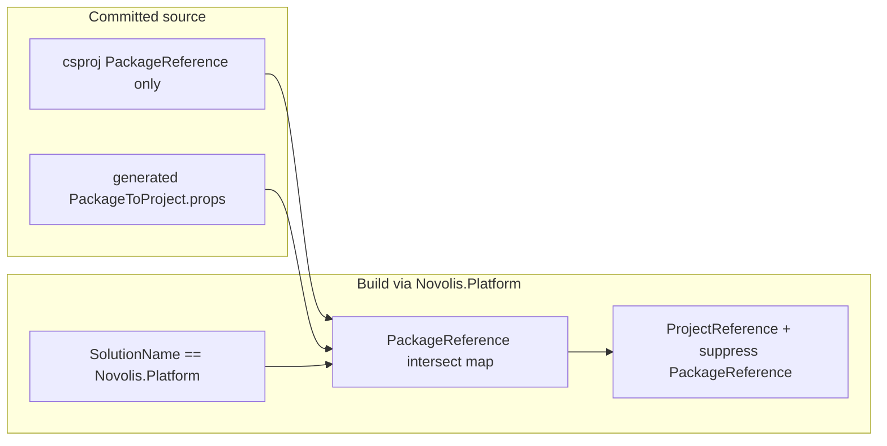

# Platform ProjectReference mode

## Goal

When building via the meta solution (`SolutionName == Novolis.Platform`), rewrite each project's **existing** `Novolis.*` `PackageReference` items into sibling `ProjectReference`s using a generated map. Committed `.csproj` files stay PackageReference-only. Per-repo solutions and CI stay on GPR.

## Hard rules (locked)

- **Trigger:** auto when `'$(SolutionName)' == 'Novolis.Platform'`; override with `-p:NovolisUseProjectReferences=true|false`.
- **Intersect only:** substitute iff the consuming project has that `PackageReference` **and** the package id is in the map **and** the mapped `.csproj` exists. Never add ProjectReferences for unreferenced packages; never leave a substituted PackageReference active (`Remove` or `ExcludeAssets=all`).
- **Map providers:** only packable projects (`IsPackable=true` + `PackageId`). Tests/samples/codegen are consumers only (they get substitution when they PackageReference Novolis packages); they are not map entries unless packable.
- **No csproj dual-ref blocks.** No local feeds. Same-repo `ProjectReference` unchanged.
- **Third-party packages** stay PackageReference.

## Implementation

### 1. Generate PackageId → project map

Extend [`novolis-governance/build/Generate-Platform-Slnx.ps1`](novolis-governance/build/Generate-Platform-Slnx.ps1) (or call a sibling script from it) to also emit:

[`novolis-governance/build/generated/Novolis.PackageToProject.props`](novolis-governance/build/generated/Novolis.PackageToProject.props)

Reuse the packable scan pattern from [`sync-registry-packages.ps1`](novolis-governance/scripts/sync-registry-packages.ps1): walk `novolis-*/**/*.csproj`, require `IsPackable=true`, read `PackageId` (fallback: filename). Paths relative to the props file (or `$(NovolisWorkspaceRoot)` set once).

Also align generator output path docs: script currently defaults to workspace-root `Novolis.Platform.slnx`; keep regenerating the checked-in copy under `novolis-governance/build/` as today.

### 2. MSBuild substitution (one import, all repos)

Add:

- [`novolis-governance/build/Novolis.ProjectReferenceMode.props`](novolis-governance/build/Novolis.ProjectReferenceMode.props) — resolve `NovolisUseProjectReferences` from `SolutionName` / explicit property / env.
- [`novolis-governance/build/Novolis.ProjectReferenceMode.targets`](novolis-governance/build/Novolis.ProjectReferenceMode.targets) — import generated map; when enabled, for each matching `PackageReference`:
  - add `ProjectReference` to mapped path (skip self)
  - remove that `PackageReference`

Import the targets from [`Novolis.Packaging.targets`](novolis-governance/build/Novolis.Packaging.targets) (already imported by ~27 repo `Directory.Build.targets`) so no per-repo churn.

Gate / reconcile [`Novolis.StackAnalyzers.props`](novolis-governance/build/Novolis.StackAnalyzers.props) so analyzer ProjectReference is not double-added when substitution already covers `Novolis.Analyzers.StackBoundaries`.

### 3. Verification scripts

| Script | Role |
|--------|------|
| [`verify-project-ref-mode.ps1`](novolis-governance/scripts/verify-project-ref-mode.ps1) **new** | Map completeness (every packable ↔ one map entry, paths exist, unique PackageIds); static intersect dry-run on sample consumers (e.g. physics → math); fail if map would invent refs for packages not listed in a project's PackageReferences |
| [`verify-nuget-only.ps1`](novolis-governance/scripts/verify-nuget-only.ps1) | Keep failing on **committed** cross-repo `ProjectReference` / `Novolis*Src` dual blocks in `.csproj` only (do not scan generated props/targets as violations) |
| Wire into [`gpr-health-check.ps1`](novolis-governance/scripts/gpr-health-check.ps1) | Run `verify-project-ref-mode.ps1` as a local check |

**MSBuild smoke (in verify script):** evaluate a known consumer with `-p:SolutionName=Novolis.Platform` (or `NovolisUseProjectReferences=true`) via `dotnet msbuild -getItem:ProjectReference` / `-getItem:PackageReference` and assert:

- expected Novolis deps appear as ProjectReference
- those PackageReferences are gone/suppressed
- no ProjectReference to packages the project does not PackageReference
- with `SolutionName` unset / `NovolisUseProjectReferences=false`, no cross-repo ProjectReferences appear

Optional focused build smoke: `dotnet build` one cross-repo test project (e.g. `Novolis.Physics.Unit`) under project-ref mode.

### 4. Policy, guidance, rules, skill

**Docs**

- Update [`nuget-only-policy.md`](novolis-governance/docs/nuget-only-policy.md): committed source remains PackageReference-only; **exception** = MSBuild substitution when `SolutionName` is `Novolis.Platform` (or explicit property). Forbid csproj dual-ref and local feeds still.
- Add [`platform-project-ref-mode.md`](novolis-governance/docs/platform-project-ref-mode.md): how to regen map + platform slnx, build/open meta solution, overrides, what gets substituted (src + tests), prove-done still requires GPR publish for consumers outside meta mode.
- Retarget [`local-nuget-development.md`](novolis-governance/docs/local-nuget-development.md) to point at project-ref mode as the local iteration path; mark folder-feed workflow deprecated.
- Touch [`README-Platform-Solution.md`](novolis-governance/build/README-Platform-Solution.md), [`gpr-maintenance.md`](novolis-governance/docs/gpr-maintenance.md), [`AGENTS.md`](novolis-governance/AGENTS.md), [`.ai/index.md`](novolis-governance/.ai/index.md).

**Cursor rule** — update [`.cursor/rules/nuget-only-dependencies.mdc`](.cursor/rules/nuget-only-dependencies.mdc):

- Still: no local feeds; no committed cross-repo ProjectReference; publish to GPR for real consumers.
- Add: local multi-repo iteration = open/build `Novolis.Platform.slnx` (auto project-ref mode); never hand-edit csproj dual refs; regen map after adding packable projects.

**Skill** — create [`.cursor/skills/novolis-project-ref-mode/SKILL.md`](.cursor/skills/novolis-project-ref-mode/SKILL.md):

- When: local cross-repo API changes before GPR publish; meta solution / project-ref questions.
- Steps: regen `Generate-Platform-Slnx.ps1` → open/build `Novolis.Platform.slnx` → run `verify-project-ref-mode.ps1` → do not commit csproj Package→Project swaps → publish via merge for non-meta consumers.
- Explicit: only referenced packages become ProjectReferences; inverse holds.

## Out of scope

- Restoring `artifacts/nuget-local` / `pack-local` as a supported path.
- Changing CI to build `Novolis.Platform.slnx` (CI stays per-repo PackageReference).
- Hand-maintained dual `ItemGroup` blocks in any `.csproj`.

