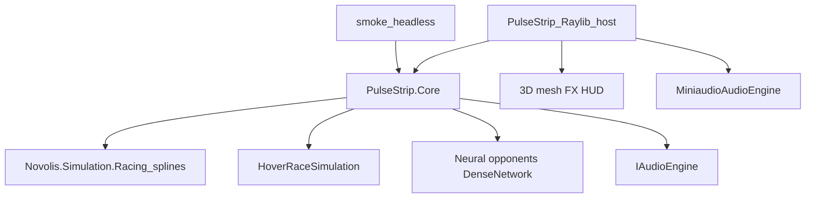

# PulseStrip — Wipeout-homage MVP (desktop-first)

## Locked decisions

- **Platforms:** Windows + Linux playable via Raylib (`net10.0`). Android is **documented follow-up** (shared headless core only; no fake APK).
- **Scope:** Playable MVP — 1–2 spline circuits, hover craft, weapons/boost, procedural VFX+SFX, evolutionary ML AI, menu, `--smoke` CI.
- **Name:** `PulseStrip` (homage; avoid Wipeout trademark in product/strings).
- **Location:** [`d:\novolis\novolis-dogfooding\apps\raylib\PulseStrip`](d:\novolis\novolis-dogfooding\apps\raylib\PulseStrip) (mirrors FreightWing/XFighter).
- **Stack:** `Novolis.Raylib*` + `Novolis.Simulation.Racing` (splines/tracks) + `Novolis.MachineLearning.Neural` (DenseNetwork mutate/eval) + `Novolis.Game.MenuFlows` + **miniaudio** game SFX (`Novolis.Audio` / `Novolis.Audio.Runtime` — add CPM entries; not NAudio Playback).

## Architecture



- **`PulseStrip.Core`** (class lib under `apps/raylib/PulseStrip/Core` or `apps/shared/…`): track bake from `SplineLoop`/`CatmullRomSplineSampler`/`TrackBuilder`, hover dynamics, weapons, race session, ML controller + optional short evolutionary train, pure C# — no Raylib.
- **`PulseStrip`** exe: `RayGame.Run`, 3D track ribbon/walls, craft meshes, particle FX, chase camera, MenuFlows, miniaudio cues.
- Reuse patterns from [`NeuralRacing`](d:\novolis\novolis-dogfooding\apps\NeuralRacing) (`NeuralRaceCarController`, `EvolutionaryRacingTrainer`) adapted to hover controls (steer / throttle / brake / boost / fire).

## Gameplay MVP

| Piece | Behavior |
|-------|----------|
| Circuits | 2 built-in closed splines (e.g. Oval + Chicane/Esses) via Racing `BuiltInTracks` / custom `TrackSpecs.Polyline`; extrude centerline to a 3D hover tube (fixed altitude band + banked ribbon mesh) |
| Craft | Anti-grav: forward accel, steering, lateral airbrake feel, boost meter; wall scrape damage |
| Weapons | Pickup pads on track → one weapon (e.g. plasma bolt) + shield optional; fire along craft forward |
| Opponents | 3 ML craft: short in-process evolution **or** load shipped JSON network snapshots under `Content/brains/` generated once at first run / train smoke |
| Effects | Speed streaks, boost trail, weapon flash, shield hit sparks, gate/checkpoint pulses (procedural Raylib draw — no art pack required) |
| Audio | Engine loop (pitch∝speed), boost whoosh, weapon fire/hit, lap/checkpoint, menu blip via miniaudio + tiny procedural/WAV assets |
| UI | Title → Circuit select → Race → Results; HUD: speed, boost, weapon, lap, position |

## Hover sim (vs stock Racing)

[`Novolis.Simulation.Racing`](d:\novolis\novolis-simulation\src\Novolis.Simulation.Racing) is **planar ground cars**. Keep for:

- Spline sampling, `RaceTrack` progress/gates/laps, sensor rays against road/wall grid, reward model hooks.

Replace in Core:

- `HoverCraftState` (position on centerline frame + lateral offset + altitude within band + yaw/bank).
- `HoverControlDecision` (steer, throttle, brake, boost, fire).
- `HoverRaceSimulation` tick integrating hover motion + weapon projectiles + boost; map sensors to NN inputs (pad sensor vector to fixed size matching network, e.g. 10→hidden→4/5).

Do **not** change the Simulation package in this MVP unless a tiny shared helper is unavoidable — prefer app-local hover layer on top of track geometry.

## ML opponents

1. Copy/adapt evolutionary trainer from NeuralRacing into Core (population of `DenseNetwork`, fitness = progress + lap reward − crashes − time).
2. Train quickly on MicroCircle/Oval for smoke; persist champion snapshots to `Content/brains/*.json`.
3. Race-time: `NeuralHoverController` wraps `INeuralNetwork.Evaluate` → hover controls; player uses keyboard/gamepad.

## Registration / packages

- Add projects to [`Novolis.Dogfooding.slnx`](d:\novolis\novolis-dogfooding\Novolis.Dogfooding.slnx) under `/raylib/`.
- CPM: ensure `Novolis.Audio`, `Novolis.Audio.Runtime`, `Novolis.Audio.Abstractions` (and transitive Native) versions `2026.1.*` in [`Directory.Packages.props`](d:\novolis\novolis-dogfooding\Directory.Packages.props) if missing.
- Existing already: `Novolis.Simulation.Racing`, `Novolis.MachineLearning.Neural`, `Novolis.Game.MenuFlows`, Raylib packages.
- Unit tests: `PulseStrip.Tests` — spline track build, hover tick smoke, NN controller clamps, weapon fire hit; no native Raylib required.
- README: run commands (absolute paths), `--smoke`, Android follow-up note.

## Workflows (Win / Linux / Android note)

Dogfooding already has PR/merge calling reusable Ubuntu CI. Add app-focused workflows under [`d:\novolis\novolis-dogfooding\.github\workflows`](d:\novolis\novolis-dogfooding\.github\workflows):

| Workflow | Purpose |
|----------|---------|
| `pulsestrip-smoke.yml` | On PR paths touching PulseStrip: `dotnet test` Core/Tests + `dotnet run … -- --smoke` with `NOVOLIS_RAYLIB_HEADLESS=1` on **ubuntu-latest** |
| `pulsestrip-publish.yml` | `workflow_dispatch` (+ optional main): `dotnet publish` `-r win-x64` and `-r linux-x64` (self-contained), upload artifacts |
| Android | Job or README step that **documents** deferred status (needs Raylib Android RID/host); optional `if: false` placeholder job commenting the gap — **no APK build** |

Keep existing solution-wide PR/merge unchanged.

## Out of scope (MVP)

- Raylib Android natives / APK
- Campaign meta, multiplayer, licensed Wipeout assets
- Changing `Novolis.Simulation.Racing` into full 3D hover in the platform package
- Inno installer / Steam

## Verify before done

```powershell
dotnet test d:\novolis\novolis-dogfooding\apps\raylib\PulseStrip.Tests\PulseStrip.Tests.csproj -p:NovolisUseProjectReferences=true
$env:NOVOLIS_RAYLIB_HEADLESS='1'
dotnet run --project d:\novolis\novolis-dogfooding\apps\raylib\PulseStrip -p:NovolisUseProjectReferences=true -- --smoke
pwsh -File d:\novolis\novolis-governance\scripts\verify-nuget-only.ps1
```

