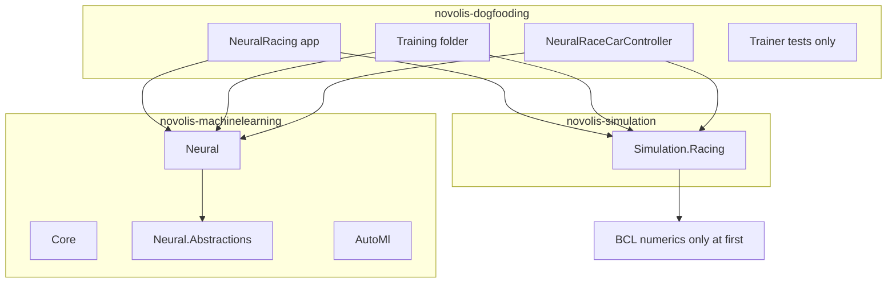

# Racing placement: Simulation facet + dogfood composition

## Problem

`MachineLearning.Racing` would be **reverse leakage**: a domain scenario (racing + evolution) packaged under a repo that should stay **orthogonal building blocks** like [novolis-math](d:\novolis\novolis-math) or [novolis-raylib](d:\novolis\novolis-raylib).

Per [library-boundaries.md](d:\novolis\novolis-governance\docs\library-boundaries.md):

- **Math / Physics / Simulation** = closed stack; Simulation depends only on Math + Physics.
- **MachineLearning** = orthogonal (not in stack); apps compose it with other repos.
- **Apps** own cross-repo glue: *"Apps may reference any combination; they own cross-repo glue."*

Racing today in [novolis-dogfooding/apps/NeuralRacing](d:\novolis\novolis-dogfooding\apps\NeuralRacing) is a **hidden library** (~55 sim files + 266 tests) with an invalid dependency: `NeuralRacing.Sim` **ProjectReferences** [Novolis.MachineLearning.Neural](d:\novolis\novolis-machinelearning\src\Novolis.MachineLearning.Neural) — the sim layer should not depend on ML.



## What belongs where

| Code (current `NeuralRacing.Sim`) | Target | Rationale |
|-----------------------------------|--------|-----------|
| `Tracks/`, `Race/`, `Sensors/`, `Rewards/`, `Progress/`, `Cars/*` except neural types | **`Novolis.Simulation.Racing`** | Headless tick-based sim; `IRaceCarController` is policy-agnostic |
| `Cars/NeuralRaceCarController.cs`, `INeuralRaceCarController.cs` | **`apps/NeuralRacing/`** (app source) | Adapts `INeuralNetwork` → `IRaceCarController`; ML-specific |
| `Training/*` (4 files) | **`apps/NeuralRacing/`** | Evolution loop over sim + `DenseNetwork`; product/demo glue |
| `Program.cs` | **`apps/NeuralRacing/`** | Demo entry |
| 11 sim test files (~264 tests) | **`Novolis.Simulation.Racing.Tests`** | Library tests live with the library |
| `EvolutionaryRacingTrainer*Tests.cs` (2 files) | **`apps/NeuralRacing.Tests`** | Tests composition, not a platform package |

**[novolis-machinelearning](d:\novolis\novolis-machinelearning)** stays four packable facets only:

- `Novolis.MachineLearning.Core`
- `Novolis.MachineLearning.Neural.Abstractions`
- `Novolis.MachineLearning.Neural`
- `Novolis.MachineLearning.AutoMl`

No new ML packages. README already states racing is not in this repo — keep that.

## Why `Simulation.Racing` fits the stack

- Matches existing facets ([World](d:\novolis\novolis-simulation\src\Novolis.Simulation.World), [Kinematics](d:\novolis\novolis-simulation\src\Novolis.Simulation.Kinematics)): **domain runtime** under Simulation, not under ML.
- `RaceSimulation` is orchestration over discrete ticks (like Simulation’s clock/world model), with custom kinematics — does not require `Novolis.Physics.*` on day one.
- **Must not** reference `Novolis.MachineLearning.*` (enables sim tests without ML on the graph).

**Not** `Simulation.Racing` + `MachineLearning.Racing`: the second package would re-introduce domain naming in the wrong repo and tempt Simulation ↔ ML coupling in platform code.

## Phase 1 — Add `Novolis.Simulation.Racing` (novolis-simulation)

1. **Create project** at `src/Novolis.Simulation.Racing/` using the same pattern as [Novolis.Simulation.Kinematics.csproj](d:\novolis\novolis-simulation\src\Novolis.Simulation.Kinematics\Novolis.Simulation.Kinematics.csproj):
   - Import [Novolis.Simulation.Packaging.props](d:\novolis\novolis-simulation\build\Novolis.Simulation.Packaging.props)
   - `PackageId` = `Novolis.Simulation.Racing`
   - **No** project references to MachineLearning
   - **No** project reference to Physics required initially (racing is self-contained); optional `Novolis.Math.Geometry` later if shared ray/grid helpers appear

2. **Move + rename** from [NeuralRacing.Sim](d:\novolis\novolis-dogfooding\apps\NeuralRacing\NeuralRacing.Sim):
   - Namespace: `NeuralRacing.*` → `Novolis.Simulation.Racing.*` (folder layout unchanged: `Tracks`, `Race`, `Cars`, etc.)
   - Exclude: `Training/`, `NeuralRaceCarController.cs`, `INeuralRaceCarController.cs`

3. **Add tests** `tests/Novolis.Simulation.Racing.Tests/`:
   - Port 11 files from [NeuralRacing.Tests/Sim](d:\novolis\novolis-dogfooding\apps\NeuralRacing.Tests\Sim) (all except the two `EvolutionaryRacingTrainer*` files)
   - Namespace: `Novolis.Simulation.Racing.Tests`
   - TUnit exe pattern like [Novolis.Simulation.World.Tests](d:\novolis\novolis-simulation\tests\Novolis.Simulation.World.Tests)
   - Small local `TestInfrastructure` (copy `BaseTest` / `StructuredTestOutput` from dogfood or ML test support — do not reference ML test projects)

4. **Wire repo**:
   - [Novolis.Simulation.slnx](d:\novolis\novolis-simulation\Novolis.Simulation.slnx)
   - [.novolis/packages.json](d:\novolis\novolis-simulation\.novolis\packages.json)
   - [novolis-registry/packages/novolis-simulation-racing.json](d:\novolis\novolis-registry\packages) (new stub)
   - `dotnet build` + run Racing tests in simulation CI

## Phase 2 — Slim dogfooding to composition-only

1. **Delete** `apps/NeuralRacing/NeuralRacing.Sim/` after move.

2. **Restructure** [apps/NeuralRacing](d:\novolis\novolis-dogfooding\apps\NeuralRacing):
   ```
   apps/NeuralRacing/
     NeuralRacing.csproj          # Exe, IsPackable=false
     Program.cs
     Training/                    # 4 files from old Sim/Training
     Controllers/                 # NeuralRaceCarController + INeuralRaceCarController
   ```
   - `PackageReference` to `Novolis.Simulation.Racing` and `Novolis.MachineLearning.Neural` (`2026.1.*` per [Directory.Packages.props](d:\novolis\novolis-dogfooding\Directory.Packages.props))
   - Remove monorepo `ProjectReference` into `novolis-machinelearning` (aligns with [dogfooding design](d:\novolis\novolis-dogfooding\docs\design.md)); use local GPR or `artifacts/nuget-local` during dev per [nuget-setup.md](d:\novolis\novolis-governance\docs\nuget-setup.md)

3. **Slim tests** [NeuralRacing.Tests](d:\novolis\novolis-dogfooding\apps\NeuralRacing.Tests):
   - Keep only `EvolutionaryRacingTrainerTests.cs` + `EvolutionaryRacingTrainerValidationTests.cs`
   - Reference app + packages (not Simulation test internals)

4. Update [Novolis.Dogfooding.slnx](d:\novolis\novolis-dogfooding\Novolis.Dogfooding.slnx) and [README apps table](d:\novolis\novolis-dogfooding\README.md): `NeuralRacing` exercises `Simulation.Racing` + `MachineLearning.Neural`.

## Phase 3 — Governance and migration script

Update docs to codify the rule **“no domain packages in ML repo”**:

| Document | Change |
|----------|--------|
| [library-boundaries.md](d:\novolis\novolis-governance\docs\library-boundaries.md) | Add row: headless racing sim → `Simulation.Racing`; NN evolution on racing → apps |
| [simulation-layer-policy.md](d:\novolis\novolis-governance\docs\simulation-layer-policy.md) | List `Simulation.Racing` facet |
| [wave-8-machinelearning-neural.md](d:\novolis\novolis-governance\docs\extraction-briefs\wave-8-machinelearning-neural.md) | Racing → `Simulation.Racing` + dogfood glue (not ML package) |
| [frank-naming-and-structure.md](d:\novolis\novolis-governance\docs\frank-naming-and-structure.md) | `Frank.ML.Domain.Racing` → `Novolis.Simulation.Racing` + dogfood |
| [frank-inventory.md](d:\novolis\novolis-governance\docs\frank-inventory.md) | Same mapping |
| [migrate-frank-slice.ps1](d:\novolis\novolis-governance\scripts\migrate-frank-slice.ps1) | `Frank.ML.Domain.Racing` → `Novolis.Simulation.Racing` (not `NeuralRacing`) |

Optional: add `extraction-briefs/wave-12-simulation-racing.md` for the Frank.ML racing sim slice.

## Deferred (explicitly out of scope)

| Item | Reason |
|------|--------|
| **`Vector2` → XZ `Vector3`** | Racing uses `System.Numerics.Vector2` throughout; [library-boundaries](d:\novolis\novolis-governance\docs\library-boundaries.md) forbids Vector2 in stack — schedule as follow-up, do not block the move |
| **Integrate `RaceSimulation` with `SimulationWorld` / `ISimulationSystem`** | Future alignment; current code is a standalone loop |
| **Frank.ML Avalonia / Spectre UI** | Stays private Frank.ML; may consume packages later |
| **`MachineLearning.Racing`** | Rejected — not a building block |

## Success criteria

- `novolis-simulation` builds; `Novolis.Simulation.Racing.Tests` passes (~264 tests).
- `novolis-machinelearning` unchanged package set (4 facets); no racing code.
- `novolis-dogfooding` `NeuralRacing` is a thin exe + ~6 glue files + 2 trainer test files; no embedded sim library.
- Dependency graph: `Simulation.Racing` does not reference `MachineLearning.*`.

