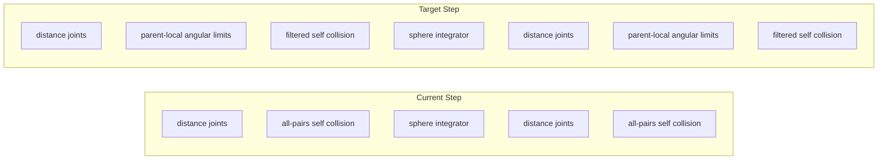

# Ragdoll physics and pose improvement

## Problem (matches your screenshot)

The doll **collapses into a heap with legs folded backward over the torso** because:

1. **No angular limits during simulation** — [`RagdollBody.Step`](d:\novolis\novolis-dogfooding\apps\RagdollPlay\Game\RagdollBody.cs) only calls `ConstrainedSphereSimulator.Step` (distance joints + self-collision). Limits run **only** in `StabilizeSpawn()`.
2. **Thighs are unconstrained** — [`RagdollPoseLimits`](d:\novolis\novolis-dogfooding\apps\RagdollPlay\Game\RagdollPoseLimits.cs) defines swing/hinge for spine, head, shoulders, elbows, and knee→foot, but **nothing on hip→knee**. Those links are distance-only, so knees can orbit the hip freely.
3. **World-space rest directions** — [`AngularLimitSolver`](d:\novolis\novolis-physics\src\Novolis.Physics.Joints\AngularLimitSolver.cs) uses fixed `RestDirection` / `HingeAxis` vectors. Re-enabling them at runtime without a parent frame caused the earlier blow-up; they must be **parent-local**.
4. **Self-collision fights joints** — [`RagdollBodyCollision`](d:\novolis\novolis-physics\src\Novolis.Physics.Joints\RagdollBodyCollision.cs) separates **all** sphere pairs, including bones connected by joints, adding energy and weird folding.



---

## Phase 1 — Parent-local angular limits (`Novolis.Physics.Joints`)

**Goal:** Limits follow the torso/limb as the ragdoll falls, without world-locked rest vectors.

### API additions

| Type | Change |
|------|--------|
| `BoneFrame` (new) | Build orthonormal basis from `parent` + `reference` sphere positions: up = normalize(ref − parent), right = normalize(cross(up, worldForward)), forward = cross(right, up). Helpers: `WorldToLocal`, `LocalToWorld`. |
| `SwingLimit` / `HingeLimit` | Add optional `int FrameReferenceSphere` (use `-1` for legacy world-fixed behavior). Add `RestDirectionLocal` (+ `HingeAxisLocal` for hinges) captured at build time. |
| `AngularLimitSolver` | If `FrameReferenceSphere >= 0`, transform local rest/axis to world each solve via current `BoneFrame`; else keep today’s behavior. |

### Tests ([`AngularLimitSolverTests.cs`](d:\novolis\novolis-physics\tests\Novolis.Physics.Unit\AngularLimitSolverTests.cs))

- Rotated parent frame: parent/reference repositioned 90° → hinge still clamps relative to torso, not world +X.
- Hip-knee style limit: backward bend beyond `maxRadians` is corrected after 8 iterations.

### Docs

Add a **“Sphere ragdoll / joints”** section to [`novolis-physics/docs/INTEGRATION.md`](d:\novolis\novolis-physics\docs\INTEGRATION.md): distance joints + parent-local limits + `ConstrainedSphereSimulator`.

---

## Phase 2 — Integrate limits + filtered collision in `ConstrainedSphereSimulator`

**File:** [`ConstrainedSphereSimulator.cs`](d:\novolis\novolis-physics\src\Novolis.Physics.Joints\ConstrainedSphereSimulator.cs)

Extend `Step` with optional parameters:

```csharp
void Step(..., ReadOnlySpan<SwingLimit> swings, ReadOnlySpan<HingeLimit> hinges, ReadOnlySpan<(int A,int B)> skipCollisionPairs = default)
```

**Per constraint pass (before and after physics):**

1. `DistanceJointSolver.Solve`
2. `AngularLimitSolver.Solve` (2–3 iterations, lower than spawn)
3. `RagdollBodyCollision.ResolveOverlaps` **skipping** joint-adjacent pairs

**`RagdollBodyCollision`:** add overload `ResolveOverlaps(..., ReadOnlySpan<(int,int)> skipPairs)` or build skip set from `DistanceJoint` list internally.

Bump [`Novolis.Physics.Packaging.props`](d:\novolis\novolis-physics\build\Novolis.Physics.Packaging.props) if needed; run [`pack-novolis-local.ps1`](d:\novolis\scripts\pack-novolis-local.ps1).

---

## Phase 3 — Complete humanoid limit set (`RagdollPlay` + optional preset)

### New / updated limits in [`RagdollPoseLimits.cs`](d:\novolis\novolis-dogfooding\apps\RagdollPlay\Game\RagdollPoseLimits.cs)

| Joint | Type | Frame reference | Notes |
|-------|------|-----------------|-------|
| Hip → Chest | Swing | Hip | Torso twist/bend (~32°) |
| Chest → Head | Swing | Chest | Neck (~45°) |
| Chest → Shoulder | Swing | Chest | Arm raise (~70°) |
| **Hip → Knee** | **Hinge** | **Chest (torso up)** | **NEW — blocks leg folding behind back** |
| Knee → Foot | Hinge | Hip or knee parent | Forward bend only (~95° max) |
| Shoulder → Hand | Hinge | Chest | Elbow (~130°), lateral axis in torso frame |

Use **parent-local** rest at spawn; runtime stiffness ~**0.55–0.7** (softer than spawn stabilize **0.85**) to avoid fighting distance joints.

### [`RagdollBody.cs`](d:\novolis\novolis-dogfooding\apps\RagdollPlay\Game\RagdollBody.cs)

- Pass `_swingLimits` / `_hingeLimits` into `_simulator.Step(...)`.
- Keep spawn stabilize loop (32 passes, higher stiffness) unchanged in spirit.
- Tune simulator: `ConstraintPasses = 2`, `JointIterations = 16`, angular iterations **2 per pass**, `InternalCollisionIterations = 4`.

### Optional library preset (same phase if small)

Extract to **`RagdollHumanoidPreset`** in `Physics.Joints`:

- Bone indices (from [`RagdollIndices`](d:\novolis\novolis-dogfooding\apps\RagdollPlay\Game\RagdollIndices.cs))
- `BuildStanding(...)` → spheres, joints, limits
- App `RagdollBody` becomes a thin wrapper (sim options + impulse + step)

**Defer** adding extra thigh spheres unless hip→knee hinges are still insufficient after testing.

---

## Phase 4 — Visual cleanup (app only)

**File:** [`PainterDollRenderer.cs`](d:\novolis\novolis-dogfooding\apps\RagdollPlay\Game\PainterDollRenderer.cs)

- Reduce per-limb sphere chain steps (fewer “lumps”; 2–3 spheres per segment instead of up to 8).
- Draw joint knobs only at hips, knees, shoulders; skip redundant mid-limb spheres.
- Keep head wireframe; limbs read as smooth capsules.

No new Raylib APIs required (no `DrawCapsule` today).

---

## Phase 5 — Validation

```powershell
d:\novolis\scripts\pack-novolis-local.ps1
dotnet test d:\novolis\novolis-physics\tests\Novolis.Physics.Unit -c Release
dotnet build d:\novolis\novolis-dogfooding\apps\RagdollPlay\RagdollPlay.csproj -c Release
dotnet run --project d:\novolis\novolis-dogfooding\apps\RagdollPlay\RagdollPlay.csproj -c Release
```

**Acceptance:**

| Check | Expected |
|-------|----------|
| Spawn | Standing humanoid, feet on floor grid |
| Idle 3s | Settles without exploding or detaching spheres |
| LMB shove | Falls naturally; **knees do not fold through torso** or point backward through hips |
| Reset (R) | Clean respawn |
| F3 diag | Joint/self-collision counts non-zero but stable |

Optional unit test: 120 physics steps from standing pose → max angle hip→knee vs torso forward stays below ~110°.

---

## Out of scope (this plan)

- Metaball / skin mesh (RandoriFight territory)
- Capsule collision bones (sphere ragdoll stays)
- Extra thigh bone spheres (only if hinge limits fail acceptance)
- Parent-local limits for RandoriFight kinematic skeleton

