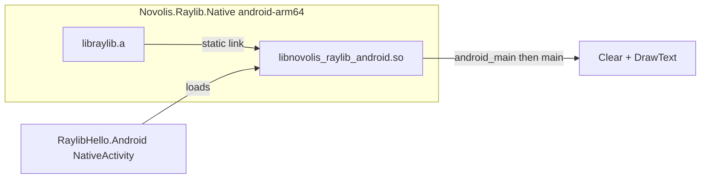

# Raylib Android package (Native + Hello)

## Locked scope

- **Package (1a):** Extend [`Novolis.Raylib.Native`](d:\novolis\novolis-raylib\src\Novolis.Raylib.Native) with **`android-arm64`** assets, published to GitHub Packages via existing merge pack.
- **Consumer (2 minimal):** New [`RaylibHello.Android`](d:\novolis\novolis-dogfooding\apps\RaylibHello.Android) (`net10.0-android`) that proves the package on device/emulator.
- **Not in scope:** imgui/trace/raygui on Android, `RayGame.Run` / GLFW shell, PulseStrip APK, armeabi-v7a / x86_64 RIDs.

## Why not “just ship libraylib.so”

Upstream Android raylib is **static-link oriented**: `android_main` lives in raylib and calls user `main()`, so a lone `libraylib.so` + managed `LibraryImport`/`InitWindow` hits circular/`main` load failures ([raylib#5114](https://github.com/raysan5/raylib/issues/5114)). Desktop `RayGame.Run` assumes GLFW + a blocking process `Main` — wrong for NativeActivity lifecycle.



## Package design

Under [`runtimes/android-arm64/native/`](d:\novolis\novolis-raylib\src\Novolis.Raylib.Native\runtimes):

| Artifact | Role |
|----------|------|
| `libraylib.a` | NDK-built raylib 6.0 (`PLATFORM=Android`, `ANDROID_ABI=arm64-v8a`, static) |
| `libnovolis_raylib_android.so` | Thin host: links `.a`, implements raylib’s expected `main()` entry used via `android_main`; MVP `main` clears a solid color and draws “Novolis Raylib Android” |

Packing updates in [`Novolis.Raylib.Native.csproj`](d:\novolis\novolis-raylib\src\Novolis.Raylib.Native\Novolis.Raylib.Native.csproj): `Exists`-gated `None` ItemGroups → `PackagePath=runtimes/android-arm64/native` (same pattern as win/linux/osx).

**Android MSBuild wiring** (new or extended transitive targets, e.g. [`build/Novolis.Raylib.Native.targets`](d:\novolis\novolis-raylib\build\Novolis.Raylib.Native.targets) + Android-specific import): when `$(TargetFramework)` contains `-android`, add:

```xml
<AndroidNativeLibrary Include=".../libnovolis_raylib_android.so">
  <Abi>arm64-v8a</Abi>
</AndroidNativeLibrary>
```

Desktop host-OS copy logic stays unchanged; Android does **not** use `IsOSPlatform('Linux')`.

Docs: [`Novolis.Raylib.Native/README.md`](d:\novolis\novolis-raylib\src\Novolis.Raylib.Native\README.md) RID table row + short note (static `.a` + host `.so`; no managed `InitWindow` yet).

## Pipeline (maintainer)

Raylib 6.0 GitHub releases have **no Android prebuilt** ([`versions.json`](d:\novolis\novolis-raylib\codegen\pipeline\raylib6\versions.json)). Add an NDK step (new `step_03_android` or Android branch of native):

1. Ensure raylib **sources** available (reuse step_01 source / clone pin to 6.0).
2. CMake with NDK toolchain: `-DPLATFORM=Android -DANDROID_ABI=arm64-v8a -DANDROID_PLATFORM=android-24` (or 23 to match BooksMobile min), `-DBUILD_SHARED_LIBS=OFF -DBUILD_EXAMPLES=OFF`.
3. Build thin host from new sources under e.g. [`codegen/native/raylib6-android-host/`](d:\novolis\novolis-raylib\codegen\native) → `libnovolis_raylib_android.so`.
4. Copy both artifacts into `src/Novolis.Raylib.Native/runtimes/android-arm64/native/` (git-tracked like win-x64, so CI pack needs no NDK).

Document NDK requirement in the step README. CI remains pack-only (no NDK job required if binaries are checked in).

## Minimal Hello app

New project [`d:\novolis\novolis-dogfooding\apps\RaylibHello.Android`](d:\novolis\novolis-dogfooding\apps\RaylibHello.Android) modeled on BooksMobile TFM/shell ([`BooksMobile.Android.csproj`](d:\novolis\novolis-apps\src\BooksMobile\BooksMobile.Android\BooksMobile.Android.csproj)):

- `net10.0-android`, `SupportedOSPlatformVersion` 23+, `AndroidPackageFormat=apk`, `ApplicationId=com.novolis.raylibhello`
- `PackageReference` to `Novolis.Raylib.Native` (or meta `Novolis.Raylib`) — **do not** `ExcludeAssets=buildTransitive` (unlike desktop dogfood) so Android targets inject the host `.so`
- Managed `NativeActivity` subclass + manifest `android:name` / `android.app.lib_name` = `novolis_raylib_android`
- Success criteria: APK installs; surface shows clear + text; no `UnsatisfiedLinkError`

Keep desktop [`RaylibHello`](d:\novolis\novolis-dogfooding\apps\RaylibHello) on `RayGame.Run` unchanged. Register Android project in [`Novolis.Dogfooding.slnx`](d:\novolis\novolis-dogfooding\Novolis.Dogfooding.slnx) under `/raylib/`.

Local validation (after GPR has the new Native version, or Platform ProjectRef mode):

```powershell
dotnet build d:\novolis\novolis-raylib\src\Novolis.Raylib.Native\Novolis.Raylib.Native.csproj -p:NovolisUseProjectReferences=true
dotnet build d:\novolis\novolis-dogfooding\apps\RaylibHello.Android\RaylibHello.Android.csproj -p:NovolisUseProjectReferences=true -r android-arm64
# then deploy APK via adb when device/emulator available
pwsh -File d:\novolis\novolis-governance\scripts\verify-nuget-only.ps1
```

## Publish path

1. Commit android-arm64 natives under `novolis-raylib` → merge → GPR `Novolis.Raylib.Native` `2026.1.*`
2. Bump dogfooding CPM if needed; Hello restores from nuget.org + github only (no local feed)

## Out of scope / follow-ups

- Managed `LibraryImport("raylib")` game loop / `RayGame.Run` on Android
- ImGui / trace / OpenSLES polish
- Multi-ABI and CI NDK rebuild automation
- PulseStrip Android host (can consume the same Native package later)

