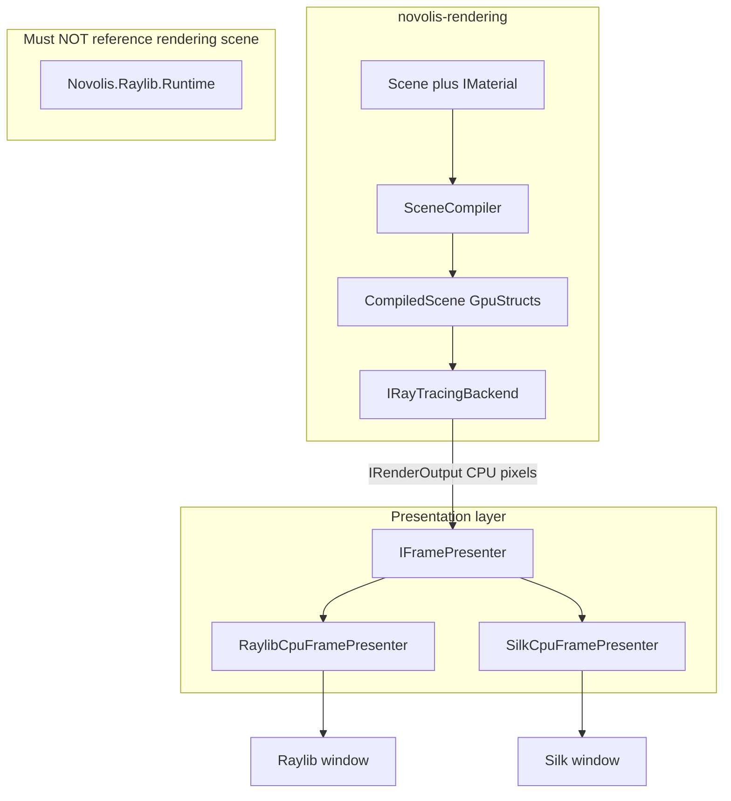

# Raytracing library — implementation plan

Source spec: [novolis-rendering/docs/roadmap-raytracing.md](d:\novolis\novolis-rendering\docs\roadmap-raytracing.md). Governance: [novolis-governance/docs/library-boundaries.md](d:\novolis\novolis-governance\docs\library-boundaries.md).

## Current state

| Exists today | Location |
|--------------|----------|
| `ImageBuffer`, `RenderCamera`, `RenderMesh`, `RenderScene`, `IRayTracer` | [Novolis.Rendering.Abstractions](d:\novolis\novolis-rendering\src\Novolis.Rendering.Abstractions) |
| `CpuRayTracer` (brute-force triangles, simple shading) | [Novolis.Rendering.Raytrace](d:\novolis\novolis-rendering\src\Novolis.Rendering.Raytrace) |
| TUnit tests | [tests/](d:\novolis\novolis-rendering\tests) |
| `RaylibPresentationHooks` (post-`EndDrawing` callbacks for **capture**, not CPU blit) | [RaylibPresentationHooks.cs](d:\novolis\novolis-raylib\src\Novolis.Raylib.Runtime\Presentation\RaylibPresentationHooks.cs) |

**Not yet:** materials, `CompiledScene`, `IRayTracingBackend`, presentation packages, Silk host, BVH in rendering path.

## Architecture (target)



**Boundary rule:** `Scene`, `IMaterial`, `CompiledScene`, and `IRayTracingBackend` stay in **rendering**. `novolis-raylib` may reference only `Novolis.Rendering.Presentation.Abstractions` (pixels / opaque GPU handle)—never `Novolis.Rendering.Scene`, `Materials`, or `Compile`.

Apps wire: `ViewPose` (Simulation) → `CameraSnapshot` → backend → `IFramePresenter`.

---

## Package evolution

```text
Today                          End state (incremental adds)
─────                          ────────────────────────────
Rendering.Abstractions    →    + Presentation.Abstractions, Runtime structs
Rendering.Raytrace        →    Rendering.Backends.Cpu (rename/migrate)
Rendering (meta)          →    references all facets

NEW in rendering: Materials, Scene, Compile, Runtime,
                  Backends.Igpu, Backends.Vulkan, DependencyInjection

NEW in novolis-raylib: Novolis.Raylib.Presentation (optional packable)

NEW repo (Phase 7): novolis-silk + Novolis.Silk.Presentation
```

Migrate bootstrap types with `[Obsolete]` shims for one release; remove after dogfood updates.

---

## Phase 0 — Stabilize foundation

**Goal:** CI green on GitHub; normative API doc.

- Fix CI restore: workflow step to pack or pin `Novolis.Math.Geometry` (today [Directory.Packages.props](d:\novolis\novolis-rendering\Directory.Packages.props) uses `0.3.0-local`, absent on nuget.org).
- Add [docs/materials-and-backends.md](d:\novolis\novolis-rendering\docs\materials-and-backends.md) — trimmed normative spec (authoring vs runtime, material records, backend contract).

**Exit:** `dotnet build` + TUnit pass on PR CI.

---

## Phase 1 — Interchangeable display (Sprint 1)

**Goal:** Same CPU frame via Raylib or Silk by swapping `IFramePresenter` only.

### 1a — `Novolis.Rendering.Presentation.Abstractions` (new project in rendering)

```csharp
public interface IFramePresenter {
    void PresentCpuFrame(ReadOnlySpan<Rgba32> pixels, int width, int height);
}
public interface IRenderOutput {
    bool TryGetCpuPixels(out ReadOnlySpan<Rgba32> pixels, out int width, out int height);
}
```

- Reuse [Rgba32](d:\novolis\novolis-math\src\Novolis.Math.Geometry\Rgba32.cs) from Math; no Raylib/Silk refs.
- Extend bootstrap `CpuRayTracer` to write into `IRenderOutput` / `ImageBuffer` (unchanged behavior).

### 1b — `Novolis.Raylib.Presentation` (new optional package in **novolis-raylib**)

- Depends: `Novolis.Rendering.Presentation.Abstractions`, `Novolis.Raylib.Runtime`.
- `RaylibCpuFramePresenter`: upload `Rgba32[]` → texture → `DrawTexture` (full-screen quad).
- **Do not** reference rendering Scene/Materials/Compile packages.
- Coexist with existing `RaylibPresentationHooks` (capture timing)—different concern.

### 1c — `RaytraceHello` dogfood app

- New app under [novolis-dogfooding/apps](d:\novolis\novolis-dogfooding\apps) (pattern: [RaylibHello](d:\novolis\novolis-dogfooding\apps\RaylibHello)).
- Loop: `CpuRayTracer` → `ImageBuffer` → `RaylibCpuFramePresenter.PresentCpuFrame`.
- Register presenter in app DI or explicit construction.

### 1d — Silk presenter (defer full repo to Phase 7)

- Minimal `Novolis.Rendering.Presentation.Silk` **or** stub in rendering until `novolis-silk` exists; same `IFramePresenter` contract.
- Demo: toggle presenter type via config flag.

**Exit:** Grep `novolis-raylib` for `Novolis.Rendering.Scene` / `Materials` → zero hits. Manual: swap presenter, scene code unchanged.

---

## Phase 2 — Materials + compilation (Sprint 2)

**Goal:** Spec material models compile to fixed-size `GpuMaterial`.

### New package: `Novolis.Rendering.Materials`

- `IMaterial` marker interface.
- Records: `StandardMaterial`, `GlassMaterial`, `SkinMaterial`, `EmissiveMaterial` (fields per spec in roadmap).
- `Materials` static presets (`Metal`, `Glass`, `Standard`, …)—no inheritance between material types.
- `MaterialModel` enum + `GpuMaterial` (`Vector4` A/B/C).
- `MaterialCompiler.Compile(IMaterial) → GpuMaterial` with documented packing per model.

**Tests:** preset → field values; compile → golden `A/B/C` vectors.

Textures (`MaterialTextures`, `TextureHandle`) — **deferred** to Phase 6.

---

## Phase 3 — Scene authoring + `CompiledScene` (Sprint 3)

**Goal:** Replace [RenderMesh](d:\novolis\novolis-rendering\src\Novolis.Rendering.Abstractions\RenderMesh.cs) / [RenderScene](d:\novolis\novolis-rendering\src\Novolis.Rendering.Abstractions\RenderScene.cs).

### Packages

- `Novolis.Rendering.Scene` — `Scene`, `MeshInstance`, `LightDefinition`, `SceneBuilder` helpers.
- `Novolis.Rendering.Compile` — `SceneCompiler.Compile(Scene) → CompiledScene`.
- `Novolis.Rendering.Runtime` — `GpuTriangle`, `GpuLight`, `BvhNode`, `CompiledScene` (immutable arrays).

### BVH

- Prefer extract/build in [Novolis.Math.Geometry](d:\novolis\novolis-math) (aligns with governance note: BVH structure in Math; [BvhStaticWorld](d:\novolis\novolis-physics\src\Novolis.Physics.Collision.Simple\BvhStaticWorld.cs) stays for physics response).
- `SceneCompiler` produces `BvhNode[]` for rendering traversal.

### Migration

- Mark `IRayTracer`, `RenderMesh`, `RenderScene` `[Obsolete]` with adapter: old API → compile → temporary backend wrapper.

**Exit:** Compiler tests (triangle/material counts, BVH hits vs brute force on small scenes).

---

## Phase 4 — `IRayTracingBackend` + CPU path tracer v2 (Sprints 4 + 6)

**Goal:** Backend owns resize, upload, per-sample render, progressive accumulation.

### Abstractions (in `Rendering.Abstractions` or `Rendering.Runtime`)

```csharp
public readonly record struct CameraSnapshot(...);

public interface IRayTracingBackend {
    ValueTask ResizeAsync(int width, int height, CancellationToken ct = default);
    ValueTask UploadSceneAsync(CompiledScene scene, CancellationToken ct = default);
    ValueTask RenderAsync(CameraSnapshot camera, int sampleIndex, CancellationToken ct = default);
    IRenderOutput Output { get; }
    int SampleCount { get; }
    void ResetAccumulation();
}
```

### `Novolis.Rendering.Backends.Cpu`

- Rename/migrate from [Novolis.Rendering.Raytrace](d:\novolis\novolis-rendering\src\Novolis.Rendering.Raytrace).
- `Parallel.For`, `ArrayPool`, deterministic single-thread mode for golden PNG tests.
- Progressive: `accum += sample; display = accum / sampleCount`.

### Shading milestones (incremental PRs)

| ID | Models | Technique |
|----|--------|-----------|
| M1 | Standard | Lambert + ambient + directional |
| M2 | Standard | GGX microfacet |
| M3 | Emissive | Emissive geometry as lights |
| M4 | Glass | Refraction (single bounce) |
| M5 | Skin | Approximate SSS |

**Exit:** Progressive dogfood demo; golden PNG per milestone on CPU output (no Raylib in test projects).

---

## Phase 5 — DI (Sprint 5)

**Goal:** `AddRayTracing()` without pulling Raylib.

- New `Novolis.Rendering.DependencyInjection`: `AddRayTracing()`, `UseCpuBackend()`, later `UseIlgpuBackend()` / `UseVulkanBackend()` behind optional package refs.
- Presentation registration stays in **app**:

```csharp
services.AddRayTracing().UseCpuBackend();
services.AddSingleton<IFramePresenter, RaylibCpuFramePresenter>();
```

**Exit:** RaytraceHello uses DI; swap `IFramePresenter` only to change host.

---

## Phase 6 — GPU backends (Sprints 8–9)

**Goal:** Same `CompiledScene` on GPU; parity tests vs CPU.

| Package | Tech | Notes |
|---------|------|-------|
| `Rendering.Backends.Igpu` | ILGPU | Flat buffers, C# kernels |
| `Rendering.Backends.Vulkan` | Silk.NET Vulkan compute | Optional package ref |
| OpenGL compute | Silk | Optional, lower priority |

- `IRenderGpuSurface` + `IGpuFramePresenter` for GPU-native output path.
- Silk presenter blits handle only—no scene types in Silk package.

**Exit:** Parity suite (PSNR/SSIM threshold) for fixed `CompiledScene` + `CameraSnapshot`.

---

## Phase 7 — Hardening (Sprint 10)

- Roslyn analyzer (in [novolis-analyzers](d:\novolis\novolis-analyzers) or raylib-local): ban `Novolis.Rendering.Scene` / `Materials` / `Compile` imports in `Novolis.Raylib.*`.
- Golden harness in rendering tests (PNG SHA256 over CPU `IRenderOutput`).
- Register packages in [novolis-registry](d:\novolis\novolis-registry).
- Create **novolis-silk** repo; move Silk presenter out of rendering stub.
- Update [library-boundaries.md](d:\novolis\novolis-governance\docs\library-boundaries.md) with material/scene placement table.

---

## Critical “do not” checklist

| Do not | Why |
|--------|-----|
| Add `Scene` / `IMaterial` to `Novolis.Raylib.*` | Scene is rendering; Raylib is display/input |
| Pass `CompiledScene` into `IRaylibFrameRenderer` | Keeps frame hook host-agnostic |
| Put `Camera3D` in rendering | Use `CameraSnapshot`; bridge in app |
| `SkinMaterial : StandardMaterial` | Different light transport models |
| Descriptor sets / pipelines in authoring APIs | Breaks backend swap |

---

## Resolved defaults (from roadmap open items)

| Decision | Choice |
|----------|--------|
| Silk home | `novolis-silk` repo in Phase 7; stub presenter acceptable in Phase 1 |
| BVH | Extract to Math in Phase 3 (Physics keeps collision response wrapper) |
| `TextureHandle` | Defer until GPU backends need textures (Phase 6) |

---

## Suggested PR sequence

1. Phase 0 — CI + materials-and-backends.md  
2. Phase 1 — Presentation.Abstractions + Raylib.Presentation + RaytraceHello  
3. Phase 2 — Materials + MaterialCompiler  
4. Phase 3 — Scene + Compile + Runtime + BVH  
5. Phase 4a — IRayTracingBackend + Cpu backend shell + M1 shading  
6. Phase 4b — M2–M5 shading PRs  
7. Phase 5 — DependencyInjection  
8. Phase 6 — ILGPU then Vulkan  
9. Phase 7 — Analyzer, registry, novolis-silk  

Each PR updates [Novolis.Rendering.slnx](d:\novolis\novolis-rendering\Novolis.Rendering.slnx), packaging props, and `.novolis/packages.json`.

