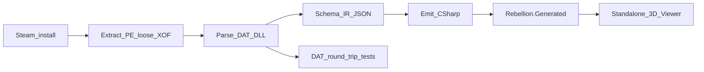
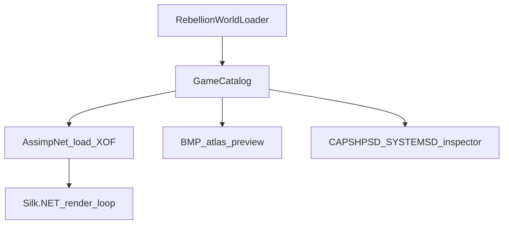

# Rebellion extract-to-codegen C# reimplementation

## Goal

Turn the existing dump CLI ([RebellionAssetDumper.cs](d:\novolis\novolis-experimental\src\Novolis.Experimental.Rebellion\RebellionAssetDumper.cs)) into a **closed loop**:



**Your choices (locked):** C# DAT parsers (no Rust `dat-dumper` bridge); first runnable target is a **standalone 3D viewer**, not dogfooding yet.

**Spec sources (read-only reference, not dependencies):**
- [open-rebellion](https://github.com/tdimino/open-rebellion) — 51 DAT layouts, PE catalogs, `ghidra/notes/`
- [Deep-Dive wiki](https://github.com/TheArchitect2018/Deep-Dive-into-SW-Rebellion-PC-Game-Internals) — `table_header` / linked-list types
- [StarWarsRebellionEditor.NET](https://github.com/MetasharpNet/StarWarsRebellionEditor.NET) — prior C# field names

Simulation/combat port from Ghidra is **Phase 7+**; this plan stops at **data + assets + viewer + generated loaders**.

---

## Repo layout (restructure)

Keep everything under [novolis-experimental](d:\novolis\novolis-experimental) — still no CI, no NuGet publish.

| Project | Role |
|---------|------|
| `Novolis.Experimental.Rebellion.Formats` | `ByteReader`/`ByteWriter`, `table_header`, PE resource reader, XOF carve |
| `Novolis.Experimental.Rebellion.Formats.Tests` | Golden DAT round-trip (uses `SW_REBELLION_DIR` or copied fixtures) |
| `Novolis.Experimental.Rebellion.Extract` | Move current dumper + new PE/string extractors |
| `Novolis.Experimental.Rebellion.Extract.Cli` | `dump`, `parse`, `generate` commands |
| `Novolis.Experimental.Rebellion.Data` | Hand-written `IDatRecord` parsers (51 files) → in-memory model |
| `codegen/Novolis.Experimental.Rebellion.CodeGen` | Lightweight emitter (mirror [novolis-codegen Pipeline](d:\novolis\novolis-codegen\docs\specs\binding-codegen-library\initial-idea-v2.md) pattern **without** GPR dependency) |
| `generated/Novolis.Experimental.Rebellion.Generated` | **Checked-in or regen-on-build** emitted C# (catalogs, enums, tables) |
| `Novolis.Experimental.Rebellion.Viewer` | Silk.NET window: mesh browser, sprite preview, DAT entity inspector |

Refactor: split today’s monolithic [Novolis.Experimental.Rebellion](d:\novolis\novolis-experimental\src\Novolis.Experimental.Rebellion) into `Formats` + `Extract`.

**NuGet (nuget.org only):** `PeNet` or `System.Reflection.Metadata` for PE; `Silk.NET` (+ windowing/input); `AssimpNet` for XOF → render meshes (fallback: keep raw `.x` on disk if Assimp fails a mesh).

---

## Phase 1 — Binary foundations (Formats + Extract)

### 1a. Codec + DAT scaffolding

Implement in `Formats`:

```csharp
// Shared header per Deep-Dive / open-rebellion entity tables
struct TableHeader { uint Magic; uint Entries; uint CurrentType; uint SiblingType; }
struct TableEntryHeader { uint Id; uint Production; uint NextProduction; uint Type; ushort TextResId; ushort TextDllId; }
```

- `ByteReader` / `ByteWriter` with little-endian primitives and span-based reads
- `IDatRecord` with `Read(ReadOnlySpan<byte>)`, `Write(IBufferWriter<byte>)`, `string FileName`
- `DatRegistry` mapping `CAPSHPSD.DAT` → parser type

**Three parser patterns** (from open-rebellion `agent_docs/dat-formats.md`):

| Pattern | Count | Examples |
|---------|------:|----------|
| Entity linked tables | 18 | `SYSTEMSD.DAT`, `CAPSHPSD.DAT`, `FIGHTSD.DAT`, `*MSTB` |
| Parameter / lookup | 24 | `GNPRTB.DAT`, `SDPRTB.DAT`, `CMUN*TB.DAT` |
| Seed / constant | 9 | `SEED*.DAT`, `RAND*.DAT` |

### 1b. Extend extraction (beyond current dump)

Add to [RebellionAssetDumper.cs](d:\novolis\novolis-experimental\src\Novolis.Experimental.Rebellion\RebellionAssetDumper.cs) pipeline:

| Source | Output | Technique |
|--------|--------|-----------|
| `ALSPRITE.DLL`, `EMSPRITE.DLL`, `GOKRES.DLL`, … | `bitmaps/ui/*.png` | PE `RT_BITMAP` → BMP → PNG (`SkiaSharp` or `System.Drawing` on Windows) |
| `VOICEFXA/E.DLL` | `audio/voice/*.wav` | PE `RT_WAVE` / RIFF blobs |
| `TEXTSTRA.DLL` | `text/entities.json` | PE string resources (UTF-16) |
| `ENCYTEXT.DLL` | `text/encyclopedia.json` | `RT_RCDATA` |
| `ALSPRITE` / brief DLLs | `sprites/*.bin` | Raw resource dump + manifest entry (decode later) |
| Existing | loose BMP/WAV/SMK/DAT/XOF | Keep current behavior |

Target: **~2,400 UI bitmaps + 285 voice WAVs** (open-rebellion counts) in addition to today’s 356 loose files.

---

## Phase 2 — Port all 51 DAT parsers (C# round-trip)

**Order of implementation** (unblocks viewer + codegen early):

1. **High-value entity tables:** `SYSTEMSD`, `SECTORSD`, `CAPSHPSD`, `FIGHTSD`, `TROOPSD`, `MJCHARSD`, `MNCHARSD`
2. **Mission tables:** 18 × `*MSTB.DAT`
3. **Globals:** `GNPRTB`, `SDPRTB`, `BASICSD`
4. **Remaining** parameter/seed tables

Each parser gets:

- Struct layout documented in `docs/dat/<filename>.md` (field offset, type, name)
- Unit test: read original from `GData/` → write → `SequenceEqual` on bytes
- Optional JSON snapshot in `_scratch/json/` for debugging (gitignored)

**CLI:** `parse --gdata <path> --output _scratch/json` writes per-DAT JSON; used as codegen input IR.

**Parity gate:** CI-less locally: `dotnet test` with `SW_REBELLION_DIR` set; checked-in **minimal byte fixtures** (truncated headers only) for agents without the game.

---

## Phase 3 — Codegen (C# reimplementation artifacts)

Lightweight pipeline in `codegen/` (no platform GPR packages):

```
extract → parse → emit
```

**Inputs:** parsed JSON IR + `manifest.json` (hashes, relative paths).

**Emitted into `generated/Novolis.Experimental.Rebellion.Generated/`:**

| Output | Purpose |
|--------|---------|
| `EntityIds.g.cs` | `readonly struct` IDs per table type |
| `Tables/*.g.cs` | One record type per DAT row + `static readonly` tables |
| `GameCatalog.g.cs` | `AssetPath`, `Sha256`, `Kind` for every extracted file |
| `StringTables.g.cs` | Entity names, encyclopedia keys |
| `RebellionWorldLoader.g.cs` | `LoadFromDump(string root)` wiring tables + asset paths |

Emitter uses Roslyn text templates (or `Novolis.CodeGen.Bindings.Roslyn` **only if** you choose to add a GPR `PackageReference` later; default is **inline StringBuilder emitter** to stay sandbox-pure).

**Fingerprint file:** `generated/.rebellion-codegen-hash` — regen when install dump hash changes.

**CLI:** `generate --dump <path> --output generated/`

---

## Phase 4 — Standalone 3D viewer

New exe `Novolis.Experimental.Rebellion.Viewer`:



**MVP screens:**

1. **Mesh browser** — list 87 tactical meshes; orbit camera; wireframe/solid
2. **Ship catalog** — `CAPSHPSD` row → linked mesh index (map via RE notes / trial once parsers land)
3. **Sprite sheet** — first N UI BMPs from PE extract
4. **DAT inspector** — tree of generated tables, click row → fields

**Not in MVP:** galaxy map, combat sim, save/load, SMK playback (defer ffmpeg or static thumbnail).

---

## Phase 5 — Documentation + legal guardrails

Update [docs/rebellion-extract.md](d:\novolis\novolis-experimental\docs\rebellion-extract.md):

- Full pipeline diagram
- `docs/dat/` per-file specs
- `docs/reverse-engineering/` — links to Ghidra notes (combat formulas **out of scope** until viewer + data parity done)
- README: regen commands, `SW_REBELLION_DIR`, **do not commit** `_scratch/` dumps or generated assets from LucasArts IP

---

## Phase 6+ (future, not this plan)

- Port `rebellion-core` simulation systems using `ghidra/notes/combat-formulas.md`
- Advisor BIN v2 decoder for droid UI
- Dogfooding hook (`RtsLiteTwoD`) after standalone viewer proves assets

---

## Success criteria

| Milestone | Done when |
|-----------|-----------|
| M1 Extract+ | PE dump yields UI bitmaps + voice WAVs + string JSON |
| M2 DAT parity | All 51 DATs round-trip byte-equal vs Steam `GData/` |
| M3 Codegen | `dotnet run generate` produces compiling `Rebellion.Generated` |
| M4 Viewer | Standalone app loads dump, displays XOF mesh + ship table row |

---

## Risk notes

- **GNPRTB semantics** — layout parseable early; meaning of all 213 params needs Ghidra/docs (~52% mapped in open-rebellion); codegen can emit raw fields first
- **Sprite BIN** — dump raw; schema decode is a separate workstream
- **XOF bounds** — current carve-by-next-header works; validate mesh count vs ship IDs when linking catalog
- **Assimp on .x** — test early; keep `.x` path fallback in viewer

