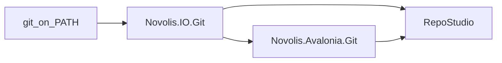

# RepoStudio: IO.Git + Avalonia.Git + hybrid host

Design source: [reposstudio-multi-repo-git.canvas.tsx](C:\Users\frank\.cursor\projects\d-novolis\canvases\reposstudio-multi-repo-git.canvas.tsx).

## Locked decisions

- **Domain owns everything SCM-related** in [`Novolis.IO.Git`](d:\novolis\novolis-io\src\Novolis.IO.Git) (single-repo + workspace batch + graph builder + stash + scheduler). No `Novolis.Tools.Repos`.
- **UI chrome** is a new packable [`Novolis.Avalonia.Git`](d:\novolis\novolis-avalonia\src\Novolis.Avalonia.Git) — Manuscript grain (composable `UserControl`s bound to IO.Git DTOs), not an app-in-a-package.
- **Host** is [`RepoStudio`](d:\novolis\novolis-apps\src\RepoStudio) with GeoPolity-style `--mode spectre|avalonia` + redirected-console → headless, plus `daemon fetch`.
- **Process git only** via existing `IGitProcessRunner` / `ProcessGitRunner` — no LibGit2Sharp.
- **Do not reuse** `Novolis.Avalonia.Timeline` / workspace `GitGraph*` types (those are snapshot cosmetics, not real commits).
- **Publish order:** expand + push `novolis-io` → GPR → Avalonia.Git PackageReference → push `novolis-avalonia` → RepoStudio. Local iteration via `Novolis.Platform.slnx` ProjectRef mode after map regen.



## Current baseline

| Asset | State |
|-------|--------|
| [`GitRepositoryService`](d:\novolis\novolis-io\src\Novolis.IO.Git\GitRepositoryService.cs) | Status, checkpoint, pass, revision tag only |
| Tests | [`Novolis.IO.Unit`](d:\novolis\novolis-io\tests\Novolis.IO.Unit) fakes `IGitProcessRunner` |
| Avalonia template | [`Novolis.Avalonia.Manuscript`](d:\novolis\novolis-avalonia\src\Novolis.Avalonia.Manuscript) |
| Apps CPM | Already has `Novolis.IO.Git`; needs `Novolis.Avalonia.Git` |
| Avalonia CPM | Needs `PackageVersion` for `Novolis.IO.Git` |

---

## Phase 1 — Expand `Novolis.IO.Git`

Keep package Avalonia-free. Prefer splitting files under the same package (Manuscript-style clarity) rather than one mega file.

### 1.1 Single-repo verbs on / beside `GitRepositoryService`

Add typed results (not anonymous `Data`) for:

- `Fetch`, `PullFfOnly`, `Push`
- `ListBranches` / `ListRemoteBranches` / `ListTags` → `BranchList`
- `Checkout`, `CreateBranch` (`checkout -B` / `branch`)
- `GetWorkingTree` (porcelain groups: staged / unstaged / untracked)
- `GetCommitLog` / `GetCommitDetail`
- `GetDiff` (commit or WIP → `DiffDocument` with hunks)
- Stash: `ListStashes`, `StashPush`, `StashApply`, `StashPop`, `StashDrop`

Safety defaults encoded in options types: ff-only pull, skip dirty on mass mutate, no force-push helpers as defaults.

### 1.2 Commit graph (Avalonia-free layout)

New types: `CommitGraphModel`, `CommitNode`, `CommitEdge`, `TipRef`, `CommitGraphOptions`.

`CommitGraphBuilder` assigns lanes from parent SHAs (first-parent optional, max count). Emits logical geometry units for UI paint/hit-test. CLI can serialize the same model via `--json`.

### 1.3 Workspace orchestration (same package)

| Type | Role |
|------|------|
| `GitWorkspace` | `ResolveRoot` (`NOVOLIS_ROOT` / `Novolis.Platform.slnx` / `novolis-governance`), `Discover` (`novolis-*` + `.git`), `GetStatusMatrix` |
| `RepoFilter` | include/exclude names, dirty/behind/ahead/on-branch |
| `GitWorkspaceBatch` | bounded parallel `FetchAsync` / `PullFfOnlyAsync` / `CheckoutAsync` |
| `BranchCutPlanner` | `Plan` / `ApplyAsync(dryRun)` / plan id + resume report |
| `RepoStateStore` | `.novolis/repos-state.json` (last fetch ages) |
| `RepoLock` | `.novolis/locks/<repo>` — fetch shared-read; pull/branch exclusive |
| `FetchScheduler` | interval + backoff; host Start/Stop only |

### 1.4 Tests + package metadata

- Extend [`GitRepositoryServiceTests.cs`](d:\novolis\novolis-io\tests\Novolis.IO.Unit\GitRepositoryServiceTests.cs) / new files: fake runner scripted stdout for porcelain, log, stash list, ahead/behind.
- Unit-test `CommitGraphBuilder` lane assignment with fixed parent graphs (including merge).
- Update package `Description` + README for new surface.
- Push `novolis-io` `main` so GPR gets `2026.1.*`.

---

## Phase 2 — `Novolis.Avalonia.Git` (product controls first)

### 2.1 Package scaffold

Path: `d:\novolis\novolis-avalonia\src\Novolis.Avalonia.Git\`

Copy Manuscript csproj shape:

- `PackageReference`: Avalonia, Avalonia.Themes.Fluent, **Novolis.IO.Git**
- Optional same-repo `ProjectReference` to `Novolis.Avalonia.Controls` / `Layout` only for list/dialog atoms — no Cad/Raylib.
- Add `PackageVersion Include="Novolis.IO.Git"` to [`novolis-avalonia/Directory.Packages.props`](d:\novolis\novolis-avalonia\Directory.Packages.props)
- Register in `Novolis.Avalonia.slnx`, then `Generate-Platform-Slnx.ps1`

### 2.2 Control catalog (ship as reusable chrome)

| Control | Binds |
|---------|--------|
| `GitRepoVisualizer` | `WorkspaceStatusMatrix` + multi-select → `RepoSelection` |
| `GitCommitGraphView` | `CommitGraphModel` (paint lanes/curves/ref pills; virtualize rows) |
| `GitBranchNavigator` | `BranchList` (local/remote/tags); checkout on activate |
| `GitStashPanel` | `StashEntry[]`; apply/pop/drop/show |
| `GitCommitDetailView` | commit meta + file counts |
| `GitDiffView` | `DiffDocument` (unified first; split later if cheap) |
| `GitWorkingTreeView` | working tree groups |
| `GitActionBar` | Fetch/Pull/Push/Branch/Stash/Refresh → IO.Git ops + progress |
| `GitCreateBranchDialog` | single-repo create |
| `GitBranchCutDialog` | multi-repo planner dry-run preview |
| `GitRefBadge`, `GitFetchAgeLabel` | small atoms |

Theme: Fluent / studio tokens; categorical lane colors from accents; stash dashed/muted; mono only for hashes/diff.

### 2.3 Contracts + tests

- `GitChromeContracts.cs` — selection/events the host wires (open repo, selection changed, command requested).
- Host owns session I/O and job lifetime; controls raise events / call injected facades — same Manuscript rule (“not a product host”).
- `Novolis.Avalonia.Git.Unit` (or extend existing Avalonia unit suite): selection, command routing with fake IO facade; graph hit-test smoke.
- Push `novolis-avalonia` after IO.Git is on GPR (or ProjectRef via Platform.slnx for local).

---

## Phase 3 — `RepoStudio` hybrid host

Path: `d:\novolis\novolis-apps\src\RepoStudio\`

### 3.1 Modes ([`GeoPolity/Program.cs`](d:\novolis\novolis-apps\src\GeoPolity\Program.cs) pattern)

- `--mode avalonia` (default on TTY): compose Layout Wide shell + Avalonia.Git panes
- `--mode spectre` / redirected stdio: CLI verbs over same IO.Git APIs, `--json` stdout = DTO serialize
- `daemon fetch --interval N`: `FetchScheduler` loop only

CLI verbs (argv glue only): `root`, `list`, `status`, `fetch`, `pull`, `checkout`, `branch plan|apply|status`, `log --graph`, `stash …`, `diff` / `show`.

### 3.2 Avalonia composition

```text
Wide: GitRepoVisualizer | GitBranchNavigator + GitStashPanel | GitCommitGraphView | Detail+Diff
Toolbar: GitActionBar
Dialogs: create branch / branch-cut
```

Timer → `FetchScheduler`. Matrix selection drives batch pull / branch-cut. Double-open repo focuses graph session.

### 3.3 Project wiring

- `RepoStudio.csproj`: Avalonia.Desktop, Studio/Layout as needed, `Novolis.Avalonia.Git`, `Novolis.IO.Git`
- Add `Novolis.Avalonia.Git` to [`novolis-apps/Directory.Packages.props`](d:\novolis\novolis-apps\Directory.Packages.props)
- Register in [`Novolis.Apps.slnx`](d:\novolis\novolis-apps\Novolis.Apps.slnx)
- Optional: extend dogfooding `IoSmoke` for library smoke only

### 3.4 Host thinness rule

Reject PRs that put lane geometry, porcelain parsing, or batch policy inside `RepoStudio`. Those belong in IO.Git or Avalonia.Git.

---

## Verification gates

1. `dotnet test d:\novolis\novolis-io\tests\Novolis.IO.Unit\Novolis.IO.Unit.csproj -p:NovolisUseProjectReferences=true`
2. Avalonia.Git unit tests similarly
3. `pwsh -File d:\novolis\novolis-governance\scripts\verify-nuget-only.ps1` (+ project-ref / layer checks as usual)
4. `Generate-Platform-Slnx.ps1` after new packable projects
5. Manual: spectre `status --json` / `log --graph --json` against `d:\novolis`; Avalonia matrix + open one repo + stash list
6. Push libraries to `main` for GPR before claiming consumers work NuGet-only

## Out of scope (v1)

- GitHub PR browser / review UI
- LibGit2Sharp
- Mass commit / force-push product flows
- Replacing BooksWriterStudio inline git chrome (can adopt Avalonia.Git later)
- Overloading Timeline “git graph” types

