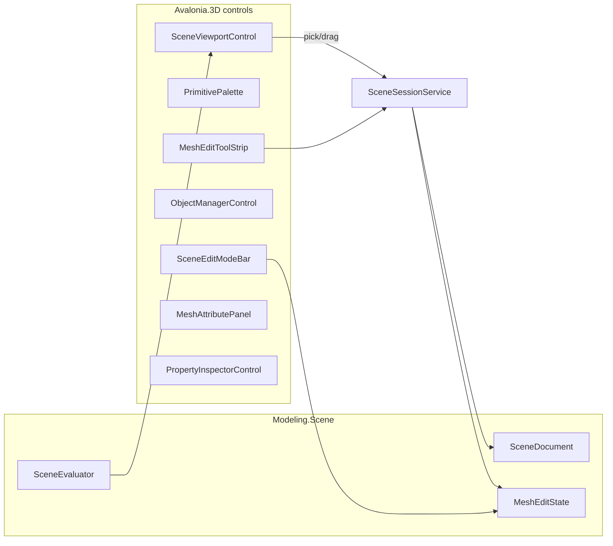

# SceneLab mesh modeller (wireframe + poly edit)

## Decision

**Deepen [SceneLab](novolis-dogfooding/apps/avalonia/SceneLab)** and grow **[Novolis.Avalonia.3D](novolis-avalonia/src/Novolis.Avalonia.3D)** into a component library. Do not add a parallel MeshLab app. Stay on `.nov3djson` / Modeling.Scene — not Cad/`.cadjson`.

Today SceneLab is Object Manager + procedural stack + **whole-mesh wireframe** with **node-only** selection. The gap for “C4D wireframe + mesh editing” is **component selection in the viewport** plus **selection-aware tools** and **real Avalonia chrome**.

## Phase 1 — Edit model + wireframe viewport

**Selection / edit state** in Modeling.Scene (next to document, not only UI):

- `SceneEditMode`: `Object | Point | Edge | Polygon`
- `MeshEditState`: selected vertex/edge/face indices for the active `MeshNode`; soft-radius later
- Persist **editable topology** on mesh objects: when entering Point/Edge/Polygon on a procedural mesh, **bake** eval result into `MeshNode` vertices/indices (make Current State), then ops mutate that mesh — matches C4D “Make Editable”

**Viewport** ([`SceneViewportRenderer`](novolis-avalonia/src/Novolis.Avalonia.3D/Services/SceneViewportRenderer.cs), [`SceneViewportControl`](novolis-avalonia/src/Novolis.Avalonia.3D/Ui/SceneViewportControl.cs)):

- Display modes: **Wireframe** (default), **Wire + points**, **Isoline** (edges + optional face tint for selection)
- Draw selected points as markers, selected edges thicker/cyan, selected faces hatch/tint
- **Ray pick**: closest vertex / edge / triangle under cursor (camera ray vs mesh in world space); click selects; Shift multi-select
- LMB: pick when not on gizmo; MMB/Alt+LMB: orbit (keep current orbit); scroll zoom
- Simple **move gizmo** (axis lines) for selected components — translate only in v1

**Session actions**: `seteditmode`, `selectcomponents`, `moveselection`, `makeeditable`, plus existing object ops.

## Phase 2 — Avalonia component library (lots of controls)

Refactor [`SceneEditorSurface`](novolis-avalonia/src/Novolis.Avalonia.3D/Ui/SceneEditorSurface.cs) toward **CAD-style factory**: build chrome, let SceneLab dock (like DraftStudio). Keep a default self-composed layout for the sample.

New reusable controls under `Novolis.Avalonia.3D/Ui/`:

| Control | Job |
|---------|-----|
| `SceneEditModeBar` | Object / Point / Edge / Polygon (mirror CadSelectionModeBar) |
| `PrimitivePalette` | Grid of primitive create buttons + segment/size presets |
| `GeneratorToolStrip` | Array, Symmetry, Boole (split out of mega strip) |
| `MeshEditToolStrip` | Extrude, Bevel, Inset, Knife, Bridge, Weld, Optimize, Subdiv, Dissolve |
| `LookToolStrip` | Camera / Material / lights (secondary) |
| `MeshAttributePanel` | Vert/edge/face counts, selection counts, weld threshold, subdiv level |
| `TransformHud` | Numeric X/Y/Z for selection or object transform |
| `ModifierStackPanel` | List modifiers on selected mesh; reorder/delete |
| `ViewportStatusBar` | Edit mode, pick target, display mode |
| `SceneDisplayModeBar` | Wireframe / Points / Isoline |

Upgrade existing: editable numeric fields in `PropertyInspectorControl`; richer `ObjectManagerControl` icons by node kind.

SceneLab `MainWindow` composes these into a C4D-ish layout: top mode + primitives + mesh tools; OM | viewport | attributes+properties; bottom status.

## Phase 3 — Cinema4D-style primitives

Extend [`MeshPrimitiveKind`](novolis-avalonia/src/Novolis.Modeling.Scene/Primitives/SceneTypes.cs) + [`PrimitiveMesher`](novolis-avalonia/src/Novolis.Modeling.Scene/Evaluation/PrimitiveMesher.cs):

**Add:** Pyramid, Disc, Tube (hollow cylinder), Platonic (Tetra/Octa/Icosa/Dodeca), Landscape (heightgrid plane).

Keep existing: Box, Sphere, Cylinder, Cone, Plane, Capsule, Torus.

Params on `MeshNode` (segments, fillet/radius where relevant) editable via `PrimitivePalette` + property panel. Schema + session `addmesh` updated.

## Phase 4 — Selection-aware mesh tools

Move shaping from whole-mesh stubs to **ops on selection** using [`EditableMesh`](novolis-math/src/Novolis.Math.Geometry/EditableMesh.cs) + existing kernels:

- **Extrude** selected faces (offset along normals, create side walls)
- **Inset** selected faces
- **Bevel** selected edges (real edge bevel, replace AABB hack)
- **Bridge** two equal edge loops (wire up [`MeshBridge`](novolis-math/src/Novolis.Math.Geometry/MeshBridge.cs))
- **Dissolve** edges / faces
- **Knife** (plane cut via [`MeshPlaneSplit`](novolis-math/src/Novolis.Math.Geometry/MeshPlaneSplit.cs) on selection or whole mesh)
- Keep Weld / Optimize / Subdiv as object or selection-scoped

Object mode still applies generators (Array/Boole/Symmetry) as today.

## Phase 5 — Dogfood, tests, packages

- SceneLab samples: `edit-box` (make editable + extruded faces), `prim-gallery` (all primitives), existing cloner/boole kept
- Unit tests: pick math, make-editable bake, face extrude, component selection DTOs
- Explicit Raylib PackageReferences already on dogfood SceneLab — keep ProjectRef working
- Publish Avalonia/Modeling packages via normal GPR path after merge (no local feeds)

## Out of scope

Animation, MoGraph fields, sculpt brushes, UVs, shaded PBR materials, Cad solid boolean merge, trademarked Cinema4D UI cloning (Object Manager / Modeling / Look naming only).

