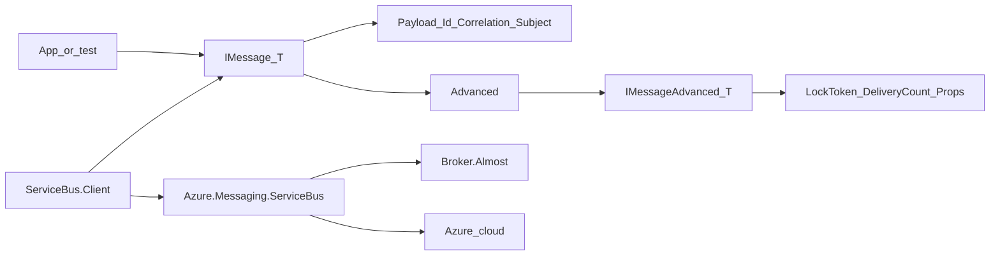

# ServiceBus messaging facet

## Goal

Ship a Service Bus client/broker stack where apps and tests use one typed message model and one Azure SDK–backed client; AlmostServiceBus is the in-process/dev broker. Cloud Azure is connection-string only (no Novolis broker package).

## Message model (Primitives)

**Package:** `Novolis.Messaging.ServiceBus.Primitives`  
**Namespace:** `Novolis.Messaging.ServiceBus` (avoids clash with in-process [`Novolis.Messaging.Message<T>`](d:\novolis\novolis-messaging\src\Novolis.Messaging.Abstractions\Message.cs))

**Default surface (simple):**

```csharp
public interface IMessage<T>
{
    Guid Id { get; }
    Guid CorrelationId { get; }
    string? Subject { get; }
    T Payload { get; }
    IMessageAdvanced<T> Advanced { get; }
}

public sealed record Message<T>(
    T Payload,
    Guid Id = default,
    Guid CorrelationId = default,
    string? Subject = null,
    MessageAdvanced<T>? Advanced = null) : IMessage<T>
{
    public IMessageAdvanced<T> Advanced { get; init; } =
        Advanced ?? MessageAdvanced<T>.Empty;
}
```

**Progressive disclosure (committed shape):**

- Everyday code uses `Payload`, `Id`, `CorrelationId`, `Subject`.
- Deeper broker metadata lives on `IMessageAdvanced<T>` / `record MessageAdvanced<T>`, reached only via `message.Advanced` (public, not `InternalsVisibleTo`, not `internal`).
- Advanced holds: `SessionId`, `ReplyTo`, `ContentType`, `DeliveryCount`, `EnqueuedTime`, `LockedUntil`, `LockToken`, `PartitionKey`, application/user properties (`IReadOnlyDictionary<string, object>`), and raw binary body when payload deserialization is bypassed.
- Send path: construct `Message<T>` with payload (+ optional subject/correlation); set advanced only when needed.
- Receive path: Client maps Azure SDK message → `Message<T>` with Advanced populated; settle APIs take `LockToken` from Advanced (or a small `ISettler` that accepts `IMessage<T>` and reads Advanced internally).



Do **not** unify with PulseFlow/`Novolis.Messaging.Message<T>` in this work.

## Package layout

| Package | Repo | Role |
|---|---|---|
| `Novolis.Messaging.ServiceBus.Primitives` | messaging | `IMessage<T>`, `Message<T>`, `MessageAdvanced<T>`, entity path helpers, settle outcome enums |
| `Novolis.Messaging.ServiceBus.Abstractions` | messaging | Ports: `IServiceBusClient`, sender/receiver/processor, admin create-queue/topic, options (`ServiceBusProvider`: Azure \| Almost), DI extension stubs |
| `Novolis.Messaging.ServiceBus.Client` | messaging | Implements ports with `Azure.Messaging.ServiceBus`; maps to/from `Message<T>`; `UseDevelopmentEmulator` when Almost |
| `Novolis.Messaging.ServiceBus.Broker.Almost` | messaging | Hosts [AlmostServiceBus](https://github.com/gkinsman/AlmostServiceBus); yields connection string + port into options |
| `Novolis.Testing.ServiceBus` | testing | TUnit fixture wrapping Almost TestHost / Broker: start, unique namespace, `CreateClient()`, dispose |

Dependency direction:

```text
Primitives ← Abstractions ← Client
Primitives ← Abstractions ← Broker.Almost
Client + Broker.Almost ← Testing.ServiceBus (PackageReference)
```

Mirror Coordination packaging: new projects under [`d:\novolis\novolis-messaging\src\`](d:\novolis\novolis-messaging\src), register in [`Novolis.Messaging.slnx`](d:\novolis\novolis-messaging\Novolis.Messaging.slnx) and [`.novolis\packages.json`](d:\novolis\novolis-messaging\.novolis\packages.json). Same for [`d:\novolis\novolis-testing`](d:\novolis\novolis-testing).

Update naming example in [`d:\novolis\novolis-governance\docs\naming.md`](d:\novolis\novolis-governance\docs\naming.md) from flat `Novolis.Messaging.AzureServiceBus` to this Client/Broker facet.

## Client / broker behavior

- **One client package** — always Azure SDK. Almost and cloud share the wire; provider is connection + `UseDevelopmentEmulator`, not a second client API.
- **Broker.Almost** — start emulator (in-process for tests; process/tool optional later). No `Broker.Azure`.
- DI: `AddServiceBusClient(...)` always; `AddAlmostServiceBusBroker(...)` only for local/CI. Options bind connection string from broker when provider is Almost.

## Abstractions ports (minimal v1)

Keep the first surface small:

- Send: `SendAsync(IMessage<T>, CancellationToken)`
- Receive/process: handler `Func<IMessage<T>, CancellationToken, Task>` + Complete/Abandon/DeadLetter
- Admin: create queue (enough for tests); topics/sessions in a follow-up if not needed for first tests

## Testing

`Novolis.Testing.ServiceBus`:

- TUnit-friendly async lifetime (align with [`Novolis.Testing.TestBases`](d:\novolis\novolis-testing\src\Novolis.Testing.TestBases))
- Per-fixture namespace isolation (Almost `SharedAccessKeyName` trick)
- Smoke tests in messaging unit project: send/receive round-trip through Client + Almost (skip if package restore fails only when Almost unavailable — prefer hard dep once published)

## Docs / package READMEs

Short README per new package: install, simple `Message<T>` example, one Advanced example, Client + Almost vs Azure connection. Point Testing package at messaging Client.

## Out of scope (this plan)

- Aspire hosting package
- PulseFlow / Channels bridge
- MassTransit / NServiceBus wrappers
- Reworking existing in-process `Message<T>`

