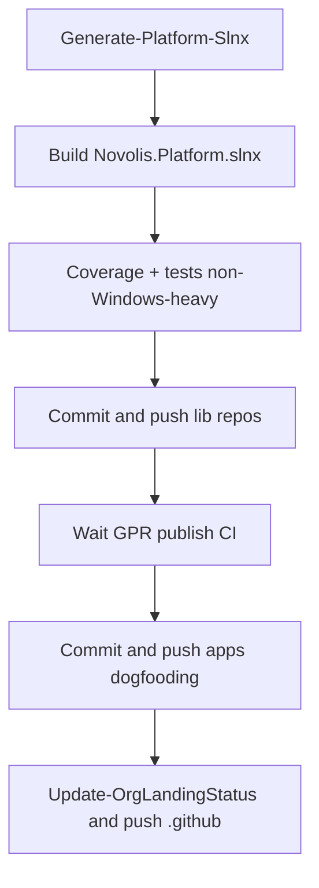

# Ship platform: meta-solution, verify, push main, org landing

Dirty work sits on `main` in ~12 repos (library extractions + third-party hole remediation). Goal: regen meta-solution, green local verify, push so CI publishes packages, refresh org landing.

**Constraint:** NuGet-only — no local feeds. Push **library repos first**, wait for merge/publish CI, then **consumers**. Explicit user request to push to `main`.



---

## 1. Regenerate meta-solution

```powershell
pwsh -File novolis-governance/build/Generate-Platform-Slnx.ps1
```

Includes new/moved packages (`Simulation.Mesh`, `Avalonia.Live`, `Modeling.Scene` under cad, `Agent.Surface` under commands, etc.). Commit map + `Novolis.Platform.slnx` changes in [novolis-governance](novolis-governance).

---

## 2. Local build (ProjectRef mode)

```powershell
dotnet build novolis-governance/build/Novolis.Platform.slnx
```

Auto-enables ProjectReference substitution. Fix any breakages from concurrent dirty trees before proceeding.

Also:

```powershell
pwsh -File novolis-governance/scripts/verify-nuget-only.ps1
pwsh -File novolis-governance/scripts/verify-project-ref-mode.ps1 -SkipBuild
```

---

## 3. Tests and coverage

Use standing excludes from [coverage-excludes.txt](novolis-governance/scripts/coverage-excludes.txt) (already skips apps, dogfooding, templates, workflows, …).

Extra exclude for Windows-heavy hosts on this Linux-capable pass if needed: `-Exclude novolis-raylib` (user: skip Windows-only). Raylib often fails or is slow off Windows.

```powershell
pwsh -File novolis-governance/scripts/get-coverage-report.ps1 -Exclude novolis-raylib -FailBelow 60 -ThrottleLimit 6
```

Acceptable = exit 0 and aggregate line coverage ≥ 60% (org gate from [coverage-report.md](novolis-governance/docs/coverage-report.md)). Investigate/fix failing non-excluded repos; do not fail the ship on excluded Windows-only suites.

Touched lib repos to prioritize if full parallel is too heavy: simulation, gaming, economy, cad, commands, avalonia, audio, rendering, transports.

---

## 4. Commit and push — libraries first

Per-repo commit on current `main` (no new branches unless branch protection blocks direct push — then PR + merge). Repos with dirty work:

| Repo | Why |
|------|-----|
| novolis-simulation | Mesh, cameras, Racing Vector3 |
| novolis-gaming | Session 1.1 genericize |
| novolis-economy | CreditCirculation only (Astro bridge stays out) |
| novolis-cad | Modeling.Scene move, OpeningDerivation |
| novolis-commands | Agent.Surface move |
| novolis-avalonia | Avalonia.Live, 3D Silk ownership, package moves out |
| novolis-audio | Live.Render consumption path if any |
| novolis-rendering | TwoDViewport, Silk presentation abstractions |
| novolis-transports | WireFish PacketPresentation |
| novolis-governance | Platform map/slnx + docs |

For each: `git status` / `diff` / `log` style commit messages; `git push origin main`. Do **not** amend published commits; do **not** force-push.

After lib pushes: watch merge/publish workflows (`gh run list` / wait) until GPR has new `2026.1.*` for Mesh, Game.Session, Avalonia.Live, WireFish, etc.

---

## 5. Commit and push — consumers

| Repo | Why |
|------|-----|
| novolis-apps | Sins Mesh PackageRef, Session adapters, LiveStudio Host, props cleanup |
| novolis-dogfooding | CalypsoCad, WireFishViewer, Silk-free labs, props cleanup |

Restore/build a consumer **without** ProjectRef after GPR is warm:

```powershell
dotnet restore novolis-apps/src/SinsOfACapitalismTycoon/SinsOfACapitalismTycoon.csproj
dotnet build ...
```

---

## 6. Org landing regen

From [.github](.github) (skill: [novolis-org-landing](d:\novolis\.cursor\skills\novolis-org-landing\SKILL.md)):

```powershell
pwsh -File scripts/Update-OrgLandingStatus.ps1
git add profile/README.md
git commit -m "Refresh org landing CI and package version matrices."
git push origin main
```

Requires `gh` auth to Novolis-Platform. Do not hand-edit the generated marker block.

---

## Done criteria

1. `Generate-Platform-Slnx.ps1` succeeded; Platform.slnx builds
2. `verify-nuget-only` + `verify-project-ref-mode -SkipBuild` exit 0
3. Coverage report exit 0 with aggregate ≥ 60% (raylib excluded)
4. All dirty repos committed and on `origin/main`
5. Consumer restore works from nuget.org + GitHub Packages only
6. Org landing `profile/README.md` regenerated and pushed

