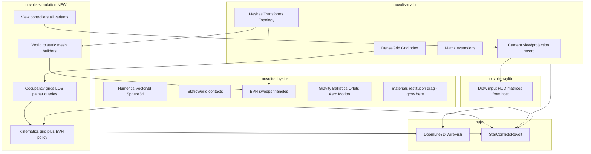

# novolis-simulation + local NuGet platform plan

## Goals

1. **Clear layering:** math = geometry/topology; physics = forces, collision, materials (textbook); simulation = composed worlds + cameras + motion policies for CAD / games / artillery / RTS.
2. **New repo:** [`novolis-simulation`](https://github.com/Novolis-Platform/novolis-simulation) (to be created) with packages `Novolis.Simulation.*`.
3. **Local dev standard:** **local NuGet feed only** across Novolis library repos, [`novolis-dogfooding`](d:\novolis\novolis-dogfooding), and [`StarConflictsRevolt`](D:\github\StarConflictsRevolt) — no cross-repo `ProjectReference` (per your choice).
4. **Patterns first:** governance + MSBuild templates before mass migration; breakages acceptable short-term.

---

## Layer model (locked responsibilities)



| Layer | Owns | Does not own |
|-------|------|----------------|
| **Math** | `DenseGrid`, meshes, transforms, lattices, **`Camera`** (position, target, FOV, aspect) + **`GetViewMatrix` / `GetProjectionMatrix`** ([`Camera.cs`](d:\novolis\novolis-math\src\Novolis.Math.Geometry\Camera.cs), [`CameraExtensions`](d:\novolis\novolis-math\src\Novolis.Math.Geometry\CameraExtensions.cs)) | Input, game rules, occupancy semantics, controller behaviors |
| **Physics** | Forces, integration, **collision mathematics** (BVH, sphere sweep, restitution in [`SphereContactKinematics`](d:\novolis\novolis-physics\src\Novolis.Physics.Collision.Simple\SphereContactKinematics.cs)), domain solvers (ballistics, orbits, aero) | “Walkable cell = 0”, maze generation, third-person shoulder offset |
| **Simulation** | **World models**, **composed motion**, **view controllers**, bridges from grids → physics worlds | GPU draw, networking, product UI |
| **Raylib** | Host loop, textures, `Camera3D` interop | Simulation rules |
| **Apps** | Product logic (Doom packs, SCR server events) | Reusable textbook physics |

**Naming collision:** SCR already has [`StarConflictsRevolt.Server.Simulation`](D:\github\StarConflictsRevolt\src\StarConflictsRevolt.Server.Simulation) (product event loop). Governance must state: **`Novolis.Simulation` = platform library**; SCR keeps its namespace; prefer `PackageReference` to `Novolis.Simulation.*` without renaming SCR projects.

---

## Camera judgment call (math vs simulation)

| Concept | Home | Rationale |
|---------|------|-----------|
| **View/projection parameters** (pose → matrices) | **Math** `Camera` + extensions | GPU and render APIs need matrices; this is geometry, not gameplay |
| **`ViewPose` / `Orientation`** (position + yaw/pitch or quaternion) | **Simulation** `Novolis.Simulation.View` | Neutral state produced by controllers |
| **Controllers** (`FirstPerson`, `ThirdPerson`, `ThirdPersonOverShoulder`, `Cockpit`, `Orbit`, `FreeForm`, `God`, `MapProjection`) | **Simulation** | Convenience policies; each implements `IViewController.Tick(...)` → `ViewPose` |
| **Adapter** `ViewPose.ToMathCamera()` / `ToViewMatrix()` | **Simulation** (thin) or **Math** (if matrix pure) | Keeps math unaware of “shoulder offset” |
| **Minimap / RTS map** | **Simulation** `MapProjection` (world XZ → 2D map coords) | Not a 3D camera; today in [`MinimapHud`](d:\novolis\novolis-dogfooding\apps\DoomLite3D\Game\MinimapHud.cs) — candidate extract later |

**Migrate:** [`FirstPersonCamera`](d:\novolis\novolis-math\src\Novolis.Math.Geometry\FirstPersonCamera.cs) → `Novolis.Simulation.View.FirstPersonController` (or `YawPitchController` base). Leave **one-release obsolete type forwarder** in math if needed.

**Do not** put `ThirdPersonOverShoulder` in math — only the matrix math it uses stays in math.

---

## `novolis-simulation` package layout (initial)

| Package | Responsibility | Migrated from |
|---------|----------------|---------------|
| **`Novolis.Simulation.View`** | `IViewController`, `ViewPose`, camera variants listed above | `FirstPersonCamera` (math) |
| **`Novolis.Simulation.World`** | Planar occupancy on XZ (+Y up): move, LOS, raycast, push-out; axis convention doc | [`GridCollision2D`](d:\novolis\novolis-math\src\Novolis.Math.Geometry\GridCollision2D.cs) (rename e.g. `PlanarOccupancy`) |
| **`Novolis.Simulation.Kinematics`** | Single `PlanarAgent.Move(...)` choosing grid vs `IStaticWorld` sweep | [`GridPhysicsMovement`](d:\novolis\novolis-physics\src\Novolis.Physics.Collision.Simple\GridPhysicsMovement.cs), DoomLite dual-path |
| **`Novolis.Simulation.World.Builders`** | Occupancy grid → `BvhStaticWorld` (extruded columns) | [`RoomMeshBuilder`](d:\novolis\novolis-physics\src\Novolis.Physics.Collision.Simple\RoomMeshBuilder.cs) (rename `OccupancyColumnMeshBuilder`) |
| **`Novolis.Simulation`** (meta, optional) | Aggregator package like [`Novolis.Physics`](d:\novolis\novolis-physics\src\Novolis.Physics\Novolis.Physics.csproj) | — |

**Dependencies:** `Novolis.Simulation.*` → `Novolis.Math.*`, `Novolis.Physics.*`; **never** raylib, **never** dogfooding/SCR.

**Tests:** port [`GridCollision2DTests`](d:\novolis\novolis-math\tests\Novolis.Math.Geometry.Tests\GridCollision2DTests.cs) → `Novolis.Simulation.World.Tests`; add `View` tests for forward/right axes.

**Physics stays** for textbook expansion: material hardness, friction tensors, contact manifolds — future `Novolis.Physics.Materials` / contact models, not simulation.

---

## Local NuGet-only workflow (platform standard)

You selected **local NuGet feed only** (no cross-repo `ProjectReference`). This replaces today’s split patterns:

- Dogfooding: submodule junctions + `ProjectReference` ([`design.md`](d:\novolis\novolis-dogfooding\docs\design.md))
- SCR: pinned `PackageVersion` in [`Directory.Packages.props`](D:\github\StarConflictsRevolt\Directory.Packages.props) + ad-hoc `UseLocalNovolisTesting` + `ProjectReference` in tests

### Canonical layout (monorepo root `d:\novolis`)

| Path | Purpose |
|------|---------|
| [`d:\novolis\nuget.config`](d:\novolis\nuget.config) (new) | Adds `local` source → `d:\novolis\artifacts\nuget-local` |
| `d:\novolis\artifacts\nuget-local\` | Shared feed; all `dotnet pack` outputs land here |
| `d:\novolis\scripts\pack-novolis-local.ps1` (new) | Packs listed repos in dependency order (math → physics → simulation → raylib → …) |
| Per-repo `scripts/pack-local.ps1` | Thin wrapper calling shared script or `dotnet pack -o ...` |

### MSBuild contract (every **packable** library repo)

Add to governance + template [`novolis-template-dotnet`](d:\novolis\novolis-template-dotnet):

```xml
<!-- Directory.Build.props -->
<PropertyGroup>
  <NovolisLocalFeed Condition="'$(NovolisLocalFeed)'==''">$(NOVOLIS_LOCAL_FEED)</NovolisLocalFeed>
  <NovolisLocalFeed Condition="'$(NovolisLocalFeed)'==''">D:\novolis\artifacts\nuget-local</NovolisLocalFeed>
</PropertyGroup>
```

```xml
<!-- scripts/pack-local.ps1 standard -->
dotnet pack -c Release -o "$(NovolisLocalFeed)" /p:ContinuousIntegrationBuild=false
```

**Consumers** (dogfooding, SCR):

- `PackageReference` only in `.csproj`
- Versions in `Directory.Packages.props` (e.g. `0.3.0-local` or dated `0.3.0-g$(git sha)`)
- Repo-level or user-level `nuget.config` pointing at `NovolisLocalFeed`
- **Remove** `ProjectReference` to `d:\novolis\novolis-*` and dogfooding submodule build paths for **compile** (submodules may remain for **source browsing** only, optional)

### Versioning convention for local feed

| Environment | Version pattern |
|-------------|-----------------|
| Local iterative | `0.3.0-local` bumped in central props when breaking API, or `0.3.0-*` with `--force` repack |
| CI / nuget.org | Semver from tag ([`package-policy.md`](d:\novolis\novolis-governance\docs\package-policy.md)) |

Document: **after changing a library, run `pack-novolis-local.ps1` before building consumers.**

### StarConflictsRevolt integration

- Add `nuget.config` (or document machine-wide) with `D:\novolis\artifacts\nuget-local`
- Align [`Directory.Packages.props`](D:\github\StarConflictsRevolt\Directory.Packages.props) with locally packed versions (physics `0.2.0-alpha` → local; raylib `0.1.1-alpha` → local)
- Remove [`tests/Directory.Build.props`](D:\github\StarConflictsRevolt\tests\Directory.Build.props) `ProjectReference` override path for raylib testing once `Novolis.Raylib.Testing` is packed locally
- Later: add `Novolis.Simulation.*` when SCR adopts platform view/world APIs (not required for phase 1)

### Dogfooding migration

- Update [`DoomLite3D.csproj`](d:\novolis\novolis-dogfooding\apps\DoomLite3D\DoomLite3D.csproj): `PackageReference` to `Novolis.Raylib`, `Novolis.Math.*`, `Novolis.Physics.*`, then `Novolis.Simulation.*`
- Revise [`docs/design.md`](d:\novolis\novolis-dogfooding\docs\design.md): consumer-of-local-NuGet, not ProjectReference integrator
- CI: pack dependencies in workflow **or** use cached `nuget-local` artifact between jobs (phase 2)

---

## Governance deliverables (wave 11)

New docs under [`novolis-governance/docs/`](d:\novolis\novolis-governance\docs\):

| Document | Contents |
|----------|----------|
| **`simulation-layer-policy.md`** | Math / physics / simulation / raylib boundaries; SCR naming note |
| **`local-nuget-development.md`** | Feed path, `nuget.config`, pack order, version rules, troubleshooting |
| **`extraction-briefs/wave-11-simulation-repo.md`** | Scope, migrations, done-when |
| Update **`gameengine-reference-policy.md`** | Point dogfood-grown APIs to simulation, not math |
| Update **`naming.md`** | `novolis-simulation`, `Novolis.Simulation.View`, etc. |

---

## Phased execution

### Phase 0 — Platform plumbing (no API moves yet)

- Add root `d:\novolis\nuget.config` + `artifacts/nuget-local` + `pack-novolis-local.ps1`
- Add `local-nuget-development.md` + template `pack-local.ps1` snippet for all packable repos
- Pilot: pack [`novolis-math`](d:\novolis\novolis-math), [`novolis-physics`](d:\novolis\novolis-physics), [`novolis-raylib`](d:\novolis\novolis-raylib); verify SCR/dogfood can restore from feed

### Phase 1 — Create `novolis-simulation` skeleton

- New repo: solution, `Directory.Packages.props`, TUnit tests, packaging props mirroring physics
- Empty packages: `View`, `World`, `Kinematics`, `World.Builders`
- Register in [`.novolis/repos.json`](d:\novolis\novolis-dogfooding\.novolis\repos.json) for discoverability (even if dogfood uses NuGet only)

### Phase 2 — Move APIs (with obsolete shims)

- Move `GridCollision2D` → `Simulation.World` (rename type; obsolete alias in math one release)
- Move `FirstPersonCamera` → `Simulation.View`
- Move `RoomMeshBuilder`, `GridPhysicsMovement` → simulation (`World.Builders`, `Kinematics`)
- Unify DoomLite [`PlayerController`](d:\novolis\novolis-dogfooding\apps\DoomLite3D\Game\PlayerController.cs) on `Kinematics.PlanarAgent.Move`

### Phase 3 — Consumers on local NuGet only

- Migrate **dogfooding** apps to `PackageReference` + local feed
- Migrate **SCR** to local feed for all Novolis packages; drop test `ProjectReference` hacks
- Bump central package versions; document pack-before-build in README

### Phase 4 — Expand simulation (incremental)

- Stub remaining view controllers (orbit, third-person, god) as needed by SCR / CAD
- `MapProjection` extract from MinimapHud (optional)
- Physics: flesh out **materials** package surface (hardness, friction) without moving to simulation

---

## What stays in physics (textbook checklist)

Keep and document as **fundamental** (extend here, not in simulation):

- `Novolis.Physics.Numerics`, `Abstractions`, `Collision.Simple` (BVH, mesh, sweep, restitution)
- `Motion`, `Gravity`, `Ballistics`, `Orbits`, `Aerodynamics`
- Future: explicit **material** models (hardness, friction, combine rules), constraint solvers

Remove from physics after migration: grid-specific **policy** (`GridPhysicsMovement`, `RoomMeshBuilder`).

---

## Risk notes

| Risk | Mitigation |
|------|------------|
| Local feed stale vs source | `pack-novolis-local.ps1` in dev loop; README “always pack after pull” |
| Dogfooding CI without submodules | CI job packs libs to artifact feed, then builds dogfood |
| SCR / Novolis.Simulation name clash | Document; no rename of SCR projects |
| Breaking consumers during moves | Obsolete type forwards; local `0.x-local` version bumps |

---

## Done when (wave 11)

- `novolis-simulation` builds, tests pass, packs to `artifacts/nuget-local`
- Governance policies published
- DoomLite3D builds via **PackageReference** only against local feed
- SCR builds via **PackageReference** only against local feed (versions documented)
- Math/physics no longer contain dogfood-grown occupancy/view policy (or only obsolete aliases)
- Physics repo README states textbook scope explicitly

