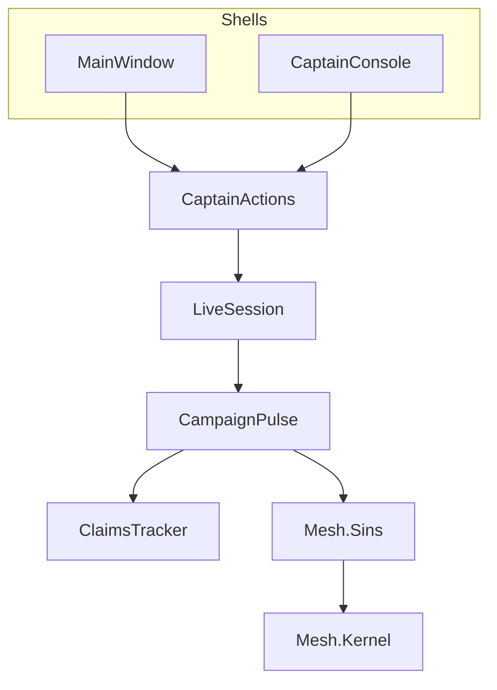

# Fix Sins architectural sins

Decisions locked: **1A** harden replay (no Economy dump APIs); **2A** in-app mesh boundary (no `Novolis.Mesh.Core` package).

Do **not** delete the core BM engine or invent full-world serialization. Align `CaptainActions` with the in-flight [event-driven bridge protocol](.cursor/plans/event-driven_bridge_protocol_31b6ef37.plan.md): this pass builds the in-process command layer that bridge service can wrap later.

---

## 1. Session-scoped claims (high)

[`ClaimsPulse.cs`](novolis-apps/src/SinsOfACapitalismTycoon/Universe/Commerce/ClaimsPulse.cs): replace static `SeenCancelled` / `SeenBombEdge` / `ResetSeen` with a small `ClaimsTracker` instance owned by `LiveSession` (field on session or on [`CampaignWorld.Ids`](novolis-apps/src/SinsOfACapitalismTycoon/Universe/CampaignWorld.cs)).

- `ClaimsPulse.TickDay(..., ClaimsTracker tracker)`
- Remove process-global sets; ctor of `LiveSession` creates a fresh tracker (drop `ResetSeen` call)
- Update unit tests that hit claims if any

## 2. Delete AgentDebugLog (high)

- Remove [`AgentDebugLog.cs`](novolis-apps/src/SinsOfACapitalismTycoon/AgentDebugLog.cs)
- Strip all `AgentDebugLog.Write` + `#region agent log` from [`PlayerTrampAgent.cs`](novolis-apps/src/SinsOfACapitalismTycoon/Universe/Player/PlayerTrampAgent.cs) and [`CaptainConsole.cs`](novolis-apps/src/SinsOfACapitalismTycoon/Cli/CaptainConsole.cs)

## 3. Harden replay saves (high, 1A)

Keep seed → `HoursDone` warm. Make the contract honest and checkable:

- Extend [`CampaignSaveRecord`](novolis-apps/src/SinsOfACapitalismTycoon/Universe/Persistence/CampaignSaveRecord.cs) with integrity fields: `SimHash`, `DayIndex` (already partly present), `OpsCash` (rename/clarify vs display `Cash`)
- On save in [`CampaignSaveStore`](novolis-apps/src/SinsOfACapitalismTycoon/Universe/Persistence/CampaignSaveStore.cs): write `sim.State.Hash` and tramp ops cash
- On [`FromSaveAsync`](novolis-apps/src/SinsOfACapitalismTycoon/Universe/CampaignRunner.cs): after `AdvanceHoursAsync`, verify hash/day/cash; on mismatch log a clear error and fail load (do not silently diverge)
- Docs: [`gameplay.md`](novolis-apps/src/SinsOfACapitalismTycoon/docs/gameplay.md) / [`architecture.md`](novolis-apps/src/SinsOfACapitalismTycoon/docs/architecture.md) — checkpoint = deterministic replay + integrity, not a world dump
- No sidecar unless warm needs player mid-queue (interactive saves already warm with autopilot); skip DTO sidecars in this pass

## 4. Bridge thread isolation (high)

[`CaptainJobBoard`](novolis-apps/src/SinsOfACapitalismTycoon/Universe/Player/CaptainJobBoard.cs) / [`MainWindow`](novolis-apps/src/SinsOfACapitalismTycoon/Ui/MainWindow.cs): stop reading live Economy collections from the UI thread during sim.

- Add `LiveSession.CaptureBridge(systemId)` (or similar) that builds [`CaptainBridgeModel`](novolis-apps/src/SinsOfACapitalismTycoon/Ui/CaptainBridgeModel.cs) **on the sim path** at `DayEnded` / `AwaitingDecision` (or under a session lock held only for the capture)
- UI binds the last captured immutable model; refresh = use pending capture, not ad-hoc `From` mid-tick
- Keep `HubOrders.ToArray()` as defense-in-depth inside board builders when called from capture

## 5. Shared `CaptainActions` (medium)

New [`Universe/Player/CaptainActions.cs`](novolis-apps/src/SinsOfACapitalismTycoon/Universe/Player/CaptainActions.cs): single place that enqueues `PlayerOrder` kinds + optional `Continue()`.

- Retarget overlapping verbs in MainWindow and CaptainConsole (accept/charter/market/travel/depart/wait/refuse/premium/overhaul/profile/board/time)
- Shells keep selection/parsing/UX only
- Shape results as `Result(Ok, Message, Advanced)` so bridge protocol can wrap later without another fork

## 6. Shared hull finance posts (medium)

Extract `HullFinance.TryRemitPremium` / `TryPayOverhaul` (same ledger posts used today).

- [`SurvivalCaptain`](novolis-apps/src/SinsOfACapitalismTycoon/Universe/Player/SurvivalCaptain.cs) and [`PlayerTrampAgent`](novolis-apps/src/SinsOfACapitalismTycoon/Universe/Player/PlayerTrampAgent.cs) call helpers
- [`InsurancePulse`](novolis-apps/src/SinsOfACapitalismTycoon/Universe/Commerce/InsurancePulse.cs) keeps idle/arrears/station-advance policy on top of the same remit helpers

## 7. Catalog memoize (medium)

[`SinsCatalog.Load`](novolis-apps/src/SinsOfACapitalismTycoon): memoize NearSol pack (`Lazy` or static cached catalog). Bridge refresh stops rebuilding every frame.

## 8. Thinner pulse extraction (medium)

Move `PulseDaysAsync` body out of `LiveSession` into `CampaignPulse` (hour loop + day commerce pulses) taking `(Sim, Ids, Agents, …, ClaimsTracker)`.

- `LiveSession` keeps pause/gates/save/events; pulse is one collaborator
- Do **not** explode `Ids` into many types this pass — claims tracker is the only new owned field

## 9. Mesh in-app boundary (medium, 2A)

No new package / GPR.

- Kernel files under `Universe/Mesh/` → namespace `SinsOfACapitalismTycoon.Universe.Mesh.Kernel` (engines, `MeshState`, pipeline, invariants)
- Glue under `Universe/Mesh/Sins/` → namespace `SinsOfACapitalismTycoon.Universe.Mesh.Sins`
- Prefer `internal` on kernel types; keep `InternalsVisibleTo` unit tests
- Update [`SPEC.md`](novolis-apps/src/SinsOfACapitalismTycoon/Universe/Mesh/SPEC.md) / mesh docs: extraction remains future; this pass is the boundary

## 10. Delivery bios + shell globals (low)

- [`ObserveDeliveries`](novolis-apps/src/SinsOfACapitalismTycoon/Universe/CampaignRunner.cs): resolve origin/dest hub names from shipment/event (match ClaimsPulse style), not `"?"`
- Replace [`Program.UiOptions` / `ReportText`](novolis-apps/src/SinsOfACapitalismTycoon/Program.cs) handoff with `App` startup args / `App.RunOptions` set once before desktop lifetime (same pattern, no cross-static from Program for UI)

## 11. Dual engines (explicit non-delete)

Keep **campaign** + **core** in one exe as documented BM regression. Only clarify [`architecture.md`](novolis-apps/src/SinsOfACapitalismTycoon/docs/architecture.md) / Program comments that core is intentional and orthogonal — no project split this pass.

---

## Verification

- `dotnet test` on `SinsOfACapitalismTycoon.Unit` (mesh + any claims/save tests)
- Headless: `dotnet run … -- --engine campaign --days 2d --seed 1001 --quiet`
- Save/load round-trip same seed/hours → integrity assert passes
- `pwsh -File novolis-governance/scripts/verify-nuget-only.ps1` (and project-ref check if touched) — no local feeds; no new packages for mesh

## Out of scope

- Economy platform checkpoint APIs / full world dumps
- Publishing `Novolis.Mesh.Core`
- Full `novolis-game-bridge` protocol (separate plan; consume `CaptainActions` later)
- Removing core smoke engine

