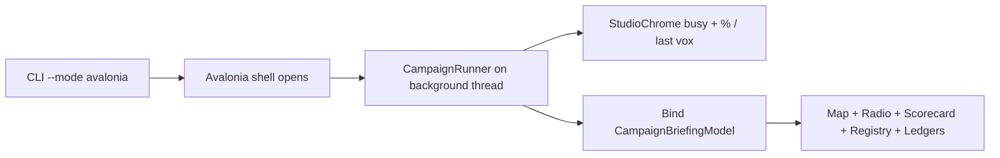

# Sins Avalonia campaign briefing UI

## Default product shape

**Campaign briefing room** (not a live pulse loop, not a pure ops spreadsheet). Matches the gameplay you just shipped: judge the campaign via radio, life moments, registry, and geography.

Flow change:

Headless path stays unchanged (`SpectreHeadlessReport` to stdout). Avalonia stops dumping Spectre ANSI into a TextBox as the primary UX (keep a **Raw** tab for parity).

## New Avalonia package: `Novolis.Avalonia.Briefing`

Add packable, no-XAML library under [novolis-avalonia](d:\novolis\novolis-avalonia) (same conventions as Controls/StarMap: `net10.0`, code-built controls, `PackageId` = project name).

| Control | Role |
|---------|------|
| `FeedPanel` | Scrollable `[voice] text` feed rows (domain-agnostic; Sins feeds `VoxBank` lines) |
| `ScorecardView` | Rows of kind / hits / hook with filled vs empty state |
| `DualMetricStrip` | Two labeled money columns with explicit “never summed” caption |
| `MetricTableView` | Thin DataGrid wrapper for keyed rows (registry / logistics / agents) |

Wire into solution + [`.novolis/packages.json`](d:\novolis\novolis-avalonia\.novolis\packages.json), package README, unit smoke for construction/bind (match Controls test style).

Reuse existing packages (already in apps `Directory.Packages.props`):

- [`Novolis.Avalonia.StarMap`](d:\novolis\novolis-avalonia\src\Novolis.Avalonia.StarMap) — hubs as `StarMapPoint`, corridors as `StarMapEdge`
- [`Novolis.Avalonia.Studio`](d:\novolis\novolis-avalonia\src\Novolis.Avalonia.Studio) — `StudioChrome` busy overlay + status/flash during run

**NuGet-only:** Sins takes `PackageReference` `2026.1.*`. Local validation via `-p:NovolisUseProjectReferences=true` (platform map). Claiming done still requires publishing `Novolis.Avalonia.Briefing` to GitHub Packages before non-ProjectRef restores.

## Sins app UI rewrite

Replace thin [`Ui/MainWindow.cs`](d:\novolis\novolis-apps\src\SinsOfACapitalismTycoon\Ui\MainWindow.cs) / [`Ui/App.cs`](d:\novolis\novolis-apps\src\SinsOfACapitalismTycoon\Ui\App.cs) with a briefing shell (still no XAML, matching Novolis Avalonia style):

**Layout (one composition):**

- Left: `StarMapControl` of the 100-hub campaign (coords from catalog via `ids.Bridge`; role-aware labels; selection shows hub name/role in a detail strip)
- Right top: `FeedPanel` (overture + milestone vox + curtain)
- Right mid: `ScorecardView` from `LifeMoments.Score`
- Right lower / tabs: registry `MetricTableView`, `DualMetricStrip` (Ops vs Core), logistics/activity metrics, mega-hauler bio list, agents last-decision list
- Bottom: status line + Raw Spectre text tab (optional)

**Projection layer:** `Ui/CampaignBriefingModel.cs` builds immutable UI DTOs from `CampaignRunner.Result` (map points/edges, feed lines via `VoxBank`, scorecard, registry rows, ledger pair, logistics numbers). Keeps Economy types out of control constructors.

**Program.cs change:** for `--mode avalonia` + campaign, start desktop lifetime **first**; window kicks `CampaignRunner.RunAsync` with progress → chrome; on completion bind model. Stop using `Program.ReportText` as the only Avalonia payload for campaign. Core engine Avalonia keeps a simple report pane (existing text path) so scope stays campaign-first.

**csproj:** add PackageReferences to `Novolis.Avalonia.Briefing`, `Novolis.Avalonia.StarMap`, `Novolis.Avalonia.Studio`.

## Visual direction (app shell)

Avoid purple/glow defaults. Briefing aesthetic: deep charcoal dock (`#0b1020` already on StarMap), amber accent for brand/title, muted cyan for map edges, monospace only in Raw/feed timestamps — expressive UI type for headers (Inter already via `WithInterFont` is OK for body; brand title slightly larger/semibold, not a second Figlet dump).

## Docs touch

Short updates: [docs/cli-and-reports.md](d:\novolis\novolis-apps\src\SinsOfACapitalismTycoon\docs\cli-and-reports.md), [docs/gameplay.md](d:\novolis\novolis-apps\src\SinsOfACapitalismTycoon\docs\gameplay.md) — `--mode avalonia` is the briefing room; note StarMap/live pulse loop still later for *mid-tick* animation ([roadmap.md](d:\novolis\novolis-apps\src\SinsOfACapitalismTycoon\docs\roadmap.md)).

## Validation

1. Build avalonia Briefing + Sins with ProjectRef
2. `dotnet run … -- --engine campaign --days 10d --seed 1001 --mode avalonia --story` — window shows progress then populated panels; empty-berth / scorecard visible after ≥15–20d runs
3. Headless still prints Spectre as today
4. After merge/publish Briefing to GPR, restore without ProjectRef works

## Out of scope (this pass)

- Mid-hour live map animation / Spectre pulse loop
- Editing seed/days inside the UI (CLI remains the run config)
- Extracting a shared campaign library from NearSol dogfood

