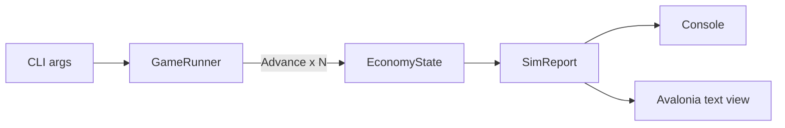

# Sins of a Capitalism Tycoon (novolis-apps)

## Locked decisions

- **Repo:** [`novolis-apps`](novolis-apps) under [`src/SinsOfACapitalismTycoon/`](novolis-apps/src/SinsOfACapitalismTycoon/)
- **Kernel:** published [`Novolis.Economy.Core`](novolis-economy/src/Novolis.Economy.Core/) (`PackageReference` `2026.1.*` only — no cross-repo ProjectReference in committed csproj)
- **Modes:** `--mode headless` (default for agents/CI) and `--mode avalonia` (playtest); shared runner + report text
- **OutputType:** `Exe` (console works headless; Avalonia still launches)
- **Baby step 1 scope:** minimal seeded `EconomyState`, advance N periods, print/`Snapshot()` report; Avalonia = scrollable text of that report — no Astro, no agents, no NearSol weave
- **Local multi-repo iteration:** after Core is on the packable map, use Platform ProjectRef mode (`Novolis.Platform.slnx` or `-p:NovolisUseProjectReferences=true`) — never local feeds



## Phase 0 — Core on GitHub Packages

[`Novolis.Economy.Core.csproj`](novolis-economy/src/Novolis.Economy.Core/Novolis.Economy.Core.csproj) is already `IsPackable=true` / `PackageId=Novolis.Economy.Core`.

1. Confirm CI/main has published `Novolis.Economy.Core` `2026.1.*` to GPR (merge/publish if missing).
2. Regenerate platform map so Core appears: `pwsh -File novolis-governance/build/Generate-Platform-Slnx.ps1`.
3. Verify: `verify-nuget-only.ps1` + `verify-project-ref-mode.ps1` (as needed).

## Phase 1 — App scaffold (headless-first)

Create [`novolis-apps/src/SinsOfACapitalismTycoon/`](novolis-apps/src/SinsOfACapitalismTycoon/):

| File | Role |
|------|------|
| `SinsOfACapitalismTycoon.csproj` | `Exe`; PackageRefs: `Novolis.Economy.Core`, Avalonia trio (Desktop/Themes/Fonts) |
| `Program.cs` | Parse `--mode`, `--periods N`, `--seed U`; dispatch |
| `Cli/Args.cs` | Arg parsing; default `headless`, periods e.g. 20 |
| `Sim/GameRunner.cs` | Build seed state → `DefaultPeriodPipeline.CreateEngine()` → advance → collect reports |
| `Sim/SeedEconomy.cs` | Tiny deterministic seed (1 region, household+firm+state cash, optional trivial activity) |
| `Sim/SimReport.cs` | Immutable report: period, `EconomySnapshot` lines, optional entity/region blurb |
| `Sim/ReportFormatter.cs` | Plain-text formatter (single source for CLI + Avalonia) |
| `Ui/App.axaml(.cs)`, `Ui/MainWindow.axaml(.cs)` | Avalonia: run sim (or show last report), `TextBlock`/`TextBox` with formatter output |
| `README.md` | Run commands for both modes |

Wire into [`Novolis.Apps.slnx`](novolis-apps/Novolis.Apps.slnx) and document in [`novolis-apps/README.md`](novolis-apps/README.md) + short note in [`docs/design.md`](novolis-apps/docs/design.md).

Central version: add `Novolis.Economy.Core` `2026.1.*` to [`Directory.Packages.props`](novolis-apps/Directory.Packages.props).

**CLI contract:**

```text
dotnet run --project src/SinsOfACapitalismTycoon -- --mode headless --periods 20 --seed 42
dotnet run --project src/SinsOfACapitalismTycoon -- --mode avalonia --periods 20 --seed 42
```

Headless writes the formatted report to stdout and exits 0.

## Phase 2 — Avalonia shell (same report)

- `--mode avalonia` starts desktop app; on load runs the same `GameRunner` and binds `ReportFormatter` text into a simple window (title **Sins of a Capitalism Tycoon**).
- No second economy path; no live tick UI yet (run-to-completion then display is enough for baby step).

## Phase 3 — Smoke / agent affordance

- README documents headless as the agent entrypoint.
- Manual smoke: headless 20 periods prints non-empty snapshot (cash, period, entity counts).
- Do not add installer/release assets in this baby step (keep out of release workflow until the app is worth shipping).

## Explicitly out of this plan

- Astro system profiles / NearSol / Logistics vehicles
- Order books, tramp agents, interactive play loop
- Replacing `Novolis.Economy.Simulation`
- Inno installer / GitHub Release assets for Sins

## Verification

```powershell
# economy: Core available on GPR (or Platform mode after map regen)
dotnet build novolis-economy/src/Novolis.Economy.Core/Novolis.Economy.Core.csproj

# apps
dotnet restore novolis-apps/src/SinsOfACapitalismTycoon
dotnet run --project novolis-apps/src/SinsOfACapitalismTycoon -- --mode headless --periods 5 --seed 1
```

Local Core source iteration (optional): build the app with `-p:NovolisUseProjectReferences=true` once Core is in `Novolis.PackageToProject.props`.

