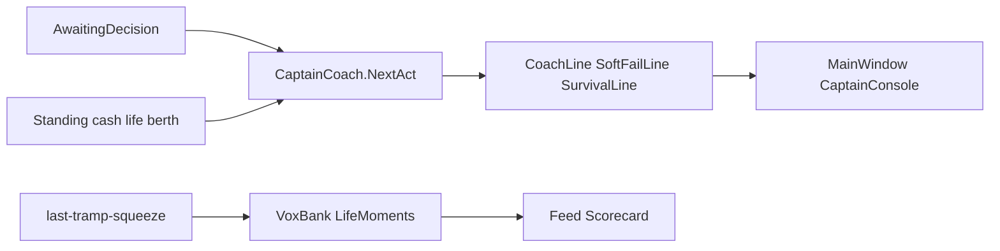

# Sins engagement: coach, choice clarity, last-tramp beats

## Scope (locked)

Implement a **compact package** of the engagement pillars we discussed: clear feedback + sharper berth tradeoffs + nested last-tramp goals. No UI redesign, no new panels—extend voyage strip, radio, scorecard, and spot summaries. Playtest via existing CLI gates (not a full MCP win run).

## Problem

Pause already works (`AwaitingDecision`), but the bridge’s `DecisionLine` is raw agent chatter (`LastDecision`) and soft-fail/survival lines do not answer **why it hurt** or **what to do next**. Last-tramp squeezes fire milestones without radio/scorecard voice.

## Approach

### 1. Captain coach (feedback + recovery)

Add [`Universe/Player/CaptainCoach.cs`](novolis-apps/src/SinsOfACapitalismTycoon/Universe/Player/CaptainCoach.cs) that ranks one next act from live state:

| Priority | Condition | Hint shape |
|----------|-----------|------------|
| 1 | Soft-fail / `!CanOperate` | Cause from standing (`uninsured` / `suspended` / `burnout` / arrears) + CTA (`Pay premium` / `Request overhaul` / cash short) |
| 2 | Active ugly standby | Accept or refuse (refuse ≠ premium) |
| 3 | Manifest waiting | Depart |
| 4 | Spot `AtOrigin` with margin | Accept top spot / fill hold |
| 5 | Idle operable, no local spot | Travel to best off-berth origin (reuse board distance) |
| 6 | Overhaul due / life pressure | Elective overhaul when cash allows |
| 7 | Else | Wait / scan boards |

Wire into [`CaptainBridgeModel`](novolis-apps/src/SinsOfACapitalismTycoon/Ui/CaptainBridgeModel.cs):

- New `CoachLine` (agent id `calypso.coach`) — do **not** overwrite `DecisionLine` (keep `LastDecision` for Spectre/agents).
- Enrich `SoftFailLine` to include cause + recovery CTA when grounded streak &gt; 0 or soft-fail raised.
- [`MainWindow`](novolis-apps/src/SinsOfACapitalismTycoon/Ui/MainWindow.cs): show coach under decision; on `AwaitingDecision` flash coach via existing `StudioFeedback` (not only soft-fail).
- [`CaptainConsole`](novolis-apps/src/SinsOfACapitalismTycoon/Cli/CaptainConsole.cs): print coach on status / pause.

### 2. Spot / charter choice clarity

In [`CaptainJobBoard`](novolis-apps/src/SinsOfACapitalismTycoon/Universe/Player/CaptainJobBoard.cs) spot `Summary` / `DistanceHint`:

- Keep AT BERTH vs travel distance.
- Add short risk tags: `steam risk` when not at origin; `cash gate` when quoted premium / thin cash makes haul risky (simple cash vs premium heuristic—no new economy math).
- Charter rows already say refuse ≠ premium; ensure coach points at standby when active.

No new accept rules—copy only, so playtests stay deterministic.

### 3. Last-tramp nested goals + pacing voice

- Extend [`TrampSurvival.FormatLine`](novolis-apps/src/SinsOfACapitalismTycoon/Universe/TrampSurvival.cs): in last-tramp mode, append `next squeeze ~dN` (from [`LastTrampPressure.FirstSqueezeDay` / `SqueezeSpacingDays`](novolis-apps/src/SinsOfACapitalismTycoon/Universe/LastTrampPressure.cs) + first still-operable rival index) and a short grounded-rival count/name when space allows.
- [`VoxBank`](novolis-apps/src/SinsOfACapitalismTycoon/Universe/Drama/VoxBank.cs): handlers for `last-tramp`, `last-tramp-squeeze`, `last-tramp-lose` (James / Meridian voice).
- [`LifeMoments`](novolis-apps/src/SinsOfACapitalismTycoon/Universe/Drama/LifeMoments.cs): add those kinds + hooks so scorecard/briefing track the arc.
- Optional one-line overture tweak when `--last-tramp` is on (pass flag into existing overture path if already available; otherwise keep vox-on-milestone only).

### 4. Docs (minimal)

One short subsection in [`docs/gameplay.md`](novolis-apps/src/SinsOfACapitalismTycoon/docs/gameplay.md): voyage strip coach + soft-fail recovery language + last-tramp radio beats. No new markdown files.

## Playtesting (acceptance)

Run from `novolis-apps` with project refs as you usually do for local Sins work:

1. **Build** Sins debug.
2. **`--playtest --seed 1001`** — must still pass; coach text must appear in captain status output when paused/awaiting (grep `NEXT:` or similar prefix).
3. **`--playtest-last-tramp --seed 1001`** — must still `PLAYTEST LAST-TRAMP PASS`; expect `last-tramp-squeeze` / win milestones to speak via VoxBank in feed/report; survival line shows next squeeze day while mid-run.
4. **Manual smoke (short):** `--mode captain --last-tramp --seed 1001 --days 20` (or Avalonia with agent) — pause on grounded/idle, confirm coach points at Pay premium / Travel / Accept; soft-fail line names cause when forced grounded (if easy via save or by watching arrears).

If playtest autopilot never pauses long enough to show coach in logs, assert coach via a tiny unit-style helper test **or** a headless status dump after forcing `NeedsPlayerDecision`—prefer grepping captain console banner if autopilot still prints status.

## Out of scope

- New economy mechanics, margin formulas, or win-condition changes.
- MCP / Avalonia.Agent protocol changes beyond `calypso.coach` id.
- Full human MCP play-to-WIN session.
- Commits/PRs unless you ask.

