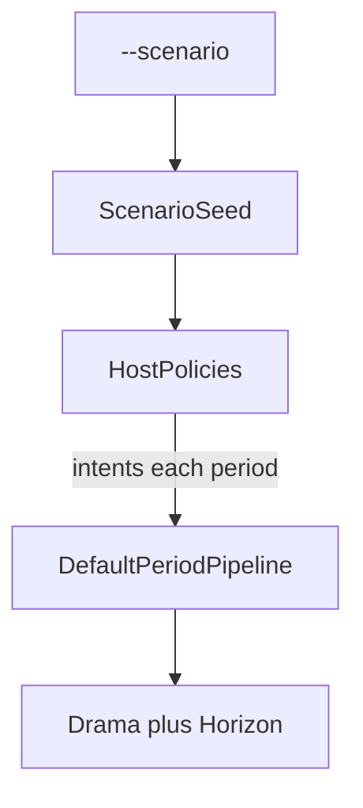

# Interesting dynamics in Sins

## Locked decisions

- **Where:** [`novolis-apps/src/SinsOfACapitalismTycoon/`](novolis-apps/src/SinsOfACapitalismTycoon/) only (no Core API expansion unless a scenario is blocked; Core already has credit/obligations/losses/capacity).
- **CLI:** `--scenario <name>` added to [`Cli/Args.cs`](novolis-apps/src/SinsOfACapitalismTycoon/Cli/Args.cs); default **`logistics_bind`** (interesting showcase). Keep **`baseline`** as the current stable conveyor for conservation checks.
- **Kill god-haul:** remove unconditional [`DispatchOreHauls`](novolis-apps/src/SinsOfACapitalismTycoon/Sim/GameRunner.cs); replace with per-scenario **host policies** that act only when that actor can pay / lane has residual capacity.
- **Regression:** no new `novolis-apps` test project (repo has none). Headless smokes + drama lines in the report; README documents greppable expectations. Core unit tests stay as they are.
- **Out of scope here:** Astro map seed, tramp agents, Core pivot, installer/release assets.



## Scenario catalog

| Name | Bind | Seed knobs | Host policy |
|------|------|------------|-------------|
| `baseline` | none (regression) | current two-region; generous cash/lane | haul if factory buffer low and factory can pay |
| `logistics_bind` | carriage | mine output high; lane capacity **5**; travel 3 | haul max residual only; no cash god-mode |
| `working_capital` | liquidity | factory cash thin; ore price high; wages on | haul only if cash≥cost+wage reserve; else try bank draw if facility exists |
| `credit_cycle` | leverage | committed facility on factory; higher install later via policy once | draw when illiquid; expand capacity once after N periods if drawn |
| `fiscal_stress` | treasury | State cash low; transfer/hh high; tax low | no special haul change; transfers starve demand |
| `shock` | insurance/loss | coverage on factory; mid-horizon `LossEvent` | inject loss at period `periods/2`; haul as baseline |

Each seed builds on shared [`SeedIds`](novolis-apps/src/SinsOfACapitalismTycoon/Sim/SeedIds.cs) / two-region skeleton; scenario packs live in `Sim/Scenarios/`.

## Implementation

### 1. CLI + runner wiring

- Extend `RunOptions` with `Scenario` enum/string.
- `GameRunner.Run(seed, periods, scenario, …)` selects seed + `IHostPolicy`.
- Each period: `state = policy.ApplyIntents(state, ids, periodIndex)` then `engine.Advance(state)`.

### 2. Host policies (replace god-haul)

New types under `Sim/Policies/`:

- `IHostPolicy.ApplyIntents(EconomyState, SeedIds, int period)`
- `OreHaulPolicy` — trade+`StartTransfer` only if: factory needs buffer, mine has ore, **lane residual**, factory cash covers price (and optional wage reserve).
- `CreditDrawPolicy` — if factory `Liquidity.Surplus < 0` and committed facility available → `CreditEngine.DrawFacility`.
- `ShockPolicy` — at trigger period, append `PendingLosses`.
- Compose via `CompositePolicy`.

### 3. Drama metrics

Extend [`HorizonStats`](novolis-apps/src/SinsOfACapitalismTycoon/Sim/SimReport.cs) / formatter:

- `PeriodsWithoutProduction`, longest production gap
- peak mine ore stockpile
- count of delinquent/defaulted obligations seen
- count of credit draws / money created
- factory stockout periods (ore &lt; recipe need)

Report section **Drama** so headless and Avalonia both show whether the run “hurt.”

### 4. Docs + smoke

Update [`README.md`](novolis-apps/src/SinsOfACapitalismTycoon/README.md):

```text
--mode headless --scenario logistics_bind --periods 300 --seed 42
--scenario working_capital --periods 200
--scenario credit_cycle --periods 400
--scenario fiscal_stress --periods 200
--scenario shock --periods 300
--scenario baseline --periods 100
```

Expected signals (examples): logistics_bind → `PeriodsWithoutProduction > 0` and rising mine stockpile; working_capital → delinquencies or credit draws; fiscal_stress → state cash trough / flat transfers; shock → claim/premium activity or delinquency spike.

### 5. Avalonia

No new economy path — [`MainWindow`](novolis-apps/src/SinsOfACapitalismTycoon/Ui/MainWindow.cs) already shows `ReportFormatter` text; drama section appears automatically.

## Verification

```powershell
dotnet run --project novolis-apps/src/SinsOfACapitalismTycoon -- --mode headless --scenario logistics_bind --periods 300 --seed 42 --quiet
dotnet run --project novolis-apps/src/SinsOfACapitalismTycoon -- --mode headless --scenario working_capital --periods 200 --seed 1 --quiet
dotnet run --project novolis-apps/src/SinsOfACapitalismTycoon -- --mode headless --scenario baseline --periods 100 --seed 42 --quiet
```

Local Core source: `-p:NovolisUseProjectReferences=true` after Core is on the package map (already packable).

## Done when

- God-haul gone; hauls require cash + logistics residual.
- All six scenarios runnable via `--scenario`.
- Drama block present; logistics_bind and working_capital show non-flat pain on 200–300 period smokes.
- baseline still conserves aggregate cash with production most periods.

