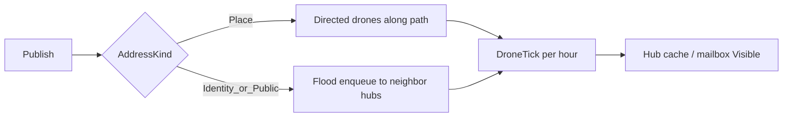

# Sins Mesh messaging component (BM kernel, app-local)

## Intent

Ship a **real mesh simulation** (publish/propagate, place-directed vs identity-flood, pulse drones, visibility ≠ delivery) as a **Sins component** for now — not a new `novolis-mesh` repo and not inside `Novolis.Transports.*`.

Shape it like [`Novolis.Economy.Core`](novolis-economy/src/Novolis.Economy.Core/README.md): `SPEC.md`, immutable state, ordered step engine, invariants, explicit non-goals — so extraction to `Novolis.Mesh.Core` later is a move, not a rewrite.

## Placement

```text
novolis-apps/src/SinsOfACapitalismTycoon/
  Universe/Mesh/                 ← BM kernel (no CampaignWorld / Avalonia / EconomySimulation refs)
    SPEC.md
    MeshState.cs
    MeshEngine.cs + IMeshStep
    Identifiers.cs / Enums.cs / ModelTypes.cs
    PublishEngine.cs             ← place-directed + identity-flood entry
    DroneTickEngine.cs           ← hop / arrive / loss
    FloodEngine.cs               ← hub fan-out when identity / public
    InvariantChecker.cs
    DefaultMeshPipeline.cs
  Universe/Mesh/Sins/            ← thin product glue only
    MeshBridge.cs                ← Astro hubs → MeshState
    MeshPulse.cs                 ← hour advance + publish helpers for campaign
  docs/mesh-and-communications.md
```

**Kernel rule:** anything under `Universe/Mesh/` (except `Sins/`) must not reference `CampaignWorld`, `ShipRegistry`, Spectre, or Avalonia. IDs are mesh-native (`MeshHubId`, `MeshIdentityId`, `PacketId`); the bridge maps `systemId` / ship flavor ids.

## Bounded minimum (v1)

**In boundary**

| Concept | Behavior |
|---------|----------|
| Hubs | One per bridged star system; pulse bandwidth budget per hour |
| Edges | Known hub→hub hops with travel hours (sprint vs cargo) |
| Packets | Pulse / bulk / public; sealed flag; opaque signature blob |
| Address | `Place(HubId)` vs `Identity(IdentityId)` vs `Public` |
| In-flight drones | Aggregate carriers (count + ETA), not named NPCs |
| Hub cache + mailbox | Visibility store; identity mailboxes hold until “connect” |
| Postage priority | Small integer; higher priority wins bandwidth contention |

**Contract**

- Place address → **directed** drone path along known edges (scoped propagate).
- Identity / public → **flood** (one-to-all among hubs) subject to bandwidth.
- Success metric = **visible at hub / in mailbox**, never “delivered to a human.”

**Out of boundary (v1)**

Real crypto, ansible channel, per-drone physics, Limbo ceremony as special event type, Transports promotion, money fees charged into Economy ledgers (postage is mesh-internal capacity only).

## Timing model

Reuse campaign geography, not cargo cruise speeds:

- Mesh edges seeded from the same hop graph as [`AstroEconomyBridge`](novolis-apps/src/SinsOfACapitalismTycoon/Universe/Bridge/AstroEconomyBridge.cs) (`MaxRangeLy = 12`).
- **Pulse travel hours** = `ceil(ly / PulseLyPerHour)` with `PulseLyPerHour` ≫ tramp cruise (`CruiseLyPerHour` today ≈ `1/(1.3×24)`). Concrete default: **~20× tramp** (tiny disposable mass) — documented in SPEC.
- Bulk layer uses slower hop hours (closer to cargo) so pulse vs bulk is mechanically distinct.
- `MeshEngine.Advance` runs **once per campaign hour** beside existing pulses.



## Campaign wiring

1. **Seed** in [`CampaignWorld.Create`](novolis-apps/src/SinsOfACapitalismTycoon/Universe/CampaignWorld.cs): after `AstroEconomyBridge.Build`, `MeshBridge.FromBridge(bridge)` → `MeshState`; store on `CampaignWorld.Ids` as `MeshState Mesh` (mutable ref holder or replace-with-new each tick — prefer `Ids.Mesh` updated immutably like Core).
2. **Identities (minimal):** register player hull + tramp ship flavor ids + firm keys as `MeshIdentityId` strings; optional `LastKnownHub` when a ship is berthed (from registry/site) as flood bias only — does not upgrade SLA.
3. **Hour tick** in [`CampaignRunner.LiveSession.PulseDaysAsync`](novolis-apps/src/SinsOfACapitalismTycoon/Universe/CampaignRunner.cs) after agents / `Sim.AdvanceAsync`: `Ids.Mesh = MeshPulse.TickHour(Ids.Mesh)`.
4. **Smoke publishes:** on campaign start, one directed Sol→a known hub pulse and one identity flood for Calypso — proves the system without UI.
5. **Spectre:** short “Mesh” block in [`SpectreHeadlessReport`](novolis-apps/src/SinsOfACapitalismTycoon/Universe/Reporting/SpectreHeadlessReport.cs) — hubs, in-flight drones, cache hits, flood vs directed counts.
6. **Docs:** [`places-and-stations.md`](novolis-apps/src/SinsOfACapitalismTycoon/docs/places-and-stations.md) Communications section points at `docs/mesh-and-communications.md`; architecture table row for Mesh (Sins-local → future `Novolis.Mesh.Core`).

## API sketch (kernel)

```csharp
// Publish — returns next state; never claims delivery
MeshState Publish(MeshState s, MeshPacket packet, MeshAddress to, MeshHubId fromHub);

// Query visibility
bool IsVisibleAt(MeshState s, PacketId id, MeshHubId hub);
bool IsInMailbox(MeshState s, PacketId id, MeshIdentityId identity);

MeshState Advance(MeshState s); // DefaultMeshPipeline fold
```

Directed path: BFS/Dijkstra on mesh edges (ly or hop count); no hard dependency on `Novolis.Astro.Routing` inside kernel — bridge precomputes edge list with travel hours.

## Tests

`novolis-apps` has no test project today. Add:

- [`novolis-apps/tests/SinsOfACapitalismTycoon.Unit/SinsOfACapitalismTycoon.Unit.csproj`](novolis-apps/tests/SinsOfACapitalismTycoon.Unit/) — xUnit, `InternalsVisibleTo` from Sins exe (or make Mesh types `public` under a clear namespace).
- Register in [`Novolis.Apps.slnx`](novolis-apps/Novolis.Apps.slnx).

Scenarios (Economy-style validation):

1. Directed Sol→Wolf: visible at destination hub; not at unrelated hub before path completes.
2. Identity flood: eventually visible at all hubs (or until TTL).
3. Offline identity: mailbox holds; `IsDelivered` does not exist.
4. Bandwidth: flood displaces lower-priority pulse at a congested hub.
5. Multi-hop drone loss + retry still converges to visibility.

## Explicit non-goals this PR

- New GitHub Packages package / `novolis-mesh` repo
- Charging Economy cash for postage
- Captain-bridge compose UI for messaging
- Ansible dual-channel
- Promoting anything into `Novolis.Transports.*`

## Promotion path (later, not now)

When stable: move `Universe/Mesh/*` (minus `Sins/`) → `Novolis.Mesh.Core`, publish `2026.1.*`, Sins keeps `MeshBridge` / `MeshPulse` as app glue — same pattern as hull quotes leaving Sins for Logistics.
