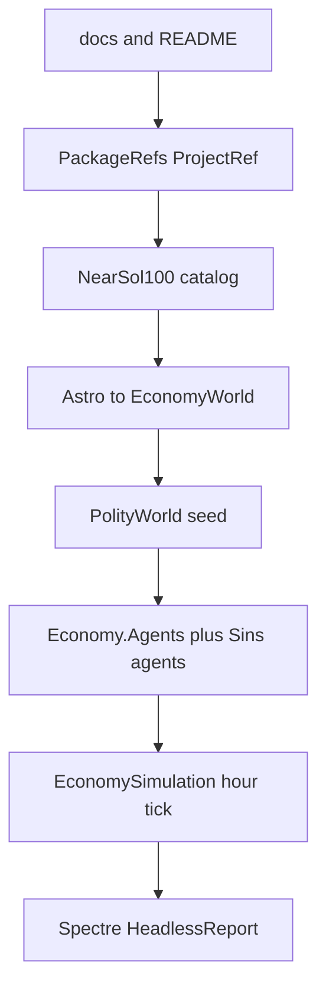

# Sins polity universe (NearSol successor)

## Locked decisions

- **1B full pivot:** Sins owns the interstellar polity experience. Primary path = Astro catalog (100 systems) → `EconomyWorld` / `EconomySimulation` → agents → rich headless report. Current two-region Core `--scenario` packs stay as **`--mode core-smoke`** (or `--engine core`) for BM regression only — not the product surface.
- **Headless-first:** Spectre.Console tables/panels for readable output. Avalonia StarMap / live playtest UI is **out of this plan** (text Avalonia report may still show the Spectre-rendered string later).
- **Docs first:** create [`docs/`](novolis-apps/src/SinsOfACapitalismTycoon/docs/) and link from [`README.md`](novolis-apps/src/SinsOfACapitalismTycoon/README.md) before large code moves. Fiction/tone inspired by [Standards and Infrastructure](https://frankhaugen.github.io/galactic-confederation-review/series/standards-and-infrastructure/) (containers, registry, ship law, insurance as *interfaces that make trade work* — not abstract policy).
- **Libraries via PackageReference + ProjectRef:** add Economy Simulation/Logistics/Accounting/Production/Markets/Population/Finance/Agents + Astro Abstractions/Catalog/Routing/Assessment (+ Catalog.Data if needed) to Sins csproj and [`novolis-apps/Directory.Packages.props`](novolis-apps/Directory.Packages.props). Local builds use `-p:NovolisUseProjectReferences=true` (apps already import Packaging.targets). No cross-repo ProjectReference in committed csproj; no local NuGet feeds.
- **Catalog:** embed/adapt NearSol’s fixed Johnston 100-star slice ([`nearsol-100.json`](novolis-dogfooding/apps/economy/NearSolPolity/data/nearsol-100.json)) into Sins as the canonical “100 nearest” seed — do not invent a second catalog format. Improve *economy* and *report*, not the star list provenance in v1.
- **Better than NearSol (v1 deltas):** Sins-branded world + agents under `Universe/`; Spectre report exceeding NearSol’s wall of text; docs that map C-series / registry / insurance concepts onto Logistics corridors, hull cargo, Accounting ledgers, Core projected books; keep Core authority dual-book visibility in the report (Ops vs Core, never summed). Extract/copy patterns from NearSol rather than ProjectReference dogfooding.



## Phase 0 — Documentation (first todo)

Create under `novolis-apps/src/SinsOfACapitalismTycoon/docs/`:

| Doc | Content |
|-----|---------|
| `README.md` | Index + links; “start here” |
| `vision.md` | Product pitch: sins of capital across 100 systems; mind-boggling = causality visible |
| `architecture.md` | Dual engines (polity vs core-smoke); Ops vs Core books; ProjectRef |
| `universe.md` | 100-star catalog, hop graph (≤12 ly), roles, hubs/corridors |
| `standards-and-cargo.md` | Fiction↔code: C10/C20/C40 as cargo quantum inspiration ([C-Series article](https://frankhaugen.github.io/galactic-confederation-review/articles/c-series-containers-founding-standard/)); hull capacity, corridor max, registry/insurance as Liability/Accounting hooks — what is modeled now vs later |
| `agents-and-firms.md` | Firm map, agent pulse order, sinks (Final consumption) |
| `cli-and-reports.md` | Headless duration args, Spectre sections, greppable milestones |
| `scenarios-core-smoke.md` | Legacy BM packs retained for Core regression |
| `roadmap.md` | Avalonia StarMap, C-series SKU enforcement, richer ship registry — explicitly later |

Update root Sins `README.md`: short run commands + **Documentation** link to `docs/README.md`. Tone: dry institutional clarity (standards memo), not marketing fluff.

## Phase 1 — Dependencies

- Extend `SinsOfACapitalismTycoon.csproj` PackageReferences to match NearSol’s Economy+Astro set + `Spectre.Console`.
- Add missing `PackageVersion` rows to apps `Directory.Packages.props` (`2026.1.*`, Spectre version as in dogfooding).
- Verify substitute with `dotnet msbuild … -p:NovolisUseProjectReferences=true -getItem:ProjectReference`.

## Phase 2 — Universe runtime (port + improve)

New tree under Sins (names illustrative):

- `Universe/Catalog/` — embed `nearsol-100.json`, `NearSolCatalog`-equivalent loader
- `Universe/Bridge/AstroEconomyBridge.cs` — port from NearSol; route graph, roles, hubs/corridors
- `Universe/PolityWorld.cs` — seed firms, SKUs, facilities, cohorts, tramp fleet (start from NearSol; rename brands to Sins)
- `Universe/Agents/` — wire library agents + Sins-local export/venture agents as needed
- `Universe/PolityRunner.cs` — `Create(seed)` → pulse agents → `AdvanceAsync(1h)` for `Nd` days
- CLI: default / `--engine polity --days 100` (Spectre report); `--engine core --scenario …` for old path

Keep NearSol in dogfooding untouched (reference implementation). Prefer copy-adapt over shared project until a library extraction is justified.

**v1 “better” checklist (must ship):**

- Spectre structured sections (money, sectoral projected Core books, ops ledgers, logistics in-flight, roles/geography, milestones)
- Explicit Ops vs Core cash lines (reuse `WorldReportSnapshot` / `ProjectedAccounts`)
- Deterministic seed + state hash in report header
- At least the NearSol firm/agent coverage (mining/industry/station/carriers/tramps/treasury/export)

## Phase 3 — Headless readability

- Add `Reporting/SpectreHeadlessReport.cs` using Spectre `Table` / `Rule` / `Panel` / `BreakdownChart` where useful.
- CLI `--days 10d|100d|1000d` (NearSol `DurationArg` pattern); `--quiet` suppresses progress bars only.
- Write artifact under `artifacts/sins-report-{days}d.txt` when not quiet.
- Avalonia mode (if kept): dump the same text for now — no StarMap in this plan.

## Phase 4 — Verification

```powershell
dotnet build novolis-apps/src/SinsOfACapitalismTycoon -p:NovolisUseProjectReferences=true
dotnet run --project novolis-apps/src/SinsOfACapitalismTycoon -p:NovolisUseProjectReferences=true -- --engine polity --days 10d --seed 1001
dotnet run --project novolis-apps/src/SinsOfACapitalismTycoon -p:NovolisUseProjectReferences=true -- --engine core --scenario baseline --periods 50 --quiet
```

Expect polity run: 100 systems seeded, hubs/corridors non-empty, Spectre tables with money + logistics + agents; core-smoke still conserves cash on baseline.

## Out of scope (this plan)

- Avalonia StarMap / live Spectre dashboard loop
- Extracting shared `Novolis.Economy.Polity` library from NearSol+Sins
- Replacing Johnston 100 list with full HYG live query
- Full C-series container SKU/enforcement in Logistics engine
- GPR publish (note in PR when Sins needs new package versions on CI)

## Done when

- `docs/` exists, linked from README, extensively describes architecture/universe/standards fiction/CLI
- Sins PackageRefs cover NearSol-class libraries; ProjectRef build works
- Default product path runs 100-system polity headless with Spectre tables
- Core scenarios remain runnable as smoke
- Report shows Ops vs Core and is materially more scannable than NearSol’s plain dump

