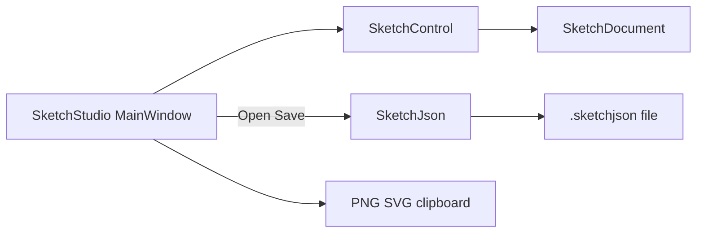

# Sketch Studio production app

## Defaults (locked)

- **Name:** Sketch Studio → [`novolis-apps/src/SketchStudio/`](novolis-apps/src/SketchStudio/)
- **Stack:** freehand [`SketchControl`](novolis-avalonia/src/Novolis.Avalonia.Controls/SketchControl.cs) only (not CAD / Draft Studio)
- **v1 bar:** port SketchLab UX + document persistence + ship zip/Inno; no layers/text/arrows; keep dogfood SketchLab as smoke

## Source of truth today

Dogfood app: [`novolis-dogfooding/apps/avalonia/SketchLab/`](novolis-dogfooding/apps/avalonia/SketchLab/) (`MainWindow.cs`, `SketchExport.cs`, `Program.cs`, `App.cs`).

Library already ships what we need in `Novolis.Avalonia.Controls` (`SketchControl`, `SketchJson`, tools, undo, Gridify). **No new Controls package APIs required** for v1; apps consume floating `2026.1.*` from GPR.

## App scaffold (`novolis-apps`)

Create self-contained project mirroring BooksWriterStudio / DraftStudio:

- [`SketchStudio.csproj`](novolis-apps/src/SketchStudio/SketchStudio.csproj): `WinExe`, `ApplicationTitle=Sketch Studio`, PackageRefs:
  - Avalonia / Desktop / Fluent / Inter
  - `Microsoft.Extensions.Hosting`
  - `Novolis.Avalonia.Controls`
  - `Novolis.Avalonia.Packaging.Inno` (`PrivateAssets=all`)
  - `Optris.Icons.Avalonia` + `Optris.Icons.Avalonia.FontAwesome`
- TFM from apps [`Directory.Build.props`](novolis-apps/Directory.Build.props) (`net10.0`) — do **not** use SketchLab’s windows-specific TFM
- Port code-only UI (no XAML), rename namespace to `SketchStudio`
- Add Optris package versions to [`Directory.Packages.props`](novolis-apps/Directory.Packages.props) (same versions as dogfooding: `12.0.6`)

### Production bridge polish (beyond dogfood)

Port toolbar/tools/export from SketchLab, then add:

| Feature | Approach |
|---------|----------|
| **Open / Save / Save As / New** | Avalonia `StorageProvider` (same pattern as [`DraftStudio/MainWindow.cs`](novolis-apps/src/DraftStudio/MainWindow.cs)); filter `*.sketchjson` |
| **Persistence** | `SketchJson.Serialize` / `Deserialize` already in Controls |
| **Dirty + title** | Track path + dirty from `DocumentChanged`; title `Sketch Studio — file*` |
| **Close confirm** | Prompt if dirty |
| **Shortcuts** | Ctrl+N/O/S/Shift+S, Ctrl+Z/Y, Delete (erase selection), existing tool keys from SketchLab |
| **Default workspace** | Optional last-path or `%LocalAppData%\Novolis\Sketch Studio\` (lightweight; match Draft Studio LocalAppData pattern only if needed) |

Keep Paint-light code toolbar (Font Awesome). Do **not** pull in `Novolis.Avalonia.Studio` for v1.



## Release packaging (required for “pack correctly”)

Follow Draft Studio checklist from [`apps-repos.md`](novolis-governance/docs/apps-repos.md) / [`release.md`](novolis-apps/docs/release.md):

1. Add project to [`Novolis.Apps.slnx`](novolis-apps/Novolis.Apps.slnx)
2. Register catalog entry in `Get-NovolisAppCatalog` ([`Publish-NovolisApp.ps1`](novolis-apps/scripts/Publish-NovolisApp.ps1)):

```powershell
Key='sketch-studio'; Choice='SketchStudio'; Project='src/SketchStudio/SketchStudio.csproj'
DisplayName='Sketch Studio'; AppId='Novolis.SketchStudio'; ExeName='SketchStudio.exe'
GroupName='Sketch Studio'; InstallDir='Novolis\Sketch Studio'
SetupBase='SketchStudioSetup'; ScriptFile='sketch-studio.iss'
```

3. Add `SketchStudio` to ValidateSet in [`build-installer.ps1`](novolis-apps/scripts/build-installer.ps1) and to [`release.yml`](novolis-apps/.github/workflows/release.yml) `app` choices
4. Docs: README apps table, [`docs/release.md`](novolis-apps/docs/release.md) asset rows, [`docs/design.md`](novolis-apps/docs/design.md), [`docs/getting-started.md`](novolis-apps/docs/getting-started.md)

Merge to `main` (paths under `src/**`) publishes **all** catalog apps → zip + Inno + SHA256SUMS on GitHub Releases.

## Dogfooding

Keep [`SketchLab`](novolis-dogfooding/apps/avalonia/SketchLab/) as Controls smoke. Update its README to note production home is Sketch Studio in `novolis-apps`.

## Explicit non-goals (v1)

- No CAD / `.cadjson` / Draft Studio merge
- No layers, text, arrows, collaboration
- No NuGet packing of the app host (`IsPackable=false`)
- No local NuGet feeds; PackageReference only

## Verification

- `dotnet build` / run `src/SketchStudio` (ProjectRef mode OK locally while iterating Controls)
- Smoke: draw → save `.sketchjson` → reopen → Gridify → undo → Copy PNG/SVG
- `pwsh -File novolis-governance/scripts/verify-nuget-only.ps1` (and project-ref checks as needed)
- Local pack: `pwsh -File scripts/build-installer.ps1 -App SketchStudio` (needs Inno Setup 6)
- After merge: confirm Release assets `SketchStudioSetup-*-win-x64.exe` / `SketchStudio-*-win-x64.zip`
