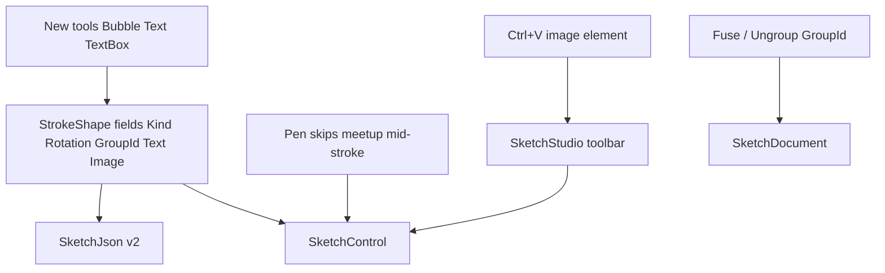

# SketchStudio shapes, rotation, fuse, paste

## Defaults (locked)

| Request | Decision |
|---------|----------|
| Pen not “interrupted” by existing shapes | **Disable meetup snap during Pen freehand** (grid snap may stay). Meetup remains for Line/Spline/Rect/Ellipse endpoints. Root cause: [`SnapPointer`](d:\novolis\novolis-avalonia\src\Novolis.Avalonia.Controls\SketchControl.cs) already pulls every pen sample to the nearest vertex when Meetup is on. |
| Fuse | **Group**, not boolean union: multi-select → one `GroupId`; move/resize/rotate/delete as one; **Ungroup** restores individuals. |
| Speech bubble | New tool → closed polyline via `SketchPrimitives.SpeechBubble` (rounded body + triangular tail). |
| Text vs textbox | **Text**: click-place label. **TextBox**: drag AABB with border + editable text inside. |
| Rotation | Persist `RotationDegrees` around element AABB center; rotate grip above selection union. |
| Picture paste | **Ctrl+V** (and toolbar) inserts clipboard bitmap as an image element at viewport center. |

Work lands primarily in [`d:\novolis\novolis-avalonia\src\Novolis.Avalonia.Controls\`](d:\novolis\novolis-avalonia\src\Novolis.Avalonia.Controls\) (source of truth), with toolbar/shortcuts/paste in [`d:\novolis\novolis-apps\src\SketchStudio\MainWindow.cs`](d:\novolis\novolis-apps\src\SketchStudio\MainWindow.cs). Dogfood [`SketchLab`](d:\novolis\novolis-dogfooding\apps\avalonia\SketchLab\) gets matching tool buttons only if cheap (same Controls APIs).

Local iteration: build via [`d:\novolis\novolis-governance\build\Novolis.Platform.slnx`](d:\novolis\novolis-governance\build\Novolis.Platform.slnx) / ProjectRef mode — do not add sibling `ProjectReference` in the app csproj. Ship Controls to GPR before consumers restore NuGet-only.



## 1. Element model + JSON

Extend [`StrokeShape`](d:\novolis\novolis-avalonia\src\Novolis.Avalonia.Controls\StrokeShape.cs) (keep type name for less churn):

- `SketchElementKind Kind` — `Stroke` (default), `Text`, `TextBox`, `Image`
- `double RotationDegrees`
- `string? GroupId`
- `string? Text`, `double FontSize` (defaults ~16)
- `string? ImagePngBase64` (images only; points define the axis-aligned placement rect before rotation)

Bump document/schema to **version 2** in [`SketchJson.cs`](d:\novolis\novolis-avalonia\src\Novolis.Avalonia.Controls\SketchJson.cs); omit null/default fields; old files still load as v1 strokes.

Clone / history already snapshot full element lists — ensure new fields copy in `Clone()`.

## 2. Pen meetup fix

In `SketchControl.SnapPointer` / pen drag path:

- While `_dragMode == Draw` and `Tool == Pen`, **do not** call `SketchMeetup.FindNearestVertex`.
- Optionally hide meetup hint during pen drag.
- Line/Spline/shape tools unchanged.

Add a focused unit test or document the behavior in an existing meetup-related test if one exists; otherwise a small `SketchMeetup`/`SnapPointer` regression note via control-level test of sampling policy if practical.

## 3. New primitives and tools

[`SketchTool`](d:\novolis\novolis-avalonia\src\Novolis.Avalonia.Controls\SketchTool.cs): add `SpeechBubble`, `Text`, `TextBox`.

[`SketchPrimitives.cs`](d:\novolis\novolis-avalonia\src\Novolis.Avalonia.Controls\SketchPrimitives.cs):

- `SpeechBubble(a, b)` — rounded-rect outline + bottom-left (or bottom-center) triangular tail; closed polyline; unit-tested like Rect/Ellipse.

`SketchControl` interaction:

- **SpeechBubble**: same drag as Rect → commit closed stroke (`Kind = Stroke`).
- **Text**: press → create `Kind=Text` element with default `"Text"` at point; show inline `TextBox` overlay for edit; Enter/blur commits.
- **TextBox**: drag AABB → `Kind=TextBox` with border stroke + fill optional + empty/default text; double-click (or create) opens overlay editor.

Render path in `DrawStroke`:

- Stroke/SpeechBubble: existing polyline (+ rotation matrix).
- Text / TextBox: draw rotated frame; `FormattedText` for label; TextBox draws rect then text inset.
- Image: decode cached `Bitmap` from base64; `DrawImage` in rotated bounds.

Hit-test / bounds: invert rotation around center before polyline distance / AABB tests (`SketchBounds` helpers for rotate point / rotated AABB).

## 4. Rotation

- Selection UI: keep 8 AABB grips; add **rotate handle** above union center (Select tool).
- Drag applies **delta degrees** to all selected elements’ `RotationDegrees` (group-aware).
- Live preview + history push on gesture end (same pattern as move/resize).
- Resize remains axis-aligned in local/unrotated space: inverse-rotate cursor → existing `ApplyBoundsTransform` → keep `RotationDegrees`.

## 5. Fuse (group) / ungroup

[`SketchDocument`](d:\novolis\novolis-avalonia\src\Novolis.Avalonia.Controls\SketchDocument.cs):

- `FuseSelection()` — require ≥2 selected; assign shared new `GroupId`; select all members.
- `UngroupSelection()` — clear `GroupId` on selected (and expand to full group first).

Selection UX:

- Clicking any member selects **entire group**.
- Shift/Ctrl toggle still works at group granularity.
- Move / resize / rotate / delete operate on all group members.
- Shortcuts: **Ctrl+G** fuse, **Ctrl+Shift+G** ungroup; toolbar icons in SketchStudio.

## 6. Picture paste (SketchStudio host)

In [`MainWindow.cs`](d:\novolis\novolis-apps\src\SketchStudio\MainWindow.cs) / thin API on `SketchControl`:

- `PasteImage(byte[] pngOrRaster, SketchPoint centerWorld, double maxEdge)` creates `Kind=Image` with placement rect, selects it, records history.
- Host: on **Ctrl+V**, try clipboard bitmap (Avalonia `IClipboard` / `DataFormats`); if image → paste; if not, no-op (do not steal Select tool’s V key — paste uses Ctrl+V only; Select stays **V** alone).
- Toolbar “Paste image” button next to Copy PNG/SVG.

Export (`SketchExport`): include images and text in PNG/SVG when feasible (PNG via existing render path if it draws through `SketchControl.Render` or shared draw helper; SVG: embed image as base64 `<image>`, text as `<text>`).

## 7. SketchStudio chrome

Toolbar additions: Speech bubble, Text, TextBox; Fuse / Ungroup; Paste image; shortcuts in status help.

Status strings for new tools. No XAML — same code-built panels as today.

## 8. Tests and verify

Under [`d:\novolis\novolis-avalonia\tests\Novolis.Avalonia.Unit\Controls\`](d:\novolis\novolis-avalonia\tests\Novolis.Avalonia.Unit\Controls\):

- `SpeechBubble` point count / closed / bounds
- Rotate point helpers
- Fuse/Ungroup GroupId + selection expansion
- SketchJson round-trip for Kind/Text/Rotation/GroupId/Image

Build/test:

```powershell
dotnet test d:\novolis\novolis-avalonia\tests\Novolis.Avalonia.Unit\Novolis.Avalonia.Unit.csproj -p:NovolisUseProjectReferences=true
dotnet run --project d:\novolis\novolis-apps\src\SketchStudio -p:NovolisUseProjectReferences=true
pwsh -File d:\novolis\novolis-governance\scripts\verify-nuget-only.ps1
```

After merge: publish `Novolis.Avalonia.Controls` to GitHub Packages so SketchStudio’s floating `2026.1.*` picks up the APIs without local feeds.

