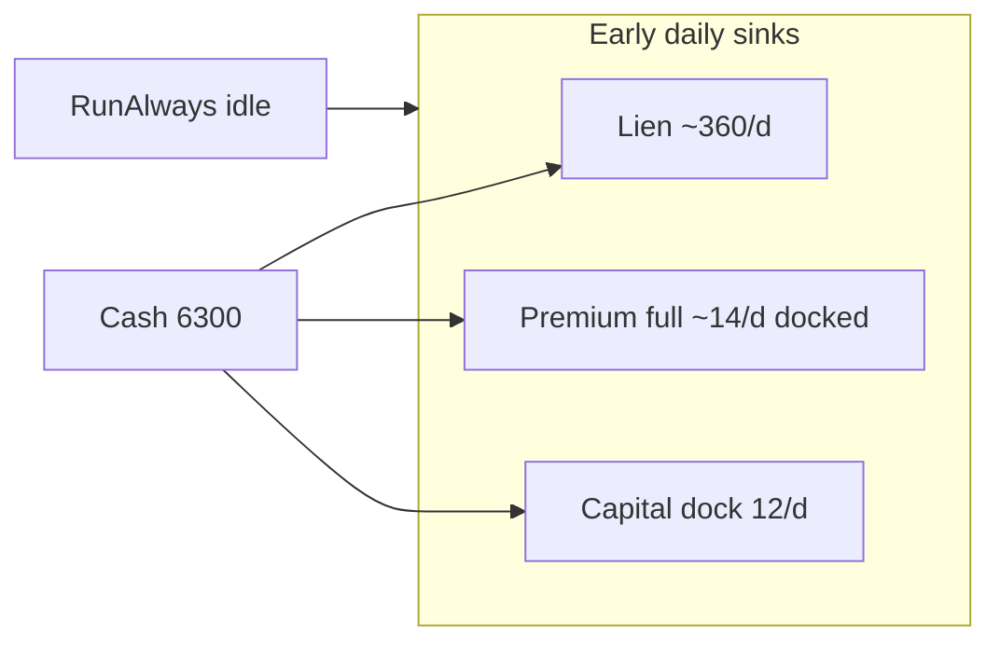

# Early solvency + Captain Bridge game UX

## Diagnosis

**Money:** Calypso opens at **6,300** cash (`OpeningFirmCash × 0.35`) with a **4,500** restoration lien serviced at **max(80, 8%/day) ≈ 360/d** in [`LienPulse.cs`](novolis-apps/src/SinsOfACapitalismTycoon/Universe/Commerce/LienPulse.cs). Insurance now accrues **full ~14/d even when docked** ([`InsurancePulse.cs`](novolis-apps/src/SinsOfACapitalismTycoon/Universe/Commerce/InsurancePulse.cs)). Default **`RunAlways`** keeps the calendar moving while “awaiting James,” so idle berths burn ~**386/d** with zero revenue (~16 days to empty).

**UI:** [`MainWindow.cs`](novolis-apps/src/SinsOfACapitalismTycoon/Ui/MainWindow.cs) is imperative C# on **Fluent Dark + Inter**, monospace briefing widgets, identical Fluent buttons, map-as-scatter-plot — Studio/EMR chrome, not a voyage game.

## Economy: early solvency package

All knobs live in campaign code (no GPR/economy package publish required for the main fixes).

1. **Lien soft-start** in [`LienPulse.cs`](novolis-apps/src/SinsOfACapitalismTycoon/Universe/Commerce/LienPulse.cs) + constants in [`CampaignWorld.cs`](novolis-apps/src/SinsOfACapitalismTycoon/Universe/CampaignWorld.cs):
   - Days **1–21**: no lien cash service (principal frozen; still visible on bridge).
   - After grace: service **4%** of principal (floor **40**), not 8%/80.
   - Keep principal at **4,500** so the debt story remains; only the early cash vacuum changes.

2. **Idle standing premium** (keep wage-style accrual model):
   - In [`InsurancePulse.cs`](novolis-apps/src/SinsOfACapitalismTycoon/Universe/Commerce/InsurancePulse.cs), when insured and **not** `IsOperating`, accrue `QuotePremiumDue × IdleStandingFactor` (**0.15**), memo idle standing.
   - Underway / operating: full daily accrual as now.
   - Burned/suspended path unchanged (standing band already exists via quotes).
   - Update bridge copy in [`CaptainBridgeModel`](novolis-apps/src/SinsOfACapitalismTycoon/Ui/CaptainBridgeModel.cs) / coach so “premium X/d” reflects the *effective* accrual rate when docked.

3. **Opening cash:** raise [`PlayerOpeningCashFactor`](novolis-apps/src/SinsOfACapitalismTycoon/Universe/CampaignWorld.cs) **0.35 → 0.50** → **9,000** opening (still lean vs fleet 18k / rivals 12.6k).

4. **Interactive clock default:** Avalonia / human session sessions start on **`HardPause`** so berth decisions don’t auto-burn days. Headless, autopilot, warm/replay, and explicit `RunAlways` benches stay free-running. Touch [`PlayerControlState`](novolis-apps/src/SinsOfACapitalismTycoon/Universe/Player/PlayerControlState.cs) defaults only where interactive launch sets attention ([`MainWindow`](novolis-apps/src/SinsOfACapitalismTycoon/Ui/MainWindow.cs) / campaign boot for Avalonia mode)—do not break CLI throughput tests.

5. **Docs:** one paragraph in [`ship-law-and-transit.md`](novolis-apps/src/SinsOfACapitalismTycoon/docs/ship-law-and-transit.md) for grace + idle standing factor.

**Target feel:** first ~3 weeks are playable (freight + empty steam), not a lien treadmill; insurance still accrues while docked but as standing fee, not full operating tax.

## UI: tramp freighter bridge (not medical instrument)

**Direction (locked):** deep navy / teal atmosphere, **warm copper–amber** accent (keep `#d4a017` family), chart-table energy. Avoid purple SaaS, cream+terracotta, and broadsheet density. Stay **C#-built layout** (no AXAML rewrite); extract tokens and styles.

### Leverage points (highest ROI first)

1. **`CalypsoPalette` + button styles** — new small type in `Ui/` (e.g. `CalypsoTheme.cs`): surfaces, text, accent, danger, success; `Style`s for Primary / Secondary / Danger buttons. Wire Travel / Accept / Depart as primary; Step/Continue secondary; soft-fail actions muted.

2. **Typography** — stop Inter-as-brand. Load one expressive display face for “Calypso” / voyage status (e.g. a distinctive serif or condensed display already redistributable, or ship a single font asset under Sins `Assets/Fonts` if license-clear). Body: readable non-Inter UI face. Keep mono **only** for Raw / debug ledgers.

3. **Voyage as hero panel** — restructure right-rail voyage stack: large phase line (Dock / Underway), cash + life as **metric chips** (reuse [`DualMetricStrip`](novolis-avalonia/src/Novolis.Avalonia.Briefing) patterns with Calypso colors), coach as secondary gold whisper; demote registry/money DataGrids behind a closed “Ship papers” expander/tab.

4. **Boards as contract rows** — replace single-string `ListBox` items with a simple `DataTemplate` / custom row control: origin→dest, margin, distance, at-dock badge. Still bound to `SpotJobs` / charters; no gameplay change.

5. **Tuck clinical chrome** — Attention / Speed / clock into a compact “Ops” expander (default collapsed in Avalonia). Transport row stays visible but visually quieter than Travel/Accept.

6. **Map atmosphere** — in [`StarMapControl`](novolis-avalonia/src/Novolis.Avalonia.StarMap/StarMapControl.cs) *or* a thin Calypso wrapper: vignette / faint grid, slightly warmer edge tint; keep selection/route/ship orange. Prefer Calypso-local wrapper overrides if StarMap is shared elsewhere so other products don’t inherit game chrome.

7. **Feedback** — replace `LightGreen`/`OrangeRed` Studio flashes with palette gold/rust banner strip in bridge feedback path.

Brand-first first viewport: **Calypso** remains the hero word; one voyage status; one primary CTA group; map as the visual plane—not a wall of equal Fluent buttons.

## Cursor hooks (keep agents on-brief)

Add **project** hooks under [`.cursor/hooks.json`](.cursor/hooks.json) + [`.cursor/hooks/`](.cursor/hooks/):

| Hook | Event | Role |
|------|-------|------|
| `calypso-session-brief` | `sessionStart` | Inject solvency+UX brief (lien grace, idle premium, HardPause Avalonia, tramp-bridge palette don’ts) when cwd/workspace touches `SinsOfACapitalismTycoon` / Calypso plans |
| `calypso-ui-guard` | `afterFileEdit` (matcher: `**/SinsOfACapitalismTycoon/Ui/**`) | Prompt reminder: no Inter default, primary CTA hierarchy, no purple/cream clusters, palette only via `CalypsoPalette` |
| `calypso-economy-guard` | `afterFileEdit` (matcher: `**/Commerce/*Pulse*.cs`, `CampaignWorld.cs`) | Remind: don’t reintroduce full docked premium or 8% early lien without grace |

Fail open; command or prompt hooks per existing Cursor hook skill. Scope: novolis project hooks only.

## Verification

- Headless / unit: early 30-day idle dock burn with HardPause ≈ premium standing + dock fee only (no lien during grace); with RunAlways + grace, cash lasts far past day 16.
- Avalonia smoke: new game opens HardPause; Travel enabled to suggested remote on barren berth; voyage panel reads as bridge not EMR.
- `verify-nuget-only` / `verify-project-ref-mode -SkipBuild` unchanged (UI/economy local to apps + optional StarMap tweak).
- Rebuild requires stopping running `SinsOfACapitalismTycoon.exe`.

## Out of scope

- Rewriting SurvivalCaptain AI / soft-fail rules beyond clock default.
- Full AXAML migration or new art pipeline.
- Changing mega/fleet NPC economy balance.
