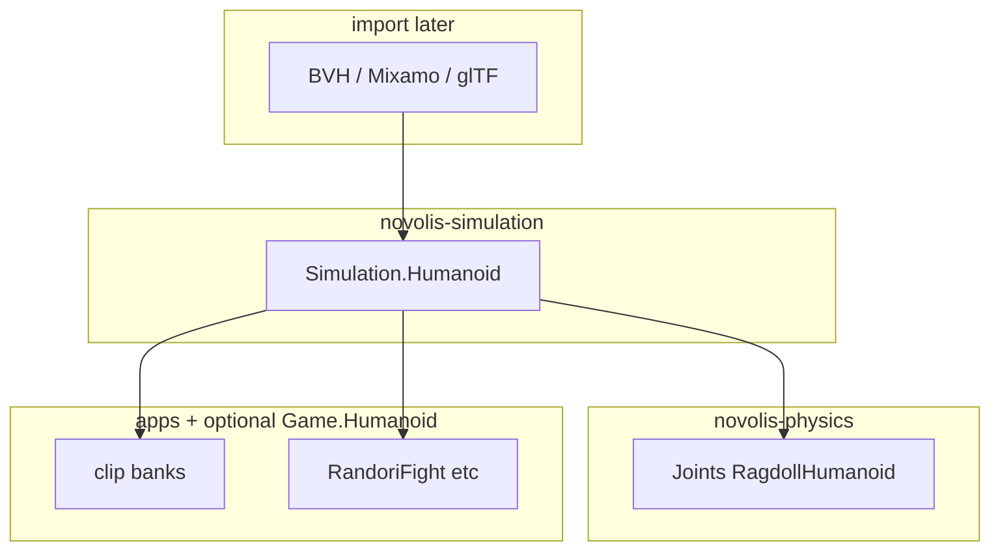

# Standardized human model (C4D-style)

## Problem

Cinema 4D / Unity / Mixamo expect one **shared biped**: named bones, T-pose bind, retargetable animation, mocap in, games out. Today Novolis has:

- `Physics.Joints.RagdollHumanoidPreset` — 11 spheres (not Mixamo)
- RandoriFight dogfood — Mixamo-named IK (app-only)
- `Simulation.View` cameras — no bones
- C4D-lite / SceneLab — hard-surface; animation deferred

## Placement (locked)

| Layer | Package | Role |
|-------|---------|------|
| **Standard** | `Novolis.Simulation.Humanoid` | Bone ids, hierarchy, bind pose, FK/IK, pose frames, animation clips |
| **Physics** | adapter later | Humanoid → ragdoll spheres |
| **Import** | Assets / loaders later | BVH, Mixamo FBX, glTF skins → clips + optional skin |
| **Render** | apps / Rendering | Draw skinned mesh or debug sticks |
| **Gaming** | optional `Novolis.Game.Humanoid` | Clip banks / masks only — **not** the skeleton schema |

Do **not** put the canonical skeleton in `novolis-gaming`, Avalonia.3D, or CAD.

## Bone standard (v1)

Align with **Unity Humanoid / Mixamo** naming (retarget + mocap friendly):

`Hips → Spine → Spine1 → Spine2 → Neck → Head`  
`Hips → LeftUpLeg → LeftLeg → LeftFoot → LeftToeBase` (and Right*)  
`Spine2 → LeftShoulder → LeftArm → LeftForeArm → LeftHand` (and Right*)

- Units: meters, ~1.8 m T-pose facing **+Z**, up **+Y** (BCL `Vector3` / `Quaternion`)
- Minimum required bones for a valid avatar ≈ Unity’s 15+ core set; toes/clavicles included
- Fingers / face / props: later optional bones (not in v1 bind)

## v1 API surface

- `HumanoidBone` enum + `HumanoidHierarchy.Parent`
- `HumanoidBindPose.CreateDefaultTPose(heightMeters)`
- `HumanoidPose` — root translation + local rotations
- `HumanoidPoseSolver.SolveWorld` — FK
- `TwoBoneIk.Solve` — limb IK
- `HumanoidAnimationClip` + sample at time
- `HumanoidBoneNames` — Mixamo/Unity alias lookup

## Explicit non-goals (v1)

- Mesh skinning / GPU draw
- BVH/FBX parsers
- Finger / facial rigs
- Cinema 4D file import
- Putting cameras or voxels in this package

## Follow-ons

1. Ragdoll bridge (11-sphere map)
2. Mocap/retarget importers
3. Skinned mesh
4. Lift RandoriFight onto the package
5. Optional `Novolis.Game.Humanoid` banks

