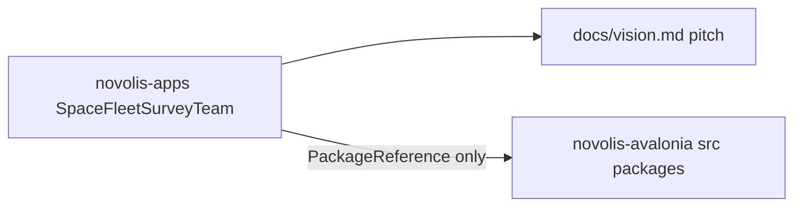

# Space Fleet: Survey Team — app home + vision

## Placement (locked)



| Layer | Location |
|-------|----------|
| Game (this pass) | [`d:\novolis\novolis-apps\src\SpaceFleetSurveyTeam\`](d:\novolis\novolis-apps\src\SpaceFleetSurveyTeam\) |
| Design pitch (your text) | `…/docs/vision.md` (same role as [Sins `docs/vision.md`](d:\novolis\novolis-apps\src\SinsOfACapitalismTycoon\docs\vision.md)) |
| Packable instrument gizmos / sensor facades | Platform `src/` — primarily [`d:\novolis\novolis-avalonia\src\`](d:\novolis\novolis-avalonia\src\) (extend [`Novolis.Avalonia.Gaming`](d:\novolis\novolis-avalonia\src\Novolis.Avalonia.Gaming) and/or add `Novolis.Avalonia.Instruments`; on-device sensors beside [`Novolis.Avalonia.Mobile`](d:\novolis\novolis-avalonia\src\Novolis.Avalonia.Mobile) / `.Android` / `.Desktop`). **Not** `Novolis.IO.Mobile.Android` (host ADB). |

`novolis-apps` stays NuGet-only: no shared in-repo libraries under the game folder ([`docs/design.md`](d:\novolis\novolis-apps\docs\design.md), governance apps-repos).

## App skeleton (this pass)

Mirror [`BooksMobile`](d:\novolis\novolis-apps\src\BooksMobile\) (mobile-native; local deploy, not Windows installer catalog):

- `SpaceFleetSurveyTeam/` — shared Avalonia UI + survey loop stubs (Survey → Detect → Resolve → Certify as named placeholders only)
- `SpaceFleetSurveyTeam.Desktop/` — Windows head for UI iteration
- `SpaceFleetSurveyTeam.Android/` — `net10.0-android` head (like BooksMobile; not CI-released)

Wire into [`Novolis.Apps.slnx`](d:\novolis\novolis-apps\Novolis.Apps.slnx) under `/src/SpaceFleetSurveyTeam/` (shared + Desktop; Android comment-out pattern as BooksMobile). Add a catalog row in [`novolis-apps/README.md`](d:\novolis\novolis-apps\README.md) as **local deploy only** (same note as Books Mobile). Do **not** add to `scripts/build-installer.ps1` ValidateSet.

Minimal first UI: one composition field-shell shell (title **Space Fleet: Survey Team**, short tagline from the pitch, primary CTA toward starting a survey). No Pokémon Go clutter; no purple SaaS look. Sensor panes are labeled stubs until platform packages exist.

## Docs to add under the game

1. **`docs/vision.md`** — paste your provided pitch essentially as-is (title, terrain methods, four sensors, Survey→Detect→Resolve→Certify, anti–PoGo access model, grey→cartography reward, closing quote).
2. **`README.md`** — product name, project table (shared/Desktop/Android), absolute-path run/deploy commands, pointer to `docs/vision.md`, and a short “platform libraries” section listing intended homes for sonic/photonic/magnetic/spatial gizmos (consume via GitHub Packages after publish).
3. Optional thin **`docs/architecture.md`** — one page: app owns region loop + certification state; Avalonia packages own live instrument widgets; no audio/image retention.

## Out of scope this pass

- Implementing real mic/camera/magnetometer/GPS pipelines or publishing new `Novolis.*` packages
- Region map data, certification backend, or Play-store release wiring
- Dogfooding prototypes (production home is novolis-apps)

## Verification

```powershell
dotnet build d:\novolis\novolis-apps\src\SpaceFleetSurveyTeam\SpaceFleetSurveyTeam.Desktop\SpaceFleetSurveyTeam.Desktop.csproj
dotnet run --project d:\novolis\novolis-apps\src\SpaceFleetSurveyTeam\SpaceFleetSurveyTeam.Desktop
```

