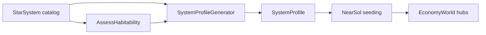

# System generation + potential-gated NearSol

Scope is **canvas Phases 1–2** only (Astro generation library + headless NearSol wiring). Capitalism depth, institutions, Avalonia/Gaming, and in-system travel remain out of scope.

## Locked model

- One system = one Economy hub (travel unit). In-system travel stays collapsed.
- Generator emits **elements** (flavor + drivers) and rolled-up **potentials** (0–1): Mining, Volatiles, Agriculture, Industry.
- Agriculture is hard-gated: if habitability tier is `Excluded` or `Hostile`, Agriculture = 0 (no settlement / food-export story).
- Economy packages get **no** new types this pass; gating is host seed logic only (keeps Astro out of Economy).

## Phase 1 — Astro library (`Novolis.Astro.Assessment`)

Place generation in Assessment (already depends on Catalog; habitability lives there). No new NuGet package.

**New types** (suggested files under [`novolis-astro/src/Novolis.Astro.Assessment/`](novolis-astro/src/Novolis.Astro.Assessment/)):

- `SystemElementKind` — `RockyWorld`, `IceWorld`, `GasGiant`, `AsteroidBelt`, `VolatileReservoir` (enough to drive mining/volatiles/agri).
- `SystemElement` — kind + relative abundance (0–1).
- `SystemEconomicPotential` — Mining, Volatiles, Agriculture, Industry (0–1).
- `SystemProfile` — `SystemId`, effective seed, elements, potential, embedded `HabitabilityRating`.
- `SystemProfileGenerator` — `Generate(StarSystem system, ulong campaignSeed)`.

**Determinism**

- Mix `campaignSeed` with a stable hash of `system.Id.Value` (and optionally spectral/L/Teff) into a small SplitMix64/xorshift PRNG (same spirit as Economy’s [`DeterministicRandom`](novolis-economy/src/Novolis.Economy/DeterministicRandom.cs); keep a private struct in Assessment—do not reference Economy).
- Same `(system, campaignSeed)` always yields identical `SystemProfile`.

**Generation rules (concrete v1)**

1. Assess habitability via existing `system.AssessHabitability()`.
2. Roll element set from spectral class + RNG (e.g. M/K bias toward belts/ice; G/K favor rocky + possible HZ worlds).
3. Derive potentials from elements:
   - Mining ← belts + rocky abundance
   - Volatiles ← ice + gas + volatile reservoirs
   - Industry ← rocky + gas (refined capacity proxy) capped by a mild habitability bonus
   - Agriculture ← rocky-in-HZ proxy × habitability score; **force 0** when tier ≤ Hostile
4. Do not invent travel edges or locations.

**Tests** in [`novolis-astro/tests/Novolis.Astro.Unit/`](novolis-astro/tests/Novolis.Astro.Unit/):

- Determinism: Sol twice with same seed equal; different seeds differ.
- Gate: Excluded/Hostile systems have `Agriculture == 0`.
- NearSol100 smoke: generate all systems under fixed campaign seed; snapshot counts (e.g. how many have Agriculture > 0.3).

**Docs:** extend [`Assessment/README.md`](novolis-astro/src/Novolis.Astro.Assessment/README.md) + one paragraph in [`docs/design.md`](novolis-astro/docs/design.md). Optionally print one profile in [`AstroSmoke`](novolis-dogfooding/apps/astro/AstroSmoke) after publish.

**Publish:** pack/push `Novolis.Astro.Assessment` `2026.1.*` to GitHub Packages (nuget-only; no local feed).

## Phase 2 — NearSol potential-gated seeding

Dogfood only: [`novolis-dogfooding/apps/economy/NearSolPolity/`](novolis-dogfooding/apps/economy/NearSolPolity/).

**Bridge profiles**

- In [`AstroEconomyBridge`](novolis-dogfooding/apps/economy/NearSolPolity/AstroEconomyBridge.cs) or a thin helper: for each catalog system, `SystemProfileGenerator.Generate(system, campaignSeed)` with a fixed campaign seed (e.g. same `1001` as [`PolityWorld.Create`](novolis-dogfooding/apps/economy/NearSolPolity/PolityWorld.cs)).
- Attach `SystemProfile` on `HubBinding` (or parallel dictionary keyed by system id).

**Rewrite [`RoleAssigner`](novolis-dogfooding/apps/economy/NearSolPolity/RoleAssigner.cs)** to prefer potentials over ad-hoc tags/spectral heuristics:

| Role | Gate |
|------|------|
| Capital | Sol (unchanged) |
| Inhabited | Agriculture ≥ threshold (e.g. 0.35), take top N by agri |
| Industrial | among inhabited/high-industry, Industry ≥ threshold, top N |
| Mining | Mining ≥ threshold and not inhabited/capital, top N |
| Transit / Waypoint | remainder (graph degree still OK for transit) |

**Facility / cohort seed** in [`PolityWorld`](novolis-dogfooding/apps/economy/NearSolPolity/PolityWorld.cs) (NearSol has no farm SKU today—map the canvas rule to settlement + extractive sites):

- Mining mfg facility only on `SystemRole.Mining` (already potential-gated via roles).
- Household cohorts only on Capital / Inhabited / Industrial (already agri-gated via roles).
- Do **not** place inhabited/industrial roles on Agriculture = 0 systems.

**Headless acceptance** in [`HeadlessReport`](novolis-dogfooding/apps/economy/NearSolPolity/HeadlessReport.cs) / `Program` headless path:

- Seed invariants: every Mining hub has Mining potential ≥ threshold; every Inhabited/Capital/Industrial hub has Agriculture > 0; count of agri=0 systems with cohorts == 0.
- Short self-running run still completes; report lines for potential summary (mining hubs / agri hubs).

Restore dogfood against **nuget.org + github only** after Assessment publish (`verify-nuget-only` / gpr-health as per workspace policy).

## Explicit non-goals

- New Economy APIs or Civics package
- In-system locations / travel / congestion in Astro
- Avalonia StarMap, EconomyBoard UI, Gaming
- Product-design tradeoffs, deep finance, institutions (canvas Phases 3–4)

## Done when

1. `dotnet test` on Astro unit suite green (determinism + agri gate).
2. Assessment published to GPR; dogfood restores without local feeds.
3. NearSol headless run prints potential-aware role summary and passes seed asserts (barren ≠ settlement; mining only where potential allows).

