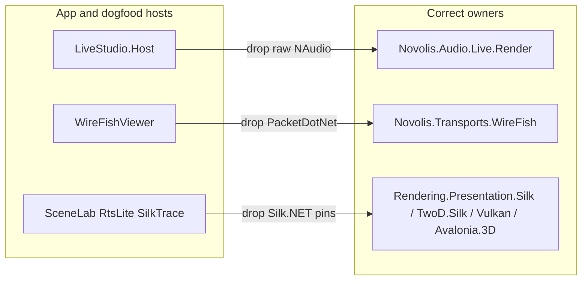

# Third-party package hole remediation

Context: [apps Directory.Packages.props](novolis-apps/Directory.Packages.props) and [dogfooding Directory.Packages.props](novolis-dogfooding/Directory.Packages.props) still pin raw third-party packages that either already have Novolis owners or are dead central versions.

**In scope:** real holes + orphan pin cleanup.  
**Out of scope:** wrapping Avalonia / `Microsoft.Extensions.Hosting` / Spectre / TUnit / MCP / Hunspell (expected host deps). Soft MessagePack/QuestPDF pins left unless they become unused after orphan cleanup.



---

## Phase 1 — Orphan / dead central pins

**apps** ([Directory.Packages.props](novolis-apps/Directory.Packages.props)):
- Remove unused `PackageVersion` entries with no csproj `PackageReference`: `Markdig`, `Avalonia.HtmlRenderer`, `Microsoft.CodeAnalysis.CSharp.Scripting`, `SixLabors.ImageSharp`.
- Remove unused refs: `YamlDotNet` from BooksWriterStudio + props; `Microsoft.Extensions.FileProviders.Physical` from Sins + props (no usings).

**dogfood** ([Directory.Packages.props](novolis-dogfooding/Directory.Packages.props)):
- Remove `Hex1b` (props-only, no csproj).

Keep `QuestPDF` on BooksWriterStudio (license bootstrap in `Program.cs`). Keep MessagePack where Session/Agent consumers still need attribute visibility.

---

## Phase 2 — NAudio hole (LiveStudio.Host)

[`Novolis.Audio.Live.Render`](novolis-audio/src/Novolis.Audio.Live.Render/) already owns `OscillatorLiveAudioEngine` / `LiveMixSampleProvider` (NAudio internal).

- Delete duplicate host copies under [LiveStudio/host/Render/](novolis-apps/src/LiveStudio/host/Render/) that reimplement the same engines.
- Retarget LiveStudio.Host to `PackageReference` `Novolis.Audio.Live.Render` (and Live + Visuals as needed).
- Remove `NAudio` from [LiveStudio.Host.csproj](novolis-apps/src/LiveStudio/host/LiveStudio.Host.csproj) and from apps `Directory.Packages.props` if no remaining consumer.

Done when: Host builds with ProjectRefs; no `using NAudio` under novolis-apps.

---

## Phase 3 — PacketDotNet hole (WireFishViewer)

WireFish already depends on PacketDotNet and exposes `DevicePacketExtensions.GetPacketSummary`. Viewer still parses with raw PacketDotNet in [PacketDetailBuilder](novolis-dogfooding/apps/WireFishViewer/Capture/PacketDetailBuilder.cs), [PacketRowFactory](novolis-dogfooding/apps/WireFishViewer/Capture/PacketRowFactory.cs), formatters.

- Lift detail/summary builders into `Novolis.Transports.WireFish` as public API returning plain strings / simple DTOs (no PacketDotNet in public signatures). Reuse existing `DevicePacket` where possible.
- Retarget WireFishViewer (+ Tests) to those APIs; drop `PacketDotNet` PackageReferences from viewer/tests.
- Remove `PacketDotNet` from dogfood `Directory.Packages.props` if nothing else needs it.

Done when: WireFishViewer has zero PacketDotNet refs; transports still owns PacketDotNet privately.

---

## Phase 4 — Silk.NET hole (dogfood labs/games)

Owners already exist:
- [Presentation.Silk](novolis-rendering/src/Novolis.Rendering.Presentation.Silk/) — Input/OpenGL/windowing
- [Backends.TwoD.Silk](novolis-rendering/src/Novolis.Rendering.Backends.TwoD.Silk/) — TwoD + Input
- [Backends.Vulkan](novolis-rendering/src/Novolis.Rendering.Backends.Vulkan/) — Vulkan/Shaderc
- [Avalonia.3D](novolis-avalonia/src/Novolis.Avalonia.3D/) — already PackageReferences `Silk.NET.OpenGL`

Actions:
1. Ensure Avalonia.3D (and any Vulkan viewport path) PackageReferences the Silk packages SceneLab/ViewportBench currently pin (`OpenGL`, `Vulkan`, `Shaderc`, `Shaderc.Native`) so runtime/native assets flow; remove those PackageReferences from [SceneLab.csproj](novolis-dogfooding/apps/avalonia/SceneLab/SceneLab.csproj) and [ViewportBench.csproj](novolis-dogfooding/apps/avalonia/ViewportBench/ViewportBench.csproj) (no `using Silk` in SceneLab today — dead direct pins).
2. For games that `using Silk.NET.Input` ([RtsLiteTwoD](novolis-dogfooding/apps/RtsLiteTwoD/), SilkTraceStudio, TopDownDoom, PlatformerTwoD, SilkTwoDHello): keep Input only where the public Silk host API requires it **or** re-export thin helpers from `Presentation.Silk` / `TwoD.Silk` so apps PackageReference Novolis packages only. Concrete default: add/keep public window+input entry points on Presentation.Silk / TwoD.Silk; change dogfood to PackageReference those packages and delete direct `Silk.NET.*` PackageReferences from dogfood props when unused.
3. Drop unused `Silk.NET.*` versions from dogfood `Directory.Packages.props` after consumers are clean.

Done when: dogfood `Directory.Packages.props` has no `Silk.NET.*`; labs/games build via Novolis Rendering/Avalonia packages only.

---

## Phase 5 — Verify

```powershell
pwsh -File novolis-governance/scripts/verify-nuget-only.ps1
pwsh -File novolis-governance/scripts/verify-project-ref-mode.ps1 -SkipBuild
```

Build with `-p:NovolisUseProjectReferences=true`: LiveStudio.Host, WireFishViewer, SceneLab, RtsLiteTwoD, Avalonia.3D, Live.Render, WireFish.

Publish affected packages (audio Live.Render, transports WireFish, rendering/Avalonia as touched) to GPR on merge before package-only consumers restore new APIs.

---

## Explicit non-goals

- Do not invent `Novolis.Cli` for Spectre or `Novolis.Hosting` for MEF Hosting.
- Do not strip Avalonia.* from app props (shell requirement).
- Do not move Astro/economy glue (already reverted).

