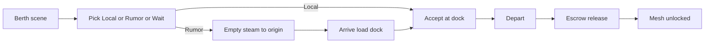

# Tramp berth fantasy (fun loop)

## North star

At a dock the player should only feel: **pick a bet → commit hull → leave → get paid (or hurt)**. Simulation fidelity stays under the hood; the face becomes captain’s wagers.

Playtest metric (30 min): high **commits** (accept / steam-on-rumor / depart), near-zero **stares** at empty/incomprehensible UI, at least one retellable beat.

## Locked design choices

- **One early board**: Dock-only until first Calypso escrow `release`. No Mesh/Dock combo until then.
- **Never-empty berth**: always show 1–3 `BerthOffer` rows (Local / Rumor / Wait)—never a blank ListBox as the main state.
- **Contract implies travel**: remote/rumor primary CTA is steam-to-origin (already in UI/UI service); demote free-floating Travel for board rows.
- **Gut bands**: Fat / Fair / Thin from margin; Pay/Lift/Net one line under the band, not the headline.
- **Phase 1 only**: rivalry/gossip theater later; this plan does not add rival AI.

## Existing leverage (do not rebuild)

- Remote Accept → Travel: [`MainWindow.AcceptSelectedSpot`](novolis-apps/src/SinsOfACapitalismTycoon/Ui/MainWindow.cs), [`CaptainBridgeService.ExecAcceptSpot`](novolis-apps/src/SinsOfACapitalismTycoon/Universe/CaptainBridgeService.cs)
- Live remotes: [`CaptainJobBoard.ListLiveFreight`](novolis-apps/src/SinsOfACapitalismTycoon/Universe/Player/CaptainJobBoard.cs)
- Barren INTEL fill: [`CaptainBridgeModel.From`](novolis-apps/src/SinsOfACapitalismTycoon/Ui/CaptainBridgeModel.cs) (~114–117)
- Payday signal: escrow milestone `release` in [`EscrowPulse`](novolis-apps/src/SinsOfACapitalismTycoon/Universe/Commerce/EscrowPulse.cs) + [`MilestoneLog`](novolis-apps/src/SinsOfACapitalismTycoon/Universe/Drama/MilestoneLog.cs)
- Coach NEXT lines: [`CaptainCoach`](novolis-apps/src/SinsOfACapitalismTycoon/Universe/Player/CaptainCoach.cs)
- Tutorial beats: [`PlayerTutorialHost`](novolis-apps/src/SinsOfACapitalismTycoon/Universe/Player/PlayerTutorialHost.cs)

## Implementation

### 1. Unlock flag: Mesh after first payday

Add `MeshBoardUnlocked` on [`PlayerControlState`](novolis-apps/src/SinsOfACapitalismTycoon/Universe/Player/PlayerControlState.cs) (persist on save record).

Set true when Calypso gets first escrow **release** (hook beside existing milestone in `EscrowPulse`, or one-shot in `PlayerTutorialHost` / bridge capture when `Milestones` already has `Kind=="escrow"` + Detail starts with `release` for load games).

Until unlocked:
- Force `DockBoardOnly = true`
- Hide `_boardScope` ComboBox in [`MainWindow`](novolis-apps/src/SinsOfACapitalismTycoon/Ui/MainWindow.cs)
- Coach/feed may still mention mesh inbox counts lightly; no second job list

After unlock: show Mesh/Dock combo; keep Mesh-empty honest (no silent live fill)—already fixed.

### 2. `BerthOffer` projection (never empty)

New small type (in `CaptainJobBoard` or bridge model):

- `Kind`: `Local` | `Rumor` | `Wait`
- `Title`, `Band` (`Fat`/`Fair`/`Thin`/`None`), `Hook` (one short risk line), `Spot?`, `WaitDaysHint?`
- Band thresholds from `Margin` (tune in `CampaignWorld`): e.g. Thin &lt; 8, Fair 8–20, Fat &gt; 20

Build in `CaptainBridgeModel.From`:

1. Up to 2 **Local** from dock `ListSpot` / live at-origin (best margins)
2. If &lt; 2 locals, fill with **Rumor** from `ListLiveFreight` remotes (best margin / suggested travel)—replace today’s dump of 16 INTEL rows
3. If still empty, one **Wait** offer: “Hold berth · next board pulse ~Nd” (use coach/survival hint or fixed 1–2d)

`SpotJobs` can remain for Accept indexing (offers that wrap a `SpotCandidate`), or map offer index → spot; Keep Accept path working for Local + Rumor.

UI list: render offers as contract rows — **Band · Title · Hook**; subtitle Pay/Lift/Net or “Steam → {Origin}”. Wait row selects Wait button / disables Accept.

### 3. One primary berth verb

In Avalonia berth chrome:

- Primary CTA label by selection: **Accept at dock** (Local) / **Steam for this haul** (Rumor) / **Wait** (Wait)
- Keep Depart as second primary when `ManifestUsed > 0`
- Soften or tuck standalone Travel when a Rumor is selected (map click travel stays)
- Flash/coach: one NEXT line that matches the selected offer (reuse `CaptainCoach`)

No change required inside `TryAcceptSpot` (still at-origin only); travel stays in UI/bridge-service layer.

### 4. Early bridge: voyage over ops

Until `MeshBoardUnlocked` (same gate as Mesh):

- Collapse/hide Ops + Registry expanders by default (or omit from first viewport)
- Voyage hero shows **lien grace countdown** when `day <= LienServiceGraceDays`: e.g. `Grace 12d · then lien bites` from [`CampaignWorld.LienServiceGraceDays`](novolis-apps/src/SinsOfACapitalismTycoon/Universe/CampaignWorld.cs)
- Idle premium already shown; keep as quiet chip, not a lecture

### 5. Tutorial + coach copy

Extend [`PlayerTutorialHost`](novolis-apps/src/SinsOfACapitalismTycoon/Universe/Player/PlayerTutorialHost.cs):

- Beat on first Local accept / first Depart / first escrow release (“payday — Mesh digests unlocked”)
- Align day 2–3 charter suggestion with BerthOffer Local preference

Tune [`CaptainCoach`](novolis-apps/src/SinsOfACapitalismTycoon/Universe/Player/CaptainCoach.cs) priority to speak in offer language: “NEXT: Fat local ore” / “NEXT: Steam empty → EZ (Fair rumor)” / “NEXT: Depart staged hold”.

### 6. Tests + smoke

- Unit: BerthOffer builder — local present; barren dock yields rumors not empty; total empty yields Wait; MeshUnlocked false until release milestone
- Existing accept/travel bridge-service behavior unchanged for AtOrigin vs remote
- Avalonia: rebuild with `-p:NovolisUseProjectReferences=true`; kill exe if locked
- Policy: `verify-nuget-only` / project-ref as usual (no package surface change expected)

## Out of scope (later)

- Rival snipes / dockmaster gossip as mesh face
- Full voyage theater UI while underway
- Economy retune beyond band thresholds / presentation
- Rewriting CLI board commands (keep working; Avalonia is the fantasy surface)

## Key files

- [`PlayerControlState.cs`](novolis-apps/src/SinsOfACapitalismTycoon/Universe/Player/PlayerControlState.cs) + save record
- [`CaptainBridgeModel.cs`](novolis-apps/src/SinsOfACapitalismTycoon/Ui/CaptainBridgeModel.cs)
- [`MainWindow.cs`](novolis-apps/src/SinsOfACapitalismTycoon/Ui/MainWindow.cs)
- [`CaptainCoach.cs`](novolis-apps/src/SinsOfACapitalismTycoon/Universe/Player/CaptainCoach.cs)
- [`PlayerTutorialHost.cs`](novolis-apps/src/SinsOfACapitalismTycoon/Universe/Player/PlayerTutorialHost.cs)
- [`EscrowPulse.cs`](novolis-apps/src/SinsOfACapitalismTycoon/Universe/Commerce/EscrowPulse.cs) or milestone hook for unlock
- [`CampaignWorld.cs`](novolis-apps/src/SinsOfACapitalismTycoon/Universe/CampaignWorld.cs) band/grace constants

