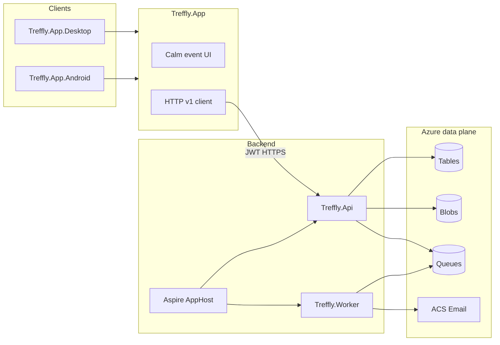

# Treffly greenfield (API + Avalonia mobile)

## Locked decisions

| Topic | Choice |
|-------|--------|
| Repo | **New private** GitHub repo `frankhaugen/treffly-app` (checkout at `d:\novolis\treffly-app`). Leave existing [`frankhaugen/treffly`](https://github.com/frankhaugen/treffly) untouched as Blazor reference. |
| Code reuse | **Docs/product only** — copy/adapt `docs/product/vision-and-scope.md` + `docs/branding/design-guidelines.md` (+ glossary as needed). **No** copy of `Treffly.Application` / Blazor / Aspire code. |
| Backend | **API-first** ASP.NET Core + Aspire AppHost; Azure **Table / Blob / Queue** (same cheap posture as vision); email-first notifications. No SQL. |
| Web UI | **Not primary.** Optional thin public RSVP landing later; organizers and invitees use Avalonia clients. |
| Mobile stack | **Avalonia** shared + `.Desktop` + `.Android` via **`Novolis.Avalonia.Mobile*`** (BooksMobile pattern). **Do not** create `Novolis.Maui*`. |
| iOS | **Out of MVP** until `Novolis.Avalonia.Mobile.iOS` exists. |
| Client deps | Novolis packages (`2026.1.*` from GPR) + Avalonia third-party only; NuGet-only policy (no local feeds). |
| Auth | Email/password MVP → JWT access + refresh; store tokens with `ISecureTokenStore`. Invite deep links for RSVP without full account optional in phase 2. |

## Why not MAUI

Platform already ships Avalonia mobile shell (`Novolis.Avalonia.Mobile` / `.Desktop` / `.Android`) and BooksMobile. There is **no** `Novolis.Maui*` product line (only a voice TTS adapter). Building Treffly on Avalonia keeps one Novolis mobile lane.

## Target architecture



## Monorepo layout

```
treffly-app/
  README.md, AGENTS.md, nuget.config, Directory.Build.props, Directory.Packages.props
  docs/                 # vision, branding, api contracts, security (seeded from old treffly docs)
  aspire/Treffly.AppHost/
  aspire/Treffly.ServiceDefaults/
  src/Treffly.Domain/           # entities + rules (User, Contact, Circle, Place, Treff, Invite)
  src/Treffly.Application/      # use cases + authz + table repos (greenfield rewrite)
  src/Treffly.Api/              # /v1 REST, OpenAPI, JWT bearer, ProblemDetails
  src/Treffly.Worker/           # queue: invite email, reminders
  clients/Treffly.App/          # shared Avalonia UI + ApiClient
  clients/Treffly.App.Desktop/
  clients/Treffly.App.Android/
  tests/                        # TUnit unit + Aspire smoke; optional Playwright later
  scripts/run-desktop.ps1, deploy-android.ps1
```

## Product MVP (from vision — keep non-goals)

**In:** auth; contacts; circles; places; create/edit/duplicate treff; invite expand+dedupe; RSVP Going/Maybe/Declined; treff hub; queued email reminders; discussion text thread (priority 2 after hub works).

**Out of MVP:** public discovery, feeds, friend graph, DMs, tickets/payments, communities-as-product, iOS.

## Backend design (great API, not Blazor host)

1. **Contracts first** — OpenAPI under `docs/api/` rewritten as the live contract for `/v1/...` (auth, contacts, circles, places, events, rsvp, discussion, notifications). Problem Details + cursor pagination.
2. **Authz in application layer** — every table access goes through services (same rule as old [table-storage-security.md](_scratch/treffly/docs/security/table-storage-security.md)): storage has no RLS.
3. **Partitioning** — design Table partition keys for organizer-scoped lists (contacts/circles/places) and treff-scoped invites; document in `docs/data/`.
4. **Aspire** — Azurite for local tables/blobs/queues; AppHost is source of truth for Azure export later (managed identity / Key Vault), same air-gapped spirit as old AGENTS.md.
5. **Worker** — email-only channel initially; idempotent reminder keys.

## Avalonia clients (Novolis-only mobile lane)

Mirror [BooksMobile](novolis-apps/src/BooksMobile/README.md):

| Piece | Approach |
|-------|----------|
| Shell | `Novolis.Avalonia.Mobile` + `.Desktop` / `.Android` for tokens, paths, browser |
| UI | Code-built Avalonia screens; brand from design-guidelines (calm, calendar-first, no feed chrome) |
| Dev loop | Desktop against local Aspire API |
| Android | `net10.0-android` + local `deploy-android.ps1` (adb); no CI APK release yet |
| Dogfood | Optional later thin entry under dogfooding; product lives in private repo |

Screens (MVP): Sign in → Home (organizing / invited) → Contacts / Circles / Places → Create Treff wizard → Treff hub (details, RSVP summary, discussion) → RSVP action.

## Repo / workspace bootstrap (execution order)

1. `gh repo create frankhaugen/treffly-app --private` + clone to `d:\novolis\treffly-app`.
2. Seed solution, CPM, nuget.config (nuget.org + GitHub Packages), AGENTS.md.
3. Copy/adapt product + branding docs; mark architecture docs as greenfield API+Avalonia (not Blazor).
4. Aspire + Api + Domain/Application skeleton with health endpoints.
5. Implement MVP domain + `/v1` resources with TUnit tests (in-memory fakes first, then Azurite).
6. Scaffold `Treffly.App` Desktop talking to API; then Android head + deploy script.
7. Worker email path for invites/reminders.

## Explicit non-goals for this plan

- Migrating or wrapping the existing Blazor `Treffly.Web` code.
- Creating `Novolis.Maui*` packages or a MAUI host.
- Shipping iOS.
- Putting Treffly inside `novolis-apps` public release catalog.
- FriendLab / interest-matching product surface.

