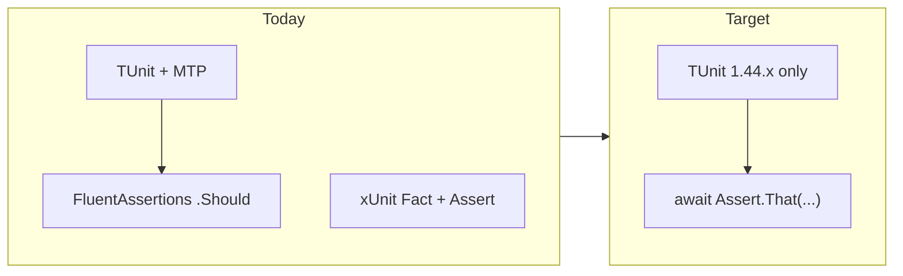

# TUnit-only test migration (novolis-*)

## Current state

Governance already requires TUnit exclusively ([naming.md](d:\novolis\novolis-governance\docs\naming.md)), but many repos still ship **FluentAssertions** alongside TUnit, and two repos still use **xUnit**.



| Category | Repos / projects | Action |
|----------|------------------|--------|
| xUnit only | [novolis-install](d:\novolis\novolis-install), [novolis-smoketest](d:\novolis\novolis-smoketest) (3 test files) | Framework + assertion rewrite |
| TUnit + FluentAssertions | ~14 repos, ~35 test `.cs` files, template content, [novolis-dogfooding](d:\novolis\novolis-dogfooding) `WireFishViewer.Tests` | Remove package; rewrite assertions |
| TUnit native already | [novolis-physics](d:\novolis\novolis-physics), [novolis-raylib](d:\novolis\novolis-raylib), transports Http/Tcp, [novolis-machinelearning](d:\novolis\novolis-machinelearning) | Version pin + `global.json` only |
| Package pins only | [novolis-template-dotnet](d:\novolis\novolis-template-dotnet) (`xunit` in [Directory.Packages.props](d:\novolis\novolis-template-dotnet\Directory.Packages.props), no test projects) | Delete unused versions |
| Out of scope | `bootstrap/scratch/**` | Per your choice — leave unchanged |

**Reference pattern** (already in-repo): [ServiceCollectionExtensionsTests.cs](d:\novolis\novolis-transports\tests\Novolis.Transports.Http.Tests\ServiceCollectionExtensionsTests.cs) and [RoomMeshBuilderTests.cs](d:\novolis\novolis-physics\tests\Novolis.Physics.Unit\RoomMeshBuilderTests.cs).

**Anti-pattern to eliminate**: [AssertShim.cs](d:\novolis\novolis-markup\tests\Novolis.Markup.Markdown.Tests\AssertShim.cs) wraps FluentAssertions behind `Assert.Equal` — delete shim and call TUnit directly.

---

## Target conventions (all novolis-* test projects)

### Packages (`Directory.Packages.props` + `*.Tests.csproj`)

- **Keep**: `TUnit` at **1.44.39** (current high-water mark in [novolis-raylib](d:\novolis\novolis-raylib\Directory.Packages.props) / [novolis-physics](d:\novolis\novolis-physics\Directory.Packages.props)).
- **Remove**: `FluentAssertions`, `xunit`, `xunit.runner.visualstudio`, `Microsoft.NET.Test.Sdk`, `coverlet.*`.
- **ML repos**: bump `TUnit` / `TUnit.Core` from 1.41.0 → 1.44.39 in [novolis-machinelearning/Directory.Packages.props](d:\novolis\novolis-machinelearning\Directory.Packages.props).

### Runner (`global.json`)

Add MTP runner everywhere tests run (pattern from [novolis-raylib/global.json](d:\novolis\novolis-raylib\global.json)):

```json
"test": { "runner": "Microsoft.Testing.Platform" }
```

Repos on 0.25.21 today (e.g. [novolis-math/global.json](d:\novolis\novolis-math\global.json)) only have SDK pin — add `test.runner` during version bump.

### Test project shape

- `IsTestProject` = true; **only** `<PackageReference Include="TUnit" />` (no Test.Sdk).
- ML-style executables: keep `<OutputType>Exe</OutputType>` where already present; do not add Test.Sdk.
- Template content under [novolis-templates/src/...](d:\novolis\novolis-templates\src\Novolis.Templates\content): remove pinned `FluentAssertions` / `Microsoft.NET.Test.Sdk` from [Microservice](d:\novolis\novolis-templates\src\Novolis.Templates\content\Novolis.Templates.Microservice\Novolis.Templates.Microservice.Tests\Novolis.Templates.Microservice.Tests.csproj) and [NoXaml](d:\novolis\novolis-templates\src\Novolis.Templates\content\Novolis.Templates.NoXaml.Avalonia.Solution\Novolis.Templates.NoXaml.Avalonia.Solution.Tests\Novolis.Templates.NoXaml.Avalonia.Solution.Tests.csproj); align TUnit to **1.44.39** (central or explicit, matching repo policy).

### Code style

| From (FluentAssertions / xUnit) | To (TUnit) |
|----------------------------------|------------|
| `[Fact]` / `[Theory]` | `[Test]` / `[Arguments(...)]` (already used in most repos) |
| `Assert.Equal(a, b)` | `await Assert.That(b).IsEqualTo(a)` |
| `Assert.Contains(sub, str)` | `await Assert.That(str).Contains(sub)` |
| `x.Should().Be(y)` | `await Assert.That(x).IsEqualTo(y)` |
| `x.Should().BeTrue()` / `BeFalse()` | `await Assert.That(x).IsTrue()` / `.IsFalse()` |
| `x.Should().BeApproximately(y, ε)` | `await Assert.That(x).IsEqualTo(y).Within(ε)` (verify against 1.44 API in first migrated file) |
| `x.Should().NotBeNull()` | `await Assert.That(x).IsNotNull()` |
| `coll.Should().Contain(pred)` | `await Assert.That(coll.Any(pred)).IsTrue()` or `await Assert.That(coll).Contains(...)` |
| `action.Should().Throw<T>()` | `await Assert.That(action).Throws<T>()` |
| Sync test method | `public async Task` when body uses `await Assert.That` |

- Remove `using FluentAssertions;` and `global using FluentAssertions;` ([markup GlobalUsings](d:\novolis\novolis-markup\tests\Novolis.Markup.Mermaid.Tests\GlobalUsings.cs)).
- Prefer `using TUnit.Core;` where `Assert` / `TestContext` are used (match physics/transports).
- **Parameterized tests**: convert `HashPassword`-style sync `[Test]` + `[Arguments]` to `async Task` when assertions become awaited ([PasswordHasherTests.cs](d:\novolis\novolis-security\tests\Novolis.Security.Tests\PasswordHasherTests.cs)).

---

## Execution phases

### Phase 0 — Baseline and governance

1. Record current `dotnet test` status per repo (matrix in PR description).
2. Update [naming.md](d:\novolis\novolis-governance\docs\naming.md): explicit ban on **FluentAssertions** and any non-TUnit test SDK (mirror xUnit rule).
3. Update extraction briefs that still say “TUnit + FluentAssertions” (e.g. [wave-10-markup.md](d:\novolis\novolis-governance\docs\extraction-briefs\wave-10-markup.md), [wave-7-gameengine-math.md](d:\novolis\novolis-governance\docs\extraction-briefs\wave-7-gameengine-math.md)) → “TUnit assertions only”.

### Phase 1 — Platform pins (mechanical, all repos)

For each `novolis-*` repo with tests or central test packages:

1. Set `TUnit` (and `TUnit.Core` where used) → **1.44.39** in `Directory.Packages.props`.
2. Remove `FluentAssertions`, `xunit`, `xunit.runner.visualstudio`, `Microsoft.NET.Test.Sdk` from central props.
3. Add `"test": { "runner": "Microsoft.Testing.Platform" }` to `global.json` if missing.
4. Strip matching `PackageReference` lines from every `*Tests*.csproj` / `*.Unit.csproj`.

**Repos (central props touch):** avalonia, analyzers, aspire, codegen, install, machinelearning, markup, math, messaging, security, storage, templates, template-dotnet, smoketest, transports, wirefish, dogfooding, physics, raylib, testing (TUnit version only).

### Phase 2 — xUnit stragglers (small, high priority)

| Repo | Files | Changes |
|------|-------|---------|
| [novolis-install](d:\novolis\novolis-install) | `NovolisPathsTests.cs`, `DoctorCommandTests.cs` | `[Fact]` → `[Test]`; xUnit `Assert.*` → `await Assert.That`; add TUnit package; remove xUnit/Test.Sdk |
| [novolis-smoketest](d:\novolis\novolis-smoketest) | `SmokeTests.cs` | Same |
| [novolis-template-dotnet](d:\novolis\novolis-template-dotnet) | props only | Remove unused xUnit pins |

### Phase 3 — FluentAssertions → TUnit assertions (by repo)

Work repo-by-repo; run `dotnet test` on that repo’s solution before moving on.

**Wave A — smallest / few files**

- [novolis-avalonia](d:\novolis\novolis-avalonia) (1 file)
- [novolis-aspire](d:\novolis\novolis-aspire)
- [novolis-analyzers](d:\novolis\novolis-analyzers) (2 files; diagnostic `Should().Contain` → `Assert.That(diagnostics.Any(...))`)
- [novolis-wirefish](d:\novolis\novolis-wirefish)
- [novolis-codegen](d:\novolis\novolis-codegen) (3 projects)
- [novolis-dogfooding](d:\novolis\novolis-dogfooding) `WireFishViewer.Tests`

**Wave B — math / security / storage**

- [novolis-math](d:\novolis\novolis-math) (~10 files; heavy `BeApproximately`)
- [novolis-security](d:\novolis\novolis-security)
- [novolis-storage](d:\novolis\novolis-storage)

**Wave C — messaging / markup / transports**

- [novolis-messaging](d:\novolis\novolis-messaging)
- [novolis-markup](d:\novolis\novolis-markup): delete both `AssertShim.cs`, remove `global using FluentAssertions`, rewrite tests to `await Assert.That`
- [novolis-transports](d:\novolis\novolis-transports): only **WireFish** tests (Http/Tcp already native)

**Wave D — templates**

- [novolis-templates](d:\novolis\novolis-templates): smoke tests + all three template test projects under `content/`; re-run template pack smoke after content changes

### Phase 4 — Version alignment (already-native repos)

- [novolis-machinelearning](d:\novolis\novolis-machinelearning): 1.41 → 1.44.39; confirm `dotnet test` / `dotnet run` on test exes per [README](d:\novolis\novolis-machinelearning\README.md)
- [novolis-physics](d:\novolis\novolis-physics), [novolis-raylib](d:\novolis\novolis-raylib): props + `global.json` only (no FA in source)

### Phase 5 — Verification and guardrails

Per repo:

```powershell
dotnet test <Repo>.slnx
```

Repo-wide grep gate (CI or local script):

```powershell
rg -i "FluentAssertions|using Xunit|\[Fact\]|PackageReference.*xunit" --glob "!bootstrap/**" novolis-*
```

Optional: add a lightweight check in [novolis-workflows](d:\novolis\novolis-workflows) reusable workflow (fail PR if forbidden strings appear in `*.csproj` / `Directory.Packages.props`).

---

## Risk notes

| Risk | Mitigation |
|------|------------|
| TUnit **0.25 → 1.44** breaking API | Pilot on [novolis-math](d:\novolis\novolis-math) or [novolis-install](d:\novolis\novolis-install) first; fix compile errors before bulk waves |
| Sync → async test signatures | Batch-convert per file; `[Arguments]` tests become `async Task` |
| Approximate float assertions | Validate `Within(ε)` syntax once in math repo, reuse pattern |
| ML test executables + CI | Re-run existing ML CI after pin bump; no Test.Sdk added |
| Template consumers | Template content is source of truth for new solutions — must ship without FA/xUnit |

---

## Deliverables checklist

- Zero `FluentAssertions` / `xunit` package references in `novolis-*`
- All test code uses `await Assert.That(...)` (no `.Should()`)
- All repos on **TUnit 1.44.39** + MTP `global.json`
- [naming.md](d:\novolis\novolis-governance\docs\naming.md) and affected extraction briefs updated
- `bootstrap/scratch` explicitly untouched

