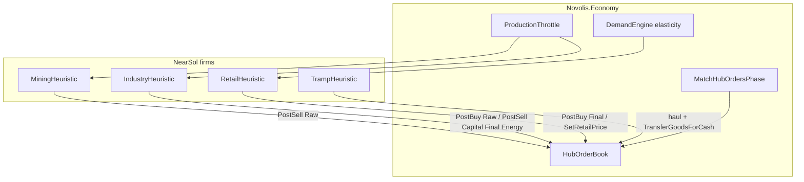

# Tycoon market slice (heuristics + RNG only)

## Locked scope

Ship the **minimum capitalism slice** that fixes the 1000d failure modes (glut, dead tramp, opaque monopoly):

1. Hub **order book** + local match + tramp clearing cross-hub spreads  
2. **Production throttle** from unsold stock  
3. **Elastic retail** demand (price vs reference)  
4. **Four firms** with visible P&L: Mining, Industry, Retail/Station, Carrier (tramp)  
5. **Stock–flow audit** on liquid money (Δ liquid ≈ −imports under closed policy)

**Agent policy:** no planners/ML — only threshold heuristics + `DeterministicRandom` (from `EconomySimulation` seed) for jitter (quote noise, job pick among near-tied margins).

**Out this pass:** bankruptcy/credit, capacity investment UI, labor market, full GE, Astro-in-Economy, Spectre→Avalonia product UI.

## 1. Kernel — hub order book

**Package:** [`Novolis.Economy.Markets`](novolis-economy/src/Novolis.Economy.Markets) + wire through [`EconomyWorld`](novolis-economy/src/Novolis.Economy.Simulation/EconomyWorld.cs) / phases.

- Types: `HubOrderSide { Buy, Sell }`, `HubOrder(Id, FirmId, InventoryLocationId, ProductId, Side, Quantity Remaining, Money LimitPrice, SimulationHour PostedAt)`.
- World: `List<HubOrder> HubOrders` (or dict by location).
- Commands/events in [`CommandsAndEvents.cs`](novolis-economy/src/Novolis.Economy/CommandsAndEvents.cs):
  - `PostHubOrder(...)`, `CancelHubOrder(Id)`
  - `HubOrderPosted`, `HubOrderFilled(partial|full)`, `HubOrderCancelled`
- **Local match** new phase (after ApplyDecisions / before or after Acquire): same `LocationId` + product, buy limit ≥ sell limit, fill FIFO by post time then id; settle with existing inventory move + `PostCashSale`/`PostCashPurchase` (same mechanics as `TransferGoodsForCash`).
- Cross-hub **not** auto-matched in kernel — carriers read the book and haul (game/dogfood).

Unit tests: two firms same hub → fill; crossed prices no fill; partial fill.

## 2. Kernel — production throttle + elastic demand

- **`ProductionThrottle.Rate(baseRate, onHand, target, floorRate=0)`** in Production or Markets: when `onHand ≥ target`, rate → floor; linear taper above ~0.7×target. Pure helper; scenarios call it when emitting `SetProductionPlan`.
- **`DemandEngine`:** optional `priceElasticity` (default `0` = today’s behavior). When &gt; 0, scale category budget (or max buy qty) by `(refPrice/postedPrice)^elasticity` clamped. Reference = posted price at first offer or product’s rolling `MarketBook` last price; keep deterministic order.

Unit tests: overstock → zero/near-zero throttle; higher price → less qty bought when elasticity &gt; 0; elasticity 0 preserves commodity-chain tests.

## 3. Kernel — stock–flow helper

- Small pure helper e.g. `MoneyStock.Liquid(world)` = Σ firm cash + Σ cohort budgets (same as NearSol `CreditCirculation.LiquidStock`).
- Test assertion helper: over a closed-loop run with known imports, `|ΔLiquid + ImportSpend| &lt; ε` (document any intentional sinks). Fix NearSol leaks found while wiring (imports must be the only cash exit under closed policy).

## 4. NearSol — four firms + opening cash

Rewrite seed in [`PolityWorld.cs`](novolis-dogfooding/apps/economy/NearSolPolity/PolityWorld.cs):

| Firm | Role | Facilities / stock | Opening cash (from today’s ~80k liquid) |
|------|------|--------------------|----------------------------------------|
| Mining | Extract Raw (needs Capital) | mine sites | 15 000 |
| Industry | Raw→Capital/Final/Energy | industrial | 15 000 |
| Station | Retail + toll treasury | capital/inhabited retail; `TollBeneficiaryFirmId` | 15 000 + absorb former polity treasury role |
| Carrier | Tramp hull | tramp posts | 15 000 |
| Households | unchanged float | | 20 000 |

Remove monolithic co-op ownership of all sites; map each site’s production/retail facility to the right firm. Keep Astro bridge as-is.

## 5. NearSol — heuristic controllers (RNG jitter only)

Replace / split [`PolityController`](novolis-dogfooding/apps/economy/NearSolPolity/PolityController.cs) + retarget [`TrampFleetAutopilot`](novolis-dogfooding/apps/economy/NearSolPolity/TrampFleetAutopilot.cs):

- **MiningHeuristic:** throttle Raw plan via `ProductionThrottle`; `PostHubOrder` sell Raw when stock above floor; buy Capital when below `MinePartsFloor` (limit = gate±RNG ticks).
- **IndustryHeuristic:** buy Raw / sell Capital+Final+Energy on hub book; throttle each product by local stock; small RNG on limit prices (±few %).
- **StationHeuristic:** buy Final (and light Capital) on book; `SetRetailPrice` via pressure + elasticity-facing asks; no feeder monopoly — internal short hops only if book empty (rare).
- **CarrierHeuristic:** scan book for **sell@A + buy@B** same SKU with delivered edge ≥ `MinMargin` after `HaulCostEstimator`; lift via buy/match at A, `PlanShipment`, sell/match at B; RNG only to break ties among near-equal routes.

Pulse order in [`Program.cs`](novolis-dogfooding/apps/economy/NearSolPolity/Program.cs): Mining → Industry → Station → Carrier → `AdvanceAsync` (book match runs inside kernel phases).

## 6. Dogfood observability (tycoon-readable)

- Dashboard + [`HeadlessReport`](novolis-dogfooding/apps/economy/NearSolPolity/HeadlessReport.cs): per-firm cash, revenue, COGS proxy, open buy/sell depth top hubs, produced vs sold, liquid Δ vs imports, tramp fills/day.
- Acceptance **`--headless 1000d`:**  
  - households not permanently ~0  
  - `|ΔLiquid + imports|` small  
  - B2B/book fills **keep growing** after day 100 (tramp not frozen)  
  - produced/sold ratio not runaway (throttle working)

## 7. Release path

1. Economy unit tests → commit/push → GPR `2026.1.*`  
2. Dogfood restore nuget.org+github only → NearSol retarget → commit/push  
3. Short notes in Economy `docs/design.md` / `release.md` (hub orders, throttle, elasticity)

## Non-goals

ML/utility maximizers, soft loans, multiplayer, Avalonia tycoon shell, firm count &gt; 4 this pass.

