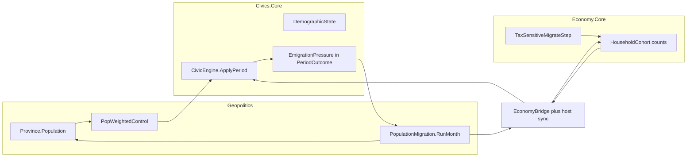

# Vibrant Civics–Economy–Geopolitics modelling

## What exists today

- **Civics**: nation stocks + fiscal intent; tax base = `Gdp × rate × control`; no population ([`CivicEngine.cs`](d:\novolis\novolis-civics\src\Novolis.Civics.Core\CivicEngine.cs), [`SPEC.md`](d:\novolis\novolis-civics\src\Novolis.Civics.Core\SPEC.md)).
- **Economy**: `HouseholdCohort` + `MigrationPreference`, but migrate only when living capacity overflows ([`HouseholdConsumeMigrateStep`](d:\novolis\novolis-economy\src\Novolis.Economy.Core\Steps\PeriodSteps.cs)).
- **Geopolitics**: `Province.Population` is seed-static; trade uses pop for prod/cons; capture flips ownership only ([`Entities.cs`](d:\novolis\novolis-geopolitics\src\Novolis.Geopolitics.Core\Entities.cs), [`TradeClearing`](d:\novolis\novolis-geopolitics\src\Novolis.Geopolitics.Trade\TradeClearing.cs)).

## Layering (non-negotiable)

Keep package boundaries from Civics/Economy/Geo SPECs:

| Owner | Owns | Does not own |
|-------|------|----------------|
| **Civics** | Nation `DemographicState` (population, working-age share, unemployment proxy); emigration *pressure* from tax/HD/war/fatigue; pop-scaled tax capacity | Province geography, force units, cash ledgers |
| **Geopolitics** | Spatial `Province.Population` flows; pop-weighted `ControlRatio`; apply Civics pressure + differentials into net migration | Cash settlement, cohort recipes |
| **Economy** | Intra-/inter-region cohort mobility from tax/wage/living; labor→production | Nation borders (host maps region↔polity) |
| **Hosts / PolityTriad** | Sync geo pop → Economy cohorts → Civics demography; evidence report | — |

## Wave 1 (implement now) — closed mobility loop

### 1. Civics Core — demography + policy smothering

Files: [`NationState.cs`](d:\novolis\novolis-civics\src\Novolis.Civics.Core\NationState.cs), [`CivicEngine.cs`](d:\novolis\novolis-civics\src\Novolis.Civics.Core\CivicEngine.cs), [`Types.cs`](d:\novolis\novolis-civics\src\Novolis.Civics.Core\Types.cs), SPEC/layering.

- Add `DemographicState`: `Population`, `WorkingAgeShare`, `NaturalGrowthRate`, `Unemployment`, `LastNetMigration`.
- Extend `PeriodContext`: `NetMigration`, `UnemploymentObserved` (optional host overrides).
- Extend `PeriodOutcome`: `EmigrationPressure` (0–1), `ImmigrationAttractiveness` (0–1), `LaborForceDemandHint`.
- Settlement changes (documented formulas in SPEC):
  - Tax capacity uses working-age pop when `Population > 0` (fallback to GDP-only for backward compat).
  - High `HouseholdTaxRate` + low HD/transfers → raise `EmigrationPressure` and hurt approval.
  - Net out-migration → legitimacy/approval drag; in-migration → short-run approval strain, longer HD pressure.
  - Light natural growth each period from `NaturalGrowthRate × Population`.
- Expand [`HeuristicFiscalAgent`](d:\novolis\novolis-civics\src\Novolis.Civics.Agents\HeuristicFiscalAgent.cs): ease tax when emigration pressure high / treasury healthy.
- Tests in [`KnownDynamicsScenariosTests.cs`](d:\novolis\novolis-civics\tests\Novolis.Civics.Unit\KnownDynamicsScenariosTests.cs): high-tax emigration pressure; pop-scaled tax; migration legitimacy hit.

### 2. Economy Core — tax-sensitive mobility

Files: [`PeriodSteps.cs`](d:\novolis\novolis-economy\src\Novolis.Economy.Core\Steps\PeriodSteps.cs), SPEC §18/§20, known-dynamics tests.

- Extend migrate logic (same step or adjacent): destinations scored by living slack, `MigrationPreference`, and **after-tax** signal from `StatePolicy.HouseholdTaxRate` (and optional regional tax map later).
- Allow partial cohort splits when count ≥ threshold (keep whole-cohort move for small counts).
- Emit scratch/telemetry: households moved, origin/destination region.
- Tests: high tax + high migration preference → outflow even without living overflow; labor/production falls in origin.

### 3. Geopolitics — spatial population dynamics

New type in Core or small `Novolis.Geopolitics.Population` package (prefer **Core + Diplomacy-adjacent static helper in Simulation** first to avoid package churn; promote package only if surface grows).

- `PopulationMigration.RunMonth(world, telemetry, pressuresByPolity)`:
  - Gravity: neighbors / same-continent; push = tax, war, low HD, Civics `EmigrationPressure`; pull = low tax, high HD, peace, attractiveness.
  - Move fractional population between provinces; clamp non-negative; update owner polity aggregates.
  - Occupation: elevated outflow from occupied home provinces (displacement lite).
- `CivicPipeline`: **pop-weighted** `ControlRatio` = ownedPop / homePop.
- Soft-couple GDP: optional monthly drift of `Polity.Gdp` toward `f(ownedPopulation, wealth)` (small blend so Civics growth still matters).
- Telemetry: `PopulationMigrated`, `RefugeesDisplaced`.
- Known-dynamics tests: high-tax polity loses pop to low-tax neighbor; capture then displacement; control ratio pop-weighted.

### 4. Bridges + Geo CivicEngine

- [`CivicEconomyBridge`](d:\novolis\novolis-civics\src\Novolis.Civics.EconomyBridge\CivicEconomyBridge.cs): helpers to map cohort `HouseholdCount` → nation population hint; feed unemployment from idle labor if available.
- [`Geopolitics.Core.CivicEngine`](d:\novolis\novolis-geopolitics\src\Novolis.Geopolitics.Core\CivicEngine.cs): sync `DemographicState` from Σ owned province population; pass migration context; apply outcome pressures into world for next migration month.
- Month order (Simulation + PolityTriad): **Trade → Civics (pressures) → PopulationMigration → Treaty → Agents** (migration after civic so pressures are fresh; Economy period in triad after geo sync).

### 5. PolityTriad dogfood — make it feel alive

[`apps/civics/PolityTriad`](d:\novolis\novolis-dogfooding\apps\civics\PolityTriad):

- Seed provincial pops + Economy cohorts sized from them; Alpha high-tax / Beta militarized / Gamma open.
- Scripted beat: tax spike → visible emigration α→γ under CM; war → displacement; peace leaves occupied pops.
- Evidence report sections: population arcs, migration milestones, labor/prod vs pop, control pop-weighted, PASS checks for tax→mobility→labor and mobility→legitimacy.
- Keep Spectre `Markup.Escape` on logs.

### 6. Publish / policy

- Bump via normal CI to GitHub Packages `2026.1.*` (no local feeds).
- Update SPECs + [`docs/layering.md`](d:\novolis\novolis-civics\docs\layering.md) in each repo; short `docs/demography-coupling.md` in civics (or geopolitics) describing the closed loop for academic users.

## Wave 2 / 3 (document only in this tranche; implement later)

- **Wave 2**: education/health spend → HD → productivity; protest/unrest stock; refugee corridors; richer multi-objective agents.
- **Wave 3**: age structure / dependency ratios; progressive tax incidence; multi-region fiscal map in Economy; calibration harness against stylized facts.

## Defaults locked

- Wave 1 ships code + tests + PolityTriad; Waves 2–3 are roadmap docs only this pass.
- Population authority for *space* = Geopolitics provinces; *nation stocks* = Civics demography synced from owned pop; *labor* = Economy cohorts synced by host.
- Backward compatible: zero/unset population keeps prior GDP-only tax path.
- NuGet-only; iterate with `-p:NovolisUseProjectReferences=true`.

