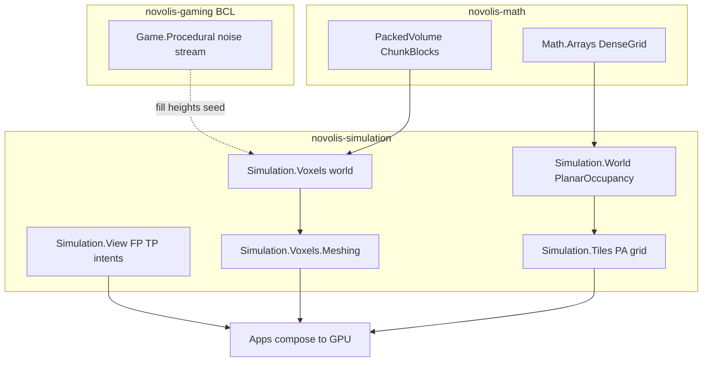

# Character cameras, PA grid, voxel engine (correct layers)

**Placement (locked):** Option 1 — extend [`Novolis.Simulation.View`](novolis-simulation/src/Novolis.Simulation.View/); add **`Novolis.Simulation.Tiles`** and **`Novolis.Simulation.Voxels`** (+ meshing). Do **not** put cameras/grids/voxels in `novolis-gaming` (policy + [`library-boundaries.md`](novolis-governance/docs/library-boundaries.md)). Gaming keeps [`Novolis.Game.Procedural`](novolis-gaming/src/Novolis.Game.Procedural/) as the BCL authoring companion (noise / 2D chunk window).

---

## 1. Character cameras + controllers — `Novolis.Simulation.View`

Extend existing BCL-only package (already has `YawPitchController`, `OrbitCameraRig`, `FreeLookCameraRig`, `TrackingCameraRig`, `IViewController`, `ViewPose`).

**Add:**

| Type | Role |
|------|------|
| `LookIntent` / `MoveIntent` | Host-agnostic floats (yaw/pitch/zoom; wish XZ + jump/sprint) — apps map Raylib/Silk/Avalonia |
| `FirstPersonCameraRig` | `IViewController`: eye height + yaw/pitch → `ViewPose` (build on `YawPitchController`) |
| `ThirdPersonCameraRig` | Follow target, boom distance, pitch clamps, optional `Func<Vector3,Vector3,float>` collision pull-in |
| `CharacterCameraDirector` | Shared look state; switch FP / TP / Orbit (`OrbitCameraRig` existing) |
| `CharacterMotor` (View-local) | Integrate `MoveIntent` on XZ wish + gravity/jump **without** collision; expose desired delta for `PlanarAgent` / apps |

**Explicit non-goals (v1):** head bob, recoil, gamepad HID bindings (stay in apps), Simulation→Raylib wiring.

**Tests:** unit tests in simulation test project for pose math, pitch clamps, director mode switch, motor jump.

**Leverage dogfood later:** patterns from `DoomLite3D/Game/PlayerController.cs` (lift logic, don’t take Raylib deps).

---

## 2. Prison Architect–style grid — `Novolis.Simulation.Tiles`

New packable package under `novolis-simulation/src/Novolis.Simulation.Tiles/`.

**Depends:** `Novolis.Math.Arrays` (`DenseGrid`), reuse [`PlanarOccupancy`](novolis-simulation/src/Novolis.Simulation.World/PlanarOccupancy.cs) via `Novolis.Simulation.World` PackageReference (or duplicate thin walkability queries if World dep is too heavy — prefer World).

**Core types:**

| Type | Role |
|------|------|
| `TileLayer` / `TileMap2D` | Multi-layer cell data (floor / object / zone) over width×depth |
| `WallEdgeMap` | Walls/doors on N/E/S/W **edges** (PA model), not only full-cell solids |
| `RoomFloodFill` | Enclosed region detection from edge walls + openings |
| `GridPathfinder` | A\* on walkability (orthogonal; optional diagonal costs) |
| `BuildBatch` / `DirtyRect` | Place/demolish ops + dirty AABB for remesh/path invalidation |
| `WalkabilityMask` | Bridge to existing occupancy byte grids for `PlanarAgent` |

**v1 non-goals:** full job/AI economy, furniture catalog, UI tools.

**Tests:** flood-fill rooms, A\* around walls, edge door opens path, dirty rect after demolish.

---

## 3. Voxel engine (Minecraft-clone minimum) — `Novolis.Simulation.Voxels` + meshing

### 3a. Storage — prefer `Novolis.Math.Arrays` extension

Add packed volume primitives (do **not** overload nullable `DenseGrid<T>`):

- `ChunkCoord3`, `VoxelChunk` (fixed **16³**, `ushort` block ids, air = 0)
- `PackedColumn` helpers optional later

### 3b. `Novolis.Simulation.Voxels`

| Type | Role |
|------|------|
| `ChunkedVoxelWorld` | Dictionary of chunks; get/set block; neighbor-aware solid query |
| `VoxelStreamer` | Keep Chebyshev radius of chunks around focus (3D; compose with Procedural `InfiniteChunkStream` for XZ focus only if useful) |
| `TerrainFiller` | Fill columns from an `IHeightSampler`-shaped callback `(x,z)→height` + block id (adapter from Procedural `NoiseHeightfield` at app layer) |
| Dig/place API | `TrySetBlock` + mark chunk + neighbors dirty for remesh |

### 3c. `Novolis.Simulation.Voxels.Meshing`

Depends on Voxels + `Novolis.Math.Geometry` (triangle/editable mesh types already used by World.Builders).

| Type | Role |
|------|------|
| `FaceCulledMesher` | Emit quads for exposed faces |
| `GreedyMesher` | Merge coplanar faces (MC-capable mesh density) |
| Output | `TriangleMesh` / existing geometry record — **no** Rendering/Raylib refs |

**v1 non-goals:** skylight/AO, multiplayer sync, entity physics beyond AABB solid tests, biome decoration (Procedural later).

**Tests:** set/get across chunk borders, face cull air vs solid, greedy reduces quad count, streamer load/unload, filler produces walkable surface.

---

## 4. Docs / policy / solution wiring

- Update [`library-boundaries.md`](novolis-governance/docs/library-boundaries.md) checklist: First/ThirdPerson as shipped; add Tiles / Voxels facet rows.
- Update simulation README / View README; gaming policy stays “no Simulation refs” — point authors at View/Tiles/Voxels for these features.
- Add projects to simulation slnx; run [`Generate-Platform-Slnx.ps1`](novolis-governance/build/Generate-Platform-Slnx.ps1).
- Publish order to GPR: **Math.Arrays** (if packed types land there) → **Simulation.View** → **Tiles** / **Voxels** → **Voxels.Meshing** → consumers.

---

## 5. Verification

- `dotnet build` simulation packages + unit tests for View / Tiles / Voxels.
- `verify-nuget-only.ps1` + `verify-project-ref-mode.ps1 -SkipBuild`.
- Optional later (out of this plan’s code scope): dogfood mini samples (PA room builder, MC dig/place) under `novolis-dogfooding` after GPR publish.

