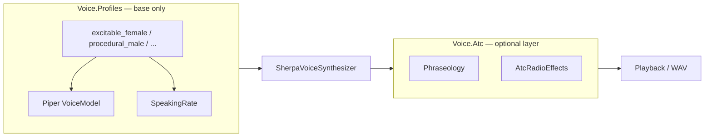

# Neutral voice archetypes + layered delivery

## Design principle

**Base voice profiles** describe *who is speaking* (TTS model + temperament: rate, optional future pitch/noise knobs). They are **domain-neutral** — not “ATC tower” or “pilot.”

**Delivery layers** (applied separately) describe *how it sounds on the wire*: ICAO phraseology, `atc-radio` DSP, future `radio`, `intercom`, etc. Consumers compose layers explicitly.



---

## Current state

- [`VoiceProfile`](d:\novolis\novolis-audio\src\Novolis.Audio.Voice.Abstractions\VoiceProfile.cs): `default`, `atc` — `atc` conflates role + delivery.
- [`AtcVoiceProfile.Apply`](d:\novolis\novolis-audio\src\Novolis.Audio.Voice.Atc\AtcVoiceProfile.cs): sets **model**, **speaking rate**, phraseology, and radio effects in one call.
- Single bundled model: `en-us-piper-amy`.

---

## 1. Bundled Piper speakers (unchanged infrastructure)

Add two models to [`NovolisAudioVoiceModelsManifest.cs`](d:\novolis\novolis-audio\codegen\Novolis.Audio.Manifests\NovolisAudioVoiceModelsManifest.cs):

| Model profile id | Sherpa asset | Typical use in archetypes |
|------------------|--------------|---------------------------|
| `en-us-piper-amy` | existing | Female baseline |
| `en-us-piper-lessac-low` | `vits-piper-en_US-lessac-low.tar.bz2` | Male baseline |
| `en-us-piper-kristin-medium` | `vits-piper-en_US-kristin-medium.tar.bz2` | Alternate female timbre |

Models are **speakers**, not personalities. Personalities live in archetype presets.

Same repo/LFS, fetch script, multi-zip Sherpa packaging as before (sections 1–2 of prior plan): generalize [`pack-voice-model-archive.ps1`](d:\novolis\novolis-audio\scripts\pack-voice-model-archive.ps1), [`Novolis.Audio.Voice.SherpaOnnx.csproj`](d:\novolis\novolis-audio\src\Novolis.Audio.Voice.SherpaOnnx\Novolis.Audio.Voice.SherpaOnnx.csproj), [`Novolis.Audio.Voice.SherpaOnnx.targets`](d:\novolis\novolis-audio\build\Novolis.Audio.Voice.SherpaOnnx.targets).

---

## 2. Package: `Novolis.Audio.Voice.Profiles`

**References:** `Novolis.Audio.Voice` + abstractions only — **no** `Novolis.Audio.Voice.Atc`, **no** effects.

### Types

```csharp
/// <summary>Neutral base voice: Piper model + synthesis temperament. No DSP or phraseology.</summary>
public sealed record VoiceArchetype(
    VoiceProfile Profile,
    VoiceModelProfile Model,
    float SpeakingRate,
    string Description);

public static class VoiceArchetypeCatalog
{
    public static VoiceArchetype ExcitableFemale { get; }
    public static VoiceArchetype ProceduralMale { get; }
    // ... small fixed set
    public static IReadOnlyList<VoiceArchetype> All { get; }
    public static bool TryGet(string profileId, out VoiceArchetype archetype);
}

public static class VoiceArchetypeApplicator
{
    /// <summary>Configures synthesis only; leaves effects and text normalization unchanged.</summary>
    public static VoiceServiceBuilder Apply(VoiceServiceBuilder builder, VoiceArchetype archetype);
}
```

`Apply` sets only:

- `VoiceSynthesisOptions.Profile` = archetype id (e.g. `excitable_female`)
- `VoiceSynthesisOptions.ModelProfile`
- `VoiceSynthesisOptions.SpeakingRate`

Does **not** call `UseEffects`, `NormalizeWith`, or touch `Voice.Atc`.

### Initial archetypes (small set — tune rates after listening)

| Profile id | Model | SpeakingRate | Character (description metadata) |
|------------|-------|--------------|----------------------------------|
| `excitable_female` | amy | ~1.13 | Stressed, professional; brisk but clear |
| `procedural_male` | lessac | ~0.98 | Seasoned operator; measured, unhurried |
| `calm_female` | kristin | ~1.00 | Even, reassuring baseline |
| `steady_male` | lessac | ~1.04 | Confident default male (between procedural and excitable) |
| `neutral_female` | amy | ~1.00 | Plain reference female (minimal temperament) |

Five archetypes give coverage without role-names. IDs are `snake_case` and stable for serialization/tests.

Optional DI: `AddNovolisVoiceArchetypes()` registers catalog only (not `IVoiceService` — composition stays explicit).

---

## 3. Delivery layer: refactor `Voice.Atc`

Split [`AtcVoiceProfile`](d:\novolis\novolis-audio\src\Novolis.Audio.Voice.Atc\AtcVoiceProfile.cs) so ATC is **delivery**, not base voice:

| Method | Responsibility |
|--------|----------------|
| `AtcVoiceProfile.ApplyDelivery(builder, options?)` | Phraseology normalizer + `AtcRadioEffects` when `EffectChainId == atc-radio` |
| `AtcVoiceProfile.Apply` (obsolete or thin wrapper) | Documented composition: **do not** set `ModelProfile` / default `SpeakingRate`; delegate to `ApplyDelivery` only |

Remove from ATC apply path:

- `VoiceModelCatalog.DefaultProfile`
- Default `SpeakingRate` (1.14) — consumers pick rate via archetype or explicit options

Keep `VoiceProfile` id `atc` only if needed for telemetry/tagging when delivery is active; alternatively use a separate `VoiceDeliveryTag` — prefer leaving `VoiceSynthesisOptions.Profile` as the **archetype** id and tagging delivery via options (see below).

### Optional: explicit delivery options on builder

Lightweight extension in `Novolis.Audio.Voice` (or stay in Atc package):

```csharp
public sealed class VoiceDeliveryOptions
{
    public string EffectChainId { get; init; } = "none"; // atc-radio, none, future radio
    public Func<string, string>? NormalizeText { get; init; }
}
```

`AtcVoiceProfile.ApplyDelivery` maps `AtcVoiceOptions` → effects + phraseology. Sample rate for filters comes from **current** `VoiceSynthesisOptions.ModelProfile` via `VoiceModelCatalog.TryGet(...).SampleRateHz` at apply time (not hard-coded 16 kHz).

---

## 4. Consumer composition (documented pattern)

```csharp
using Novolis.Audio.Voice;
using Novolis.Audio.Voice.Atc;
using Novolis.Audio.Voice.Profiles;

IVoiceService tower = VoiceArchetypeApplicator
    .Apply(new VoiceServiceBuilder(), VoiceArchetypeCatalog.ExcitableFemale)
    .Let(b => AtcVoiceProfile.ApplyDelivery(b, new AtcVoiceOptions { SpeakingRate = 1.14f })) // rate override optional
    .BuildService();

// Dry briefing — base voice only, no radio
IVoiceService briefing = VoiceArchetypeApplicator
    .Apply(new VoiceServiceBuilder(), VoiceArchetypeCatalog.ProceduralMale)
    .BuildService();
```

Note: if `SpeakingRate` should live only on archetype, `AtcVoiceOptions.SpeakingRate` becomes optional override or is removed from ATC options over time (breaking change — defer to follow-up; initially ATC can still accept rate as override for dogfooding).

Dogfooding follow-up: BridgeCommander picks archetype per character, adds `ApplyDelivery` for comms lines only.

---

## 5. Tests, docs, release

**Tests**

- `VoiceArchetypeCatalog` lists 5 ids; `TryGet` round-trip.
- `VoiceArchetypeApplicator.Apply` sets model + rate; **does not** register effects (assert identity pipeline or inspect options).
- `AtcVoiceProfile.ApplyDelivery` adds phraseology + radio without changing `ModelProfile` when builder pre-configured with archetype.
- Model catalog + conditional Sherpa synthesis per bundled model (unchanged).

**Docs**

- Profiles README: archetype table + composition with ATC.
- `docs/getting-started.md`: two-step base + delivery example.
- `docs/voice-models.md`: speaker table vs archetype table (clarify distinction).

**Governance:** `verify-nuget-only.ps1`, GPR publish `Voice.SherpaOnnx` + `Voice.Profiles`, version bump.

---

## Package responsibilities (revised)

| Package | Role |
|---------|------|
| `Voice.Abstractions` | `VoiceProfile`, `VoiceModelProfile`, `VoiceSynthesisOptions` |
| `Voice.SherpaOnnx` | Piper blobs + multi-zip extract |
| **`Voice.Profiles`** | Neutral archetype catalog (model + rate) |
| `Voice.Atc` | ICAO phraseology + `atc-radio` delivery layer |
| `Voice` | `VoiceServiceBuilder` composition host |

---

## Risks

| Risk | Mitigation |
|------|------------|
| `AtcVoiceProfile.Apply` breaking change | Keep overload that calls `ApplyDelivery` only; update README + dogfooding |
| Archetype rates subjective | Document as starting points; tune in VoiceSmoke listening pass |
| Large Sherpa nupkg | `-low` variants where available; 3 models acceptable |

