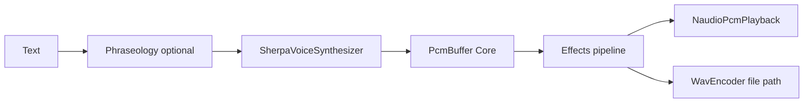

# Voice stack — merge-ready + Sherpa vertical slice

## Current state

The [scaffold milestone](d:\novolis\.cursor\plans\audio_voice_stack_58c2fd8e.plan.md) is **implemented locally** but **not committed** (`git status` shows 9 new `src/Novolis.Audio.*` projects + tests/docs). Core pieces work:

- `VoiceService.SpeakAsync` / `WriteToFileAsync` with `NullVoiceSynthesizer` + `NullAudioPlayback`
- WAV round-trip, phraseology, and voice file tests pass (5/5)
- Version bumped to **2026.1.2**

Gaps blocking “acceptable” merge + your chosen **Sherpa vertical slice**:

| Gap | Risk |
|-----|------|
| Uncommitted changes | Nothing ships to GPR |
| ~46 `CS1591` on new public APIs | [`TreatWarningsAsErrors`](d:\novolis\novolis-audio\Directory.Build.props) may fail PR CI |
| [`global.json`](d:\novolis\novolis-audio\global.json) `rollForward: latestFeature` | Local SDK 11 preview breaks Bindings codegen (`RunAudioCodegen` pipeline) |
| Root docs omit voice | [README.md](d:\novolis\novolis-audio\README.md), [getting-started.md](d:\novolis\novolis-audio\docs\getting-started.md) still game-SFX only |
| `SherpaVoiceSynthesizer` stub | No real TTS |
| `NullAudioPlayback` | `SpeakAsync` is a no-op |
| No model/setup doc | Consumers cannot run TTS |



---

## 1. Merge hygiene (scaffold polish)

### XML documentation

Add `///` summaries on all public members in new voice/PCM projects (match [Novolis.Audio.Abstractions](d:\novolis\novolis-audio\src\Novolis.Audio.Abstractions\IAudioEngine.cs) style). Priority files:

- [Novolis.Audio.Core](d:\novolis\novolis-audio\src\Novolis.Audio.Core) — interfaces, `PcmBuffer`, WAV types
- [Novolis.Audio.Voice](d:\novolis\novolis-audio\src\Novolis.Audio.Voice) — `VoiceServiceBuilder`, `VoiceServiceOptions`, DI extensions
- [Novolis.Audio.Voice.Atc](d:\novolis\novolis-audio\src\Novolis.Audio.Voice.Atc), Phraseology, Effects, Playback, Codecs

### Repo documentation

Update:

- [README.md](d:\novolis\novolis-audio\README.md) — package table for Core, Codecs, Effects, Playback, Voice.*
- [docs/getting-started.md](d:\novolis\novolis-audio\docs\getting-started.md) — voice quick start (`Novolis.Audio.Voice`, ATC preset, env var)
- New [docs/voice-models.md](d:\novolis\novolis-audio\docs\voice-models.md) — model download + layout (see below)
- [docs/release.md](d:\novolis\novolis-audio\docs\release.md) — list new packable packages in 2026.1.2

### CI build reliability

In [global.json](d:\novolis\novolis-audio\global.json), change `rollForward` from `latestFeature` to **`latestPatch`** so CI and local builds stay on .NET 10 (avoids SDK 11 preview + codegen task failures seen locally).

Verify before PR:

```powershell
pwsh -File novolis-governance/scripts/verify-nuget-only.ps1
dotnet build d:\novolis\novolis-audio\Novolis.Audio.slnx -c Release
dotnet test --project d:\novolis\novolis-audio\tests\Novolis.Audio.Unit\Novolis.Audio.Unit.csproj -c Release
```

---

## 2. Sherpa ONNX TTS ([`Novolis.Audio.Voice.SherpaOnnx`](d:\novolis\novolis-audio\src\Novolis.Audio.Voice.SherpaOnnx))

### NuGet (nuget.org only)

- Add to [Directory.Packages.props](d:\novolis\novolis-audio\Directory.Packages.props): `org.k2fsa.sherpa.onnx` (pin a recent stable, e.g. **1.12.40+**)
- `PackageReference` only in `Novolis.Audio.Voice.SherpaOnnx.csproj`

### Model strategy (English ATC-friendly, not in git)

Default documented model: **Piper** `vits-piper-en_US-amy-low` (small, English, works with Sherpa `OfflineTts` VITS config — same layout as [sherpa offline-tts example](https://github.com/k2-fsa/sherpa-onnx/blob/master/dotnet-examples/offline-tts/Program.cs)).

**Layout under `NOVOLIS_VOICE_MODEL_DIR` (or `VoiceSynthesisOptions.ModelDirectory`):**

```text
%NOVOLIS_VOICE_MODEL_DIR%/
  en_US-amy-low.onnx
  tokens.txt
  espeak-ng-data/
```

Document wget/tar steps in `docs/voice-models.md` (release URL: `vits-piper-en_US-amy-low.tar.bz2` from sherpa `tts-models`).

### `SherpaVoiceSynthesizer` implementation

Replace stub in [SherpaVoiceSynthesizer.cs](d:\novolis\novolis-audio\src\Novolis.Audio.Voice.SherpaOnnx\SherpaVoiceSynthesizer.cs):

- Resolve model directory from `VoiceSynthesisOptions.ModelDirectory` ?? `Environment.GetEnvironmentVariable("NOVOLIS_VOICE_MODEL_DIR")`
- If missing/invalid → **delegate to `NullVoiceSynthesizer`** (keeps CI green; log optional `Debug` trace)
- If valid → build `OfflineTtsConfig` (VITS paths, `Provider = "cpu"`, `NumThreads = 2`)
- Call `OfflineTts.Generate` / `GenerateWithConfig` with `LengthScale` from `SpeakingRate`
- Convert Sherpa `GeneratedAudio` (float samples + sample rate) to [`PcmBuffer`](d:\novolis\novolis-audio\src\Novolis.Audio.Core\PcmBuffer.cs) **Int16** via shared helper `SherpaAudioConverter` in SherpaOnnx project
- Cache `OfflineTts` instance per synthesizer (lazy, thread-safe) — models are heavy

Extend [VoiceSynthesisOptions.cs](d:\novolis\novolis-audio\src\Novolis.Audio.Voice.Abstractions\VoiceSynthesisOptions.cs):

- `string? ModelProfile` (default `"en-us-piper-amy"`) for future multi-model
- Document `SpeakingRate` maps to Sherpa length scale (`1f / SpeakingRate`)

### DI / builder defaults

- [VoiceServiceBuilder.UseSherpaOnnx()](d:\novolis\novolis-audio\src\Novolis.Audio.Voice\VoiceServiceBuilder.cs) — register real `SherpaVoiceSynthesizer` (not stub alias)
- [AddNovolisVoice](d:\novolis\novolis-audio\src\Novolis.Audio.Voice\VoiceServiceCollectionExtensions.cs) — default `IVoiceSynthesizer` → `SherpaVoiceSynthesizer` (still falls back to silence when no models)
- [AddNovolisAtcVoice](d:\novolis\novolis-audio\src\Novolis.Audio.Voice.Atc\AtcVoiceServiceCollectionExtensions.cs) — same + phraseology preset

---

## 3. Real playback ([`Novolis.Audio.Playback`](d:\novolis\novolis-audio\src\Novolis.Audio.Playback))

Add **`NaudioPcmPlayback`** implementing `IAudioPlayback`:

- `PackageReference NAudio` on Playback csproj (already centrally versioned)
- `PlayAsync`: `WaveOutEvent` + `BufferedWaveProvider` from `PcmBuffer` Int16 PCM
- Block until playback completes (or honor `CancellationToken` via stop/dispose)
- Keep [`NullAudioPlayback`](d:\novolis\novolis-audio\src\Novolis.Audio.Playback\NullAudioPlayback.cs) for headless

Wire defaults:

- `VoiceServiceBuilder` / `AddNovolisVoice` use `NaudioPcmPlayback` (not null) when not explicitly overridden
- CI unit tests that must be silent: continue using `VoiceServiceBuilder` with explicit `NullAudioPlayback` (existing tests unchanged)

**Do not** reference `Novolis.Audio.Runtime` / miniaudio from Voice or Playback (per original dependency rule).

---

## 4. Tests

| Test | Behavior |
|------|----------|
| Existing 5 tests | Keep using null playback / null synth — always green |
| `AtcVoiceProfile_applies_phraseology` | `AtcVoiceProfile.Apply` + normalize hook expands digits |
| `Voice_projects_do_not_reference_miniaudio` | Reflection over Voice.* assembly refs — no `Novolis.Audio.Runtime` / `Bindings` |
| `Sherpa_synthesizer_with_model_dir` (new) | **Conditional**: skip unless `NOVOLIS_VOICE_MODEL_DIR` set and `tokens.txt` exists; assert non-silent PCM length &gt; 0 |
| Optional manual | `WriteToFileAsync` with real model produces playable WAV |

---

## 5. Governance and publish

- `verify-nuget-only.ps1` — must exit 0 (no local feeds, no cross-repo `ProjectReference`)
- Commit all scaffold + vertical slice files; open PR to `novolis-audio` `main`
- Merge publishes **10 new packages** at `2026.1.*` to GitHub Packages (version **2026.1.2** already in [build/version.json](d:\novolis\novolis-audio\build\version.json))

**Explicit non-goals** (defer):

- ATC radio band-limit effects
- `Novolis.Audio.Voice.Bridge` / Dispatch / Naval packages
- Bundling ONNX weights in git or NuGet

---

## Suggested PR title

`feat(audio): voice stack scaffold + Sherpa Piper TTS and NAudio playback`

