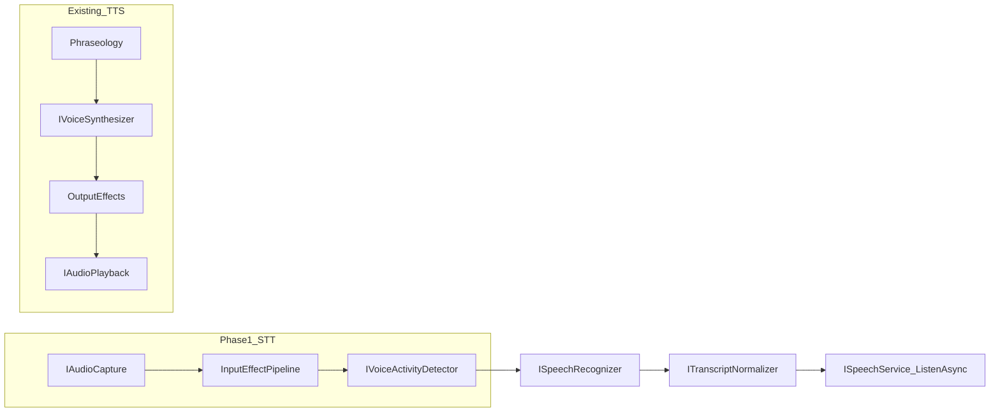

# Novolis.Audio.Voice — Phase 1 (STT + capture) plan

## Current state vs spec

| Spec layer | Today | Gap |
|------------|-------|-----|
| TTS orchestration | [`VoiceService`](d:\novolis\novolis-audio\src\Novolis.Audio.Voice\VoiceService.cs) + [`IVoiceService`](d:\novolis\novolis-audio\src\Novolis.Audio.Voice.Abstractions\IVoiceService.cs) | Done (batch utterance) |
| Output effects | [`Novolis.Audio.Effects`](d:\novolis\novolis-audio\src\Novolis.Audio.Effects) + [`AtcRadioEffects`](d:\novolis\novolis-audio\src\Novolis.Audio.Voice.Atc\AtcRadioEffects.cs) | Done |
| Phraseology | [`DefaultPhraseologyNormalizer`](d:\novolis\novolis-audio\src\Novolis.Audio.Voice.Phraseology\DefaultPhraseologyNormalizer.cs) (digits only) | Partial |
| Domain profiles | [`Voice.Profiles`](d:\novolis\novolis-audio\src\Novolis.Audio.Voice.Profiles) (archetypes) + [`Voice.Atc`](d:\novolis\novolis-audio\src\Novolis.Audio.Voice.Atc) (delivery) | Naming differs from spec (`Profiles.Atc`); functionally similar |
| STT / VAD / `ListenAsync` | **Absent** | **Phase 1** |
| Streaming / interrupt | **Absent** | Phase 2 |
| Semantic intents | **Absent** | Phase 3 |
| Hint-based voice resolution | Fixed archetype → model | Phase 4 |

**Intentional keep (for now):** dual stacks from [`docs/design.md`](d:\novolis\novolis-audio\docs\design.md) — miniaudio for game SFX, NAudio + Sherpa for voice. Unifying output graphs is out of Phase 1 scope.



---

## Prerequisite: green CI (uncommitted fix)

The [failed run](https://github.com/Novolis-Platform/novolis-audio/actions/runs/26539537707/job/78177262345) and follow-up failed for two reasons:

1. `powershell` on Linux → fixed to `pwsh` in [`build/Novolis.Audio.Voice.SherpaOnnx.targets`](d:\novolis\novolis-audio\build\Novolis.Audio.Voice.SherpaOnnx.targets).
2. Zip `Content` items evaluated **before** `CreateVoiceModelZips` on clean CI → fixed locally with `CopyNovolisVoiceModelZipsToOutput` + `AddNovolisVoiceModelZipsForPack` (not yet on `origin/main` per last check).

**Action:** Commit and push the pending changes to [`build/Novolis.Audio.Voice.SherpaOnnx.targets`](d:\novolis\novolis-audio\build\Novolis.Audio.Voice.SherpaOnnx.targets) and [`Novolis.Audio.Voice.SherpaOnnx.csproj`](d:\novolis\novolis-audio\src\Novolis.Audio.Voice.SherpaOnnx\Novolis.Audio.Voice.SherpaOnnx.csproj) before or with Phase 1 work so Merge/publish stays green.

---

## Phase 1 goal (your priority: STT path)

Deliver the spec’s STT leg end-to-end for **offline, segment-based** recognition (VAD boundaries + `OfflineRecognizer`), exposed as:

```csharp
await foreach (var utterance in speech.ListenAsync(options, ct))
{
    // utterance.Text — normalized transcript
}
```

**Non-goals for Phase 1:** `OnlineRecognizer` streaming, wake-word, semantic command types, cloud adapters, miniaudio capture, full ICAO STT normalization, package renames.

---

## Package changes

### 1. [`Novolis.Audio.Voice.Abstractions`](d:\novolis\novolis-audio\src\Novolis.Audio.Voice.Abstractions) — contracts only

Add types (no Sherpa/NAudio refs):

| Type | Responsibility |
|------|----------------|
| `IAudioCapture` | `IAsyncEnumerable<PcmBuffer>` or `ReadChunkAsync` from default mic |
| `CaptureOptions` | Device id (optional), sample rate, frame size |
| `IVoiceActivityDetector` | Feed float/PCM chunks; expose completed segments (`SpeechSegment`) |
| `ISpeechRecognizer` | `RecognizeAsync(PcmBuffer segment, SpeechRecognitionOptions)` → text |
| `ITranscriptNormalizer` | Post-STT text cleanup (default: trim + collapse whitespace; hook for future ICAO) |
| `ISpeechService` | `ListenAsync` orchestration |
| `SpeechRecognitionOptions` | Model profile, language, optional VAD thresholds |
| `SpeechUtterance` | `Text`, `IsFinal`, optional timing metadata |
| `NullSpeechRecognizer` / `NullVoiceActivityDetector` | CI/headless (empty stream or no-op) |

Keep [`IVoiceService`](d:\novolis\novolis-audio\src\Novolis.Audio.Voice.Abstractions\IVoiceService.cs) unchanged; add `ISpeechService` as sibling (spec example can map to `ISpeechService` or a thin `IVoiceService` extension later).

### 2. [`Novolis.Audio.Playback`](d:\novolis\novolis-audio\src\Novolis.Audio.Playback) — capture (reuse NAudio dep)

Add alongside playback:

- `IAudioCapture` implementation: `NaudioMicrophoneCapture` (`WaveInEvent` → mono Int16 `PcmBuffer` chunks at 16 kHz default for Sherpa STT).
- `NullAudioCapture` for CI.

Update package description to “PCM I/O” (playback + capture).

### 3. [`Novolis.Audio.Effects`](d:\novolis\novolis-audio\src\Novolis.Audio.Effects) — input preset

Effects are already direction-neutral. Add:

- `InputSpeechEffects` (or `MicrophonePreprocessorEffects`) — chain: high-pass → simple noise gate / AGC (reuse existing primitives where possible; add minimal `NoiseGateEffect` only if needed).
- Used **before** VAD/STT, symmetric to [`AtcRadioEffects`](d:\novolis\novolis-audio\src\Novolis.Audio.Voice.Atc\AtcRadioEffects.cs).

### 4. [`Novolis.Audio.Voice.SherpaOnnx`](d:\novolis\novolis-audio\src\Novolis.Audio.Voice.SherpaOnnx) — runtime

Extend existing package (already references `org.k2fsa.sherpa.onnx` 1.12.40):

| Class | Sherpa API |
|-------|------------|
| `SherpaVoiceActivityDetector` | `VoiceActivityDetector` + `VadModelConfig` (Silero) |
| `SherpaOfflineSpeechRecognizer` | `OfflineRecognizer` + `OfflineStream` |
| `SherpaSpeechModelPaths` | Mirror [`SherpaVoiceModelPaths`](d:\novolis\novolis-audio\src\Novolis.Audio.Voice.SherpaOnnx\SherpaVoiceModelPaths.cs) for STT model roots |
| Graceful fallback | Missing model → `NullSpeechRecognizer` (like TTS → silence) |

**Recognition mode:** VAD emits segments → each segment decoded with `OfflineRecognizer.Decode` (not `OnlineRecognizer` yet). Supports push-to-talk later by bypassing VAD and passing a single buffer.

### 5. [`Novolis.Audio.Voice`](d:\novolis\novolis-audio\src\Novolis.Audio.Voice) — orchestration

- `SpeechService` implementing `ISpeechService`:
  1. `await foreach` capture chunks
  2. `inputEffects.Process(chunk)`
  3. VAD `AcceptWaveform` / drain segments
  4. STT per segment
  5. `ITranscriptNormalizer`
  6. `yield return` `SpeechUtterance`
- `SpeechServiceBuilder` + `AddNovolisSpeech()` mirroring [`AddNovolisVoice`](d:\novolis\novolis-audio\src\Novolis.Audio.Voice\VoiceServiceCollectionExtensions.cs).
- Optional: `SpeechServiceBuilder` accepts custom capture/VAD/recognizer for tests.

### 6. Manifest + codegen — one bundled STT model

Parallel to TTS ([`NovolisAudioVoiceModelsManifest.cs`](d:\novolis\novolis-audio\codegen\Novolis.Audio.Manifests\NovolisAudioVoiceModelsManifest.cs)):

- Add `NovolisAudioSpeechModelsManifest` (or extend manifest with `ModelKind: Tts | Stt` — prefer **separate manifest** to keep codegen clear).
- Bundle **one** small English offline model (recommendation: Sherpa’s compact Zipformer/Whisper-tiny English preset; exact id chosen to stay &lt; ~50 MB with LFS).
- Extend pipeline: verify `models/{id}/`, emit `SpeechModelCatalog.g.cs` in Abstractions.
- Scripts: `fetch-speech-model.ps1`, pack/extract targets analogous to TTS (reuse fixed [`Novolis.Audio.Voice.SherpaOnnx.targets`](d:\novolis\novolis-audio\build\Novolis.Audio.Voice.SherpaOnnx.targets) copy/extract pattern).

### 7. Tests and docs

- Unit tests: null capture → empty `ListenAsync`; normalizer; VAD segment stitching (mock); optional gated integration test when STT model present (same pattern as [`VoiceStackTests`](d:\novolis\novolis-audio\tests\Novolis.Audio.Unit\VoiceStackTests.cs)).
- Update [`docs/design.md`](d:\novolis\novolis-audio\docs\design.md) with STT flow diagram and new packages/APIs.
- Add `docs/speech-models.md` (mirror `voice-models.md`).
- Run `verify-nuget-only.ps1`; bump `build/version.props`; publish via existing Merge workflow.

### 8. Dogfood (optional, small)

[`BridgeCommander`](d:\novolis\novolis-dogfooding\apps\BridgeCommander) — optional `--listen` or key-bound PTT printing transcripts (not required for Phase 1 acceptance).

---

## API sketch (target)

```csharp
// Abstractions
public interface ISpeechService
{
    IAsyncEnumerable<SpeechUtterance> ListenAsync(
        ListenOptions options,
        CancellationToken cancellationToken = default);
}

public sealed record ListenOptions
{
    public SpeechModelProfile Model { get; init; }
    public bool UseVoiceActivityDetection { get; init; } = true;
    public IAudioEffectPipeline? InputEffects { get; init; }
    public Func<string, string>? NormalizeTranscript { get; init; }
}
```

Register: `services.AddNovolisSpeech()` (capture + Sherpa VAD/STT + defaults).

---

## Later phases (roadmap only)

| Phase | Focus |
|-------|--------|
| **2** | Streaming TTS (`GenerateWithConfig` callback) + interruptible play queue; optional `OnlineRecognizer` |
| **3** | Semantic layer: `ITranscriptNormalizer` → intent types; domain packages (`Voice.Profiles.Bridge`, etc.) |
| **4** | Hint-based `VoiceProfile` resolution; consolidate naming with spec |
| **5** | Shared output device graph (miniaudio + voice), device enumeration |

---

## Risks and mitigations

| Risk | Mitigation |
|------|------------|
| STT model size / LFS on CI | One small model; null fallback; fetch script for devs |
| Linux CI / `pwsh` | Already standardized on `pwsh`; keep extract targets cross-platform |
| NAudio capture Linux gaps | Document Windows-first for Phase 1; `NullAudioCapture` on unsupported platforms |
| Package proliferation | Capture lives in existing `Playback`; no new NuGet unless capture abstractions need to stay out of Playback |

---

## Acceptance criteria

1. `dotnet build` + CI green on `main` (including TTS zip copy/extract fix).
2. `ISpeechService.ListenAsync` works on Windows with bundled STT model: mic → input FX → VAD → transcript events.
3. Without models: `ListenAsync` completes without throw (empty or no-op), suitable for CI.
4. Abstractions remain free of Sherpa/NAudio; SherpaOnnx implements engines only.
5. Docs describe STT path and how it composes with existing TTS/ATC.

