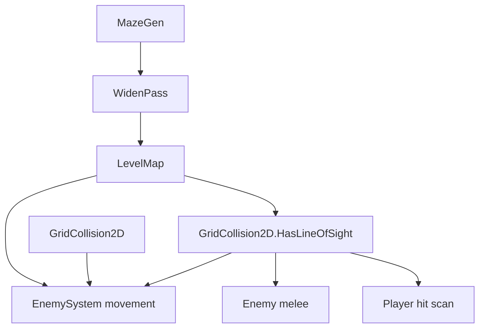

# DoomLite3D: wider corridors, enemy collision, LOS, sprawling maze

## Current gaps

- [`MazeGenerator.cs`](d:\novolis\novolis-dogfooding\apps\DoomLite3D\Game\MazeGenerator.cs): 21×21 grid, 1-cell-wide passages (classic step-2 backtracker), `MaxDiameter = 40` rejects sprawling layouts.
- [`EnemySystem.cs`](d:\novolis\novolis-dogfooding\apps\DoomLite3D\Game\EnemySystem.cs): enemies slide through walls and each other; chase/melee ignore cover.
- [`CombatRaycast.cs`](d:\novolis\novolis-dogfooding\apps\DoomLite3D\Game\CombatRaycast.cs): hit test is XZ cylinder only, no wall occlusion.
- [`GridCollision2D`](d:\novolis\novolis-math\src\Novolis.Math.Geometry\GridCollision2D.cs): has `TryMove` / `OverlapsWall` but no LOS helper.



## 1. Wider corridors + slightly sprawling maze

In [`MazeGenerator.cs`](d:\novolis\novolis-dogfooding\apps\DoomLite3D\Game\MazeGenerator.cs):

| Constant | Today | Proposed |
|----------|-------|----------|
| `Size` | 21 | **35** (odd, solid border) |
| `CalmRoomSize` | 5 | **7** (proportional calm spawn) |
| `CalmExclusionRadius` | 6 | **8** |
| `MaxDiameter` | 40 | **58** (allow longer runs; still cap runaway) |
| `MaxEnemies` | 18 | **22** |

Add **`WidenCorridors(byte[,] walls, int halfWidth)`** after DFS carve:

- For each floor cell, clear all cells within **Chebyshev distance `halfWidth`** (use **`halfWidth = 2`** → corridors up to **5 cells** wide).
- Clamp to interior `1 .. Size-2` so outer border stays wall.
- Re-run connectivity is implicit (dilation only expands floor).

Optional: increase backtracker step from 2→4 only if dilation is insufficient in playtest; start with dilation only (simpler, predictable).

## 2. Grid line-of-sight (novolis-math)

Add to [`GridCollision2D.cs`](d:\novolis\novolis-math\src\Novolis.Math.Geometry\GridCollision2D.cs):

```csharp
public static bool HasLineOfSight(
    DenseGrid<byte> map, Vector2 from, Vector2 to, float cellSize = 1f)
```

- 2D grid DDA (or Bresenham) from `from` to `to` in world XZ.
- Sample each traversed cell; any blocked cell (`!= 0`) before the target cell → false.
- Skip blocking on the start cell; treat end cell as visible if reached.

Add tests in [`GridCollision2DTests.cs`](d:\novolis\novolis-math\tests\Novolis.Math.Geometry.Tests\GridCollision2DTests.cs): open line, wall block, corner peek.

## 3. Enemy wall collision

In [`EnemySystem.cs`](d:\novolis\novolis-dogfooding\apps\DoomLite3D\Game\EnemySystem.cs):

- Constants: `EnemyRadius = 0.45f`, reuse player movement path.
- Extend `Update(...)` signature to accept **`LevelMap level`** and **`IStaticWorld? physicsWorld`** (same as player).
- Movement step: compute desired XZ delta toward player, then:

```csharp
pos = physicsWorld is null
    ? GridCollision2D.TryMove(level.Walls, pos, delta, EnemyRadius, LevelMap.CellSize)
    : GridPhysicsMovement.TryMove(physicsWorld, pos, delta, EnemyRadius, centerY: 0.9);
```

**Enemy–enemy:** after wall move, if circle overlaps another alive enemy, revert that axis move (or skip move if overlap predicted). Lightweight O(n²) is fine for ~20 enemies.

Wire in [`DoomLiteGame.cs`](d:\novolis\novolis-dogfooding\apps\DoomLite3D\Game\DoomLiteGame.cs):

```csharp
_enemies.Update(ctx, _level, _physicsWorld, _player, _combat);
```

## 4. LOS for enemies and combat

**Shared helper** in app (thin wrapper) or call math API directly:

- `GridCollision2D.HasLineOfSight(map, enemyXZ, playerXZ, CellSize)`
- Use **player feet** (`Camera.Position` XZ) for enemy AI; **eye** (`EyePosition` XZ) for player shooting.

**Enemy chase:** only move toward player when `dist < 12` **and** LOS.

**Enemy melee:** only apply damage when in melee range **and** LOS.

**Player shots:** in `TryHit`, before `TryHitEnemyXZ`, require LOS from `ray.Origin` XZ to `enemy.Position` XZ on `level.Walls`. If blocked, skip that enemy (first wall wins).

## 5. Files touched

| File | Change |
|------|--------|
| [`MazeGenerator.cs`](d:\novolis\novolis-dogfooding\apps\DoomLite3D\Game\MazeGenerator.cs) | Larger grid, widen pass, relaxed diameter, tuned spawn/enemy counts |
| [`GridCollision2D.cs`](d:\novolis\novolis-math\src\Novolis.Math.Geometry\GridCollision2D.cs) | `HasLineOfSight` |
| [`GridCollision2DTests.cs`](d:\novolis\novolis-math\tests\Novolis.Math.Geometry.Tests\GridCollision2DTests.cs) | LOS tests |
| [`EnemySystem.cs`](d:\novolis\novolis-dogfooding\apps\DoomLite3D\Game\EnemySystem.cs) | Collision, enemy-enemy, LOS gates |
| [`DoomLiteGame.cs`](d:\novolis\novolis-dogfooding\apps\DoomLite3D\Game\DoomLiteGame.cs) | Pass level + physics to enemy update |

No minimap/HUD changes required (auto-scales to new grid size).

## Verification

```bash
dotnet test novolis-math/tests/Novolis.Math.Geometry.Tests
dotnet build novolis-dogfooding/apps/DoomLite3D/DoomLite3D.csproj
dotnet run --project novolis-dogfooding/apps/DoomLite3D/DoomLite3D.csproj
```

Manual: corridors feel wide; enemies stop at walls; enemies around corners do not chase or melee; shots do not penetrate walls; F1 mazes feel a bit larger/longer than before.

