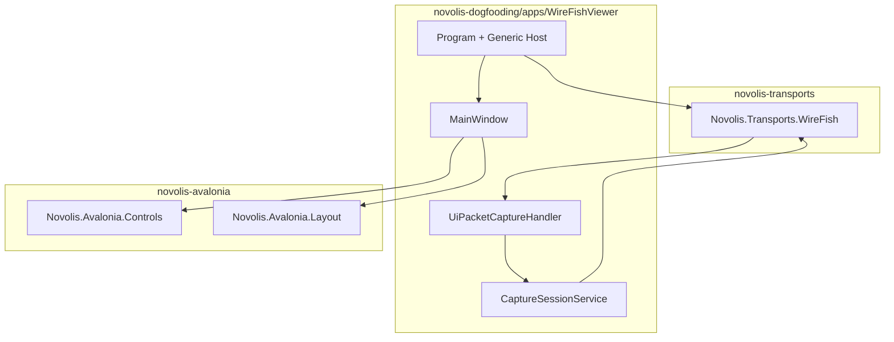

# WireFish Avalonia dogfood plan

## Context

| Asset | State |
|-------|--------|
| [`Novolis.Transports.WireFish`](d:\novolis\novolis-transports\src\Novolis.Transports.WireFish) | Live capture via SharpPcap; `DevicePacket` + extension helpers; `AddNovolisWireFish` + `IPacketHandler` dispatch |
| [`novolis-avalonia`](d:\novolis\novolis-avalonia) | Repo exists (submodule in dogfooding) but **no `src/` yet** — template README only |
| [`novolis-dogfooding`](d:\novolis\novolis-dogfooding) | Pattern: `apps/<App>/` with `ProjectReference` to `submodules/novolis-*` ([`DoomLite3D`](d:\novolis\novolis-dogfooding\apps\DoomLite3D) is the reference) |
| Prior samples | [`PacketScroller`](d:\novolis\bootstrap\scratch\Frank.WireFish\Samples\Frank.WireFish.PacketScroller) — terminal UI only; no GUI to port |

**User choices:** live-capture MVP (no offline `.pcap` yet); **Fluent default** theme with minimal custom chrome.

---

## Target architecture



**Separation rule**

- **`novolis-avalonia`**: domain-agnostic UI (split panes, hex dump, tree details, filter bar, `DataGrid` column helpers). No `DevicePacket`, SharpPcap, or WireFish types.
- **`WireFishViewer` app**: capture session, `IPacketHandler`, row models, protocol-tree building from `PacketDotNet`, BPF/device wiring.

Follow the **no-XAML** convention from [`novolis-templates` Avalonia solution](d:\novolis\novolis-templates\src\Novolis.Templates\content\Novolis.Templates.NoXaml.Avalonia.Solution) and the **Generic Host + `IHostedService`** bootstrap from [`Program.cs`](d:\novolis\novolis-templates\src\Novolis.Templates\content\Novolis.Templates.NoXaml.Avalonia.Solution\Novolis.Templates.NoXaml.Avalonia.Solution.App\Program.cs).

---

## Phase 1 — Bootstrap `novolis-avalonia`

Mirror standard Novolis repo layout ([`frank-naming-and-structure.md`](d:\novolis\novolis-governance\docs\frank-naming-and-structure.md)):

```text
novolis-avalonia/
  Novolis.Avalonia.slnx
  src/Novolis.Avalonia.Controls/
  src/Novolis.Avalonia.Layout/
  tests/Novolis.Avalonia.Controls.Tests/
  Directory.Build.props, Directory.Packages.props, global.json
  .novolis/packages.json
```

**Packages (central versions in `Directory.Packages.props`):**

- `Avalonia` **12.0.2** (align with templates)
- `Avalonia.Desktop`, `Avalonia.Themes.Fluent`, `Avalonia.Fonts.Inter`
- `Microsoft.Extensions.Hosting` (for optional shared host helpers later — keep Controls free of hosting if possible)

### `Novolis.Avalonia.Layout` (generic)

| Type | Purpose |
|------|---------|
| `AnalyzerWorkspace` | WireShark-like shell: top toolbar row, optional filter row, vertical split (packet list ~60% / bottom stack), horizontal split in bottom (tree ~50% / hex ~50%). Built with `Grid` + `GridSplitter`. |
| `ToolbarRow` | `StackPanel` of buttons + stretch filler + status text |
| `FilterBar` | Label + `TextBox` + Apply/Clear (events/callbacks only) |

### `Novolis.Avalonia.Controls` (generic)

| Type | Purpose |
|------|---------|
| `HexDumpView` | Mono `TextBlock` or read-only editor; accepts `ReadOnlyMemory<byte>` or `string`; 16-byte rows with offset column |
| `TreeDetailsView` | `TreeView` bound to `DetailTreeNode` (`Title`, `Children`, optional `Description`) |
| `PacketTableView` | Thin wrapper over Avalonia `DataGrid` with sensible defaults (virtualization on, single select, grid lines) |
| `DetailTreeNode` | UI-agnostic tree DTO in Layout or a tiny `Novolis.Avalonia.Abstractions` if needed |

**Explicitly not in avalonia repo:** packet parsing, BPF validation, capture device enumeration tied to SharpPcap.

---

## Phase 2 — Dogfood app `WireFishViewer`

Add [`novolis-dogfooding/apps/WireFishViewer/`](d:\novolis\novolis-dogfooding\apps\WireFishViewer) and register in [`Novolis.Dogfooding.slnx`](d:\novolis\novolis-dogfooding\Novolis.Dogfooding.slnx).

**Project references:**

```xml
..\..\submodules\novolis-avalonia\src\Novolis.Avalonia.Controls\...
..\..\submodules\novolis-avalonia\src\Novolis.Avalonia.Layout\...
..\..\submodules\novolis-transports\src\Novolis.Transports.WireFish\...
..\..\submodules\novolis-messaging\src\Novolis.Messaging.Channels\...
```

**App structure:**

```text
apps/WireFishViewer/
  Program.cs              # Host + Avalonia lifetime (template pattern)
  App.cs
  MainWindow.cs           # Composes AnalyzerWorkspace
  Capture/
    CaptureSessionService.cs   # start/stop, applies WireFishOptions
    UiPacketCaptureHandler.cs  # IPacketHandler → UI thread
    PacketRow.cs                 # list columns
    PacketDetailBuilder.cs       # PacketDotNet → DetailTreeNode + hex bytes
  ViewModels/ (optional thin classes, no separate package)
```

### WireShark-inspired UX (MVP)

| Area | Behavior |
|------|----------|
| Toolbar | **Start** / **Stop** capture; interface `ComboBox` (populate from `NetworkInterface.GetAllNetworkInterfaces()` — do not depend on internal `InterfaceProvider`) |
| Filter bar | BPF string → `WireFishOptions.BpfFilter`; apply on next start (document that running capture must restart to change filter) |
| Packet list | Columns: `#`, `Time`, `Source`, `Destination`, `Protocol`, `Length`, `Info` — map via existing [`DevicePacketExtensions`](d:\novolis\novolis-transports\src\Novolis.Transports.WireFish\DevicePacketExtensions.cs) (`GetSourceIPAddress`, `GetProtocol`, `GetPacketLength`, `GetPacketSummary` or a shorter summary helper in app) |
| Selection | Selecting a row fills `TreeDetailsView` (walk `Packet` link layers) + `HexDumpView` (`packet.Packet.Bytes`) |
| Status | Packet count, capture state, selected adapter; warning banner when Npcap missing (`AllowNoCaptureDevices = true` for dev machines) |

### Capture lifecycle

WireFish starts capture in `IHostedService` at host start. For Start/Stop UX:

1. **Default:** `AllowNoCaptureDevices = true`; do not call `AddNovolisWireFish` until user clicks Start (register capture pipeline lazily), **or**
2. Register WireFish at startup but gate `PacketCaptureService` with a custom `ICaptureGate` / options flag.

**Recommended:** lazy registration on first Start — avoids capturing before UI is ready and matches WireShark mental model.

`UiPacketCaptureHandler`:

- `CanHandle` → always `true` (or filter in app if display filter added later)
- `HandleAsync` → `Dispatcher.UIThread.Post` append to bounded `ObservableCollection<PacketRow>` (cap e.g. 10_000 rows, drop oldest)
- Never block capture thread on UI work

```csharp
// Conceptual bridge (app code)
services.AddNovolisWireFish(b => b.AddPacketHandler<UiPacketCaptureHandler>(), o => {
    o.CaptureAllDevices = false;
    o.DeviceNames.Add(selectedInterface);
    o.BpfFilter = bpf;
    o.AllowNoCaptureDevices = true;
});
```

---

## Phase 3 — Governance and docs

Add brief [`novolis-governance/docs/extraction-briefs/wave-9-wirefish-dogfood.md`](d:\novolis\novolis-governance\docs\extraction-briefs\wave-9-wirefish-dogfood.md) modeled on [`wave-9-doom-dogfood.md`](d:\novolis\novolis-governance\docs\extraction-briefs\wave-9-doom-dogfood.md):

- **In:** avalonia layout controls, `WireFishViewer` app, TUnit tests for `PacketDetailBuilder` / row formatting
- **Out:** `.pcap` import/export, display filters, follow-stream, dissector plugins, security scan panels
- **Done when:** `dotnet run --project apps/WireFishViewer` from dogfooding; README note for **Npcap** on Windows

Update [`novolis-dogfooding/apps/README.md`](d:\novolis\novolis-dogfooding\apps\README.md) with run instructions.

Refresh [`novolis-avalonia/README.md`](d:\novolis\novolis-avalonia\README.md) from template stub to describe Controls/Layout packages.

---

## Phase 4 — Tests and CI

| Test | Location |
|------|----------|
| `PacketDetailBuilder` layer tree for Ethernet/IP/TCP fixture bytes | `WireFishViewer` tests or small test project under dogfooding |
| `HexDumpView` formatting helper (pure string logic) | `Novolis.Avalonia.Controls.Tests` |
| WireFish extension smoke (existing) | already in transports |

Dogfooding CI: ensure `dotnet build` on solution includes new app; WireFish live capture remains **manual** (no Npcap in CI) — app must start and show empty state with warning.

---

## Optional small WireFish library tweak (only if needed)

If lazy Start/Stop cannot be done cleanly without touching transports, add a **minimal public** hook in `Novolis.Transports.WireFish` (e.g. `ICaptureController` or expose start/stop on options) — prefer **app-side host recycle** first to avoid expanding transport API in MVP.

---

## Risks and mitigations

| Risk | Mitigation |
|------|------------|
| No Npcap on dev/CI | `AllowNoCaptureDevices`; empty UI + README |
| UI thread overload at high pps | Cap collection; optional pause UI updates while scrolling (future) |
| `InterfaceProvider` is internal | Use `System.Net.NetworkInformation` in app |
| Submodule drift | Document `git submodule update` for `novolis-avalonia` + `novolis-transports` |

---

## Delivery order

1. Scaffold `novolis-avalonia` solution + Layout/Controls + unit tests  
2. `WireFishViewer` shell (mock rows) proving layout  
3. WireFish + `UiPacketCaptureHandler` live path  
4. Governance brief + README + dogfooding slnx entry  

