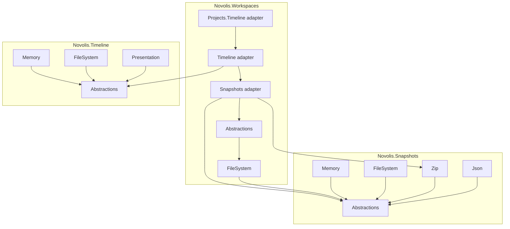

# Novolis Workspaces / Snapshots / Timeline

## Decision summary

| Topic | Choice |
|-------|--------|
| GitHub repo | **`novolis-workspaces`** (one multi-package repo; shared `2026.1.*` versioning and CI) |
| Logical split | Three libraries via **package boundaries and project references**, not folders alone |
| Filesystem | **`System.IO.Abstractions`** (`IFileSystem`, `IDirectoryInfo`, `IFileInfo`) in all disk facets |
| Existing platform | **Do not merge** with [`Novolis.IO.Workspace`](d:\novolis\novolis-io\src\Novolis.IO.Workspace\IFileWorkspace.cs) or [`Novolis.Storage`](d:\novolis\novolis-storage) event snapshots—document boundaries; optional bridge later |
| Simulation replay | **Separate**—[`SimulationTimeline<TState>`](d:\novolis\novolis-simulation\src\Novolis.Simulation.Replay\SimulationTimeline.cs) is tick replay, not editor save points |

## Hard boundaries (enforce in `docs/design.md` + analyzer-friendly project refs)



**Rules (from your spec):**

- `Novolis.Snapshots.*` — no timeline types, no workspace manifests
- `Novolis.Timeline.*` — no file I/O, no zip/json serializers; only `TSnapshotRef` opaque refs
- `Novolis.Workspaces.*` — no branching graph logic in core; branching only in Timeline adapter usage
- Adapters (`Workspaces.Snapshots`, `Workspaces.Timeline`, `Workspaces.Projects.Timeline`) are the **only** place that wires all three

### Naming collisions to document

| Existing | New library | User-facing term |
|----------|-------------|------------------|
| `ISnapshotCapableEventStore` (stream compaction) | `ISnapshotStore<TState,TRef>` | internal “snapshot”; UI: **Save Point** |
| `IFileWorkspace` (storage root + `IFileProvider`) | `IWorkspace` (editor container) | **Workspace** |
| `SimulationTimeline<TState>` | `ITimeline<TSnapshotRef>` | **Timeline** / **Branch** |

## Repo bootstrap

Create from [`novolis-template-dotnet`](d:\novolis\novolis-template-dotnet) → GitHub repo **`novolis-workspaces`**.

Standard layout per [frank-naming-and-structure.md](d:\novolis\novolis-governance\docs\frank-naming-and-structure.md):

```text
novolis-workspaces/
  src/                          # 15 packable projects (below)
  tests/Novolis.Workspaces.Unit/
  Novolis.Workspaces.slnx
  Directory.Build.props         # NovolisGitHubRepository = novolis-workspaces
  Directory.Packages.props      # System.IO.Abstractions + Novolis.* 2026.1.*
  build/version.json
  docs/design.md                # boundaries + on-disk layout
  docs/getting-started.md
```

Thin CI: copy [`novolis-audio/.github/workflows`](d:\novolis\novolis-audio\.github\workflows) pattern → `novolis-workflows` reusable workflows.

Register packages in `.novolis/packages.json` and `novolis-registry` after first GPR publish.

**Third-party (central versions):** `System.IO.Abstractions`, `System.IO.Abstractions.TestingHelpers`, `System.Text.Json` (snapshots metadata only).

## Package inventory and dependency order

Implement in this order so each phase is shippable to GPR:

| # | Package | Depends on |
|---|---------|------------|
| 1 | `Novolis.Snapshots.Abstractions` | — |
| 2 | `Novolis.Snapshots.Memory` | Abstractions |
| 3 | `Novolis.Snapshots.Json` | Abstractions |
| 4 | `Novolis.Timeline.Abstractions` | — |
| 5 | `Novolis.Timeline.Memory` | Timeline.Abstractions |
| 6 | `Novolis.Workspaces.Abstractions` | — |
| 7 | `Novolis.Snapshots.FileSystem` | Abstractions + IO.Abstractions |
| 8 | `Novolis.Timeline.FileSystem` | Timeline.Abstractions + IO.Abstractions |
| 9 | `Novolis.Workspaces.FileSystem` | Workspaces.Abstractions + IO.Abstractions |
| 10 | `Novolis.Snapshots.Zip` | Abstractions + IO.Abstractions |
| 11 | `Novolis.Timeline.Presentation` | Timeline.Abstractions |
| 12 | `Novolis.Workspaces.Snapshots` | Workspaces.* + Snapshots.Zip |
| 13 | `Novolis.Workspaces.Timeline` | Workspaces.Snapshots + Timeline.FileSystem |
| 14 | `Novolis.Workspaces.Projects.Timeline` | Workspaces.Timeline (project-scoped policy) |

`Novolis.Snapshots.Json` = serializer helpers for manifest/timeline sidecars, **not** full workspace state.

## Core API surface (Phase 0 contracts)

Match your spec verbatim in Abstractions projects; keep interfaces small and implementation-agnostic.

### Snapshots ([`Novolis.Snapshots.Abstractions`](d:\novolis\novolis-workspaces\src\Novolis.Snapshots.Abstractions))

```csharp
public interface ISnapshotStore<TState, TSnapshotRef>
{
    ValueTask<TSnapshotRef> SaveAsync(TState state, SnapshotRequest request, CancellationToken ct = default);
    ValueTask RestoreAsync(TState target, TSnapshotRef snapshot, CancellationToken ct = default);
}
```

Supporting types: `SnapshotRequest` (label, kind, properties), `MemorySnapshotRef`, `ZipSnapshotRef`, optional `FileSnapshotRef` for FileSystem backend.

**Serializer seam** (below store):

```csharp
public interface IStateSerializer<TState>
{
    ValueTask WriteAsync(TState state, Stream destination, CancellationToken ct = default);
    ValueTask ReadAsync(TState target, Stream source, CancellationToken ct = default);
}
```

### Timeline ([`Novolis.Timeline.Abstractions`](d:\novolis\novolis-workspaces\src\Novolis.Timeline.Abstractions))

- `ITimeline<TSnapshotRef>` — `AddAsync`, `BranchAsync`, `MoveHeadAsync`, plus queries: `GetNodesAsync`, `GetBranchesAsync`, `GetHeadAsync`
- Records: `TimelineNode<TSnapshotRef>`, `TimelineMetadata`, `Branch`, `BranchName`, `TimelineHead`
- Strong IDs: `TimelineNodeId`, `BranchId` (wrap `Guid` or `Ulid`)

**Explicit non-goals** in XML docs: no merge, rebase, remotes, conflict resolution.

### Workspaces ([`Novolis.Workspaces.Abstractions`](d:\novolis\novolis-workspaces\src\Novolis.Workspaces.Abstractions))

- `IWorkspace`, `IProject`, `IDocument` (optional v1), manifests: `WorkspaceManifest`, `ProjectManifest`, `ProjectReference`
- IDs: `WorkspaceId`, `ProjectId` (value types)
- `ProjectKind` enum (extensible; start with `Generic`, `VoicePack`, `Scenario`, `GameSave`)
- Roots expose `IDirectoryInfo` from injected `IFileSystem`

### On-disk layout (FileSystem facet)

```text
my-workspace/
  .novolis/
    workspace.json
    settings.json
    timeline/           # written by Timeline.FileSystem adapter only
  projects/
    {project-id}/
      project.json
      documents/
      assets/
      outputs/
      cache/
      temp/
```

`WorkspaceFileSystemService` (name TBD): `OpenAsync(path)`, `CreateAsync(path, name)`, enumerate projects from manifest, validate schema version.

## Implementation phases

### Phase 1 — Snapshots foundation (shippable alone)

**Memory:** `MemorySnapshotStore<TState>` — deep clone via serializer round-trip or optional `ICloneable` constraint documented per consumer.

**Json:** `JsonStateSerializer<TState>` using `System.Text.Json` with source-gen friendly options.

**FileSystem:** blob store under a caller-provided directory; refs = relative path + content hash/id.

**Zip:** `ZipSnapshotStore<TState>` — one entry `state.dat` (+ optional `manifest.json`); `ZipSnapshotRef(ObjectId, RelativePath)`.

Unit tests (TUnit + `MockFileSystem`): save/restore round-trip, overwrite policy, missing ref errors.

### Phase 2 — Timeline foundation

**Memory:** `InMemoryTimeline<TSnapshotRef>` — adjacency list + branch head map; thread-safe if documented for single-writer UI.

**FileSystem:** persist under `.novolis/timeline/`:

```text
timeline/
  branches.json
  nodes/
    {node-id}.json    # metadata + snapshot ref only
  head.json
```

**Queries** needed by presentation: ordered children per parent, branch membership, head per branch.

### Phase 3 — Workspaces on disk

- Read/write `workspace.json` / `project.json` (schema version `1`)
- `PhysicalWorkspace` / `PhysicalProject` backed by `IFileSystem`
- Create default folder skeleton on `CreateAsync`
- No snapshot/timeline code in these projects

### Phase 4 — Workspace snapshots adapter

[`Novolis.Workspaces.Snapshots`](d:\novolis\novolis-workspaces\src\Novolis.Workspaces.Snapshots):

- `IWorkspaceSnapshotPolicy` + `DefaultWorkspaceSnapshotPolicy` (your include/exclude lists)
- `ZipWorkspaceSnapshotStore` implementing `ISnapshotStore<IWorkspace, ZipSnapshotRef>`:
  - Walk workspace root via `IFileSystem`
  - Zip included files preserving relative paths
  - Exclude `.novolis/timeline/`, `cache/`, `temp/`, `outputs/`, build artifacts
- **Restore behavior:**
  1. Safety save point (“before restore”) via injected `WorkspaceTimeline` or direct snapshot call
  2. Restore working tree from zip
  3. **Never delete** `.novolis/timeline/` (timeline refs may point at restored snapshot ids—document that orphaned refs are possible if user deletes nodes manually)

`SnapshotRequest` kinds: `Manual`, `Autosave`, `Safety`, `Quick`, `ExportCheckpoint` (string constants in `SnapshotKinds`).

### Phase 5 — Timeline adapters + presentation

**`Novolis.Workspaces.Timeline`:**

```csharp
public sealed class WorkspaceTimeline(
    ITimeline<ZipSnapshotRef> timeline,
    ISnapshotStore<IWorkspace, ZipSnapshotRef> snapshots) { ... }
```

- `SavePointAsync` — save zip + `timeline.AddAsync`
- `RestorePointAsync` — safety checkpoint + restore + `MoveHeadAsync` optional
- `BranchFromAsync` — `BranchAsync` from selected node

**`Novolis.Workspaces.Projects.Timeline`:** same API scoped with `IProjectSnapshotPolicy` (only `projects/{id}/` subtree).

**`Novolis.Timeline.Presentation`:**

- `ITimelineProjector<TSnapshotRef>` + default `TimelineTreeProjector`
- `TimelineTreeView`, `TimelineTreeNode`, `TimelineTreeRow` (flat list for Avalonia/Blazor)
- Map `TimelineMetadata.Label` / `Kind` → presentation; never expose `ZipSnapshotRef` paths in UI models

### Phase 6 — Dogfood + governance

- Add `samples/MinimalWorkspaceTimeline/` console or tiny Avalonia sample in-repo (not packable): create workspace → 3 save points → branch → restore
- Add boundary section to [library-boundaries.md](d:\novolis\novolis-governance\docs\library-boundaries.md) or new `docs/architectural-ideals/workspace-snapshot-timeline.md` linked from README
- Run `pwsh -File novolis-governance/scripts/verify-nuget-only.ps1` before merge
- GPR publish on merge; document consumer `PackageReference` pattern for future Voice Studio app

## UX mapping (for future apps, not in library UI)

| User action | Library behavior |
|-------------|------------------|
| Autosave | App writes working files; optional lightweight `SnapshotRequest` kind `Autosave` without timeline node |
| Ctrl+S | `WorkspaceTimeline.SavePointAsync` with kind `Manual` |
| Before export / migration | App calls safety/manual save point |
| Restore | Safety checkpoint → `RestoreAsync` → optional head move |
| Branch | `BranchAsync` from selected node |

## Testing strategy

Single test project `tests/Novolis.Workspaces.Unit/` with folders per facet:

- Snapshots: memory + zip round-trip on `MockFileSystem`
- Timeline: fork/head move/branch isolation
- Workspaces: manifest IO, policy include/exclude
- Adapters: restore preserves `timeline/` dir; safety checkpoint creates new node

Use `System.IO.Abstractions.TestingHelpers.MockFileSystem` consistently (aligns with [novolis-machinelearning](d:\novolis\novolis-machinelearning\src\Novolis.MachineLearning.Core\IO\NovolisFileSystem.cs) pattern, not `InMemoryFileWorkspace`).

## Future (out of initial scope)

- Bridge package `Novolis.Workspaces.Storage` exposing `IFileWorkspace` for a project sub-root (JSON entity repos)
- Voice Studio Avalonia app in `novolis-dogfooding` consuming `TimelineTreeRow`
- Incremental/workspace-delta snapshots (v1 is full zip of policy-filtered tree)
- `Novolis.Snapshots.*` generic host DI extensions (`AddNovolisSnapshots()`)

## Risk notes

- **Large workspaces:** zip snapshots are full-tree; document size expectations; Voice packs should scope to `Projects.Timeline` where possible
- **Orphan snapshot refs:** if timeline node references a deleted zip object, `RestorePointAsync` fails clearly with structured error
- **Concurrent writers:** v1 assumes single-writer process (studio app); no file locking spec yet

